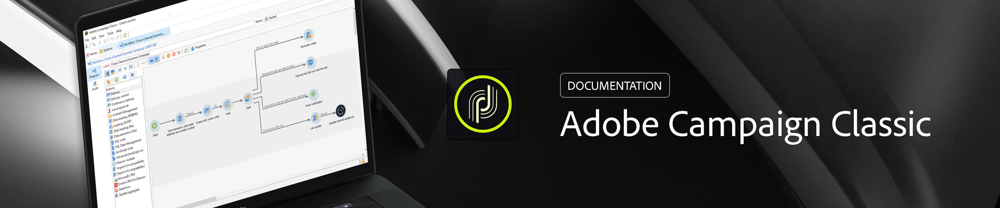

# Central de ajuda {#campaign-classic-documentation}

## Novidades

* **[Gerenciamento](https://helpx.adobe.com/campaign/kb/campaign-privacy.html)** de privacidade Saiba como o Adobe Campaign pode ajudá-lo com sua conformidade com privacidade.

* **[Guia](https://helpx.adobe.com/campaign/kb/acc-tracking.html)** de rastreamentoEntender recursos de rastreamento no Campaign

* **[Guia](https://helpx.adobe.com/campaign/kb/acc-maintenance.html)** de manutençãoSaiba como monitorar a instância e os processos do Campaign

* **[Conteúdo interativo com AMP](delivery/using/defining-interactive-content.md)** Saiba como enviar emails dinâmicos com o novo formato[AMP para email](https://amp.dev/about/email/)

* **[Painel](https://docs.adobe.com/content/help/en/control-panel/using/control-panel-home.html)** de controleSaiba como gerenciar configurações e rastrear o uso da instância do Campaign

[Clique aqui para obter mais atualizações](/help/rn/using/documentation-updates.md)

## Páginas principais

<table>
<tr>
  <td>
    
    

      <a href="platform/using/common-questions.md">
    Perguntas <strong>frequentes</strong></a>
    

    

    <em>Encontre respostas para perguntas comuns ao usar o Campaign Classic</em>
    

  </td>
   <td>
    
    

      <a href="https://docs.campaign.adobe.com/doc/AC/getting_started/EN/buildUpgrade.html">
    <strong>Atualizar para a versão</strong>mais recente </a>
    

    

    <em>Saiba mais sobre as principais etapas e práticas recomendadas para executar uma atualização de compilação</em>
    

  </td>
  <td>
    
    

       <a href="delivery/using/creating-notifications.md">
    <strong>Enviar notificações</strong>por push </a>
    

    

    <em>Projete e envie notificações por push personalizadas em dispositivos móveis</em>
    

  </td>
</tr>
</table>

## Recursos adicionais

* [Notas de versão](/help/rn/using/latest-release.md)

* [Vídeos explicativos](https://docs.adobe.com/content/help/en/campaign-learn/campaign-classic-tutorials/overview.html)

* [Matriz de compatibilidade](https://helpx.adobe.com/campaign/kb/compatibility-matrix.html)

* [Guia de implementação](https://helpx.adobe.com/campaign/kb/acc-implementation.html)

* [Notas técnicas](https://helpx.adobe.com/campaign/kb/article-list.html)
