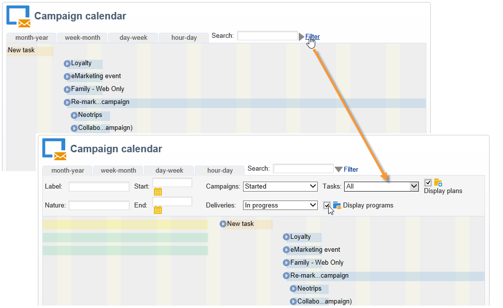
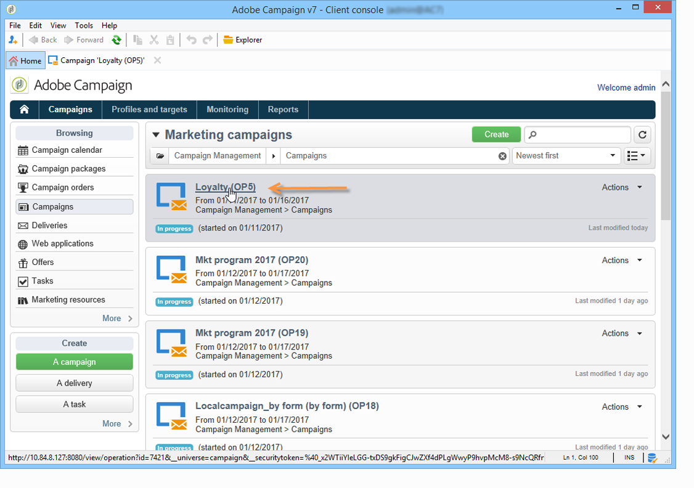

# Acesso às campanhas de marketing{#accessing-marketing-campaigns}

O Adobe Campaign permite criar, configurar, executar e analisar campanhas de marketing. Todas as campanhas de marketing podem ser gerenciadas a partir de um centro de controle unificado.

## Noções básicas da área de trabalho {#workspace-basics}

### Home page {#home-page}

Depois de se conectar ao Adobe Campaign, você verá a home page.

Clique nos links na barra de navegação para acessar os vários universos.

Os elementos da campanha são encontrados no universo **[!UICONTROL Campaigns]**: é possível ter uma visão geral dos programas e das campanhas de marketing, bem como as subdefinições. Um programa de marketing é composto por campanhas, que são compostas por deliveries, tarefas, recursos vinculados etc. No contexto de gestão de campanhas de marketing usando o Campaign, as informações relacionadas às remessas, orçamentos, revisores e documentos vinculados são encontradas nas campanhas.

O bloco de navegação do universo **[!UICONTROL Campaigns]** oferece várias entradas, dependendo dos módulos instalados na instância. Como exemplo, você pode acessar:

* **Calendário da campanha**: calendário de planos, programas de marketing, remessas e campanhas. Consulte [Calendário da campanha](#campaign-calendar).
* **Campanhas**: acesso às campanhas contidas em todos os programas de marketing.
* **Remessas**: acesso às remessas vinculadas às campanhas.
* **Web Applications**: acesso a aplicações Web (formulários, pesquisas, etc.).

>[!NOTE]
>
>Para saber mais sobre a ergonomia geral do Adobe Campaign, as permissões e o gerenciamento de perfis, consulte [esta seção](../../platform/using/adobe-campaign-workspace.md).
>
>Todas as funcionalidades relacionadas a canais e deliveries são detalhadas [nesta seção](../../delivery/using/steps-about-delivery-creation-steps.md).

### Calendário da campanha {#campaign-calendar}

Cada campanha pertence a um programa que, por sua vez, pertence a um plano. Planos, programas e campanhas são acessados por meio do menu **[!UICONTROL Campaign calendar]** no universo **Campanhas**.

Para editar um plano, programa, campanha ou delivery, clique no nome no calendário e clique em **[!UICONTROL Open...]**. Ele é exibido em uma nova guia, conforme mostrado abaixo:

Você pode filtrar as informações exibidas no calendário da campanha. Para fazer isso, clique no link **[!UICONTROL Filter]** e selecione os critérios de filtragem.

>[!NOTE]
>
>Quando você filtrar em uma data, todas as campanhas com uma data de início posterior à data especificada e/ou à data final anterior à data especificada serão exibidas. As datas precisam ser selecionadas usando os calendários à direita de cada campo.

Também é possível usar o campo **[!UICONTROL Search]** para filtrar os itens exibidos.

Os ícones vinculados a cada item permitem a você visualizar o status: concluído, em andamento, sendo editado, etc.

### Navegação em um programa de marketing {#browsing-in-a-marketing-program}

O Campaign permite gerenciar um conjunto de programas feitos de várias campanhas de marketing. Cada campanha contém remessas e processos e recursos associados.

#### Procurar um programa {#browsing-a-program}

Ao editar um programa, use as guias descritas abaixo para procurar e configurá-la.

* A guia **Agenda** exibe o calendário de programas de um mês, semana ou dia, dependendo da guia que você clicar no cabeçalho do calendário.

   Se necessário, você pode criar uma campanha, um programa ou uma tarefa por esta página.

   

* A guia **Editar** permite personalizar o programa: nome, datas de início e término, orçamento, documentos vinculados etc.

   

#### Campanhas de navegação {#browsing-campaigns}

As campanhas podem ser acessadas por meio do calendário da campanha, da guia **[!UICONTROL Schedule]** do programa ou da lista de campanhas.

1. Através do calendário da campanha, selecione a campanha que deseja exibir e clique em **[!UICONTROL Open]**.

   

   A campanha é editada em uma nova guia, conforme mostrado abaixo:

   

1. Na guia **[!UICONTROL Schedule]** do programa, o modo de edição é igual ao que pode ser acessado pelo calendário da campanha.
1. Através do link **[!UICONTROL Campaigns]** do universo **[!UICONTROL Campaigns]**, clique no nome da campanha que deseja editar.

   

### Controlar uma campanha {#controlling-a-campaign}

#### Painel {#dashboard}

Cada campanha, tarefa, recurso e remessa é centralizado em uma única tela - o painel- que permite gerenciar ações de marketing em colaboração com outras pessoas.

O painel de controle de uma campanha é usado como interface de controle. Ele acessa os estágios principais de criação e gerenciamento de campanha diretamente: remessas, arquivos de extração, notificações, orçamentos etc.

Com o Adobe Campaign você pode configurar processos colaborativos para a criação e aprovação dos vários estágios de campanhas de marketing e comunicação: aprovação do orçamento, destino, conteúdo etc.

>[!NOTE]
>
>A configuração dos modelos de campanha é apresentada em [Campaign templates](../../campaign/using/marketing-campaign-templates.md#campaign-templates).

#### Agendar {#schedule}

Uma campanha centraliza um conjunto de fornecimentos. Para cada campanha, o agendamento oferece uma visão global de todos os componentes: permite exibir as tarefas e remessas e acessá-las facilmente.

#### Fórum {#forum}

Para cada campanha, os operadores podem trocar mensagens por meio de um fórum dedicado.

Para obter mais informações, consulte os [Fóruns de discussão](../../campaign/using/discussion-forums.md).

#### Relatórios {#reports}

O link **[!UICONTROL Reports]** permite acessar os relatórios da campanha.

>[!NOTE]
>
>Os relatórios são detalhados [nesta seção](../../reporting/using/about-adobe-campaign-reporting-tools.md).

#### Configuração {#configuration}

As campanhas são criadas por meio de templates de campanha. É possível configurar templates reutilizáveis para os quais algumas opções estão selecionadas e outras configurações já estão salvas. Para cada campanha, a seguinte funcionalidade é oferecida:

* Referência de documentos e recursos: é possível associar documentos a uma campanha (resumo, relatório, imagens etc.). Todos os formatos de documento são suportados. Consulte [Gerenciamento de documentos associados](../../campaign/using/marketing-campaign-deliveries.md#managing-associated-documents).
* Definir custos: para cada campanha, o Adobe Campaign permite definir entradas de custo e estruturas de cálculo de custo que podem ser usadas ao criar a campanha de marketing. Por exemplo: custos de impressão, uso de uma agência externa, aluguel de sala etc. Consulte [Definição de categorias de custo](../../campaign/using/providers--stocks-and-budgets.md#defining-cost-categories).
* Definir objetivos: pode-se definir objetivos quantificáveis para uma campanha, por exemplo, número de inscritos, volume de negócios etc. Essas informações são usadas posteriormente nos relatórios de campanha.
* Gerenciar seed addresses (para mais informações, consulte [esta seção](../../delivery/using/about-seed-addresses.md)) e grupos de controle (consulte [Definindo um grupo de controle](../../campaign/using/marketing-campaign-deliveries.md#defining-a-control-group)).
* Gerenciar aprovações: é possível selecionar os tratamentos a serem aprovados e, se necessário, selecionar os operadores de revisão ou grupos de operadores. Consulte [Verificação e aprovação de remessas](../../campaign/using/marketing-campaign-approval.md#checking-and-approving-deliveries).

>[!NOTE]
>
>Para acessar as configurações da campanha e fazer alterações, clique no link **[!UICONTROL Advanced campaign parameters...]** na guia **[!UICONTROL Edit]**. Para obter mais informações sobre como configurar parâmetros no nível da campanha para que os deliveries herdem valores automaticamente, consulte [nossa Nota técnica](https://helpx.adobe.com/br/campaign/kb/simplifying-campaign-management-acc.html#Setparametersatthecampaignlevelsodeliveriesinheritvaluesautomatically).

## Usar a interface da Web {#using-the-web-interface-}

Você pode acessar as telas do console do Adobe Campaign por meio de um navegador da Internet para exibir todas as campanhas e remessas, bem como relatórios e informações dos perfis em seu banco de dados. Este acesso não habilita a criação de registros. Dependendo dos direitos do operador, você pode visualizar e/ou agir nos dados do banco de dados. Por exemplo, você pode aprovar conteúdo de campanha e segmentação, reiniciar ou parar um delivery etc.

1. Faça logon como de costume via https://`<your instance>:<port>/view/home`.
1. Use os menus para acessar as exibições.

   

Aprovações (de um target ou conteúdo de delivery, por exemplo) podem ser realizadas via acesso Web.

Você também pode usar o link contido nas mensagens de notificação. Para obter mais informações, consulte [Verificação e aprovação de deliveries](../../campaign/using/marketing-campaign-approval.md#checking-and-approving-deliveries).
