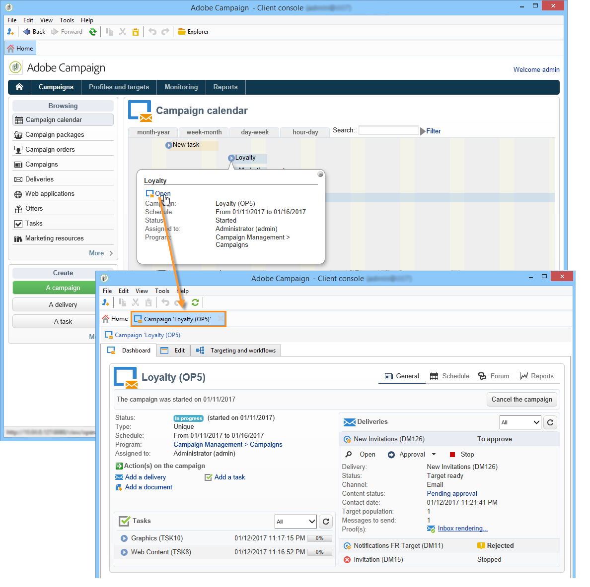

# Acesso a campanhas de marketing{#accessing-marketing-campaigns}

O Adobe Campaign permite criar, configurar, executar e analisar campanhas de marketing. Todas as campanhas de marketing podem ser gerenciadas a partir de um centro de controle unificado.

## Noções básicas da área de trabalho {#workspace-basics}

### Home page {#home-page}

Depois de se conectar ao Adobe Campaign, você verá a home page.

Clique nos links na barra de navegação para acessar os vários universos.

Campaign elements are found in the **[!UICONTROL Campaigns]** universe: here you can see an overview of the marketing programs and campaigns as well as their sub-sets. Um programa de marketing é composto por campanhas, que são compostas por entregas, tarefas, recursos vinculados etc. No contexto de gestão de campanhas de marketing usando o Campaign, as informações relacionadas às remessas, orçamentos, revisores e documentos vinculados são encontradas nas campanhas.

The navigation block of the **[!UICONTROL Campaigns]** universe offers various entries, depending on modules installed on the instance. Como exemplo, você pode acessar:

* **Calendário da campanha**: calendário de planos, programas de marketing, remessas e campanhas. Consulte Calendário [da campanha](#campaign-calendar).
* **Campanhas**: acesso às campanhas contidas em todos os programas de marketing.
* **Remessas**: acesso às remessas vinculadas às campanhas.
* **Web Applications**: acesso a aplicações Web (formulários, pesquisas, etc.).

>[!NOTE]
>
>Para saber mais sobre a ergonomia geral do Adobe Campaign, as permissões e o gerenciamento de perfis, consulte [esta seção](../../platform/using/adobe-campaign-workspace.md).
>
>Todas as funcionalidades relacionadas a canais e entregas são detalhadas  [nesta seção](../../delivery/using/communication-channels.md).

### Calendário da campanha {#campaign-calendar}

Cada campanha pertence a um programa que, por sua vez, pertence a um plano. Plans, programs and campaigns are accessed via the **[!UICONTROL Campaign calendar]** menu in the **Campaigns** universe.

To edit a plan, program, campaign or delivery, click its name in the calendar and then click **[!UICONTROL Open...]**. Ele é exibido em uma nova guia, conforme mostrado abaixo:

Você pode filtrar as informações exibidas no calendário da campanha. To do this, click the **[!UICONTROL Filter]** link and select the filtering criteria.

>[!NOTE]
>
>Quando você filtrar em uma data, todas as campanhas com uma data de início posterior à data especificada e/ou à data final anterior à data especificada serão exibidas. As datas precisam ser selecionadas usando os calendários à direita de cada campo.

You can also use the **[!UICONTROL Search]** field to filter the displayed items.

Os ícones vinculados a cada item permitem a você visualizar o status: concluído, em andamento, sendo editado, etc.

### Navegação em um programa de marketing {#browsing-in-a-marketing-program}

O Campaign permite gerenciar um conjunto de programas feitos de várias campanhas de marketing. Cada campanha contém remessas e processos e recursos associados.

#### Procurar um programa {#browsing-a-program}

Ao editar um programa, use as guias descritas abaixo para procurar e configurá-la.

* A guia **Agenda** exibe o calendário de programas de um mês, semana ou dia, dependendo da guia que você clicar no cabeçalho do calendário.

   Se necessário, você pode criar uma campanha, um programa ou uma tarefa por esta página.

   

* A guia **Editar** permite personalizar o programa: nome, datas de início e término, orçamento, documentos vinculados etc.

   

#### Campanhas de navegação {#browsing-campaigns}

Campaigns can be accessed via the campaign calendar, the **[!UICONTROL Schedule]** tab of the program, or the list of campaigns.

1. Via the campaign calendar, select the campaign you want to display, then click the **[!UICONTROL Open]** link.

   

   A campanha é editada em uma nova guia, conforme mostrado abaixo:

   

1. Via the **[!UICONTROL Schedule]** tab of the program, the edit mode is the same as via the campaign calendar.
1. Via the **[!UICONTROL Campaigns]** link of the **[!UICONTROL Campaigns]** universe, click the name of the campaign you want to edit.

   

### Controlar uma campanha {#controlling-a-campaign}

#### Painel {#dashboard}

Cada campanha, tarefa, recurso e remessa é centralizado em uma única tela - o painel- que permite gerenciar ações de marketing em colaboração com outras pessoas.

O painel de controle de uma campanha é usado como interface de controle. Ele acessa os estágios principais de criação e gerenciamento de campanha diretamente: remessas, arquivos de extração, notificações, orçamentos etc.

Com o Adobe Campaign você pode configurar processos colaborativos para a criação e aprovação dos vários estágios de campanhas de marketing e comunicação: aprovação do orçamento, destino, conteúdo etc.

>[!NOTE]
>
>The configuration of campaign templates is presented in [Campaign templates](../../campaign/using/marketing-campaign-templates.md#campaign-templates).

#### Agendar {#schedule}

Uma campanha centraliza um conjunto de fornecimentos. Para cada campanha, o agendamento oferece uma visão global de todos os componentes: permite exibir as tarefas e remessas e acessá-las facilmente.

#### Fórum {#forum}

Para cada campanha, os operadores podem trocar mensagens por meio de um fórum dedicado.

For more on this, refer to [Discussion forums](../../campaign/using/discussion-forums.md).

#### Relatórios {#reports}

The **[!UICONTROL Reports]** link lets you access the campaign reports.

>[!NOTE]
>
>Os relatórios são detalhados [nesta seção](../../reporting/using/about-adobe-campaign-reporting-tools.md).

#### Configuração {#configuration}

As campanhas são criadas por meio de templates de campanha. É possível configurar templates reutilizáveis para os quais algumas opções estão selecionadas e outras configurações já estão salvas. Para cada campanha, a seguinte funcionalidade é oferecida:

* Referência de documentos e recursos: é possível associar documentos a uma campanha (resumo, relatório, imagens etc.). Todos os formatos de documento são suportados. Consulte [Gerenciamento de documentos](../../campaign/using/marketing-campaign-deliveries.md#managing-associated-documents)associados.
* Definir custos: para cada campanha, o Adobe Campaign permite definir entradas de custo e estruturas de cálculo de custo que podem ser usadas ao criar a campanha de marketing. Por exemplo: custos de impressão, utilização de uma agência externa, aluguer de salas, etc. Consulte [Definição de categorias](../../campaign/using/providers--stocks-and-budgets.md#defining-cost-categories)de custo.
* Definir objetivos: pode-se definir objetivos quantificáveis para uma campanha, por exemplo, número de inscritos, volume de negócios etc. Essas informações são usadas posteriormente nos relatórios de campanha.
* Managing seed addresses (for more on this, refer to [this section](../../delivery/using/about-seed-addresses.md)) and control groups (refer to [Defining a control group](../../campaign/using/marketing-campaign-deliveries.md#defining-a-control-group)).
* Gerenciar aprovações: é possível selecionar os tratamentos a serem aprovados e, se necessário, selecionar os operadores de revisão ou grupos de operadores. See [Checking and approving deliveries](../../campaign/using/marketing-campaign-approval.md#checking-and-approving-deliveries).

>[!NOTE]
>
>To access the campaign configurations and make changes to them, click the **[!UICONTROL Advanced campaign parameters...]** link in the **[!UICONTROL Edit]** tab. Para obter mais informações sobre como configurar parâmetros no nível da campanha para que as entregas herdem valores automaticamente, consulte [nossa Nota técnica](https://helpx.adobe.com/campaign/kb/simplifying-campaign-management-acc.html#Setparametersatthecampaignlevelsodeliveriesinheritvaluesautomatically).

## Usar a interface da Web {#using-the-web-interface-}

Você pode acessar as telas do console do Adobe Campaign por meio de um navegador da Internet para exibir todas as campanhas e remessas, bem como relatórios e informações dos perfis em seu banco de dados. Este acesso não habilita a criação de registros. Dependendo dos direitos do operador, você pode visualizar e/ou agir nos dados do banco de dados. Por exemplo, você pode aprovar conteúdo de campanha e segmentação, reiniciar ou parar um delivery etc.

1. Log on as usual via https://`<your instance>:<port>/view/home`.
1. Use os menus para acessar as exibições.

   

Aprovações (de um target ou conteúdo de delivery, por exemplo) podem ser realizadas via acesso Web.

Você também pode usar o link contido nas mensagens de notificação. Para obter mais informações, consulte [Verificação e aprovação de entregas](../../campaign/using/marketing-campaign-approval.md#checking-and-approving-deliveries).
