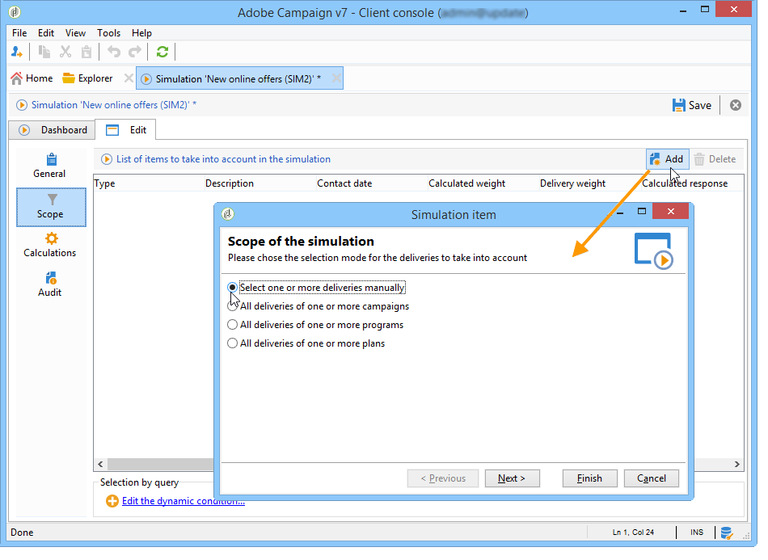

# Simulações de campanha{#campaign-simulations}

## Sobre simulações {#about-simulations}

A otimização de campanha permite testar a eficiência de um plano de campanha usando simulações. Isso permite medir o sucesso potencial de uma campanha: receita gerada, volume de destino com base nas regras de tipologia aplicadas, etc.

A simulação permite monitorar e comparar o impacto dos deliveries.

>[!NOTE]
>
>Os deliveries preparados no modo Teste não têm impacto entre si ao avaliar uma campanha no marketing distribuído ou contanto que as remessas não estejam programadas no calendário provisional.\
>This means that pressure and capacity rules are only applied to deliveries in **[!UICONTROL Target estimation and message personalization]** mode. As entregas em **[!UICONTROL Estimation and approval of the provisional target]** e em **[!UICONTROL Target evaluation]** modo não são consideradas.\
>The delivery mode is chosen in the **[!UICONTROL Typology]** sub-tab of the delivery properties.

## Configurar uma simulação {#setting-up-a-simulation}

### Criar uma simulação {#creating-a-simulation}

Para criar uma simulação, aplique as seguintes etapas:

1. Vá para o **[!UICONTROL Campaigns]** universo, clique no **[!UICONTROL More]** link dentro da **[!UICONTROL Create]** seção e selecione a **[!UICONTROL Simulation]** opção.

   

1. Insira o template e o nome da simulação. Clique em **[!UICONTROL Save]** para criar a simulação.

   

1. Click the **[!UICONTROL Edit]** tab to configure it.

   

1. In the **[!UICONTROL Scope]** tab, specify the deliveries you want to consider for this simulation. To do this, click the **[!UICONTROL Add]** button and specify the delivery selection mode to take into account.

   

   Você pode selecionar cada delivery um por um ou classificá-los por campanha, programa ou plano.

   >[!NOTE]
   >
   >Caso selecione deliveries por meio de um plano, programa ou campanha, o Adobe Campaign poderá atualizar automaticamente a lista de deliveries a serem considerados sempre que uma simulação for iniciada. Para fazer isso, marque a **[!UICONTROL Refresh the selection of deliveries each time the simulation is started]** opção.
   >  
   >Se você não fizer isso, quaisquer deliveries que não estejam disponíveis no plano, programa ou campanha quando a simulação for criada não serão levados em consideração: os deliveries adicionados posteriormente serão ignorados.

   

1. Selecione os elementos a serem incluídos no escopo de simulação. Se necessário, selecione vários elementos usando as teclas SHIFT e CTRL.

   

   Clique em **[!UICONTROL Finish]** para aprovar a seleção.

   Você pode combinar manualmente os deliveries selecionados e deliveries pertencentes a planos, programas ou campanhas.

   

   If necessary, you can use a dynamic condition via the **[!UICONTROL Edit the dynamic condition...]** link

   Clique em **[!UICONTROL Save]** para aprovar esta configuração.

   >[!CAUTION]
   >
   >Somente as entregas cujo objetivo tenha sido calculado são levadas em conta no cálculo das simulações (status: **Target pronto** ou **pronto para entrega**).

1. In the **[!UICONTROL Calculations]** tab, select an analysis dimension such as the recipient schema for example.

   

1. Você poderá então adicionar expressões.

   

### Configurações de execução {#execution-settings}

The **[!UICONTROL General]** tab of the simulation lets you enter execution settings:

* The **[!UICONTROL Schedule execution for down-time]** option defers the simulation launch to a less busy time period, based on the chosen level of priority. As simulações usam recursos significativos do banco de dados, por isso as simulações não urgentes devem ser agendadas para serem executadas à noite.
* The **[!UICONTROL Priority]** is the level applied to the simulation to delay its triggering.
* **[!UICONTROL Save SQL queries in the log]**. Os logs em SQL permitem diagnosticar uma simulação se ela terminar com erros. Eles também podem ajudá-lo a descobrir por que uma simulação está muito lenta. These messages will be visible after the simulation in the **[!UICONTROL SQL logs]** sub-tab of the **[!UICONTROL Audit]** tab.

## Executando uma simulação {#executing-a-simulation}

### Iniciando uma simulação {#starting-a-simulation}

Depois que o escopo da simulação for definido, você poderá executá-la.

To do this, open the simulation dashboard and click **[!UICONTROL Start simulation]**.

Once execution is complete, open the simulation and click the **[!UICONTROL Results]** tab to view the targets calculated for each delivery.

1. The **[!UICONTROL Deliveries]** sub-tab lists all deliveries taken into account by the simulation. Ela mostra duas contagens:

   * The **[!UICONTROL Initial count]** is the target as it was calculated during its estimation in the delivery.
   * The **[!UICONTROL Final count]** is the number of recipients counted after simulation.

      A diferença entre as contagens inicial e final reflete a aplicação de várias regras ou filtros configurados antes da simulação.

      To learn more about this calculation, edit the **[!UICONTROL Exclusions]** sub-tab.

1. The **[!UICONTROL Exclusions]** sub-tab lets you view the exclusion break-down.

   

1. The **[!UICONTROL Alerts]** sub-tab groups all alert messages generated during the simulation. As mensagens de alerta podem ser enviadas no caso de sobrecarga de capacidade (se o número de recipients exceder a capacidade definida, por exemplo).
1. The **[!UICONTROL Exploration of the exclusions]** sub-tab lets you create a result analysis table. O usuário precisa indicar variáveis nos eixos abscissa/ordenadas.

   For an example of analysis table creation, refer to the end of [Exploring results](#exploring-results).

### Visualizando resultados {#viewing-results}

#### Auditoria {#audit}

The **[!UICONTROL Audit]** tab lets you monitor simulation execution. The **[!UICONTROL SQL Logs]** sub-tab is useful for expert users. Ele lista logs de execução no formato SQL. These logs are only displayed if the **[!UICONTROL Save SQL queries in the log]** option has been selected in the **[!UICONTROL General]** tab before simulation execution.

#### Explorando resultados {#exploring-results}

The **[!UICONTROL Exploration of the exclusions]** sub-tab lets you analyze the data resulting from a simulation.

A análise descritiva é apresentada [nesta seção](../../reporting/using/about-adobe-campaign-reporting-tools.md).

## Resultados de uma simulação {#results-of-a-simulation}

The indicators in the **[!UICONTROL Log]** and **[!UICONTROL Results]** tabs provide a first overview of simulation results. For a more detailed view of results, open the **[!UICONTROL Reports]** tab.

### Relatórios {#reports}

Para analisar o resultado de uma simulação, edite os relatórios: eles mostram exclusões e causas.

Os seguintes relatórios são fornecidos como padrão:

* **[!UICONTROL Detail of simulation exclusions]** : este relatório apresenta um gráfico pormenorizado das causas de exclusão para todas as entregas em causa.
* **[!UICONTROL Simulation summary]** : este relatório mostra as populações excluídas da simulação ao longo das diversas entregas.
* **[!UICONTROL Summary of exclusions linked to the simulation]** : este relatório mostra um gráfico de exclusões causadas pela simulação juntamente com a regra de tipologia aplicada e um gráfico que mostra a taxa de exclusão por regra.

>[!NOTE]
>
>É possível criar novos relatórios e adicioná-los aos existentes. Para obter mais informações, consulte [esta seção](../../reporting/using/about-adobe-campaign-reporting-tools.md).

To access reports, click the **[!UICONTROL Reports]** link of the targeted simulation via its dashboard.

You can also edit reports using the **[!UICONTROL Reports]** link accessible from the simulation dashboard.

### Comparação de simulações {#comparing-simulations-}

Sempre que uma simulação é executada, resultados anteriores são substituídos: não é possível exibir e comparar resultados de uma execução para outra.

É necessário usar os relatórios para comparar os resultados. Na verdade, o Adobe Campaign permite que um histórico de relatórios seja salvo para exibi-los novamente mais tarde. Este histórico é salvo no ciclo de vida das simulações.

**Exemplo:**

1. Crie uma simulação em um delivery ao qual a tipologia **A** é aplicada.
1. Na **[!UICONTROL Reports]** guia, edite um dos relatórios disponíveis, como **[!UICONTROL Detail of simulation exclusions]** por exemplo.
1. Na seção superior direita do relatório, clique no ícone para criar um novo histórico.

   

1. Feche a simulação e altere a configuração de tipologia **A**.
1. Execute a simulação novamente e compare o resultado com o exibido no relatório para o qual um histórico foi criado.

   

   Você pode salvar quantos históricos de relatórios forem necessários.

### Relatórios de eixos {#reporting-axes}

The **[!UICONTROL Calculations]** tab lets you define reporting axes on the target. Theses axes will be used during result analysis (refer to [Exploring results](#exploring-results)).

>[!NOTE]
>
>Recomendamos definir eixos de cálculo nos templates de simulação, em vez de individualmente para cada simulação.\
>Simulation templates are saved in the **[!UICONTROL Resources > Templates > Simulation templates]** node of the Adobe Campaign tree.

**Exemplo:**

No exemplo abaixo, queremos criar um eixo de relatórios adicional com base no status dos recipients (&quot;Cliente&quot;, &quot;Prospecto&quot; ou nenhum).

1. To define a reporting axis, select the table which contains the information to be processed in the **[!UICONTROL Analysis dimension]** field. Essas informações são obrigatórias.
1. Aqui, queremos selecionar o campo Segmento da tabela de recipients.

   

1. As seguintes opções estão disponíveis:

   * **[!UICONTROL Generate target overlap statistics]** permite recuperar todas as estatísticas de sobreposição no relatório de simulação. As sobreposições são recipients a quem são direcionadas, no mínimo, dois deliveires em uma simulação.

      >[!CAUTION]
      >
      >A seleção dessa opção aumenta consideravelmente o tempo de execução da simulação.

   * **[!UICONTROL Keep the simulation work table]** permite que você mantenha rastreamentos de simulação.

      >[!CAUTION]
      >
      >O salvamento automático dessas tabelas requer uma capacidade de armazenamento significativa: verifique se o banco de dados é grande o suficiente.

When the simulation results are displayed, the information on the selected expression will be displayed in the **[!UICONTROL Overlaps]** sub-tab.

A sobreposição do target de delivery indica os recipients pretendidos em pelo menos dois deliveries de uma simulação.

>[!NOTE]
>
>This sub-tab is only displayed if the **[!UICONTROL Generate target recovery statistics]** option has been enabled.

The information on reporting axes can be processed in exclusion analysis reports created in the **[!UICONTROL Exploring exclusions]** sub-tab. For more on this, refer to [Exploring results](#exploring-results).
