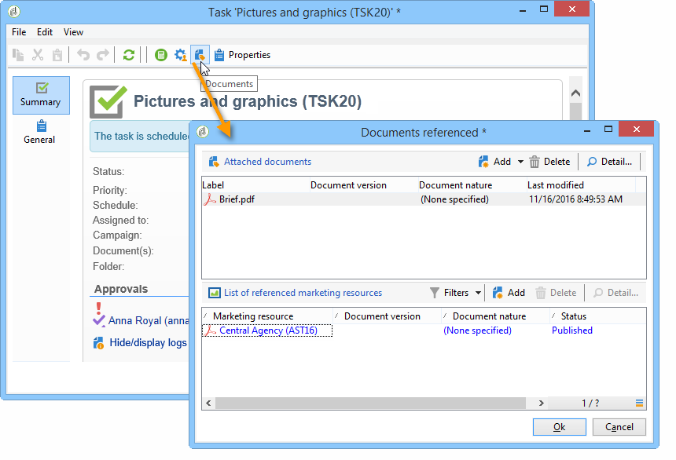
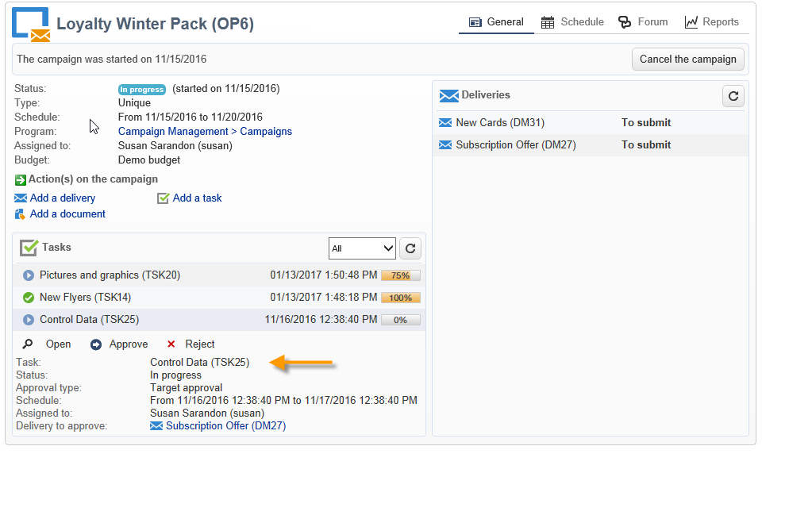

# Criar e gerenciar tarefas{#creating-and-managing-tasks}

## Sobre tarefas {#about-tasks}

O Adobe Campaign permite criar tarefas e gerenciar seu ciclo de vida completo diretamente no aplicativo. A implementação de programas e campanhas pode ser dividida em tarefas atribuídas aos operadores do Adobe Campaign ou aos provedores de serviços externos. Esse modo de operação permite criar um ambiente de colaboração aberto que inclui todos os participantes do programa e participantes externos.

As tarefas podem ser criadas, exibidas e monitoradas a partir da lista de tarefas ou do painel de campanha. Elas também podem ser visualizadas e rastreadas nas agendas do plano de marketing, programas e campanhas.

As tarefas são anexadas à campanha e podem ter dependências, ou seja, tarefas associadas. Cada tarefa tem um status, prioridade, carga estimada e custos relacionados.

Todas as tarefas são agrupadas em uma lista acessível pelo universo **Campaigns** . For more on this, refer to [Accessing tasks](#accessing-tasks).

Elas podem ser exibidas na agenda do programa ao qual pertencem.

## Acessar tarefas {#accessing-tasks}

### Exibir tarefas {#displaying-tasks}

The tasks are displayed in the task list accessible via the **[!UICONTROL Campaigns]** universe.

Todas as tarefas do operador conectado são exibidas lá.

Para obter mais informações, consulte o status de [Execução de uma tarefa](#execution-status-of-a-task) e o status de [Andamento de uma tarefa](#progress-status-of-a-task).

### Filtrar tarefas {#filtering-tasks}

When you display this view, it is automatically filtered in order to display only **[!UICONTROL operator tasks]**. Também é possível filtrar as tarefas usando os campos na seção superior da janela.

### Editar tarefas {#editing-tasks}

Clique em uma tarefa para editá-la.

## Criar uma nova tarefa {#creating-a-new-task}

To create a task, click the **[!UICONTROL Tasks]** link in the Campaigns universe and select **[!UICONTROL Create]**.

Insira pelo menos o nome da tarefa e selecione a campanha à qual ela está vinculada. É necessário também especificar as datas inicial e final. Essas três informações são obrigatórias.

Clique em **[!UICONTROL Save]** para criar a tarefa.

Também é possível criar uma tarefa através do painel de uma campanha: neste caso, ela é vinculada automaticamente à campanha em que foi criada.

Depois que uma tarefa é criada, ela é adicionada ao cronograma da campanha e à lista de tarefas. To edit a task, select it from the schedule or click its name in the task overview, and click the **[!UICONTROL Open]** link.

Para configurá-la, você deve indicar:

* O gerente e os participantes: consulte [Gerente e participantes](#manager-and-participants).
* O cronograma de criação: consulte o cronograma [de execução](#execution-schedule).
* Os custos suportados: referem - se a [Despesas e receitas](#expenses-and-revenues).

It is also possible to ad reviewers (refer to [Reviewers](#reviewers)) and referenced documents (refer to [Documents referenced](#documents-referenced)).

Task life cycle is presented in [Life cycle](#life-cycle).

### Gerente e participantes {#manager-and-participants}

Somente o operador encarregado de uma tarefa está autorizado a fechá-la.

Por padrão, quando um operador do Adobe Campaign cria uma tarefa, ela é atribuída a ele automaticamente. To select a different operator, use the **[!UICONTROL Assigned to]** field.

>[!NOTE]
>
>O gerenciamento de operador é apresentado [nesta seção](../../platform/using/access-management.md).

É possível especificar os operadores envolvidos na realização da tarefa. Esses operadores não estão autorizados a fechar a tarefa. Eles só podem aprovar a tarefa atribuída a eles.

They are selected using the **[!UICONTROL Resources]** icon in the task toolbar. Click **[!UICONTROL Add]** and select the concerned operators.

Click **[!UICONTROL Ok]** and then input the usage rate: this represents the load assigned to the operator for the duration of task execution. Essa taxa é apenas uma indicação e expressa como uma porcentagem.

Por exemplo, para uma tarefa cuja programação de execução é definida em 10 dias, um operador cuja taxa de utilização é 50% estará mobilizado nessa tarefa pelo metade do tempo de trabalho por 10 dias.

Para cada operador, você pode inserir uma carga de trabalho agendada e uma carga de trabalho real. Essas durações também são somente para fins de informação.

É possível configurar um lembrete, que será enviado automaticamente para todos os operadores envolvidos na tarefa antes de sua data final.

You can view the Adobe Campaign operator profile via the **[!UICONTROL Edit link]** icon.

O painel do operador permite verificar a carga de trabalho dele (outras tarefas em andamento).

### Revisores {#reviewers}

Além dos participantes, você pode definir operadores que revisarão a tarefa uma vez que ela tenha sido fechada pela pessoa encarregada. To do this, click the **[!UICONTROL Enable task approval]** option in the lower left-hand section of the **[!UICONTROL Resources]** window. Pode ser um operador individual, um grupo de operadores ou uma lista de operadores.

To specify a list of operators, click the **[!UICONTROL Edit...]** link to the right of the first reviewer and add as many operators as necessary, as shown below:

Você pode definir um agendamento de aprovação para a tarefa na seção inferior da janela de configuração do revisor. Por padrão, os revisores têm três dias a partir da data de envio para aprovar a tarefa. É possível configurar um lembrete, que será enviado para os operadores relacionados automaticamente antes do prazo de aprovação.

A pessoa encarregada da tarefa pode atribuir a si mesmo a tarefa de aprovação, mesmo que outros operadores já tenham sido atribuídos a isso. Se nenhum revisor tiver sido definido, as notificações serão enviadas à pessoa encarregada da tarefa. All other Adobe Campaign operators with **[!UICONTROL Administrator]** rights can also approve the task. No entanto, eles não receberão notificações.

### Documentos referenciados {#documents-referenced}

It&#39;s possible to add documents and marketing resources to a task (for more on this, refer to [Managing marketing resources](../../campaign/using/managing-marketing-resources.md)). To do so, open the task and click the **[!UICONTROL Documents]** icon in the task toolbar.

Click **[!UICONTROL Add]** and select the document to be added to your task. Faça o mesmo processo para recursos de marketing.

Os documentos referenciados aparecerão nas notificações enviadas aos operadores envolvidos na tarefa, bem como no painel de tarefas.

### Cronograma de execução {#execution-schedule}

The validity period of a task is indicated in the **[!UICONTROL Start]** and **[!UICONTROL End]** fields. A carga agendada expressa a carga de trabalho a ser executada durante o período. É expresso em dias ou horas.

>[!NOTE]
>
>The life cycle of a task is presented in [Life cycle](#life-cycle).

The **[!UICONTROL Workload performed]** field also expressed in days and hours, lets you manually update the progress of the task with respect to the scheduled workload.

The **[!UICONTROL Progress status]** of the task, expressed as a percentage, is updated automatically based on the tasks carried out by the operators involved. Ele pode ser alterado manualmente.

Essas informações podem ser visualizadas no painel de tarefas.

Também são visíveis na guia da campanha.

If the task execution schedule end date has been reached but the task is not completed, the task will be **[!UICONTROL Late]**. Uma mensagem de aviso também será exibida para alertar os operadores.

Para obter mais informações, consulte o status de [andamento de uma tarefa](#progress-status-of-a-task).

### Despesas e receitas {#expenses-and-revenues}

É possível definir despesas relacionadas e prever a receita para cada tarefa. Elas serão calculadas e consolidadas para a campanha à qual a tarefa está anexada.

To specify this information, click the **[!UICONTROL Expenses and revenue]** icon in the task toolbar.

Por padrão, o orçamento cobrado é o orçamento da campanha à qual a tarefa está anexada. Ele é exibido nos detalhes da tarefa.

>[!NOTE]
>
>Para obter mais informações sobre despesas e orçamentos, consulte Compromisso [de custo, cálculo e cobrança](../../campaign/using/controlling-costs.md#cost-commitment--calculation-and-charging).

Nessa janela, você também pode definir os objetivos a serem atingidos. Os objetivos são expressos em termos de previsão de receita para a tarefa.

### Provedores de serviços {#service-providers}

Um provedor de serviços externos pode ser envolvido no gerenciamento de uma tarefa.

Para fazer isso, edite as propriedades da tarefa e selecione o provedor de serviços. As classes de custo associadas ao provedor de serviços são listadas automaticamente na seção central da janela.

Para obter mais informações, consulte [Criação de um provedor de serviços e suas categorias](../../campaign/using/providers--stocks-and-budgets.md#creating-a-service-provider-and-its-cost-categories)de custo.

Selecione as categorias de custo relacionadas à execução da tarefa. Para fazer isso, selecione o tipo de custo e, se necessário, adicione uma quantidade como sobretaxa.

>[!NOTE]
>
>The method for managing budgets and costs is presented in [Controlling costs](../../campaign/using/controlling-costs.md).

Quando um provedor de serviços é selecionado, ele é exibido no painel de tarefas:

### Tarefas atrasadas {#late-tasks}

A task is late if it has reached its end date without its status changing to **[!UICONTROL Finished]**. Por padrão, nenhum operador é avisado quando uma tarefa está atrasada. É possível configurar o delivery de um e-mail de notificação: todos os operadores podem ser notificados mesmo se não estiverem envolvidos na tarefa.

Go to the **[!UICONTROL Resources]** box and add the operator to the **[!UICONTROL Assignation]** field. Para notificar várias pessoas, selecione um grupo de operadores.

### Notificações iniciais {#initial-notifications}

Quando uma tarefa é criada ou modificada com uma data de início no futuro, o Adobe Campaign oferece enviar um e-mail para a pessoa encarregada da tarefa para que saibam quando ela é iniciada.

No entanto, se a tarefa que criada estiver muito longe do início, pode ser preferível agendar a notificação para ser enviada antes que a tarefa seja iniciada. Por exemplo, se a tarefa iniciar em um mês, pode-se notificar a pessoa encarregada dela uma semana antes dela começar.

To schedule a notification, go to the **[!UICONTROL Resources]** box and use the **[!UICONTROL Initial notification]** field.

* Para tarefas em campanhas, selecione uma data e hora específica.
* For tasks within campaign templates, the notification time is expressed as the time remaining before the task starts (for instance, if you enter 2d in the **[!UICONTROL Initial notification]** field, the email will be sent 2 days before the task start date).

Quando agendada uma notificação, ao salvar a tarefa, o Adobe Campaign ainda oferece enviar uma notificação imediatamente. É possível enviá-lo e isso não substituirá a notificação agendada.

### Tarefa vinculada a um programa {#task-linked-to-a-program}

Você pode criar tarefas diretamente em um programa para gerenciar ações relacionadas à sua organização geral e não a uma campanha específica (por exemplo, uma reunião para discutir o tema das campanhas futuras dentro do programa). A tarefa aparecerá no cronograma do programa.

Para criar uma tarefa vinculada diretamente a um programa:

1. Open the program schedule: on the home page, go to **[!UICONTROL Campaigns > Browse > Other choices > Programs]**. O cronograma geral do programa é aberto na seção à direita da janela.
1. No agendamento, clique no programa desejado: uma janela aparece com o programa nela.
1. Nesta janela, clique em **[!UICONTROL Open]**. O cronograma do programa é aberto.
1. Clique no **[!UICONTROL Add]** botão acima do agendamento à direita e clique em **[!UICONTROL Add a task]**.

### Disponibilidade do operador {#operator-availability}

No painel de tarefas, um ícone ao lado do nome do operador indica que eles já estão trabalhando em outra tarefa ou evento durante o período coberto pela tarefa. (Task which the operator is in charge of or involved in: he appears in the **[!UICONTROL Assigned to]** field or in the task **[!UICONTROL Resources]** box).

### Tarefa em um workflow {#task-in-a-workflow}

Using a **[!UICONTROL Task]** element in a campaign workflow enables you to define two scenarios depending on whether or not the task is approved.

Nos fluxos de trabalho da campanha, a **[!UICONTROL Task]** atividade é encontrada na **[!UICONTROL Flow control]** guia.

## Tipos de tarefa {#types-of-task}

Ao criar tarefas por meio de uma campanha, pode-se criar tarefas específicas. O tipo de tarefa é definido no template selecionado.

As seguintes tarefas podem ser agendadas:

* **[!UICONTROL Control task]**, as tarefas [de](#control-tasks)controlo,
* **[!UICONTROL Marketing resource creation task]**, por exemplo, [tarefa](#grouping-task)de agrupamento,
* **[!UICONTROL Grouping task]**, por exemplo, [tarefa](#grouping-task)de agrupamento,
* **[!UICONTROL Notification task]**, consulte a tarefa Notificação.

>[!NOTE]
>
>**[!UICONTROL Control task]** e **[!UICONTROL Grouping]** as tarefas podem ser criadas **somente** por meio do painel da campanha.\
>Elas são exibidas no mapa de tarefas do operador para as quais são atribuídas. Consulte [Acessar tarefas](#accessing-tasks).

### Tarefas de controle {#control-tasks}

A **[!UICONTROL Control task]** is linked to delivery approval: approval of targeting, content, extraction file, budget or proof.

Depois de criada, a tarefa é adicionada ao painel de campanha.

É possível, então, editá-la e especificar seus parâmetros.

### Tarefa de criação de recursos de marketing {#marketing-resource-creation-task}

Uma tarefa de criação de recursos de marketing pode ser usada para gerenciar a criação e a publicação de um recurso de marketing. Se estiver gerenciando um recurso por meio de uma tarefa e não por meio do próprio recurso, é possível:

* Controlar o processo de criação de recursos por meio de uma campanha.
* Exibir o processo de criação de recursos em uma agenda.
* Gerenciar o processo de criação de recursos (lembretes, notificações).
* Calcular e controlar os custos vinculados à criação de recursos.
* Aprovar e publicar o recurso por meio da tarefa (se a opção relevante estiver habilitada).

#### Interação entre a tarefa e seu recurso vinculado {#interaction-between-the-task-and-its-linked-resource}

A tarefa de criação de recursos de marketing interage com o recurso vinculado à ela. Isso significa:

* O agendamento de criação de recursos e os custos vinculados à ela são gerenciados por meio da tarefa.
* Os operadores podem trabalhar no recurso normalmente (download ou upload, bloquear e desbloquear): isso não afeta a tarefa.
* Resource approval and publication can be carried out via the task: if the **[!UICONTROL Publish the marketing resource]** option is enabled, the resource is approved and published automatically once the task is finished. Se a opção não estiver habilitada, a tarefa e o recurso não interagem: atuando em um não afetará o outro.

   É possível usar uma série de tarefas vinculadas para definir um ciclo de aprovação completo. Check the **[!UICONTROL Publish the marketing resource]** option only for the last task: all tasks will need to be finished in order for the resource to be published. Além disso, quando você cria uma tarefa de recurso de marketing filho, o recurso será selecionado automaticamente na tarefa filho.

   * **Por meio do recurso**: se enviar o recurso para aprovação ou aprová-lo, essas ações não afetarão a tarefa.
   * **Através da tarefa**: se a **[!UICONTROL Publish the marketing resource]** opção estiver selecionada na tarefa, o recurso será aprovado e publicado automaticamente quando a tarefa for concluída (consulte acima). Se a opção não estiver marcada, a tarefa e o recurso não irão interagir: atuando em um não afetará o outro.

#### Configurar uma tarefa de criação de recurso de marketing {#configuring-a-marketing-resource-creation-task}

A pessoa que revisa a tarefa não é necessariamente a mesma pessoa que analisa o conteúdo definido no recurso. However, if the **[!UICONTROL Publish the marketing resource]** option is checked (see below), the task reviewer is authorized to approve the resource content, as finishing the task automatically approves the resource (or, if no reviewer is defined, the task manager).

In the **[!UICONTROL Marketing resource]** field, define the resource you want to manage via this task. É possível:

* Select an existing resource: the drop-down list offers all resources with the status **[!UICONTROL Being edited]**.
* Criação de um recurso: clique no **[!UICONTROL Select the link]** ícone e, em seguida, clique no **[!UICONTROL Create]** ícone.

The **[!UICONTROL Publish the marketing resource]** option lets you automate resource publishing: once the task is **[!UICONTROL Finished]**, the status of the resource automatically switches to **[!UICONTROL Published]**, even if it was neither submitted for approval or approved, including if the reviewer who completes the task isn&#39;t the content reviewer defined in the resource.

The **[!UICONTROL Publish the resource]** button is made available and the resource publishing reviewer receives a notification email to let him know that it is ready to be published. In the **[!UICONTROL Edit > Tracking]** tab, reviewing and publishing by the task reviewer become visible. Se um workflow de pós-processamento de recurso tiver sido definido, ele será executado agora.

### Tarefa de agrupamento {#grouping-task}

The **[!UICONTROL Grouping task]** type task lets you group several tasks and synchronize the management of their progress and their approval.

As tarefas de agrupamento não têm nenhuma despesa ou recurso vinculado.

Todas as tarefas agrupadas em uma tarefa de agrupamento podem ser vistas em seus próprios painéis. Isso permite filtrar a lista de tarefas para exibir apenas aquelas que necessita.

As tarefas de agrupamento têm um link que permite criar facilmente uma tarefa agrupada.

Para criar uma tarefa agrupada com base em uma tarefa de agrupamento, vá para o painel de campanha e clique no nome da tarefa de agrupamento para exibir sua descrição e, em seguida, clique em **[!UICONTROL Add a task]**.

However, if you have already created a task that you want to link to a grouping task, you can do it via the **[!UICONTROL Linked to]** field of the **[!UICONTROL Properties]** box.

### Tarefa de notificação {#notification-task}

As tarefas de notificação permitem agendar entregas de e-mail (a um operador, um grupo de operadores, um provedor de serviços etc.). Isso permite agendar lembretes, por exemplo, para notificar alguém que uma campanha está terminando em breve ou enviar documentos antes de uma campanha começar para que os operadores possam prepará-los. Isso significa que é possível acompanhar as comunicações dentro da campanha ou programa e monitorar de perto as ações realizadas.

#### Ciclo de vida {#life-cycle}

As tarefas de notificação não exigem aprovação. Isso significa que o ciclo de vida é mais simples do que uma tarefa padrão:

Uma tarefa de notificação pode ter os seguintes status:

* **[!UICONTROL Scheduled]** até que o email seja enviado
* **[!UICONTROL In progress]** uma vez que o email é enviado e até a data final ser atingida
* **[!UICONTROL Finished]** quando a data final for atingida.

#### Configuração {#configuration}

Durante a criação, os seguintes elementos devem ser inseridos na tarefa:

* **[!UICONTROL Assigned to]** : o operador ou o grupo de operadores que receberá o email. Se reatribuir a tarefa quando o e-mail tiver sido enviado, o e-mail não será enviado para o novo operador (para que isso aconteça, é necessário reiniciar a tarefa e alterar sua data de início).
* **Task start date**: data em que o e-mail de notificação será enviado. Essa data deve ocorrer no futuro a partir momento da gravação da tarefa.
* **Data** de término da tarefa: data em que o status da tarefa muda para **[!UICONTROL Finished]**. Por padrão, a data final é idêntica à data de início. No entanto, atribuir uma duração à tarefa permite que simbolizar a quantidade de tempo que o operador tem para agir no cronograma, se necessário.
* **[!UICONTROL Description]** : o texto inserido aqui aparecerá no corpo do email de notificação.

   

É possível adicionar um anexo à tarefa e ao e-mail de notificação. To do this, click the **[!UICONTROL Documents]** icon in the toolbar in the upper right-hand corner.

## Ciclo de vida {#life-cycle-1}

### Links entre tarefas {#links-between-tasks}

The **[!UICONTROL Properties]** button in each task enables you to define the links between tasks in a campaign. You can split tasks into subtasks using a grouping task (see [Linked tasks](#linked-tasks)), or define dependencies between the tasks (see [Grouping tasks](#grouping-tasks)).

#### Tarefas vinculadas {#linked-tasks}

Use the **[!UICONTROL Linked task]** field to associate tasks with a grouping task. Consulte [Tipos de tarefa](#types-of-task).

No exemplo a seguir, a aprovação de definição de alvos é dividida em quatro subtarefas.

Cada subtarefa é uma tarefa padrão vinculada à tarefa principal.

#### Agrupar tarefas {#grouping-tasks}

Use the **[!UICONTROL Grouped to]** field to make the execution of a task depend on the execution of another task.

A dependência entre tarefas é representada por setas no painel de campanha.

No caso de tarefas agrupadas, o Adobe Campaign atribui automaticamente a data de término da tarefa pai à tarefa secundária como data de início. Por exemplo, se uma tarefa de **Criação de convite** terminar em 15 de outubro às 3:30 P.M., a tarefa filho **Enviar e-mail de convite** será iniciada em 15 de outubro às 3:30 P.M.

Moreover, if you postpone the end of a parent task, some of its child tasks may be affected: these are the child tasks whose status is **[!UICONTROL Scheduled]** and whose start date is earlier than the new end date of the parent task. A duração da tarefa permanece a mesma. Se a data de início de uma tarefa filho for posterior à nova data de término da tarefa pai, a tarefa filho não será afetada.

**Exemplo**

Uma tarefa pai agendada para terminar em 9 de outubro às 5 P.M. tem duas tarefas filho, tarefa A e tarefa B. A tarefa A é agendada para iniciar em 10 de outubro às 2 P.M. e a tarefa B está agendada para iniciar em 12 de outubro de às 8 A.M.

Vamos adiar a tarefa pai: ela agora termina em 11 de outubro às 1 P.M. Somente a tarefa A é adiada e será iniciada em 11 de outubro às 1 P.M.

### Status de execução de uma tarefa {#execution-status-of-a-task}

Os status da tarefa podem ser visualizados no mapa de tarefas. O status de execução de uma tarefa é atualizado automaticamente de acordo com as ações do operador.

Uma tarefa pode ser: **[!UICONTROL Scheduled]**, **[!UICONTROL In progress]**, **[!UICONTROL Finished]**, **[!UICONTROL Canceled]**, **[!UICONTROL Pending approval]** ou **[!UICONTROL Rejected]**.

* When a task is created, it is **[!UICONTROL Scheduled]** if its start date is in the future. Ela mantém esse status até que a data de início seja alcançada.
* Once it has been started, the task is **[!UICONTROL In progress]**. When the person in charge of the task closes it, it changes to **[!UICONTROL Finished]**.
* If a reviewer has been defined, the task will be **[!UICONTROL Pending approval]** once the person in charge of it closes it and until the reviewer approves it. If the reviewer rejects it, the task will be **[!UICONTROL Rejected]**.
* A task can be canceled by the person responsible for it via the dashboard or the **[!UICONTROL Task map]** by clicking the **[!UICONTROL Cancel]** button.
* Para agendar uma tarefa, insira uma data de início no futuro. É possível enviar uma primeira notificação para os operadores do Adobe Campaign envolvidos na execução da tarefa. See [Complete task life cycle](#complete-task-life-cycle).

>[!NOTE]
>
>* O status da tarefa é atualizado automaticamente.
>* Mesmo que o período de validade seja concluído, as tarefas que não foram fechadas ainda aparecerão na lista de tarefas em andamento. Um aviso notifica os operadores que a tarefa está atrasada.
>

### Status de progresso de uma tarefa {#progress-status-of-a-task}

In addition to its execution status, a task can be associated with a progress status: **[!UICONTROL Late]**, **[!UICONTROL To approve]**, **[!UICONTROL To do today]** or **[!UICONTROL To do this week]**. Essas informações são inseridas automaticamente de acordo com o agendamento da tarefa.

É possível filtrar a lista de tarefas por status de processo ou andamento.

For more on this, refer to [Accessing tasks](#accessing-tasks).

### Ciclo completo de vida da tarefa {#complete-task-life-cycle}

Abaixo estão os estágios de um ciclo completo de vida de tarefa para o qual a pessoa encarregada tenha definido os participantes e revisores.

1. A pessoa encarregada cria a tarefa e preenche os vários campos. Para obter mais informações, consulte [Criação de uma nova tarefa](#creating-a-new-task).

   Ao criar e editar uma tarefa **agendada no futuro** (desde que a data de início da tarefa não seja atingida), é possível enviar uma notificação aos participantes e gerentes para que eles saibam que uma nova tarefa foi agendada.

   

   To send this first notification, click **[!UICONTROL Yes]**. Esta notificação informa sobre a próxima tarefa e inclui detalhes sobre o conteúdo e o número de dias restantes até seu prazo final.

   When a task is created and scheduled for the future, its status is **[!UICONTROL Scheduled]**.

1. Na data de início da tarefa, a pessoa responsável e os participantes recebem uma notificação informando que a tarefa foi iniciada. Seu status muda para **[!UICONTROL In progress]**.
1. Depois de concluir a seção atribuída a eles, os participantes podem aprovar a tarefa através:

   * do e-mail de notificação.
   * do console ou da interface da Web, no painel de tarefas.

      

1. Sempre que um participante aprovar uma tarefa, o status do progresso da tarefa será atualizado.

   

1. O revisor recebe um e-mail de notificação informando que o operador concluiu a seção atribuída a ele.

   Eles podem monitorar o progresso no painel de tarefas.

   

1. Assim que a pessoa encarregada da tarefa decidir que ela terminou, ela pode fechá-la, usando o link no e-mail de notificação enviado quando a tarefa foi iniciada, o console ou a interface.

   

   >[!NOTE]
   >
   >A pessoa encarregada de uma tarefa pode fechá-la a qualquer momento, mesmo sem aprovações. O status do progresso muda para 100% automaticamente.

1. The task status changes to **[!UICONTROL To approve]**, and a notification is sent to the reviewer.

   Eles aprovam a tarefa através do e-mail de notificação, do console ou da interface da Web.

   Eles podem agir através do painel de campanha:

   

   Eles também podem usar o botão de aprovação de tarefas:

   

   >[!NOTE]
   >
   >The task status will only change to **[!UICONTROL To approve]** if you have enabled the **[!UICONTROL Enable task validation]** option in the **[!UICONTROL Resources]** window of the task.\
   >If the reviewer rejects the task, its status changes to **[!UICONTROL Rejected]**, and the task life cycle starts again automatically.

1. The task status changes to **[!UICONTROL Finished]**. Uma notificação é enviada para todos envolvidos.

   >[!NOTE]
   >
   >Uma vez concluída a tarefa, seu ciclo de vida pode ser reinicializado pela pessoa encarregada dela. To do this, open the task and click the **[!UICONTROL Reset task to execute it again...]** link at the bottom of the dashboard.

