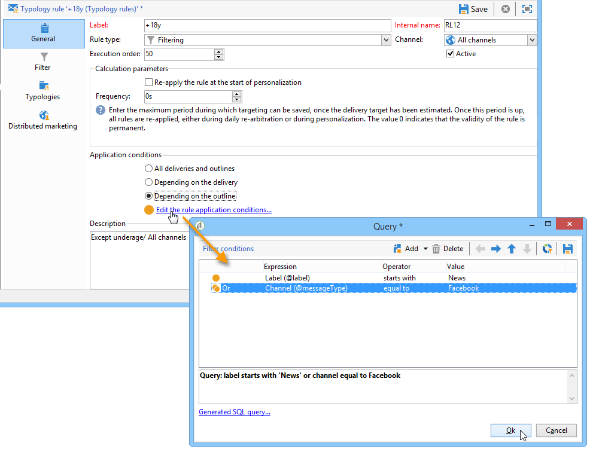

# Regras de filtragem{#filtering-rules}

Regras de filtragem permitem definir as mensagens a serem excluídas com base nos critérios definidos em uma query. Essas regras estão vinculadas a uma targeting dimension.

As regras de filtragem podem estar vinculadas a outros tipos de regras (controle, pressão etc.) em tipologias ou agrupadas em uma tipologia **Filtragem** dedicada. Para obter mais informações, consulte [Criação e uso de uma tipologia](#creating-and-using-a-filtering-typology)de filtragem.

## Criando uma regra de filtragem {#creating-a-filtering-rule}

Por exemplo, você pode filtrar os assinantes do boletim informativo para evitar que as comunicações sejam enviadas a recipients menores de idade.

Para definir esse filtro, aplique as seguintes etapas:

1. Create a **[!UICONTROL Filtering]** typology rule applicable to all communication channels.

   

1. Altere a targeting dimension padrão e selecione as assinaturas (**nms:subscription**).

   

1. Crie o filtro usando o **[!UICONTROL Edit the query from the targeting dimension...]** link.

   

1. Vincule essa regra a uma tipologis de campanha e salve-a.

   

Quando essa regra for usada em um delivery, os assinantes menores de idade serão excluídos automaticamente. Uma mensagem específica indica a regra do aplicativo:

## Condicionando uma regra de filtragem {#conditioning-a-filtering-rule}

Você poderá restringir o campo da aplicação na regra de filtragem com base no delivery ou delivery outline vinculado.

To do this, go to the **[!UICONTROL General]** tab of the typology rule, select the type of restriction to apply and create the filter, as shown below:

Nesse caso, mesmo que a regra esteja vinculada a todos os deliveries, ela só será aplicada àqueles que correspondam aos critérios do filtro definido.

>[!NOTE]
>
>Typologies and filtering rules can be used in a workflow, in the **[!UICONTROL Delivery outline]** activity. Para obter mais informações, consulte [esta seção](../../workflow/using/delivery-outline.md).

## Como criar e usar uma tipologia de filtragem {#creating-and-using-a-filtering-typology}

You can create **[!UICONTROL Filtering]** typologies: they only contain filtering rules.

These specific typologies can be linked to a delivery when the target is selected: in the delivery wizard, click the **[!UICONTROL To]** link, then click the **[!UICONTROL Exclusions]** tab.

Em seguida, selecione o filtro a ser aplicado ao delivery. To do this, click the **[!UICONTROL Add]** button and select the typologies to apply.

Você também poderá vincular regras de filtragem diretamente por meio desta guia, sem que sejam agrupadas em uma tipologia. Para fazer isso, use a seção inferior da janela.

>[!NOTE]
>
>* Somente as regras de filtragem e de tipologia estarão disponíveis na janela de seleção.
>* Essas configurações podem ser definidas no template de delivery a ser aplicado automaticamente a todos os novos deliveries criados usando o template.
>

## Regras padrão de exclusão de entrega {#default-deliverability-exclusion-rules}

Two filtering rules are available by default: **[!UICONTROL Exclude addresses]** ( **[!UICONTROL addressExclusions]** ) and **[!UICONTROL Exclude domains]** ( **[!UICONTROL domainExclusions]** ). Durante a análise de e-mail, essas regras comparam os endereços de e-mail do recipient com os endereços proibidos ou nomes de domínio contidos em uma lista de supressão global criptografada gerenciada na instância de entrega. Se houver algum positivo, a mensagem não será enviada para esse recipient.

Isso é para evitar a inclusão na blacklist devido a atividades mal-intencionadas, especialmente o uso de um Spamtrap. Por exemplo, se um Spamtrap for usado para se inscrever em um dos seus formulários Web, um e-mail de confirmação será enviado automaticamente para esse Spamtrap e isso resultará no endereço utilizado sendo automaticamente incluído na blacklist.

>[!NOTE]
>
>Os endereços e os nomes de domínio contidos na lista de supressão global estão ocultos. Somente o número de recipients excluídos é indicado nos logs de análise de delivery.

