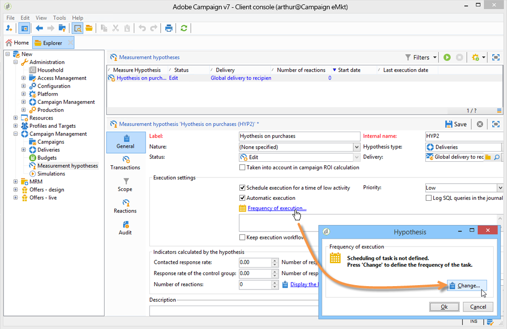
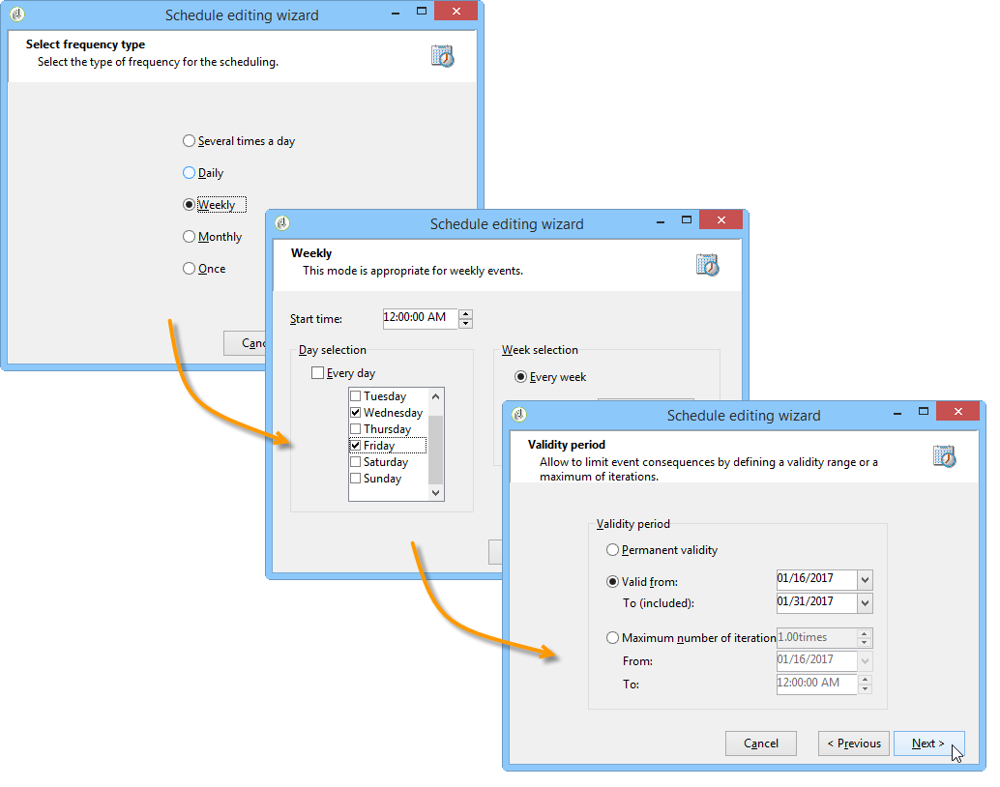
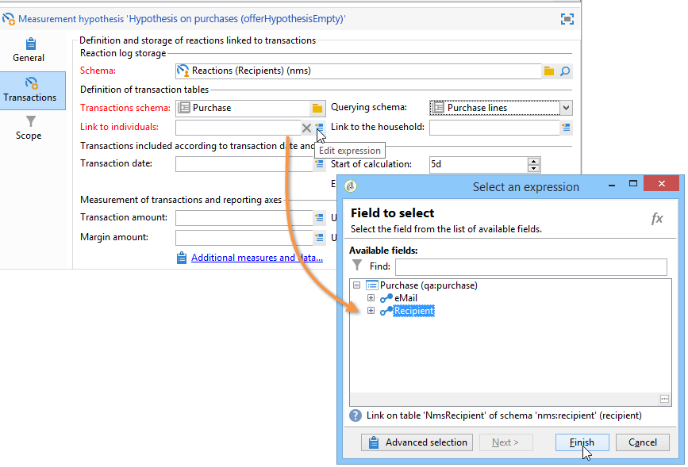

# Templates de Hipóteses{#hypothesis-templates}

## Cria um template de hipótese {#creating-a-hypothesis-model}

A configuração do template de hipótese permite definir o contexto para mensurar as reações, seja para um delivery ou para uma oferta. É onde as várias tabelas de mensuração são referenciadas, assim como aquelas que definem as relações entre individuais, hipóteses e a tabela de transações.

Aplique as seguintes etapas para criar um template de hipótese:

1. No navegador Adobe Campaign, clique em **[!UICONTROL Resources>Templates>Hypothesis templates]**.

   

1. Clique em **[!UICONTROL New]** ou selecione com o botão direito na lista de modelos e escolha **[!UICONTROL New]** na lista suspensa.
1. Insira o rótulo da hipótese.
1. Especifique se o modelo for destinado às hipóteses sobre ofertas ou envios por meio de **[!UICONTROL Hypothesis type]**.
1. Para templates do tipo **[!UICONTROL Delivery]**, especifique se as medições devem ser executadas com ou sem um grupo de controle (para mais informações, consulte [Propriedades de um template de hipótese](#properties-of-a-hypothesis-template)).
1. Para templates do tipo **[!UICONTROL Delivery]**, é possível escolher um canal específico ou decidir aplicar o modelo a todos os canais disponíveis no Adobe Campaign por meio da lista suspensa **[!UICONTROL Channel]** (para mais informações, consulte [Propriedades de um template de hipótese](#properties-of-a-hypothesis-template)).
1. Selecione a **[!UICONTROL Execution folder]** na qual deseja criar e executar automaticamente a hipótese criada a partir desse template.
1. Escolha as configurações de execução (para mais informações, consulte [Configurações de execução de template de hipótese](#hypothesis-template-execution-settings)).
1. Especifique o período de cálculo da hipótese (para saber mais sobre isso, consulte [Configurações de execução de template de hipótese](#hypothesis-template-execution-settings)).

   >[!CAUTION]
   >
   >Esse período é determinado a partir da data de contato.

1. Na guia **[!UICONTROL Transactions]**, especifique as tabelas e os campos necessários para o cálculo da hipótese (para mais informações, consulte [Transações](#transactions)).
1. Se o modelo estiver configurado para a hipótese de tipo **[!UICONTROL Offer]**, é possível habilitar a opção **[!UICONTROL Update offer proposition status]**. Nesse caso, selecione o status da apresentação da oferta que deseja alterar.
1. Especifique o escopo da aplicação da hipótese (para mais informações, consulte [Perímetro da hipótese](#hypothesis-perimeter)).
1. Se necessário, é possível usar um script para concluir a filtragem (para mais informações, consulte [Perímetro da hipótese](#hypothesis-perimeter)).

### Propriedades de um template de hipótese {#properties-of-a-hypothesis-template}

A guia **[!UICONTROL General]** permite especificar as opções gerais do modelo. Os campos disponíveis são:

* **[!UICONTROL Hypothesis type]**: permite determinar se o template deve ser destinado à hipótese sobre deliveries ou ofertas.

   É possível optar por criar uma hipótese que será aplicada tanto em envios quanto em ofertas.

   >[!NOTE]
   >
   >Se o template for aplicável a ofertas, a opção **[!UICONTROL Update offer proposition status]** estará disponível na guia **[!UICONTROL Transactions]**.

* **[!UICONTROL Measurement with control group]**: permite indicar se um grupo de controle foi definido para o delivery ou campanha, assim como incluí-lo nos indicadores de mensuração. O grupo de controle, que não recebe deliveries, permite medir o impacto da campanha após o delivery, comparando-o com a amostragem alvo que recebeu o delivery.

   >[!NOTE]
   >
   >Se o template está configurado para assumir um grupo de controle em conta, mas nenhum grupo está definido no delivery relacionado a hipótese, os resultados são baseados somente em recipients direcionados.

   Para mais informações sobre como definir e configurar um grupo de controle, consulte [Definição de um grupo de controle](../../campaign/using/marketing-campaign-deliveries.md#defining-a-control-group).

* **[!UICONTROL Channel]**: é possível escolher um canal específico ou disponibilizar o template da hipótese em todos os canais no console do Adobe Campaign ao selecionar **[!UICONTROL All channels]** na lista suspensa. Se o template for configurado para um canal específico, é possível filtrar os deliveries por canal automaticamente ao criar a hipótese (consulte [Criação de hipótese](../../campaign/using/creating-hypotheses.md)).

   

* **[!UICONTROL Execution folder]**: permite especificar a pasta de execução da hipótese.
* **[!UICONTROL Taken into account in campaign ROI calculation]**: considera o resultado da hipótese no cálculo do ROI da respectiva campanha.

### Configurações de execução do template de Hipótese {#hypothesis-template-execution-settings}

A guia **[!UICONTROL General]** do modelo também permite especificar os parâmetros de execução da hipótese. As opções disponíveis são:

* **[!UICONTROL Schedule execution for a time of low activity]**: permite agendar a aplicação da hipótese para otimizar as performances do Adobe Campaign. Quando essa opção é marcada, o workflow do processamento em campanhas executa o cálculo de hipóteses durante o tempo de inatividade.

   

* **[!UICONTROL Priority]**: nível aplicado para espaçar as ordens de cálculo da hipótese se houver execuções simultâneas.

   

* **[!UICONTROL Automatic execution]**: se necessário, permite agendar o recálculo da hipótese (por exemplo, é possível atualizar os indicadores regularmente até o fim do delivery).

   

   Aplique o seguinte processo para especificar um cronograma:

   1. Clique no link **[!UICONTROL Frequency of execution...]** e depois no botão **[!UICONTROL Change...]**.

      

   1. Configure a frequência, os eventos relacionados e o período de validade.

      

   1. Clique em **[!UICONTROL Finish]** para salvar o cronograma.

      

* **[!UICONTROL Log SQL queries in journal]**: esta função é destinada para usuários especialistas. Ele permite adicionar uma guia à auditoria da hipótese de mensuração para mostrar queries SQL. Isso permite a detecção de possíveis defeitos se uma simulação terminar com erros.
* **[!UICONTROL Keep execution workflow]**: permite manter o fluxo de trabalho gerado automaticamente no início do cálculo da hipótese. Na hipótese criada a partir de um template que tem essa opção marcada, o workflow gerado está disponível para seguir o processo.

   >[!CAUTION]
   >
   >Essa opção deve ser ativada somente para fins de depuração, caso ocorra um erro durante a execução da hipótese.\
   >Além disso, os workflows gerados automaticamente não devem ser modificados. Qualquer modificação eventual em outro lugar é desconsiderada para cálculos posteriores.\
   >Se essa opção está marcada, exclua o workflow após a execução.

### Transações {#transactions}

Esta guia contém vários campos e tabelas que permitem salvar o histórico das reações do recipient em termos de transações. Consulte o guia [Configuração](../../configuration/using/about-schema-reference.md) para obter mais informações sobre as tabelas dedicadas ao gestor de resposta.

* **[!UICONTROL Schema (reaction log storage)]**: selecione a tabela de reação de recipient. A tabela pronta para uso no Adobe Campaign é a **NmsRemaMatchRcp**.
* **[!UICONTROL Transaction schema]**: escolha a tabela relacionada à hipótese, ou seja, a tabela de transação ou a de compra.
* **[!UICONTROL Querying schema]**: escolha os critérios para filtrar a hipótese.
* **[!UICONTROL Link to individuals]**: escolha o vínculo entre as Pessoas físicas e a tabela usada como schema de transações.
* **[!UICONTROL Link to the household]**: seleciona o vínculo para a família no schema de transações se desejar incluir todos os membros de uma organização em uma hipótese. Este campo é opcional.
* **[!UICONTROL Transaction date]**: este campo é opcional, mas recomendado, pois permite a definição de um escopo para o cálculo de hipótese.
* **[!UICONTROL Measurement period]**: permite a configuração de datas de início e término para que as hipóteses sejam executadas e as linhas de compra sejam recuperadas.

   Quando a hipótese está vinculada a um delivery, a mensuração é acionada automaticamente por alguns dias após a data de contato da mala direta ou após a data do email ou SMS.

   

   Se a hipótese é iniciada em tempo real, pode ser forçada para acionar imediatamente. Caso contrário, será acionado automaticamente com base na configuração de data de término do cálculo, que se baseia na data de criação da hipótese (consulte [Criar uma hipótese em tempo real em um delivery](../../campaign/using/creating-hypotheses.md#creating-a-hypothesis-on-the-fly-on-a-delivery)).

* **[!UICONTROL Transaction/Margin amount]**: esses campos são opcionais e permitem o cálculo dos indicadores de faturamento automaticamente (consulte [Indicadores](../../campaign/using/hypothesis-tracking.md#indicators)).
* **[!UICONTROL Unit amount]**: permite a definição de um montante para calcular a receita (consulte [Indicadores](../../campaign/using/hypothesis-tracking.md#indicators)).

   

* **[!UICONTROL Additional measures and data]**: permite a especificação de relatórios adicionais de medidas ou eixos de campos nas diferentes tabelas.
* **[!UICONTROL Update offer proposition status]**: permite a alteração do status da apresentação da oferta se um recipient for identificado pela hipótese.

   

### Perímetro da Hipótese {#hypothesis-perimeter}

Depois de definir a tabela de transações e os campos que são relacionados, é possível refinar o escopo da sua hipótese especificando as transações de destino e envios através do uso de filtros. Também é possível usar um script JavaScript para apontar explicitamente para um produto referenciado na tabela de transações.

* **Filtragem em transações**: na guia **[!UICONTROL Scope]**, é possível configurar um filtro na hipótese. Para fazer isso:

   1. Clique no link **[!UICONTROL Edit query]**.

      

   1. Especifique as condições de filtragem.

      

   1. Selecione a transação que a hipótese deve relacionar.

      

* **Filter on recipients**: na guia **[!UICONTROL Scope]**, é possível limitar a hipótese de qualquer informação vinculada a uma mensagem (delivery, recipient, endereço de email, serviço, etc.):

   1. Clique no link **[!UICONTROL Add a filter]** e depois em **[!UICONTROL Edit query]**.

      

   1. Especifique as condições de filtragem.

      

   1. Clique em **[!UICONTROL Finish]** para salvar sua consulta.

      

* **Script**: é possível usar um script JavaScript para sobrecarregar dinamicamente as configurações de hipótese durante a execução.

   Para fazer isto, clique em **[!UICONTROL Advanced settings]** e depois insira o script desejado.

   >[!NOTE]
   >
   >Esse procedimento destina-se somente aos usuários especializados.

   

## Exemplo: criar um template de hipótese em um delivery {#example--creating-a-hypothesis-template-on-a-delivery}

Neste exemplo é criado um template de hipótese em um delivery do tipo mala direta. A tabela de transações (**Compras** no exemplo) que a hipótese está baseada contém linhas de compra vinculadas aos artigos ou produtos. O template é configurado para criar hipóteses em artigos ou produtos da tabela de compras.

1. No navegador do Adobe Campaign, vá para o nó **[!UICONTROL Resources > Templates > Hypothesis templates]**.
1. Clique em **[!UICONTROL New]** para criar um template.

   

1. Alterar o rótulo do template.

   

1. Selecione **[!UICONTROL Deliveries]** como tipo de hipótese.
1. Marque a opção correspondente para especificar que o delivery pode conter um grupo de controle.
1. Escolha o canal **[!UICONTROL Direct mail]**.

   >[!NOTE]
   >
   >Como o template é específico para o delivery de mala direta, a hipótese criada através desse template pode não estar vinculada a nenhum outro tipo de delivery.

1. Na guia **[!UICONTROL Transactions]**, selecione a tabela de reações do recipient.

   

1. No campo **[!UICONTROL Transactions schema]** escolha a tabela de compra.

   

1. Selecione as linhas de compra no campo **[!UICONTROL Querying schema]**.

   

1. Escolha os recipients vinculados à tabela de compras.

   

1. Selecione o campo vinculado à data de compra.

   Isso permite a definição de um período de tempo para hipóteses. Este estágio não é obrigatório, mas é recomendado.

   

1. Configure o período de cálculo de 5 a 25 dias.

   

1. Na guia **[!UICONTROL Scope]**, clique em **[!UICONTROL Edit query]** para criar um filtro na hipótese.

   

   O template criado permite a execução da hipótese nos produtos ou artigos da tabela de compras.

1. Clique em **[!UICONTROL Save]** para registrar o template.
