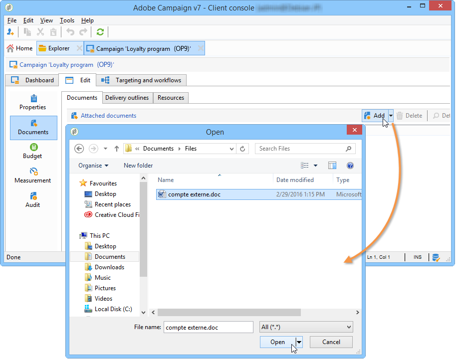

# Gerenciar recursos de marketing{#managing-marketing-resources}

O Adobe Campaign permite gerenciar e acompanhar os recursos de marketing envolvidos no ciclo de vida da campanha. Esses recursos de marketing podem ser um folheto, um auxílio visual ou qualquer outro meio de comunicação que envolva vários operadores.

Para cada recurso de marketing gerenciado pelo Adobe Campaign, é possível acompanhar o status e o histórico a qualquer momento e visualizar a versão atual.

## Adicionar um recurso de marketing {#adding-a-marketing-resource}

Os recursos de marketing são acessados pelo universo Campaigns.

To add a resource, click the **[!UICONTROL Create]** button.

Para disponibilizar um recurso no servidor do Adobe Campaign, é necessário adicionar o recurso desejado arrastando e soltando na área intermediária do editor. Você também pode clicar no **[!UICONTROL Upload file to server...]** link.

Uma mensagem de confirmação permite iniciar o upload.

Quando o upload estiver concluído, o recurso será adicionado à lista de recursos disponíveis. É acessível aos operadores do Adobe Campaign. They can view it (via the **[!UICONTROL Preview]** tab), make a copy to modify it, or update the file on the server (using the **[!UICONTROL Edit]** tab).

Click the **[!UICONTROL General]** tab to select the operators or groups of operators in charge of monitoring, tracking and approving this resource. Selecting the reviewer is done via the **[!UICONTROL Advanced parameters]** link.

* O operador para o qual o recurso é atribuído é responsável por rastreá-lo.
* O operador de aprovação é responsável pela aprovação do recurso de marketing. Eles serão notificados quando o processo de validação de recursos for iniciado.

   If no reviewer is selected, the resource **[!UICONTROL cannot be]** subject to approval.

* Se necessário, também pode-se especificar um leitor de prova.

É possível especificar uma data de disponibilidade (indicativa) para o recurso. Beyond this date, it will appear with **[!UICONTROL Late]** status.

## Trabalho colaborativo em recursos {#collaborative-work-on-resources}

É possível modificar e atualizar um recurso de marketing e, se necessário, informar outros operadores do Adobe Campaign. É possível:

* Baixe o recurso localmente para modificá-lo.
* Atualize o arquivo no servidor e torne ele acessível a outros operadores.
* Bloqueie um recurso para proibir sua modificação por outros operadores.

>[!NOTE]
>
>The **[!UICONTROL History]** tab contains the download and update log for the resource. The **[!UICONTROL Details]** button lets you view the selected version:

### Bloquear/desbloquear um recurso {#locking-unlocking-a-resource}

Depois de criado, os recursos estão disponíveis no painel de recursos de marketing e os operadores podem editá-los e modificá-los.

Quando um operador deseja trabalhar em um recurso, é preferível bloqueá-lo antes de iniciar o trabalho, para impedir que outros operadores o modifiquem ao mesmo tempo. O recurso é então reservado; ele permanece acessível, mas não pode ser publicado ou atualizado no servidor por outro operador.

Uma mensagem especial notifica todos os operadores que tentarem acessá-lo:

The **[!UICONTROL Tracking]** tab indicates the name of the operator who locked the resource and the planned update date.

To lock a resource, you must click the resource followed by the **[!UICONTROL Lock]** button in the resource dashboard.

You can indicate the planned return date in the **[!UICONTROL Tracking]** tab of the resource.

Essas informações permitem que informar outros operadores do Adobe Campaign da data em que o recurso será desbloqueado.

Quando o recurso for atualizado, ele é automaticamente desbloqueado e disponibilizado para todos os operadores novamente.

Se necessário, também é possível desbloqueá-lo manualmente no painel.

>[!NOTE]
>
>Somente o operador que bloqueou o recurso e os operadores com direitos de Administrador estão autorizados a desbloquearem um recurso.

### Fóruns de discussão {#discussion-forums}

For each resource, the **[!UICONTROL Forum]** tab lets participants exchange information.

[Os fóruns](../../campaign/using/discussion-forums.md) de discussão explicam como os fóruns de discussão operam no Adobe Campaign.

## Ciclo de vida de um recurso de marketing {#life-cycle-of-a-marketing-resource}

Quando o recurso é criado, os operadores do Adobe Campaign são indicados para projetar, revisar, aprovar e publicar o recurso. Uma duração pode ser determinada para essas campanhas.

The **[!UICONTROL Tracking]** tab lets you monitor any actions carried out on the resource: approvals, approval refusals, related comments, or publications.

The **[!UICONTROL History]** tab displays file transfers carried out for this resource.

### Processo de aprovação {#approval-process}

The expected availability date is displayed in the resource details, if it was specified in the **[!UICONTROL Tracking]** tab. Once this date is reached, you can execute the approval process using the **[!UICONTROL Submit for approval]** button in the resource dashboard. O status do recurso muda para **[!UICONTROL Approval in progress]**.

A resource can be approved via the **[!UICONTROL Approve resource]** button on its dashboard.

Os operadores autorizados podem aceitar ou rejeitar aprovações. This action is possible either: via the email message sent (by clicking the link in the notification message) or via the console (by clicking the **[!UICONTROL Approve]** ) button.

A janela de aprovação permite inserir um comentário.

The **[!UICONTROL Tracking]** tab enables all operators to track the various stages of the approval process.

>[!NOTE]
>
>Além do revisor especificado para cada recurso de marketing, os operadores com direitos de administrador e o gerente de recursos estão autorizados a aprovar um recurso de marketing.

### Publicar um recurso {#publishing-a-resource}

Quando aprovado, o recurso de marketing deve ser publicado. O processo de publicação deve estar sujeito à implementação específica de acordo com os requisitos da empresa. Isso significa que os recursos podem ser publicados em uma extranet ou em qualquer outro servidor, informações específicas podem ser enviadas para um provedor de serviços externo etc.

To publish a resource, click the **[!UICONTROL Publish]** button in the editing zone of the marketing resource dashboard.

É possível também automatizar a publicação de um recurso por meio de um workflow.

Publicar um recurso significa torná-lo disponível para uso (por outra tarefa, por exemplo). Publicações como tal variam dependendo da natureza do seu recurso: para um panfleto, publicar pode significar enviar o arquivo para uma impressora, para uma agência da Web, pode significar publicá-lo em um site etc.

Para que o Adobe Campaign publique, você precisa criar um workflow adequado e vinculá-lo ao recurso. To do this, open the **[!UICONTROL Advanced settings]** box of the resource, then select the desired workflow in the **[!UICONTROL Post-processing]** field.

O workflow será executado:

* When the reviewer clicks the **[!UICONTROL Publish resource]** link (or, if no reviewer was defined, the person in charge of the resource).
* If the resource is managed via a marketing resource creation task, it will be executed when the task is set to **[!UICONTROL Finished]**, as long as the **[!UICONTROL Publish the marketing resource]** box is checked in the task (Refer to [Marketing resource creation task](../../campaign/using/creating-and-managing-tasks.md#marketing-resource-creation-task))

If a workflow isn&#39;t started immediately (if the workflow is stopped for instance), the status of the resource changes to **[!UICONTROL Pending publication]**. Once the workflow is started, the status of the resource changes to **[!UICONTROL Published]**. Este status não leva em conta os possíveis erros no processo de publicação. Verifique o status do seu workflow para verificar se ele foi executado corretamente.

## Vincular um recurso a uma campanha {#linking-a-resource-to-a-campaign}

### Fazendo referência a um recurso de marketing {#referencing-a-marketing-resource}

Os recursos de marketing podem ser associados a campanhas, desde que este recurso tenha sido selecionado no template de campanha.

>[!NOTE]
>
>For details on how to create and configure campaign templates, refer to [Campaign templates](../../campaign/using/marketing-campaign-templates.md#campaign-templates).

Click the **[!UICONTROL Documents > Resources]** tab in the campaign dashboard, then click **[!UICONTROL Add]** to select the resource concerned.

Você pode filtrar recursos por status, natureza ou tipo ou aplicar um filtro personalizado.

Click **[!UICONTROL OK]** to add the resource to the list of marketing resources referenced for this campaign.

The **[!UICONTROL Details]** button lets you edit and view it.

Os recursos adicionados serão exibidos no painel. Eles também poderão ser editados lá.

### Adicionando um recurso de marketing a um delivery outline {#adding-a-marketing-resource-to-a-delivery-outline}

Os recursos de marketing podem ser associados a deliveries por meio de delivery outlines.

>[!NOTE]
>
>Para obter mais informações sobre contornos de distribuição, consulte [Associando e estruturando recursos vinculados por meio de um contorno](../../campaign/using/marketing-campaign-deliveries.md#associating-and-structuring-resources-linked-via-a-delivery-outline)de entrega.

## Gerenciamento de estoque {#stock-management}

Você pode associar um recurso de marketing a um ou mais estoques para gerenciar seus suprimentos e exibir um aviso no painel em caso de estoque insuficiente.

>[!NOTE]
>
>For more information on stock management in Adobe Campaign, refer to [Stock management](../../campaign/using/providers--stocks-and-budgets.md#stock-management).

Para associar um recurso de marketing a um estoque, edite o mapa de ações e edite ou crie um estoque. Adicione uma linha de estoque e selecione o recurso de marketing correspondente.

If necessary, you can edit the selected resource via the **[!UICONTROL Edit the link]** icon (magnifying glass) located to the right of the resource once it has been selected.

Especifique o estoque inicial e o alerta de estoque e salve.

O estoque é indicado nos detalhes do recurso.

Quando o estoque for insuficiente, um aviso será enviado para os operadores relacionados.

## Funções avançadas {#advanced-functions}

O painel de recursos de marketing permite que você realize os tipos comuns de operações: adicionar, editar, bloquear/desbloquear, aprovar, publicar. Você poderá criar outros tipos de recursos de marketing e acessar funcionalidades avançadas através da árvore do Adobe Campaign. To do this, click **[!UICONTROL Explorer]** in the Adobe Campaign home page.

By default, marketing resources are stored in the **[!UICONTROL MRM > Marketing resources]** node of the tree.

Você poderá adicionar os seguintes recursos nessa visualização:

* Arquivo
* HTML
* Texto
* URL

