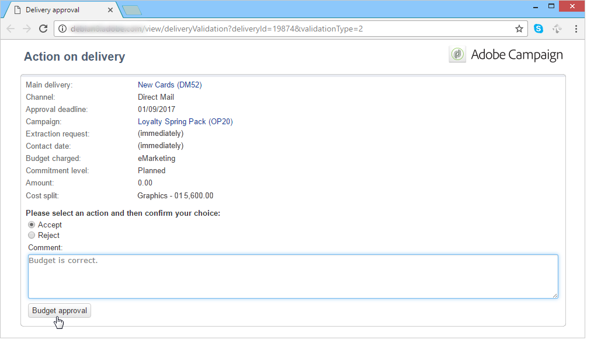
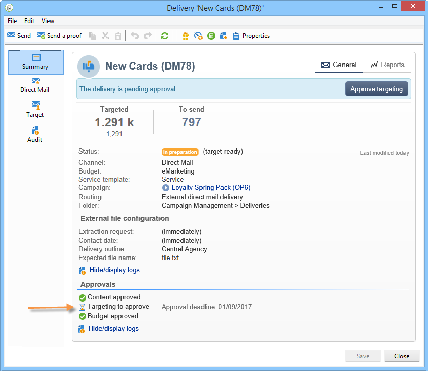
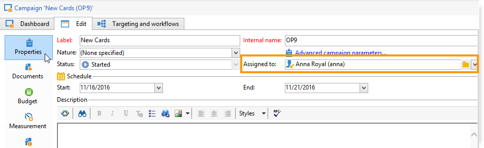
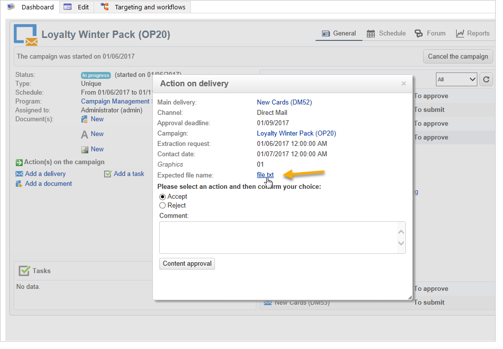
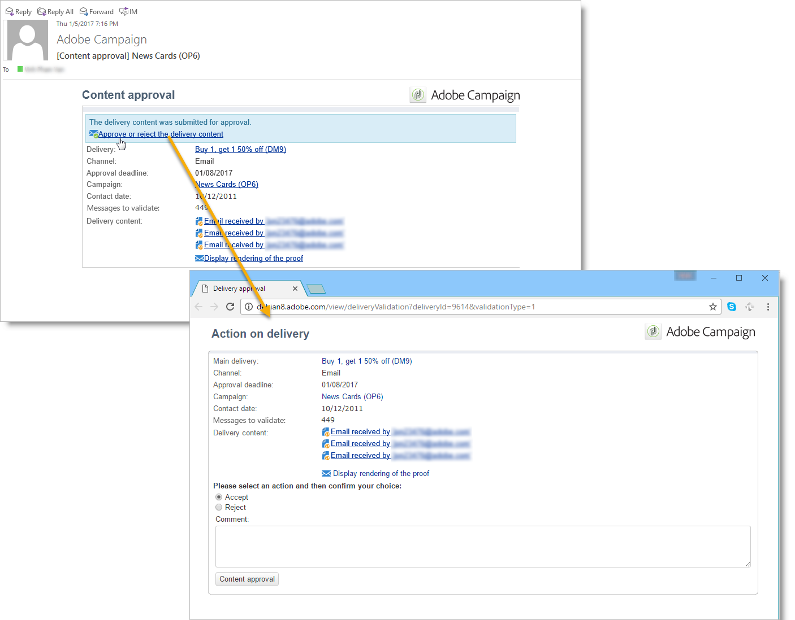
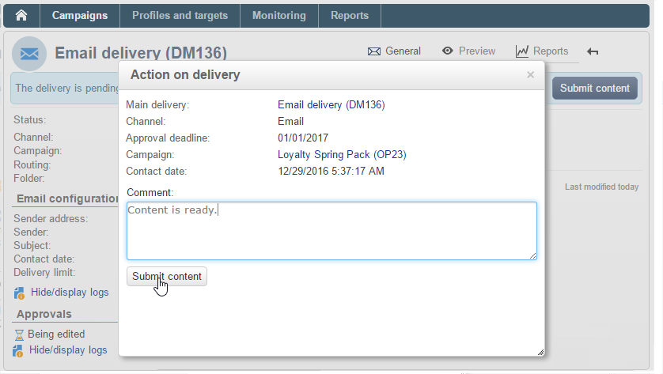
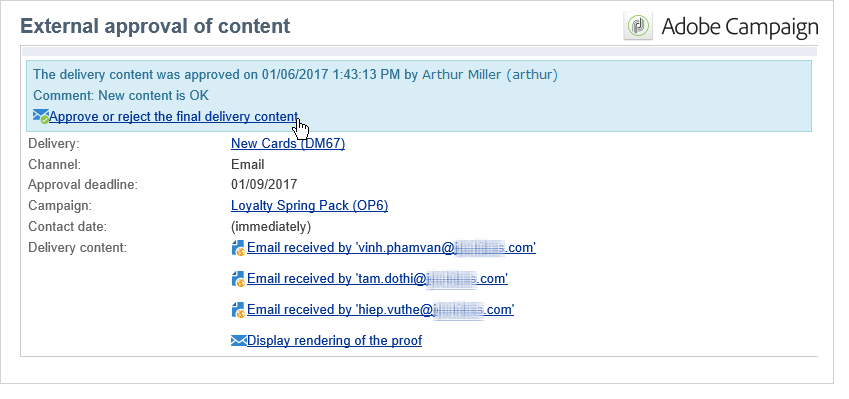

# Aprovação de campanhas de marketing {#approving-marketing-campaigns}

## Processo de aprovação {#approval-process}

Cada etapa de um delivery pode estar sujeita a aprovação para garantir o monitoramento total e controle dos vários processos da campanha: direcionamento, conteúdo, orçamento, extração e delivery de uma prova.

>[!NOTE]
>
>Você precisa verificar se os revisores têm os direitos corretos para aprovação. Verifique também se a zona de segurança está definida corretamente.

Os e-mails de notificação são enviados aos operadores do Adobe Campaign designados aos revisores para informá-los de uma solicitação de aprovação.

O procedimento de aprovação é apresentado na [Verificação e aprovação dos deliveries](#checking-and-approving-deliveries).

>[!NOTE]
>
>Somente o proprietário do delivery pode iniciar um delivery. Para que outro operador (ou grupo de operadores) possa iniciar um delivery, é necessário adicioná-los como revisores no campo **[!UICONTROL Delivery start:]**.\
>Consulte também [Seleção de revisores](#selecting-reviewers).

### Princípio operacional {#operating-principle-}

Por exemplo, o e-mail padrão para aprovação de orçamento será o seguinte:

Os operadores do revisor podem então optar por aprovar ou não a etapa relacionada.

Quando o operador aprovar a escolha, a aprovação ou a rejeição da tarefa será encaminhada para o painel de delivery.

As informações também estão disponíveis nos logs de aprovação da campanha (acessada por meio da guia **[!UICONTROL Edit > Tracking > Approvals]**):

Essas notificações são enviadas aos operadores afetados para cada processo para o qual a aprovação foi habilitada.

As aprovações podem ser habilitadas para o template de campanha, para cada campanha individualmente ou para um delivery.

Todas as tarefas que exigem aprovação são selecionadas no template da campanha (guias **[!UICONTROL Properties]** > **[!UICONTROL Advanced campaign settings...]** > **[!UICONTROL Approvals]**), como operadores em mudança de aprovação (eles receberão notificações, a menos que essa opção não esteja habilitada). Para obter mais informações, consulte [Aprovação de processos](#approving-processes).

Essas configurações podem ser substituídas para cada campanha criada usando este modelo e individualmente para cada delivery de campanha: clique no botão **[!UICONTROL Properties]** e, em seguida, na guia **[!UICONTROL Approvals]**.

No exemplo a seguir, o conteúdo do delivery não exigirá aprovações:

### Selecionar revisores {#selecting-reviewers}

Para cada tipo de aprovação, os operadores ou grupos de operadores de aprovação são selecionados na lista suspensa no delivery. Outros operadores podem ser adicionados usando o link **[!UICONTROL Edit...]**. Essa janela também permite editar o prazo de aprovação.

Se nenhum revisor for especificado, o gerente da campanha será responsável pela aprovação e receberá as notificações. O gerente da campanha é especificado na guia **[!UICONTROL Edit > Properties]** da campanha:

>[!NOTE]
>
>Todos os outros operadores do Adobe Campaign com direitos de **[!UICONTROL Administrator]** também podem aprovar tarefas, mas não receberão notificações.\
>Por padrão, o gerente de campanha não pode realizar a aprovação ou iniciar as remessas se os operadores de aprovação tiverem sido definidos. Você pode modificar esse comportamento e autorizar que o gerenciador de campanha aprove/inicie remessa criando a opção **NmsCampaign_Activate_OwnerConfirmation** com o valor **1**.

### Modos de aprovação {#approval-modes}

#### Aprovação através do painel {#approval-via-the-dashboard}

Para aprovar uma tarefa através do console ou da interface da Web, clique no link apropriado no painel de campanha. As tarefas também podem ser aprovadas por meio do rastreamento de delivery ou pelo painel de delivery.

Verifique as informações a serem aprovadas, escolha aceitar ou rejeitar a aprovação e, se necessário, insira um comentário. Clique em **[!UICONTROL Ok]** para salvar.

>[!NOTE]
>
>Se um processo já tiver sido aprovado por outro operador, o link de aprovação não estará disponível.

#### Aprovação através de mensagens de notificação {#approval-via-notification-messages}

Clique no link disponível na mensagem de notificação (consulte [Notificações](#notifications)). Você será solicitado a se identificar, como mostrado abaixo:

Selecione **[!UICONTROL Accept]** ou **[!UICONTROL Reject]** e insira um comentário se necessário.

Clique em **[!UICONTROL Validate]**.

>[!NOTE]
>
>Se os avisos forem gerados durante o processo, um aviso será exibido na notificação.

#### Rastreamento de aprovação {#approval-tracking}

As informações estão disponíveis em vários lugares:

* No log de aprovação da campanha, na subguia **[!UICONTROL Approvals]** da guia **[!UICONTROL Edit > Tracking]**:

   

* No log de delivery da campanha, na subguia **[!UICONTROL Deliveries]** da guia **[!UICONTROL Edit > Tracking]**:

   

* Para aprovar o status de aprovação de cada delivery, clique na opção **[!UICONTROL Hide/show log]** da guia **[!UICONTROL Summary]**.

   

* Essas informações também podem ser acessadas através da guia **[!UICONTROL Tracking > Approvals]** de cada delivery:

   

>[!NOTE]
>
>Após um operador ter aprovado ou rejeitado uma tarefa, os outros operadores de revisão não podem mais atuar sobre a aprovação.

#### Aprovação automática e manual {#automatic-and-manual-approval}

Ao criar um workflow de definição de metas, se a aprovação for automática (modo padrão), o Adobe Campaign exibirá o link de aprovação ou envia uma notificação assim que uma aprovação é necessária.

Para escolher o modo de aprovação (manual ou automático), clique na guia **[!UICONTROL Edit > Properties]** da campanha ou do template da campanha e em seguida em **[!UICONTROL Advanced campaign settings...]** e, por fim, na guia **[!UICONTROL Approvals]**.

>[!NOTE]
>
>O modo de aprovação selecionado será aplicado a todas as remessas da campanha.

Quando um workflow de direcionamento está sendo criado, a aprovação manual permite que você evite criar links de aprovação ou enviar notificações automaticamente. O painel de campanha oferece um link **[!UICONTROL Submit targeting for approval]** para iniciar o processo de aprovação manualmente.

As mensagens de confirmação permitem autorizar aprovações nas tarefas selecionadas para esse delivery.

Os botões de aprovação são exibidos no painel de campanha (para esse delivery), no painel de delivery e no controle de delivery. Se as notificações estiverem ativadas, elas serão enviadas em paralelo.

Esse método de ativação de aprovações permite que você trabalhe com o direcionamento sem enviar notificações falsas para os revisores.

### Notificações {#notifications}

As notificações são mensagens de e-mail específicas enviadas para os revisores para informá-los de que um processo está pendente de aprovação. Quando o operador clica no link da mensagem, é exibida uma página de autenticação. Após fazer logon, o operador pode exibir as informações e aprovar ou rejeitar a tarefa. Um comentário também pode ser inserido na janela de aprovação.

O conteúdo dos e-mails de notificação pode ser personalizado. Consulte [Conteúdo de notificação](#notification-content).

#### Ativar/desabilitar notificação {#enabling-disabling-notification}

Por padrão, as mensagens de notificação são enviadas se a aprovação da tarefa relacionada estiver habilitada no template de campanha, da campanha ou do delivery. As notificações podem, porém, estar desabilitadas para autorizar aprovações somente do console.

Para fazer isso, edite a janela de aprovação da campanha ou do template da campanha (guias **[!UICONTROL Edit > Properties]** > **[!UICONTROL Advanced campaign settings...]** > **[!UICONTROL Approvals]**) e selecione **[!UICONTROL Do not enable notification sending]**.

#### Conteúdo de notificação {#notification-content}

O conteúdo da notificação é definido em um template específico: **[!UICONTROL Notification of validations for the marketing campaign]**. Esse modelo é salvo na pasta **[!UICONTROL Administration > Campaign management > Technical delivery templates]** da árvore do Adobe Campaign.

## Verificar e aprovar remessas {#checking-and-approving-deliveries}

O Adobe Campaign permite configurar processos de aprovação para os principais estágios da campanha de marketing em modo de colaboração.

Para remessas diretas de mala direta, os operadores do Adobe Campaign podem exibir o arquivo de extração antes que ele seja enviado ao roteador e, se necessário, podem alterar o formato e reenviar a extração. Consulte [Aprovar um arquivo de extração](#approving-an-extraction-file).

Para cada campanha é possível aprovar o target, o conteúdo (consulte [Aprovação do conteúdo](#approving-content)) e os custos do delivery. Os operadores do Adobe Campaign responsáveis pela aprovação podem ser notificados por e-mail e podem aceitar ou rejeitar a aprovação por meio do console ou por meio de uma conexão com a Web. Consulte [Aprovação de processos](#approving-processes).

Quando essas fases de validação estiverem concluídas, o delivery poderá ser iniciado. Consulte [Iniciar um delivery](../../campaign/using/marketing-campaign-deliveries.md#starting-a-delivery).

>[!NOTE]
>
>Para obter mais informações sobre modos de aprovação e rastreamento, consulte [Processo de aprovação](#approval-process).

### Aprovar processos {#approving-processes}

Os estágios que exigem aprovação aparecem no painel de campanha (por meio do console da interface da Web). Eles também aparecem na tabela de rastreamento de delivery e no painel do delivery.

Neste ponto, o status da campanha é **[!UICONTROL To validate]**.

>[!NOTE]
>
>* Para selecionar os processos que estarão sujeitos a aprovação, modifique o template de campanha. Para obter mais informações, consulte [templates de campanha](../../campaign/using/marketing-campaign-templates.md#campaign-templates).
   >
   >
* Consulte também a seção [Processo de aprovação](#approval-process).

>[!NOTE]
>
>Em um workflow de direcionamento, se um erro vinculado a um problema de configuração ocorrer durante a preparação da mensagem, o link **[!UICONTROL Restart message preparation]** será mostrado no painel. Corrija o erro e clique neste link para reiniciar a preparação da mensagem, ignorando o estágio de definição de metas.

Para cada delivery na campanha, você pode aprovar os seguintes processos:

* **Definição de metas, conteúdo e orçamento**

   Quando as opções **[!UICONTROL Enable target approval]**, **[!UICONTROL Enable content approval]** ou **[!UICONTROL Enable budget approval]** são selecionadas na janela de configurações de aprovação de tarefas, os links relevantes são mostrados no painel da campanha para os deliveries relacionados.

   >[!NOTE]
   >
   >A aprovação de orçamento só estará disponível se a aprovação de definição de metas estiver habilitada na janela de configurações de aprovação. O link para aprovação do orçamento é exibido somente após o target ter sido analisado. Além disso, esse link é exibido junto com o link para aprovação do target.

   Se as opções **[!UICONTROL Assign content editing]** ou **[!UICONTROL External content approval]** forem selecionadas na janela de configurações de aprovação, o painel exibirá os links **[!UICONTROL Available content]** e **[!UICONTROL External content approval]**.

   A aprovação de conteúdo permite que você acesse as provas enviadas.

* **Aprovação de extração (delivery de mala direta)**

   Quando a opção **[!UICONTROL Enable extraction approval]** está selecionada na janela de configurações de aprovação, o arquivo extraído deve ser aprovado antes que o roteador possa ser notificado.

   Um link **[!UICONTROL Approve content]** fica disponível no painel de campanha conforme mostrado abaixo:

   

   Os arquivos de extração podem ser pré-visualizados por meio da caixa de aprovação e, em seguida, aceitos ou rejeitados.

   

   >[!NOTE]
   >
   >A pré-visualização do arquivo de extração indica apenas uma amostra de dados. O arquivo de saída inteiro não está carregado.

* **Aprovar remessas associadas**

   A opção **[!UICONTROL Enable individual approval of each associated delivery]** é usada para um delivery principal associado a deliveries secundários. Por padrão, essa opção não está selecionada, para que uma aprovação geral do delivery principal possa ser realizada. Se essa opção estiver selecionada, cada delivery deverá ser aprovado individualmente.

   

#### Seleção dos processos a aprovar {#choosing-the-processes-to-be-approved}

As fases de aprovação são definidas com o modelo associado à campanha. Você deve selecionar os elementos a serem aprovados do template e especificar os operadores do Adobe Campaign que serão responsáveis por essas aprovações. Para obter mais informações, consulte [templates de campanha](../../campaign/using/marketing-campaign-templates.md#campaign-templates).

>[!NOTE]
>
>A configuração de aprovação para a campanha ou para o template de campanha será aplicada a todas as remessas futuras vinculadas a esta campanha. Quaisquer alterações de configuração não serão aplicadas às remessas anteriores.

Essas informações podem ser sobrepostas para cada campanha e delivery.

Para uma campanha, clique na guia **[!UICONTROL Edit > Properties]**, em seguida no link **[!UICONTROL Advanced campaign settings...]** e finalmente na subguia **[!UICONTROL Approvals]** para acessar a página de configuração de aprovações.

Você pode selecionar e desmarcar os processos a aprovar e designar os operadores do Adobe Campaign responsáveis pela aprovação. Eles podem ser operadores individuais, um grupo de operadores ou uma lista de operadores.

Para selecionar uma lista de operadores, clique no link **[!UICONTROL Edit...]** à direita do campo que designa o primeiro revisor e adicione quantos operadores forem necessários, conforme mostrado abaixo:

>[!NOTE]
>
>* Se uma lista de revisores for definida, uma tarefa será aprovada assim que um revisor aceitá-la. O link de aprovação relevante não é mais oferecido no painel. Quando o envio de notificações estiver habilitado, se outro revisor clicar no link de aprovação na mensagem de notificação, será exibida uma notificação de que outro operador já aprovou a tarefa.
>* Você pode definir um agendamento de aprovação para a campanha na seção inferior da janela de edição do revisor. Por padrão, os revisores têm três dias a partir da data de envio para aprovar um processo. É possível configurar um lembrete que é enviado automaticamente para os operadores relacionados antes do prazo de aprovação.
>* Você pode adicionar lembretes desta seção.

>

Para cada delivery, clique no botão **[!UICONTROL Audit]** e na guia **[!UICONTROL Approvals]** para exibir e editar datas de aprovação e lembretes automáticos.

>[!NOTE]
>
>Essa guia fica disponível após o processo de aprovação de conteúdo ter sido iniciado.

### Aprovar conteúdo {#approving-content}

>[!CAUTION]
>
>Para aprovar um conteúdo, um ciclo de prova é obrigatório. Provas permite aprovar a exibição de informações, dados de personalização e verificar se os links estão funcionando. Para obter mais informações sobre como criar uma prova e seu ciclo de vida, consulte a seção [Enviar Mensagens](../../delivery/using/steps-validating-the-delivery.md#sending-a-proof) .
>
>As funcionalidades de aprovação de conteúdo detalhadas abaixo foram criadas para serem adicionadas ao delivery de prova.

É possível configurar um ciclo de aprovação de conteúdo. Para fazer isso, selecione a opção **[!UICONTROL Enable content approval]** na janela de configurações de aprovação. As principais etapas do ciclo de aprovação de conteúdo são:

1. Depois de criar um novo delivery, o gerente de campanha clica no link **[!UICONTROL Submit content]** no painel de campanha para iniciar o ciclo de aprovação de conteúdo.

   

   >[!NOTE]
   >
   >Se a opção **[!UICONTROL Enable the sending of proofs]** (para deliveries de email) ou **[!UICONTROL Enable the sending and approval of proofs]** (para deliveries de correspondência direta) foi selecionada na janela de configurações de aprovação, as provas serão enviadas automaticamente.

1. Um e-mail de notificação é enviado para a pessoa responsável pelo conteúdo, que pode escolher se deve ou não aprová-lo:

   * por e-mail de notificação:

      

      >[!NOTE]
      >
      >O e-mail de notificação contém um link para as provas já enviadas e possivelmente a renderização da mensagem para os vários webmails se a opção **Deliverability** estiver habilitada para esta instância.

   * por console ou interface da Web, controle de delivery, painel de delivery ou painel de campanha:

      

      >[!NOTE]
      >
      >Este painel da campanha permite exibir a lista de provas que foram enviadas, clicando no link **[!UICONTROL Inbox rendering...]**. Para exibir o conteúdo, clique no ícone **[!UICONTROL Detail]** à direita da lista.

      

1. Um e-mail de notificação é enviado para a pessoa responsável pela campanha informando se o conteúdo foi aprovado ou não.

   >[!NOTE]
   >
   >A pessoa responsável pela campanha pode reiniciar o ciclo de aprovação de conteúdo a qualquer momento. Para fazer isso, clique no link da linha **[!UICONTROL Content status]** do painel da campanha (no nível de delivery) e, em seguida, clique em **[!UICONTROL Reset content approval to submit it again]**.

   

#### Atribuir edição de conteúdo {#assign-content-editing}

Essa opção permite que você defina uma pessoa encarregada da edição de conteúdo, como um webmaster. Se a opção **[!UICONTROL Assign content editing]** estiver selecionada na janela de configurações de aprovação, várias etapas de aprovação serão adicionadas entre a criação de delivery e o delivery do e-mail de notificação à pessoa encarregada do conteúdo:

1. Depois de criar um novo delivery, a pessoa responsável pela campanha clica no link **[!UICONTROL Submit content editing]** no painel de campanha para iniciar o ciclo de edição de conteúdo.

   

1. A pessoa responsável pela edição de conteúdo receberá um e-mail informando que o conteúdo está disponível.

   

1. Eles podem fazer logon no console, abrir o delivery e editá-lo usando um assistente simplificado para alterar o assunto, o conteúdo HTML e o conteúdo de texto e enviar provas.

   

   >[!NOTE]
   >
   >Se a opção **[!UICONTROL Enable the sending of proofs]** (para deliveries de email) ou **[!UICONTROL Enable the sending and approval of proofs]** (para deliveries de correspondência direta) foi selecionada na janela de configurações de aprovação, as provas serão enviadas automaticamente.

1. Depois que a pessoa encarregada da edição de conteúdo terminar de fazer alterações no conteúdo do delivery, ela poderá tornar o conteúdo disponível.

   Para isso, elas podem:

   * clicar no link **[!UICONTROL Available content]** através do console do Adobe Campaign.

      

   * clicar no link da mensagem de notificação e, em seguida, aprovar a disponibilidade do conteúdo.

      

      O operador pode adicionar um comentário antes de enviar o conteúdo para a pessoa responsável pela campanha.

      

      A mensagem de notificação permite que o revisor aprove ou rejeite o conteúdo.

      

#### Aprovação de conteúdo externo {#external-content-approval}

Essa opção permite que você defina um operador externo responsável por aprovar a renderização do delivery, como consistência de comunicação da marca, taxas etc. Se a opção **[!UICONTROL External content approval]** estiver selecionada na janela de configurações de aprovação, várias etapas de aprovação serão adicionadas entre a aprovação do conteúdo e o delivery da notificação à pessoa responsável pelo conteúdo:

1. O gerente de conteúdo externo recebe um e-mail de notificação informando que o conteúdo foi aprovado e solicitando aprovação externa.
1. O e-mail de notificação contém links para as provas enviadas, o que permite visualizar a renderização de delivery e um botão para aprovação ou rejeição do conteúdo do delivery.

   >[!NOTE]
   >
   >Esses links só estarão disponíveis se uma ou mais provas tiverem sido enviadas. Caso contrário, a renderização do delivery só estará disponível através do console ou da interface da Web.

   

### Aprovar um arquivo de extração {#approving-an-extraction-file}

Para entregas offline, o Adobe Campaign gera um arquivo de extração que, dependendo de como é configurado, é enviado ao roteador. Seu conteúdo depende do template de exportação usado.

Quando o conteúdo, o direcionamento e o orçamento são aprovados, o delivery é alterado para **[!UICONTROL Extraction pending]** até que o workflow de extração das campanhas seja iniciado.

Na data da solicitação de extração, o arquivo de extração é criado, e o status do delivery muda para **[!UICONTROL File to approve]**.

Você pode visualizar o conteúdo do arquivo extraído (clicando no nome), aprová-lo ou, se necessário, alterar o formato e iniciar novamente a extração utilizando os links no painel.

Depois que o arquivo for aprovado, você poderá enviar o e-mail de notificação para o roteador. Para obter mais informações, consulte [Iniciar um delivery offline](../../campaign/using/marketing-campaign-deliveries.md#starting-an-offline-delivery).
