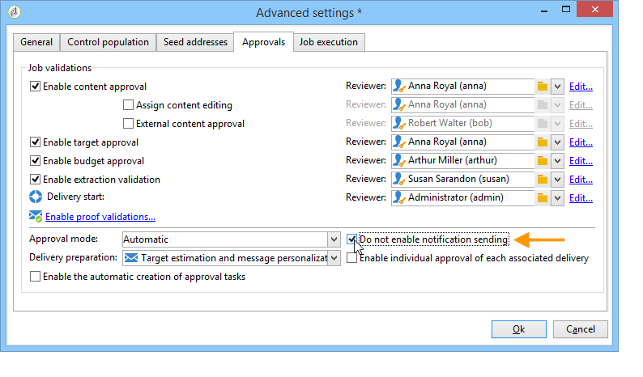
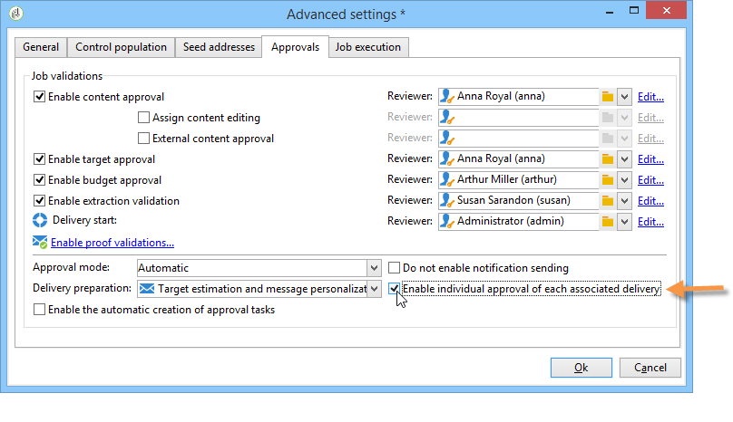
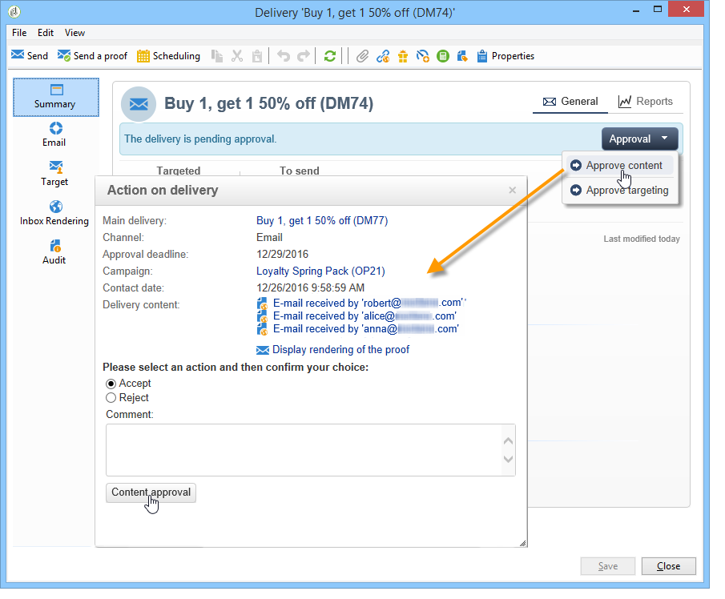

# Aprovação de campanhas de marketing {#approving-marketing-campaigns}

## Processo de aprovação {#approval-process}

Cada etapa de um delivery pode estar sujeita a aprovação para garantir o monitoramento total e controle dos vários processos da campanha: direcionamento, conteúdo, orçamento, extração e delivery de uma prova.

>[!NOTE]
>
>É necessário verificar se os revisores têm os direitos apropriados para aprovação. Verifique também se a zona de segurança está definida corretamente.

Os e-mails de notificação são enviados aos operadores do Adobe Campaign designados aos revisores para informá-los de uma solicitação de aprovação.

O procedimento de aprovação é apresentado na [verificação e aprovação das entregas](#checking-and-approving-deliveries).

>[!NOTE]
>
>Somente o proprietário do delivery pode iniciar um delivery. In order for another operator (or operator group) to be able to start a delivery, you have to add them as reviewers in the **[!UICONTROL Delivery start:]** field.\
>Consulte também [Seleção de revisores](#selecting-reviewers).

### Princípio operacional {#operating-principle-}

Por exemplo, o e-mail padrão para aprovação de orçamento será o seguinte:

Os operadores do revisor podem então optar por aprovar ou não a etapa relacionada.

Quando o operador aprovar a escolha, a aprovação ou a rejeição da tarefa será encaminhada para o painel de delivery.

The information is also available in the approval logs of the campaign (Accessed via the **[!UICONTROL Edit > Tracking > Approvals]** tab):

Essas notificações são enviadas aos operadores afetados para cada processo para o qual a aprovação foi habilitada.

As aprovações podem ser habilitadas para o template de campanha, para cada campanha individualmente ou para um delivery.

All jobs requiring approval are selected in the campaign template ( **[!UICONTROL Properties]** > **[!UICONTROL Advanced campaign settings...]** > **[!UICONTROL Approvals]** tab), as are the operators in charge of approval (they will receive notifications, unless this option is not enabled). For more on this, refer to [Approving processes](#approving-processes).

These settings can be overridden for each campaign created using this template, and individually for each campaign delivery: click the **[!UICONTROL Properties]** button, then the **[!UICONTROL Approvals]** tab.

No exemplo a seguir, o conteúdo do delivery não exigirá aprovações:

### Selecionar revisores {#selecting-reviewers}

Para cada tipo de aprovação, os operadores ou grupos de operadores de aprovação são selecionados na lista suspensa no delivery. Additional operators can be added using the **[!UICONTROL Edit...]** link. Essa janela também permite editar o prazo de aprovação.

Se nenhum revisor for especificado, o gerente da campanha será responsável pela aprovação e receberá as notificações. The campaign manager is specified in the **[!UICONTROL Edit > Properties]** tab of the campaign:

>[!NOTE]
>
>All other Adobe Campaign operators with **[!UICONTROL Administrator]** rights can also approve jobs, but they will not receive notifications.\
>Por padrão, o gerente de campanha não pode realizar a aprovação ou iniciar as remessas se os operadores de aprovação tiverem sido definidos. Você pode modificar esse comportamento e autorizar que o gerenciador de campanha aprove/inicie remessa criando a opção **NmsCampaign_Activate_OwnerConfirmation** com o valor **1**.

### Modos de aprovação {#approval-modes}

#### Aprovação através do painel {#approval-via-the-dashboard}

Para aprovar uma tarefa através do console ou da interface da Web, clique no link apropriado no painel de campanha. As tarefas também podem ser aprovadas por meio do rastreamento de delivery ou pelo painel de delivery.

Verifique as informações a serem aprovadas, escolha aceitar ou rejeitar a aprovação e, se necessário, insira um comentário. Clique **[!UICONTROL Ok]** para salvar.

>[!NOTE]
>
>Se um processo já tiver sido aprovado por outro operador, o link de aprovação não estará disponível.

#### Aprovação através de mensagens de notificação {#approval-via-notification-messages}

Click the link available in the notification message (see [Notifications](#notifications)). Você será solicitado a se identificar, como mostrado abaixo:

Selecione **[!UICONTROL Accept]** ou **[!UICONTROL Reject]** e insira um comentário, se necessário.

Clique em **[!UICONTROL Validate]**.

>[!NOTE]
>
>Se os avisos forem gerados durante o processo, um aviso será exibido na notificação.

#### Rastreamento de aprovação {#approval-tracking}

As informações estão disponíveis em vários lugares:

* No log de aprovação da campanha, **[!UICONTROL Approvals]** subguia da **[!UICONTROL Edit > Tracking]** guia:

   

* No log de entrega da campanha, **[!UICONTROL Deliveries]** subguia da **[!UICONTROL Edit > Tracking]** guia:

   

* The approval status for each delivery can be viewed by clicking the **[!UICONTROL Hide/show log]** option of the **[!UICONTROL Summary]** tab.

   

* This information can also be accessed via the **[!UICONTROL Tracking > Approvals]** tab of each delivery:

   

>[!NOTE]
>
>Após um operador ter aprovado ou rejeitado uma tarefa, os outros operadores de revisão não podem mais atuar sobre a aprovação.

#### Aprovação automática e manual {#automatic-and-manual-approval}

Ao criar um workflow de definição de metas, se a aprovação for automática (modo padrão), o Adobe Campaign exibirá o link de aprovação ou envia uma notificação assim que uma aprovação é necessária.

To choose the approval mode (manual or automatic), click the **[!UICONTROL Edit > Properties]** tab of the campaign or campaign template, then click **[!UICONTROL Advanced campaign settings...]** and finally the **[!UICONTROL Approvals]** tab.

>[!NOTE]
>
>O modo de aprovação selecionado será aplicado a todas as remessas da campanha.

Quando um workflow de direcionamento está sendo criado, a aprovação manual permite que você evite criar links de aprovação ou enviar notificações automaticamente. The campaign dashboard then offers a **[!UICONTROL Submit targeting for approval]** link to launch the approval process manually.

Uma mensagem de confirmação permite autorizar aprovações nos trabalhos selecionados para esta entrega.

Os botões de aprovação são exibidos no painel de campanha (para esse delivery), no painel de delivery e no controle de delivery. Se as notificações estiverem ativadas, elas serão enviadas em paralelo.

Esse método de ativação de aprovações permite que você trabalhe com o direcionamento sem enviar notificações falsas para os revisores.

### Notificações {#notifications}

As notificações são mensagens de e-mail específicas enviadas para os revisores para informá-los de que um processo está pendente de aprovação. Quando o operador clica no link da mensagem, é exibida uma página de autenticação. Após fazer logon, o operador pode exibir as informações e aprovar ou rejeitar a tarefa. Um comentário também pode ser inserido na janela de aprovação.

O conteúdo dos e-mails de notificação pode ser personalizado. Consulte Conteúdo de notificação.

#### Ativar/desabilitar notificação {#enabling-disabling-notification}

Por padrão, as mensagens de notificação são enviadas se a aprovação da tarefa relacionada estiver habilitada no template de campanha, da campanha ou do delivery. As notificações podem, porém, estar desabilitadas para autorizar aprovações somente do console.

Para fazer isso, edite a janela de aprovação do modelo de campanha ou campanha ( **[!UICONTROL Edit > Properties]** > **[!UICONTROL Advanced campaign settings...]** > **[!UICONTROL Approvals]** guia) e selecione **[!UICONTROL Do not enable notification sending]**.

#### Conteúdo de notificação {#notification-content}

O conteúdo da notificação é definido em um template específico: **[!UICONTROL Notification of validations for the marketing campaign]**. This template is saved in the **[!UICONTROL Administration > Campaign management > Technical delivery templates]** folder of the Adobe Campaign tree.

## Verificar e aprovar remessas {#checking-and-approving-deliveries}

O Adobe Campaign permite que você configure processos de aprovação para os principais estágios da campanha de marketing no modo colaborativo.

Para remessas diretas de mala direta, os operadores do Adobe Campaign podem exibir o arquivo de extração antes que ele seja enviado ao roteador e, se necessário, podem alterar o formato e reenviar a extração. See [Approving an extraction file](#approving-an-extraction-file).

Para cada campanha, você pode aprovar a meta de entrega, o conteúdo (consulte [Aprovação de conteúdo](#approving-content)) e os custos. Os operadores do Adobe Campaign responsáveis pela aprovação podem ser notificados por e-mail e podem aceitar ou rejeitar a aprovação por meio do console ou por meio de uma conexão com a Web. Consulte [Aprovação de processos](#approving-processes).

Quando essas fases de validação estiverem concluídas, o delivery poderá ser iniciado. Consulte [Iniciando uma entrega](../../campaign/using/marketing-campaign-deliveries.md#starting-a-delivery).

>[!NOTE]
>
>For further information about approval modes and tracking, see [Approval process](#approval-process).

### Aprovar processos {#approving-processes}

Os estágios que exigem aprovação são exibidos no painel da campanha (por meio do console da interface da Web). Eles também aparecem na tabela de rastreamento de delivery e no painel do delivery.

At this point, the status of the campaign is **[!UICONTROL To validate]**.

>[!NOTE]
>
>* Para selecionar os processos que estarão sujeitos a aprovação, modifique o template de campanha. For more on this, refer to [Campaign templates](../../campaign/using/marketing-campaign-templates.md#campaign-templates).
   >
   >
* Also refer to the section on the [Approval process](#approval-process).

>[!NOTE]
>
>In a targeting workflow, if an error linked to a configuration issue occurs during message preparation, the **[!UICONTROL Restart message preparation]** link is shown on the dashboard. Corrija o erro e clique neste link para reiniciar a preparação da mensagem, ignorando o estágio de definição de metas.

Para cada delivery na campanha, você pode aprovar os seguintes processos:

* **Definição de metas, conteúdo e orçamento**

   When the **[!UICONTROL Enable target approval]**, **[!UICONTROL Enable content approval]** or **[!UICONTROL Enable budget approval]** options are selected in the job approval settings window, the relevant links are shown in the campaign dashboard for the concerned deliveries.

   >[!NOTE]
   >
   >A aprovação de orçamento só estará disponível se a aprovação de definição de metas estiver habilitada na janela de configurações de aprovação. O link para aprovação do orçamento é exibido somente após o target ter sido analisado. Além disso, esse link é exibido junto com o link para aprovação do target.

   Se as **[!UICONTROL Assign content editing]** opções ou **[!UICONTROL External content approval]** opções estiverem selecionadas na janela de configurações de aprovação, o painel mostrará os links **[!UICONTROL Available content]** e **[!UICONTROL External content approval]** .

   A aprovação de conteúdo permite que você acesse as provas enviadas.

* **Aprovação de extração (delivery de mala direta)**

   When **[!UICONTROL Enable extraction approval]** is selected in the approval settings window, the extracted file must be approved before the router can be notified.

   An **[!UICONTROL Approve content]** link is available on the campaign dashboard as shown below:

   

   Os arquivos de extração podem ser pré-visualizados por meio da caixa de aprovação e, em seguida, aceitos ou rejeitados.

   

   >[!NOTE]
   >
   >A pré-visualização do arquivo de extração indica apenas uma amostra de dados. O arquivo de saída inteiro não está carregado.

* **Aprovar remessas associadas**

   The **[!UICONTROL Enable individual approval of each associated delivery]** option is used for one main delivery associated with secondary deliveries. Por padrão, essa opção não está selecionada, para que uma aprovação geral do delivery principal possa ser realizada. Se essa opção estiver selecionada, cada delivery deverá ser aprovado individualmente.

   

#### Seleção dos processos a aprovar {#choosing-the-processes-to-be-approved}

As fases de aprovação são definidas com o modelo associado à campanha. Você deve selecionar os elementos a serem aprovados do template e especificar os operadores do Adobe Campaign que serão responsáveis por essas aprovações. For more on this, refer to [Campaign templates](../../campaign/using/marketing-campaign-templates.md#campaign-templates).

>[!NOTE]
>
>A configuração de aprovação para a campanha ou para o template de campanha será aplicada a todas as remessas futuras vinculadas a esta campanha. Quaisquer alterações de configuração não serão aplicadas às remessas anteriores.

Essas informações podem ser sobrepostas para cada campanha e delivery.

For a campaign, click the **[!UICONTROL Edit > Properties]** tab, then the **[!UICONTROL Advanced campaign settings...]** link, and finally the **[!UICONTROL Approvals]** sub-tab to access the approvals configuration page.

Você pode selecionar e desmarcar os processos a aprovar e designar os operadores do Adobe Campaign responsáveis pela aprovação. Eles podem ser operadores individuais, um grupo de operadores ou uma lista de operadores.

To select a list of operators, click the **[!UICONTROL Edit...]** link to the right of the field designating the first reviewer and add as many operators as necessary, as shown below:

>[!NOTE]
>
>* Se uma lista de revisores for definida, uma tarefa será aprovada assim que um revisor aceitá-la. O link de aprovação relevante não é mais oferecido no painel. Quando o envio de notificações estiver habilitado, se outro revisor clicar no link de aprovação na mensagem de notificação, será exibida uma notificação de que outro operador já aprovou a tarefa.
>* Você pode definir um agendamento de aprovação para a campanha na seção inferior da janela de edição do revisor. Por padrão, os revisores têm três dias a partir da data de envio para aprovar um processo. É possível configurar um lembrete que é enviado automaticamente para os operadores relacionados antes do prazo de aprovação.
>* Você pode adicionar lembretes desta seção.
>

For each delivery, click the **[!UICONTROL Audit]** button and the **[!UICONTROL Approvals]** tab to view and edit approval dates and automatic reminders.

>[!NOTE]
>
>Essa guia fica disponível após o processo de aprovação de conteúdo ter sido iniciado.

### Aprovar conteúdo {#approving-content}

>[!CAUTION]
>
>Para aprovar um conteúdo, um ciclo de prova é obrigatório. Provas permite aprovar a exibição de informações, dados de personalização e verificar se os links estão funcionando. Para obter mais informações sobre como criar uma prova e seu ciclo de vida, consulte a seção [Enviar Mensagens](../../delivery/using/steps-validating-the-delivery.md#sending-a-proof) .
>
>As funcionalidades de aprovação de conteúdo detalhadas abaixo foram criadas para serem adicionadas ao delivery de prova.

É possível configurar um ciclo de aprovação de conteúdo. To do this, select the **[!UICONTROL Enable content approval]** option in the approval settings window. As principais etapas do ciclo de aprovação de conteúdo são:

1. After creating a new delivery, the campaign manager clicks the **[!UICONTROL Submit content]** link on the campaign dashboard to start the content approval cycle.

   

   >[!NOTE]
   >
   >If the **[!UICONTROL Enable the sending of proofs]** option (for email deliveries) or **[!UICONTROL Enable the sending and approval of proofs]** (for direct mail deliveries) options were selected in the approval settings window, proofs will be sent automatically.

1. Um e-mail de notificação é enviado para a pessoa responsável pelo conteúdo, que pode escolher se deve ou não aprová-lo:

   * por e-mail de notificação:

      

      >[!NOTE]
      >
      >O e-mail de notificação contém um link para as provas já enviadas e possivelmente a renderização da mensagem para os vários webmails se a opção **Deliverability** estiver habilitada para esta instância.

   * por console ou interface da Web, controle de delivery, painel de delivery ou painel de campanha:

      

      >[!NOTE]
      >
      >This campaign dashboard lets you view the list of proofs that have been sent, by clicking the **[!UICONTROL Inbox rendering...]** link. To view their content, click the **[!UICONTROL Detail]** icon to the right of the list.

      

1. Um email de notificação é enviado à pessoa responsável pela campanha informando se o conteúdo foi ou não aprovado.

   >[!NOTE]
   >
   >A pessoa responsável pela campanha pode reiniciar o ciclo de aprovação de conteúdo a qualquer momento. To do this, click the link on the **[!UICONTROL Content status]** line of the campaign dashboard (at delivery level), then click **[!UICONTROL Reset content approval to submit it again]**.

   

#### Atribuir edição de conteúdo {#assign-content-editing}

Essa opção permite que você defina uma pessoa encarregada da edição de conteúdo, como um webmaster. If the **[!UICONTROL Assign content editing]** option is selected in the approval settings window, several approval steps are added between delivery creation and delivery of the notification email to the person in charge of content:

1. After creating a new delivery, the person responsible for the campaign clicks the **[!UICONTROL Submit content editing]** link in the campaign dashboard to start the content editing cycle.

   

1. A pessoa responsável pela edição de conteúdo receberá um e-mail informando que o conteúdo está disponível.

   

1. Eles podem fazer logon no console, abrir o delivery e editá-lo usando um assistente simplificado para alterar o assunto, o conteúdo HTML e o conteúdo de texto e enviar provas.

   

   >[!NOTE]
   >
   >If the **[!UICONTROL Enable the sending of proofs]** option (for email deliveries) or **[!UICONTROL Enable the sending and approval of proofs]** (for direct mail deliveries) options were selected in the approval settings window, proofs will be sent automatically.

1. Depois que a pessoa encarregada da edição de conteúdo terminar de fazer alterações no conteúdo do delivery, ela poderá tornar o conteúdo disponível.

   Para isso, elas podem:

   * click the **[!UICONTROL Available content]** link via the Adobe Campaign console.

      

   * clicar no link da mensagem de notificação e, em seguida, aprovar a disponibilidade do conteúdo.

      

      O operador pode adicionar um comentário antes de enviar o conteúdo para a pessoa responsável pela campanha.

      

      A mensagem de notificação permite que o revisor aprove ou rejeite o conteúdo.

      

#### Aprovação de conteúdo externo {#external-content-approval}

Essa opção permite que você defina um operador externo responsável por aprovar a renderização da entrega, como consistência de comunicação da marca, taxas etc. Quando a **[!UICONTROL External content approval]** opção é selecionada na janela de configurações de aprovação, várias etapas de aprovação são adicionadas entre a aprovação do conteúdo e a entrega da notificação à pessoa responsável pela campanha:

1. O gerente de conteúdo externo recebe um e-mail de notificação informando que o conteúdo foi aprovado e solicitando aprovação externa.
1. O e-mail de notificação contém links para as provas enviadas, o que permite visualizar a renderização de delivery e um botão para aprovação ou rejeição do conteúdo do delivery.

   >[!NOTE]
   >
   >Esses links só estarão disponíveis se uma ou mais provas tiverem sido enviadas. Caso contrário, a renderização do delivery só estará disponível através do console ou da interface da Web.

   

### Aprovar um arquivo de extração {#approving-an-extraction-file}

Para entregas offline, o Adobe Campaign gera um arquivo de extração que, dependendo de como é configurado, é enviado ao roteador. Seu conteúdo depende do template de exportação usado.

When the content, targeting and budget have been approved, the delivery changes to **[!UICONTROL Extraction pending]** until the extraction workflow for the campaigns is launched.

On the extraction request date, the extraction file is created and the delivery status changes to **[!UICONTROL File to approve]**.

Você pode visualizar o conteúdo do arquivo extraído (clicando no nome), aprová-lo ou, se necessário, alterar o formato e iniciar novamente a extração utilizando os links no painel.

Depois que o arquivo for aprovado, você poderá enviar o e-mail de notificação para o roteador. Para obter mais informações, consulte [Iniciar uma entrega](../../campaign/using/marketing-campaign-deliveries.md#starting-an-offline-delivery)offline.
