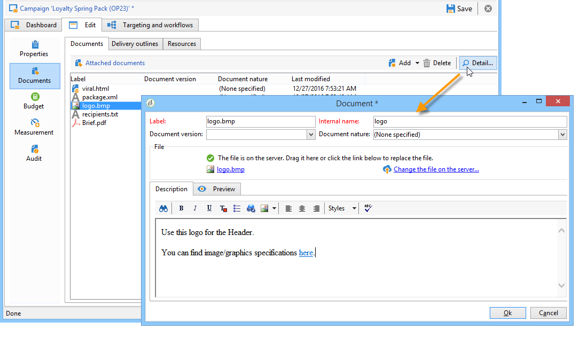
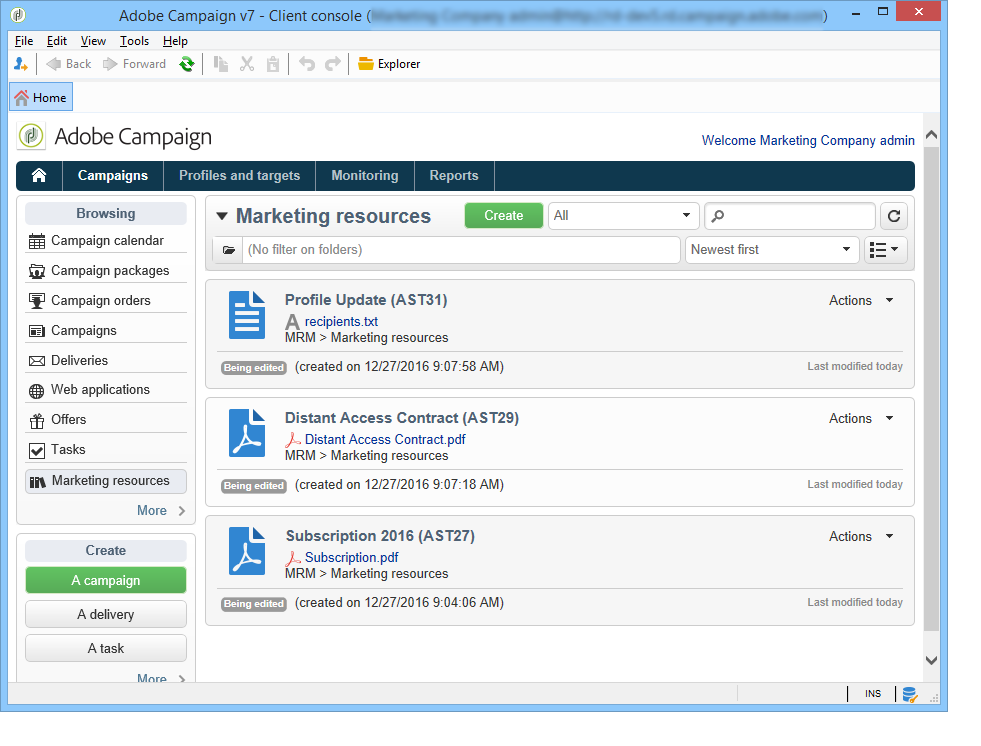
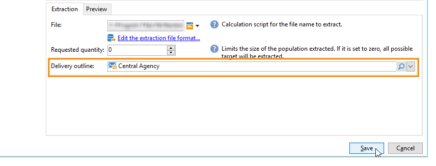

# Gerenciar documentos associados {#managing-associated-documents}

Você pode associar vários documentos a uma campanha: relatórios, fotos, páginas da Web, diagramas etc. Esses documentos podem estar em qualquer formato (Microsoft Word, PowerPoint, PNG, JPG, Acrobat PDF etc.).

>[!IMPORTANT]
>
>Esse recurso é reservado para assets e documentos pequenos.

Em uma campanha, você também pode consultar outros itens, como cupons promocionais, ofertas especiais relacionadas a uma marca ou loja específica etc. Quando esses elementos são incluídos em um outline, eles podem ser associados a um delivery de correspondência direta. Consulte [Associar e estruturar recursos vinculados por meio de um delivery outline](#associating-and-structuring-resources-linked-via-a-delivery-outline).

>[!NOTE]
>
>Se estiver usando o módulo de Gerenciamento de recurso de marketing do Campaign, você também poderá gerenciar uma biblioteca de recursos de marketing que estão disponíveis para vários usuários para trabalho colaborativo. [Saiba mais](../../mrm/using/managing-marketing-resources.md).

## Adicionar documentos {#adding-documents}

Os documentos podem ser associados no nível da campanha (documentos contextuais) ou no nível do programa (documentos gerais).

A guia **[!UICONTROL Documents]** contém:

* A lista de todos os documentos necessários para o conteúdo (template, imagens etc.) que pode ser baixado localmente pelos operadores do Adobe Campaign com direitos adequados,
* Documentos contendo informações para o roteador, se houver.

Os documentos são vinculados ao programa ou à campanha através da guia **[!UICONTROL Edit > Documents]**.

Você também pode adicionar um documento a uma campanha através do link oferecido em seu painel.

Clique no ícone **[!UICONTROL Details]** para exibir o conteúdo de um arquivo e adicionar informações:

No painel, os documentos associados à campanha são agrupados na seção **[!UICONTROL Document(s)]**, como no exemplo a seguir:

Eles também podem ser editados e modificados nessa visualização.

## Associar e estruturar recursos vinculados por meio de um delivery outline {#associating-and-structuring-resources-linked-via-a-delivery-outline}

>[!NOTE]
>
>Delivery outlines são usados exclusivamente no contexto de campanhas de correspondência direta.

Um delivery outline indica um conjunto estruturado de elementos (documentos, lojas, cupons promocionais etc.) criado pela empresa e para uma campanha específica.

Esses elementos são agrupados em delivery outlines, e cada delivery outline será associado a um delivery; ele será referenciado no arquivo de extração enviado para o **provedor de serviço** para ser anexado ao delivery. Por exemplo, você pode criar um delivery outline que se refere a uma unidade e aos folhetos de marketing que ela usa.

Para uma campanha, delivery outlines permitem que você estruture elementos externos a serem associados ao delivery de acordo com determinados critérios: a unidade relacionada, a oferta promocional concedida, o convite para um evento local etc.

### Criar um outline {#creating-an-outline}

Para criar um outline, clique na guia **[!UICONTROL Delivery outlines]** da campanha relacionada e depois clique na subguia **[!UICONTROL Edit > Documents]**.

>[!NOTE]
>
>Se essa guia não estiver presente, significa que esse recurso não está disponível para esta campanha. Consulte a configuração do template de campanha.
>   
>Para saber mais sobre modelos, consulte [esta seção](../../campaign/using/marketing-campaign-templates.md#campaign-templates).

Em seguida, clique em **[!UICONTROL Add a delivery outline]** e crie a hierarquia de outlines para a campanha:

1. Clique com o botão direito do mouse na raiz da árvore e selecione **[!UICONTROL New > Delivery outlines]**.
1. Clique com o botão direito do mouse no outline recém criado e selecione **[!UICONTROL New > Item]** ou **[!UICONTROL New > Personalization fields]**.

Uma estrutura pode conter itens e campos de personalização, recursos e ofertas:

* Os itens podem ser documentos físicos, por exemplo, que são referenciados e descritos aqui e serão anexados ao delivery.
* Os campos de personalização permitem que você crie elementos de personalização relacionados a remessas em vez de recipients. Assim, é possível criar valores que serão usados em deliveries para um target específico (oferta de boas-vindas, desconto, etc.) Eles são criados no Adobe Campaign e importados para o outline por meio do link **[!UICONTROL Import personalization fields...]**.

   

   Eles também podem ser criados diretamente no outline clicando no ícone **[!UICONTROL Add]** à direita da zona de lista.

   

* São recursos de marketing gerados no painel de recursos de marketing acessado por meio do link **[!UICONTROL Resources]** da guia **[!UICONTROL Campaigns]**.

   

   >[!NOTE]
   >
   >Para obter mais informações sobre recursos de marketing, consulte [esta seção](../../mrm/using/managing-marketing-resources.md).

### Selecionar um outline {#selecting-an-outline}

Para cada delivery, você pode selecionar o outline para associar na seção reservada para o outline da extração, como no exemplo a seguir:

A estrutura selecionada é então exibida na seção inferior da janela. Ele pode ser editado usando o ícone à direita do campo ou alterado usando a lista suspensa:

A guia **[!UICONTROL Summary]** do delivery também exibe essas informações:

### Resultado da extração {#extraction-result}

No arquivo extraído e enviado ao provedor de serviços, o nome da estrutura e, quando apropriado, suas características (custo, descrição etc.) são adicionados ao conteúdo de acordo com as informações no template de exportação associado ao provedor de serviços.

No seguinte exemplo, o rótulo, custo estimado e descrição do outline associado ao delivery serão adicionados no arquivo de extração.

O modelo de exportação deve estar associado ao provedor de serviços selecionado para o delivery. Consulte [esta seção](../../campaign/using/providers--stocks-and-budgets.md#creating-service-providers-and-their-cost-structures).

>[!NOTE]
>
>Para obter mais informações sobre exportações, consulte [esta seção](../../platform/using/get-started-data-import-export.md).
