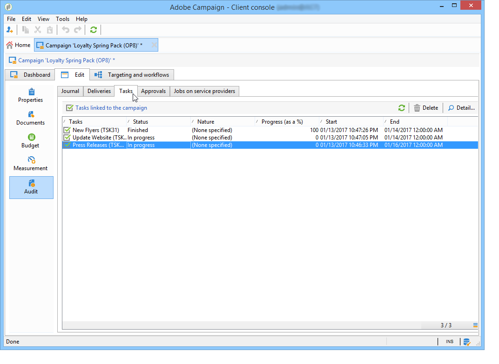

# Monitorar campanhas de marketing {#monitoring-marketing-campaigns}

## Rastrear uma campanha {#tracking-a-campaign}

Para cada campanha, a guia **[!UICONTROL Tracking]** permite visualizar todas as tarefas e os status. As seguintes informações podem ser acessadas por meio desta subguia:

* O diário de atividades mostra as tarefas realizadas na campanha em geral: criação ou início, aprovação, extração etc. do fluxo de tarefa.

   

* A subguia **[!UICONTROL Deliveries]** contém todos os deliveries da campanha que podem ser editados nessa visualização. Para fazer isso, selecione o delivery e clique no ícone **[!UICONTROL Detail]**.

   

* A subguia **[!UICONTROL Tasks]** agrupa todas as tarefas vinculadas à campanha. Essa visualização permite que você as edite ou exclua. As tarefas estão disponíveis com o aplicativo MRM. Eles são detalhados [nesta seção](../../mrm/using/creating-and-managing-tasks.md).

   

* Os workflows criados para gerar mensagens para provedores de serviços são exibidos na subguia **[!UICONTROL Jobs on service providers]**. Clique no ícone **[!UICONTROL Detail]** para exibir o workflow selecionado.

   

## Rastreamento de entrega {#delivery-tracking}

A lista de está disponível através do link **[!UICONTROL Deliveries]** Deliveries do nó do Campaign.

Para cada delivery, essa lista permite acessar os indicadores-chave: status, número de recipients direcionados, campanhas vinculadas, etc.

Para verificar o status de um delivery, edite-o e exiba seu painel e guias.

>[!NOTE]
>
>As informações relacionadas aos detalhes do delivery estão disponíveis [nesta seção](../../delivery/using/about-message-tracking.md).

## Rastreamento da execução {#execution-tracking}

Você pode consultar o status de clicando em **[!UICONTROL Deliveries]** Deliveries, acessível na página inicial do Adobe Campaign. Consulte [Rastreamento de delivery](#delivery-tracking).

As informações relativas aos processos executados em uma campanha são coletadas na guia **[!UICONTROL Edit > Audit]** da campanha. Você pode visualizar a lista de deliveries na campanha. [Saiba mais](#tracking-a-campaign).
