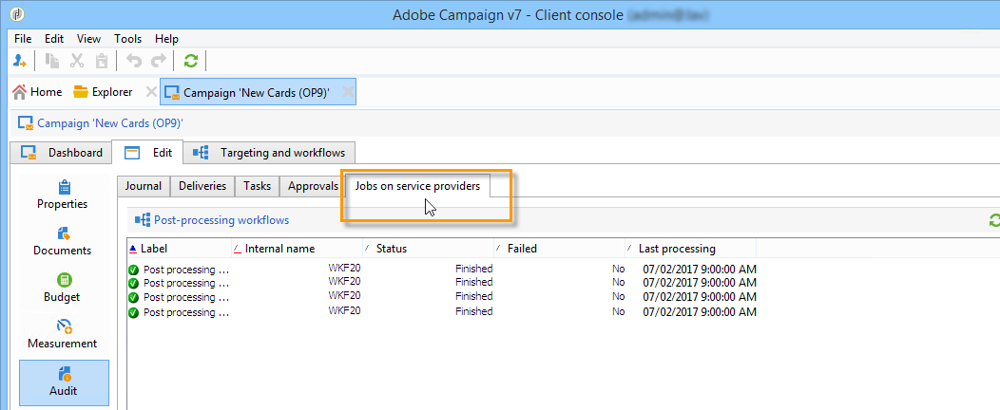

# Monitorar campanhas de marketing {#monitoring-marketing-campaigns}

## Rastrear uma campanha {#tracking-a-campaign}

Para cada campanha, a guia **[!UICONTROL Tracking]** permite visualizar todos os processos e os status. As seguintes informações podem ser acessadas por meio desta subguia:

* O diário de atividades mostra os processos realizados na campanha em geral: criação ou início, aprovação, extração etc. do fluxo de tarefa.

  

* A subguia **[!UICONTROL Deliveries]** contém todas as entregas da campanha que podem ser editadas nessa visualização. Para fazer isso, selecione a entrega e clique no ícone **[!UICONTROL Detail]**.

  

* A subguia **[!UICONTROL Tasks]** agrupa todas as tarefas vinculadas à campanha. Essa visualização permite que você as edite ou exclua. As tarefas estão disponíveis com o aplicativo MRM. Eles são detalhados [nesta seção](../../mrm/using/creating-and-managing-tasks.md).

  

* Os fluxos de trabalho criados para gerar mensagens para provedores de serviços são exibidos na subguia **[!UICONTROL Jobs on service providers]**. Clique no ícone **[!UICONTROL Detail]** para exibir o fluxo de trabalho selecionado.

  

## Rastreamento de entrega {#delivery-tracking}

A lista de entregas está disponível através do link **[!UICONTROL Deliveries]** do nó do Campaign.

Para cada entrega, essa lista permite acessar os indicadores-chave: status, número de destinatários direcionados, campanhas vinculadas, etc.

Para verificar o status de uma entrega, edite-a e exiba seu painel e guias.

>[!NOTE]
>
>As informações relacionadas aos detalhes da entrega estão disponíveis [nesta seção](../../delivery/using/about-message-tracking.md).

## Rastreamento da execução {#execution-tracking}

Você pode consultar o status de clicando em **[!UICONTROL Deliveries]** Deliveries, acessível na página inicial do Adobe Campaign. Consulte [Rastreamento de entrega](#delivery-tracking).

As informações relativas aos processos executados em uma campanha são coletadas na guia **[!UICONTROL Edit > Audit]** da campanha. Você pode visualizar a lista de entregas na campanha. [Saiba mais](#tracking-a-campaign).
