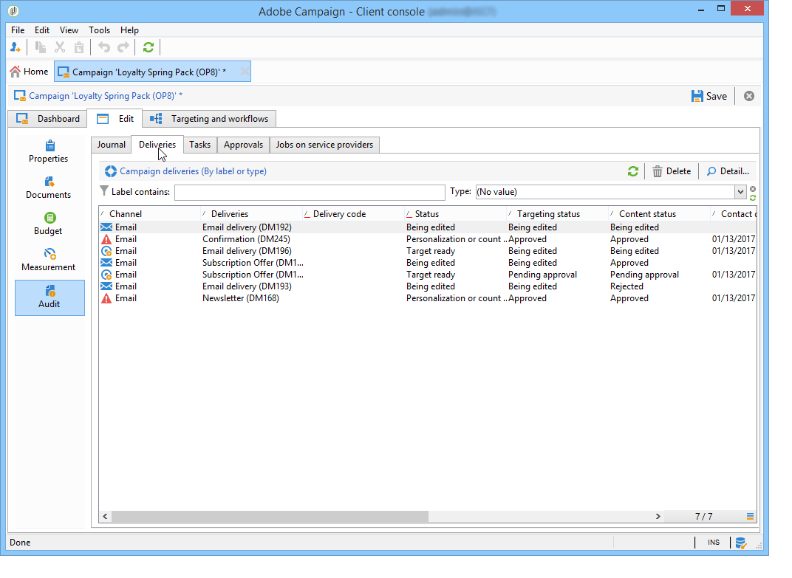

# Monitoramento de campanhas de marketing {#monitoring-marketing-campaigns}

## Rastrear uma campanha {#tracking-a-campaign}

For each campaign, the **[!UICONTROL Tracking]** tab lets you view all jobs and their statuses. As seguintes informações podem ser acessadas por meio desta subguia:

* O diário de atividades mostra as tarefas realizadas na campanha em geral: criação ou início, aprovação, extração etc. do fluxo de tarefa.

   

* The **[!UICONTROL Deliveries]** sub-tab contains all the deliveries of the campaign which can be edited from this view. To do so, select the delivery and click the **[!UICONTROL Detail]** icon.

   

* The **[!UICONTROL Tasks]** sub-tab groups all tasks linked to the campaign. Essa visualização permite que você as edite ou exclua. As tarefas estão disponíveis com o aplicativo MRM. Eles são detalhados em [Criar e gerenciar tarefas](../../campaign/using/creating-and-managing-tasks.md).

   

* The workflows created to generate messages for service providers are displayed in the **[!UICONTROL Jobs on service providers]** sub-tab. Click the **[!UICONTROL Detail]** icon to display the selected workflow.

   

## Controle de delivery {#delivery-tracking}

The list of deliveries is available via the **[!UICONTROL Deliveries]** link of the Campaign node.

Para cada delivery, essa lista permite acessar os indicadores-chave: status, número de recipients direcionados, campanhas vinculadas, etc.

Para verificar o status de um delivery, edite-o e exiba seu painel e guias.

>[!NOTE]
>
>As informações relativas aos detalhes do delivery estão disponíveis na seção [Enviar mensagens](../../delivery/using/about-message-tracking.md).

## Rastreamento da execução {#execution-tracking}

You can look up the status of deliveries by clicking the **[!UICONTROL Deliveries]**, which is accessible via the Adobe Campaign home page. Consulte Rastreamento [de entrega](#delivery-tracking).

Information concerning the processes executed in a campaign are collected in the **[!UICONTROL Edit > Audit]** tab of the campaign. Você pode exibir a lista de remessas na campanha. Consulte [Rastreamento de uma campanha](#tracking-a-campaign).
