# Selecionar o público-alvo das campanhas {#marketing-campaign-deliveries}

Em uma campanha de marketing, para cada entrega, é possível definir:

* O público-alvo – saiba mais em [Criação de público-alvo em um fluxo de trabalho](#building-the-main-target-in-a-workflow) e [Seleção da população-alvo](#selecting-the-target-population).
* Um grupo de controle ‒ saiba mais [nesta seção](#defining-a-control-group).
* Seed addresses – saiba mais [nesta seção](../../delivery/using/about-seed-addresses.md).

Algumas dessas informações podem ser herdadas do [modelo de campanha](../../campaign/using/marketing-campaign-templates.md#campaign-templates).

Para criar o público alvo da entrega, você pode definir critérios de filtragem para os destinatários no banco de dados. Este modo de seleção de destinatário é apresentado [nesta seção](../../delivery/using/steps-defining-the-target-population.md).

## Enviar para um grupo

Você pode importar uma população para uma lista e, depois, direcionar essa lista nas entregas. Para fazer isso, siga as etapas abaixo:

1. Edite a entrega em questão e clique no link **[!UICONTROL To]** para mudar a população direcionada.

1. Na guia **[!UICONTROL Main target]**, selecione a opção **[!UICONTROL Defined via the database]** e clique em **[!UICONTROL Add]** para selecionar os destinatários.

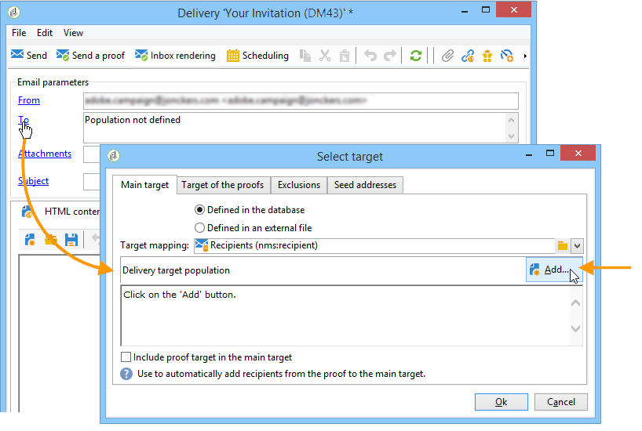

1. Selecione **[!UICONTROL A list of recipients]** e clique em **[!UICONTROL Next]** para selecioná-la.

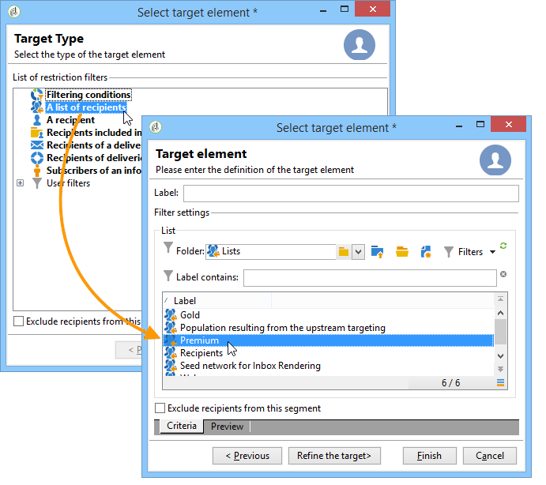

## Criar o público-alvo em um fluxo de trabalho de campanha {#building-the-main-target-in-a-workflow}

O objetivo principal de uma entrega também pode ser definido no fluxo de trabalho da campanha: este ambiente gráfico permite que você crie um destino usando consultas, testes e operadores: união, desduplicação, compartilhamento etc.

>[!IMPORTANT]
>
>Você não deve adicionar mais de 28 fluxos de trabalho a uma campanha. Acima desse limite, os fluxos de trabalho adicionais não ficam visíveis na interface e podem gerar erros.

### Criar o fluxo de trabalho {#creating-a-targeting-workflow}

A segmentação pode ser criada por meio de uma combinação de condições de filtragem em uma sequência gráfica em um fluxo de trabalho. Você pode criar populações e subpopulações que serão direcionadas de acordo com suas necessidades. Para exibir o editor de fluxo de trabalho, clique na guia **[!UICONTROL Targeting and workflows]** no painel de campanha.

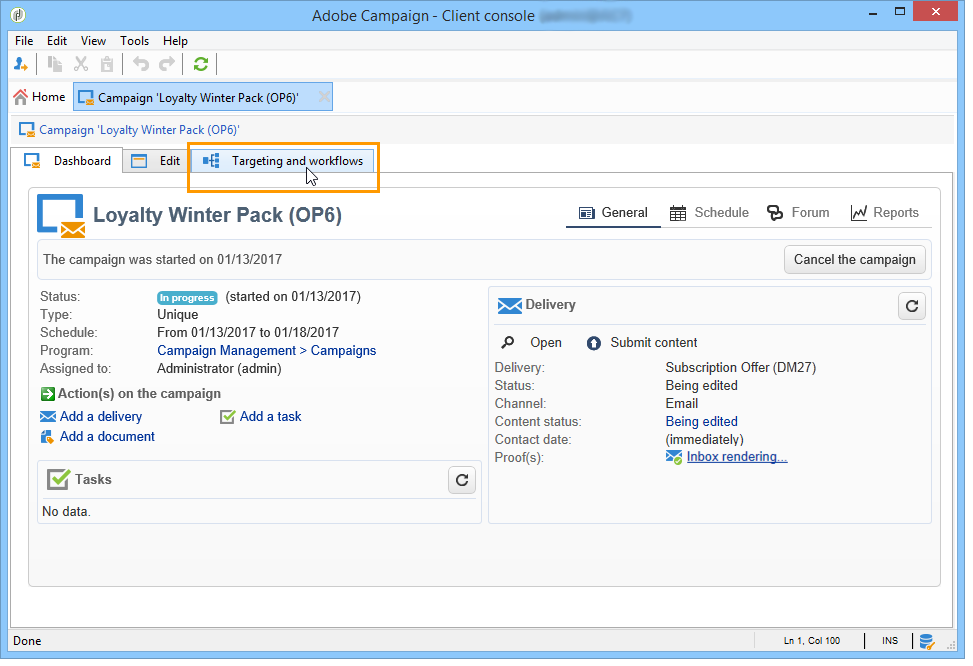

A população do target é extraída do banco de dados do Adobe Campaign através de uma ou mais consultas colocadas em um fluxo de trabalho. Para saber como criar uma consulta, consulte [esta seção](../../workflow/using/query.md).

Você pode iniciar queries e compartilhar populações por meio de caixas como União, Intersecção, Compartilhamento, Exclusão, etc.

Selecione os objetos nas listas à esquerda do espaço de trabalho e vincule a eles para construir o target.

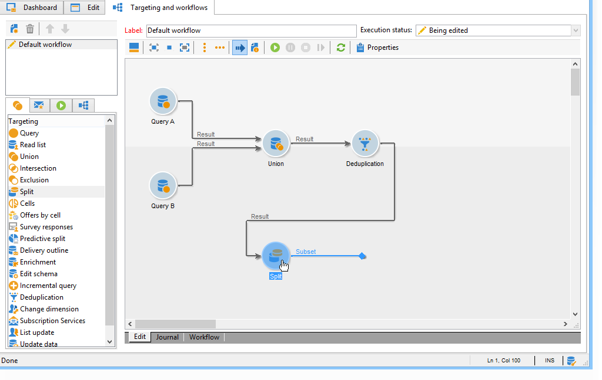

No diagrama, vincule as queries de direcionamento e agendamento necessárias para a construção de target no diagrama. Você pode executar o direcionamento enquanto a construção está em andamento para verificar a população extraída do banco de dados.

>[!NOTE]
>
>Os exemplos e o procedimento para definir queries são apresentados [nesta seção](../../workflow/using/query.md).

A seção à esquerda do editor contém uma biblioteca de objetos gráficos que representam atividades. A primeira guia contém as atividades de direcionamento e a segunda contém as atividades de controle de fluxo, que são usadas ocasionalmente para coordenar as atividades de direcionamento.

As funções de execução e formatação do fluxo de trabalho de segmentação são acessíveis pela barra de ferramentas do editor de diagrama.

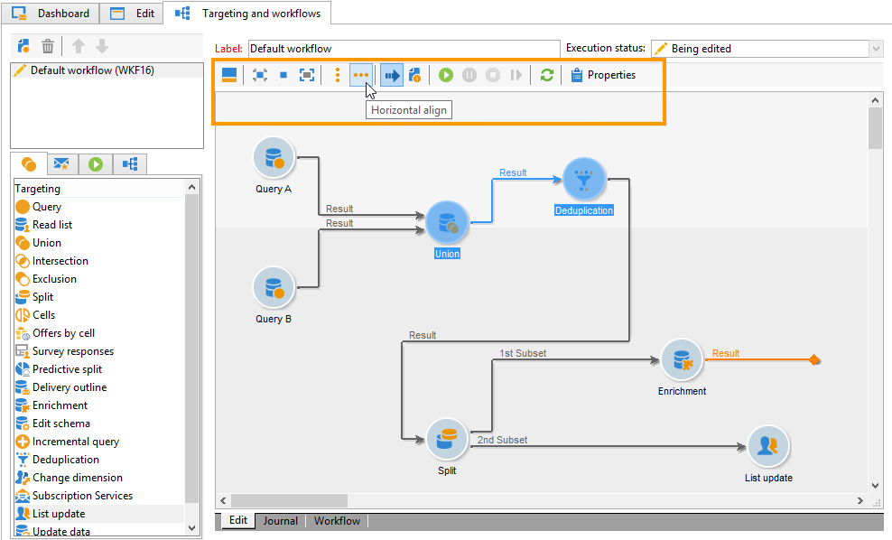

>[!NOTE]
>
>As atividades disponíveis para criar o diagrama e todos os recursos de exibição e layout estão detalhados no guia [Automating with workflows](../../workflow/using/architecture.md).

Você pode criar vários fluxos de trabalho de segmentação para uma única campanha. Para adicionar um fluxo de trabalho:

1. Acesse a seção superior esquerda da área de criação do fluxo de trabalho, clique com o botão direito do mouse e clique em **[!UICONTROL Add]**. Você também pode usar o botão **[!UICONTROL New]** localizado acima dessa área.

   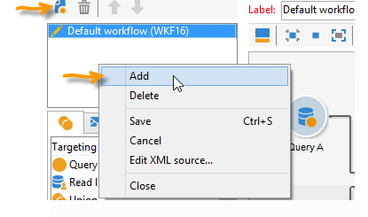

1. Selecione o modelo **[!UICONTROL New workflow]** e o nome deste fluxo de trabalho.
1. Clique em **[!UICONTROL OK]** para confirmar a criação do fluxo de trabalho e, em seguida, crie o diagrama para esse fluxo de trabalho.

### Executar o fluxo de trabalho {#executing-a-workflow}

Os fluxos de trabalho de segmentação podem ser iniciados manualmente por meio do botão **[!UICONTROL Start]** na barra de ferramentas, desde que você tenha os direitos apropriados.

O direcionamento pode ser programado para execução automática de acordo com um agendamento (scheduler) ou um evento (sinal externo, importação de arquivo, etc.).

As ações relacionadas à execução do workflow para construção do target (iniciar, parar, pausar etc.) são processos **assíncronos**: o comando é salvo e entrará em vigor assim que o servidor estiver disponível para aplicá-lo.

Os ícones da barra de ferramentas permitem realizar a ação referente à execução do fluxo de trabalho de segmentação.

* Iniciar ou reiniciar

   * O ícone **[!UICONTROL Start]** permite iniciar o fluxo de trabalho de segmentação. Quando você clica nesse ícone, todas as atividades sem uma transição de entrada são ativadas (exceto saltos de ponto de extremidade).

     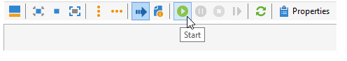

     O servidor considera a solicitação, conforme mostrado pelo status:

     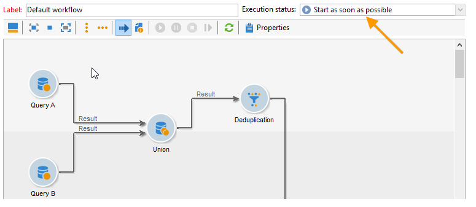

     O status do processo muda para **[!UICONTROL Started]**.

   * Você pode reiniciar o fluxo de trabalho de segmentação por meio do ícone de barra de ferramentas apropriado. Esse comando pode ser útil se o ícone **[!UICONTROL Start]** não estiver disponível, por exemplo, quando a interrupção do fluxo de trabalho para construção do target estiver em andamento. Nesse caso, clique no ícone **[!UICONTROL Restart]** para antecipar a reinicialização. O servidor considera a solicitação, como mostra o status:

     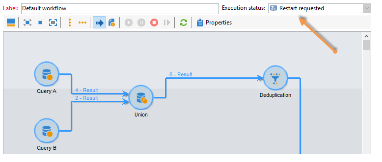

     O processo insere o status **[!UICONTROL Started]**.

* Parar ou pausar

   * Os ícones da barra de ferramentas permitem interromper ou pausar um fluxo de trabalho de direcionamento em andamento.

     Ao clicar em **[!UICONTROL Pause]**, as operações em andamento **[!UICONTROL are not]** são pausadas, mas nenhuma outra atividade é iniciada até a próxima reinicialização.

     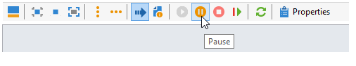

     O servidor considera o comando, como mostra o status:

     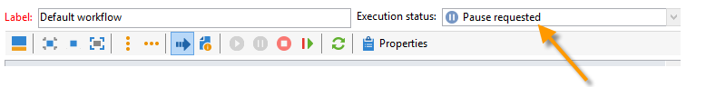

     Você também pode pausar um fluxo de trabalho de segmentação automaticamente quando a execução atinge uma atividade específica. Para fazer isso, clique com o botão direito do mouse na atividade a partir da qual o fluxo de trabalho de segmentação deve ser pausado e selecione **[!UICONTROL Enable but do not execute]**.

     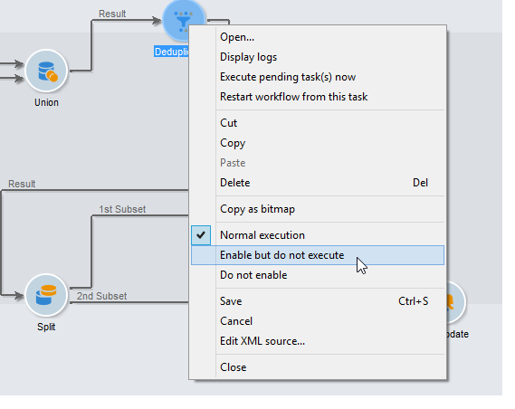

     Essa configuração é exibida por um ícone especial.

     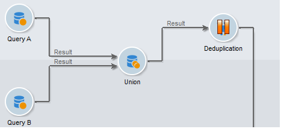

     >[!NOTE]
     >
     >Essa opção é útil durante as fases avançadas de criação e teste de campanhas de direcionamento.

     Clique em **[!UICONTROL Start]** para retomar a execução.

   * Clique no ícone **[!UICONTROL Stop]** para interromper a execução em andamento.

     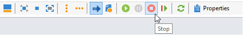

     O servidor considera o comando, como mostra o status:

     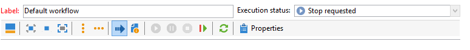

  Você também pode interromper um fluxo de trabalho de definição de metas automaticamente quando a execução atinge uma atividade. Para fazer isso, clique com o botão direito do mouse na atividade a partir da qual o fluxo de trabalho para construção do target será interrompido e selecione **[!UICONTROL Do not activate]**.

  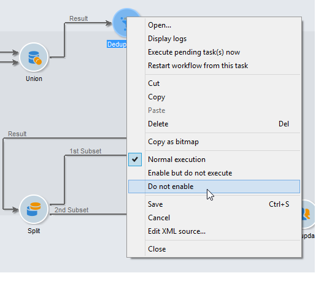

  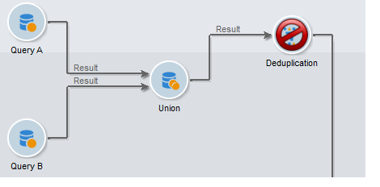

  Essa configuração é exibida por um ícone especial.

  >[!NOTE]
  >
  >Essa opção é útil durante as fases avançadas de criação e teste de campanhas de direcionamento.

* Interrupção incondicional

  No Explorer, selecione **[!UICONTROL Administration > Production > Object created automatically > Campaign workflows]** para acessar e atuar em todos os fluxos de trabalho da campanha.

  Você pode interromper o fluxo de trabalho definitivamente clicando no ícone **[!UICONTROL Actions]** e selecionando a interrupção **[!UICONTROL Unconditional]**. Esta ação encerra o fluxo de trabalho da campanha.

  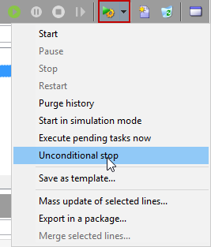

  >[!CAUTION]
  >
  >A interrupção incondicional é restrita aos usuários administradores.

## Adicionar um grupo de controle {#defining-a-control-group}

Um grupo de controle é uma população que não receberá a entrega; ele é usado para rastrear o comportamento após a entrega e o impacto da campanha fazendo uma comparação com o comportamento da população do target, que recebeu a entrega.

O grupo de controle pode ser extraído do target principal e/ou vir de um grupo ou consulta específica.

### Ativar o grupo de controle para uma campanha {#activating-the-control-group-for-a-campaign}

Você pode definir um grupo de controle no nível da campanha. Nesse caso, o grupo de controle será aplicado a cada entrega da campanha em questão.

1. Edite a campanha relacionada e clique na guia **[!UICONTROL Edit]**.
1. Clique em **[!UICONTROL Advanced campaign settings]**.

   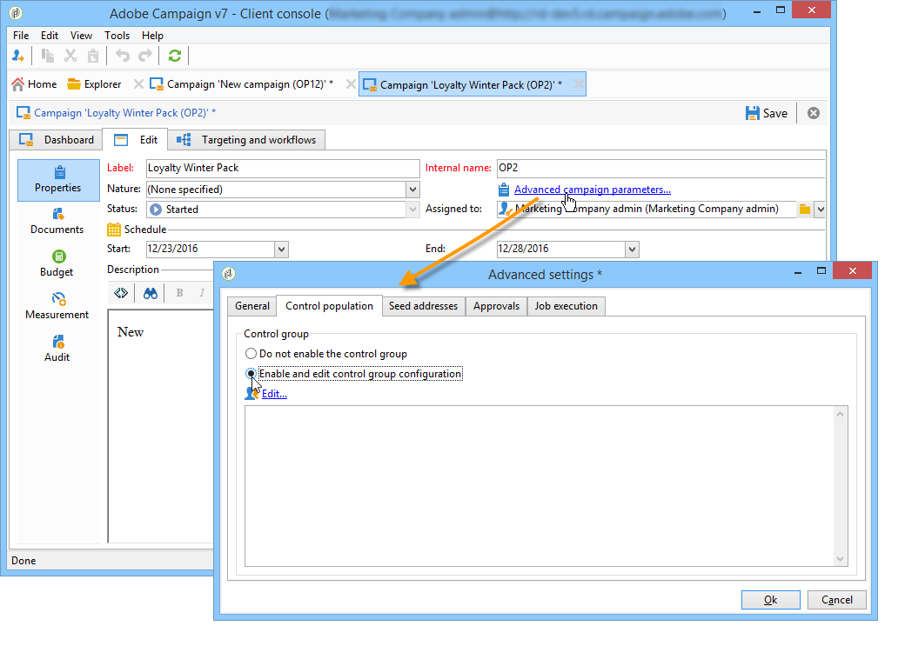

1. Selecione a opção **[!UICONTROL Enable and edit control group configuration]**.
1. Clique em **[!UICONTROL Edit...]** para configurar o grupo de controle.

   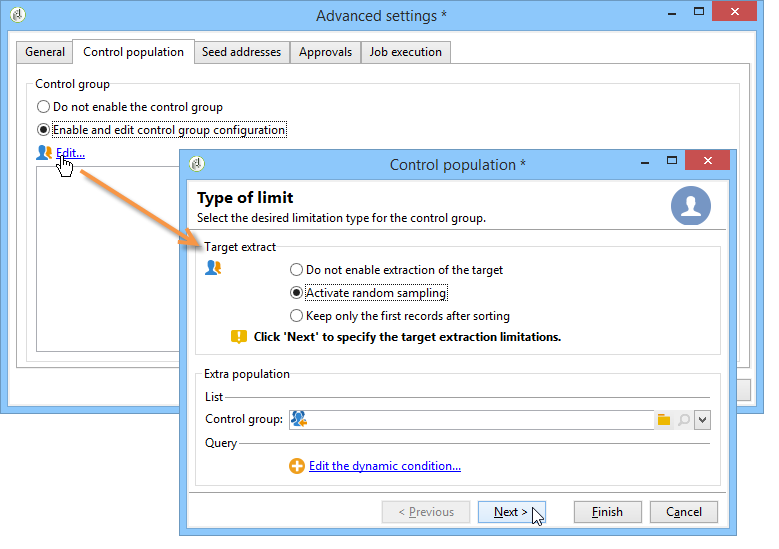

O procedimento de configuração é apresentado em [Extração do grupo de controle do público-alvo principal](#extracting-the-control-group-from-the-main-target) e [Adicionar um grupo de controle](#adding-a-population).

### Ativar o grupo de controle para uma entrega {#activating-the-control-group-for-a-delivery}

Você pode definir um grupo de controle no nível da entrega, nesse caso, o grupo de controle será aplicado a cada entrega da campanha relacionada.

Por padrão, a configuração do grupo de controle definida no nível da campanha se aplica a cada entrega dessa campanha. Entretanto, você pode adaptar o grupo de controle de uma entrega individual.

>[!NOTE]
>
>Se você tiver definido um grupo de controle para uma campanha e também configurá-lo para uma entrega vinculada a essa campanha, somente o grupo de controle definido para a entrega será aplicado.

1. Edite a entrega relacionada e clique no link **[!UICONTROL To]** na seção **[!UICONTROL Email parameters]**.

   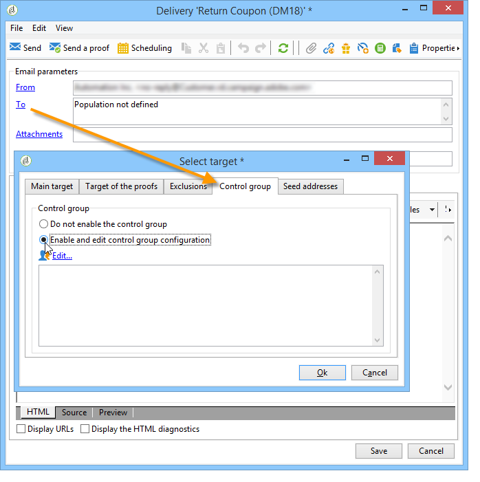

1. Clique na guia **[!UICONTROL Control group]** e selecione **[!UICONTROL Enable and edit control group configuration]**.
1. Clique em **[!UICONTROL Edit...]** para configurar o grupo de controle.

O procedimento de configuração é apresentado em [Extração do grupo de controle do público-alvo principal](#extracting-the-control-group-from-the-main-target) e [Adicionar um grupo de controle](#adding-a-population).

### Extração do grupo de controle do target principal {#extracting-the-control-group-from-the-main-target}

Você pode extrair destinatários do target principal da entrega. Nesse caso, os destinatários serão retirados do target das ações de entrega afetadas por essa configuração. Essa extração pode ser aleatória ou pode ser resultado da classificação de destinatários.

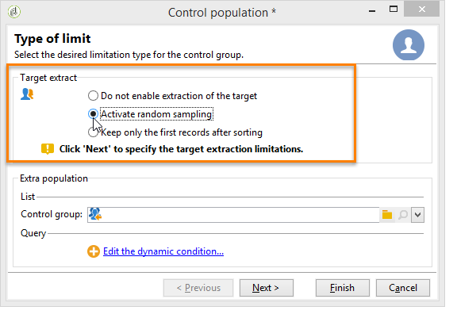

Para extrair um grupo de controle, habilite o grupo de controle para a campanha ou entrega e selecione uma das seguintes opções: **[!UICONTROL Activate random sampling]** ou **[!UICONTROL Keep only the first records after sorting]**.

* **[!UICONTROL Activate random sampling]**: esta opção aplica amostras aleatórias aos destinatários na população direcionada. Se você definir o limite como 100, o grupo de controle será constituído de 100 destinatários selecionados aleatoriamente da população direcionada. A amostragem aleatória depende do mecanismo de banco de dados.
* **[!UICONTROL Keep only the first records after sorting]**: esta opção permite definir uma limitação baseada em uma ou mais ordens de classificação. Se você selecionar o campo **[!UICONTROL Age]** como um critério de classificação e, em seguida, definir 100 como limite, o grupo de controle será constituído dos 100 destinatários mais jovens. Por exemplo, pode ser interessante definir um grupo de controle que inclua destinatários que façam poucas compras ou destinatários que façam compras frequentes e comparar seu comportamento com os destinatários contatados.

Clique em **[!UICONTROL Next]** para definir a ordem de classificação (se necessário) e selecione o modo de limitação do destinatário.

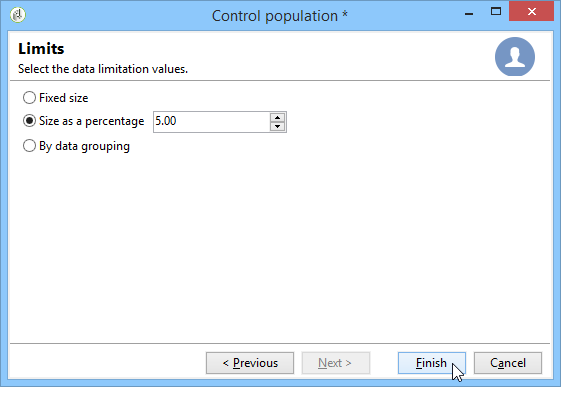

Essa configuração é equivalente a uma atividade de compartilhamento no fluxo de trabalho, que permite dividir o target em subconjuntos. O grupo de controle é um desses subconjuntos. Consulte [esta seção](../../workflow/using/architecture.md) para obter mais informações.

### Usar uma nova população como grupo de controle {#adding-a-population}

Você pode definir uma nova população a ser usada como um grupo de controle. Essa população pode vir de um grupo de destinatários ou você pode criá-la por meio de uma consulta específica.

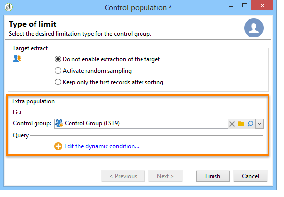

>[!NOTE]
>
>O editor de consultas do Adobe Campaign é apresentado [nesta seção](../../workflow/using/query.md).

#### Tutorial em vídeo {#create-email-video}

Este vídeo explica como criar uma campanha e um email no Adobe Campaign.

>[!VIDEO](https://video.tv.adobe.com/v/31837?captions=por_br&quality=12)

Vídeos extras explicativos do Campaign estão disponíveis [aqui](https://experienceleague.adobe.com/docs/campaign-classic-learn/tutorials/overview.html?lang=pt-BR).
