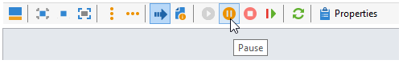
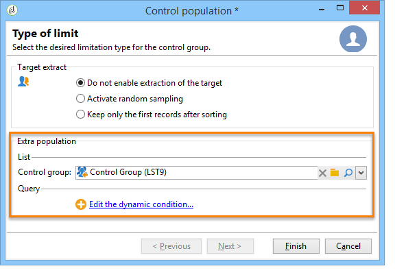

# Selecionar o público das campanhas {#marketing-campaign-deliveries}

Em uma campanha de marketing, para cada delivery, é possível definir:

* A audiência – saiba mais em [Criação de audiência em um fluxo de trabalho](#building-the-main-target-in-a-workflow) e [Seleção da população-alvo](#selecting-the-target-population).
* Um grupo de controle ‒ saiba mais [nesta seção](#defining-a-control-group).
* Seed addresses – saiba mais [nesta seção](../../delivery/using/about-seed-addresses.md).

Algumas dessas informações podem ser herdadas do [template de campanha](../../campaign/using/marketing-campaign-templates.md#campaign-templates).

Para criar o público alvo do delivery, você pode definir critérios de filtragem para os recipients no banco de dados. Este modo de seleção de recipient é apresentado [nesta seção](../../delivery/using/steps-defining-the-target-population.md).

## Enviar para um grupo

Você pode importar uma população para uma lista e, depois, direcionar essa lista nos deliveries. Para fazer isso, siga as etapas abaixo:

1. Edite o delivery em questão e clique no link **[!UICONTROL To]** para mudar a população direcionada.

1. Na guia **[!UICONTROL Main target]**, selecione a opção **[!UICONTROL Defined via the database]** e clique em **[!UICONTROL Add]** para selecionar os recipients.

1. Selecione **[!UICONTROL A list of recipients]** e clique em **[!UICONTROL Next]** para selecioná-la.

## Criar a audiência em um fluxo de trabalho de campanha {#building-the-main-target-in-a-workflow}

O objetivo principal de um delivery também pode ser definido no fluxo de trabalho da campanha: este ambiente gráfico permite que você crie um destino usando consultas, testes e operadores: união, desduplicação, compartilhamento etc.

>[!IMPORTANT]
>
>Você não deve adicionar mais de 28 workflows a uma campanha. Acima desse limite, os workflows adicionais não ficam visíveis na interface e podem gerar erros.

### Criar o workflow {#creating-a-targeting-workflow}

A definição de alvos pode ser criada por meio de uma combinação de condições de filtragem em uma sequência gráfica em um workflow. Você pode criar populações e subpopulações que serão direcionadas de acordo com suas necessidades. Para exibir o editor de workflow, clique na guia **[!UICONTROL Targeting and workflows]** no painel de campanha.

A população do target é extraída do banco de dados do Adobe Campaign através de uma ou mais queries colocadas em um workflow. Para saber como criar uma query, consulte [esta seção](../../workflow/using/query.md).

Você pode iniciar queries e compartilhar populações por meio de caixas como União, Intersecção, Compartilhamento, Exclusão, etc.

Selecione os objetos nas listas à esquerda do espaço de trabalho e vincule a eles para construir o target.

No diagrama, vincule as queries de definição de metas e agendamento necessárias para a construção de target no diagrama. Você pode executar o direcionamento enquanto a construção está em andamento para verificar a população extraída do banco de dados.

>[!NOTE]
>
>Os exemplos e o procedimento para definir queries são apresentados [nesta seção](../../workflow/using/query.md).

A seção à esquerda do editor contém uma biblioteca de objetos gráficos que representam atividades. A primeira guia contém as atividades de definição de metas e a segunda contém as atividades de controle de fluxo, que são usadas ocasionalmente para coordenar as atividades de definição de metas.

As funções de execução e formatação do workflow de direcionamento são acessíveis pela barra de ferramentas do editor de diagrama.

>[!NOTE]
>
>As atividades disponíveis para criar o diagrama e todos os recursos de exibição e layout estão detalhados no guia [Automating with workflows](../../workflow/using/architecture.md).

Você pode criar vários workflows para construção do target para uma única campanha. Para adicionar um workflow:

1. Acesse a seção superior esquerda da área de criação do workflow, clique com o botão direito do mouse e clique em **[!UICONTROL Add]**. Você também pode usar o botão **[!UICONTROL New]** localizado acima dessa área.

   

1. Selecione o template **[!UICONTROL New workflow]** e o nome deste workflow.
1. Clique em **[!UICONTROL OK]** para confirmar a criação do workflow e, em seguida, crie o diagrama para esse workflow.

### Executar o workflow {#executing-a-workflow}

Os workflows para construção do target podem ser iniciados manualmente por meio do botão **[!UICONTROL Start]** na barra de ferramentas, desde que você tenha os direitos apropriados.

O direcionamento pode ser programado para execução automática de acordo com um agendamento (agendador) ou um evento (sinal externo, importação de arquivo, etc.).

As ações relacionadas à execução do workflow de definição de metas (inicialização, parada, pausa etc.) são processos **assíncronos** : o comando é salvo e entrará em vigor assim que o servidor estiver disponível para aplicá-lo.

Os ícones da barra de ferramentas permitem tomar medidas referentes à execução do workflow de direcionamento.

* Iniciar ou reiniciar

   * O ícone **[!UICONTROL Start]** permite iniciar o workflow para construção do target. Quando você clica nesse ícone, todas as atividades sem uma transição de entrada são ativadas (exceto saltos de ponto de extremidade).

      

      O servidor considera a solicitação, conforme mostrado pelo status:

      

      O status do processo muda para **[!UICONTROL Started]**.

   * Você pode reiniciar o workflow de definição de metas por meio do ícone de barra de ferramentas apropriado. Esse comando pode ser útil se o ícone **[!UICONTROL Start]** não estiver disponível, por exemplo, quando a interrupção do workflow para construção do target estiver em andamento. Nesse caso, clique no ícone **[!UICONTROL Restart]** para antecipar a reinicialização. O servidor considera a solicitação, como mostra o status:

      

      O processo insere o status **[!UICONTROL Started]**.

* Parar ou pausar

   * Os ícones da barra de ferramentas permitem interromper ou pausar um workflow de direcionamento em andamento.

      Ao clicar em **[!UICONTROL Pause]**, as operações em andamento **[!UICONTROL are not]** são pausadas, mas nenhuma outra atividade é iniciada até a próxima reinicialização.

      

      O servidor considera o comando, como mostra o status:

      

      Você também pode pausar um workflow de direcionamento automaticamente quando a execução atinge uma atividade específica. Para fazer isso, clique com o botão direito do mouse na atividade a partir da qual o workflow para construção do target deve ser pausado e selecione **[!UICONTROL Enable but do not execute]**.

      

      Essa configuração é exibida por um ícone especial.

      

      >[!NOTE]
      >
      >Essa opção é útil durante as fases avançadas de criação e teste de campanhas de definição de metas.

      Clique em **[!UICONTROL Start]** para retomar a execução.

   * Clique no ícone **[!UICONTROL Stop]** para interromper a execução em andamento.

      

      O servidor considera o comando, como mostra o status:

      
   Você também pode interromper um workflow de definição de metas automaticamente quando a execução atinge uma atividade. Para fazer isso, clique com o botão direito do mouse na atividade a partir da qual o workflow para construção do target será interrompido e selecione **[!UICONTROL Do not activate]**.

   

   

   Essa configuração é exibida por um ícone especial.

   >[!NOTE]
   >
   >Essa opção é útil durante as fases avançadas de criação e teste de campanhas de definição de metas.

* Interrupção incondicional

   No Explorer, selecione **[!UICONTROL Administration > Production > Object created automatically > Campaign workflows]** para acessar e atuar em todos os workflows da campanha.

   Você pode interromper o workflow definitivamente clicando no ícone **[!UICONTROL Actions]** e selecionando a interrupção **[!UICONTROL Unconditional]**. Esta ação encerra o fluxo de trabalho da campanha.

   

## Adicionar um grupo de controle {#defining-a-control-group}

Um grupo de controle é uma população que não receberá o delivery; ele é usado para rastrear o comportamento após o delivery e o impacto da campanha fazendo uma comparação com o comportamento da população do target, que recebeu o delivery.

O grupo de controle pode ser extraído do target principal e/ou vir de um grupo ou query específica.

### Ativar o grupo de controle para uma campanha {#activating-the-control-group-for-a-campaign}

Você pode definir um grupo de controle no nível da campanha. Nesse caso, o grupo de controle será aplicado a cada delivery da campanha em questão.

1. Edite a campanha relacionada e clique na guia **[!UICONTROL Edit]**.
1. Clique em **[!UICONTROL Advanced campaign settings]**.

   

1. Selecione a opção **[!UICONTROL Enable and edit control group configuration]**.
1. Clique em **[!UICONTROL Edit...]** para configurar o grupo de controle.

   

O procedimento de configuração é apresentado em [Extração do grupo de controle do público-alvo principal](#extracting-the-control-group-from-the-main-target) e [Adicionar um grupo de controle](#adding-a-population).

### Ativar o grupo de controle para um delivery {#activating-the-control-group-for-a-delivery}

Você pode definir um grupo de controle no nível do delivery, nesse caso, o grupo de controle será aplicado a cada delivery da campanha relacionado.

Por padrão, a configuração do grupo de controle definida no nível da campanha se aplica a cada delivery dessa campanha. Entretanto, você pode adaptar o grupo de controle de um delivery individual.

>[!NOTE]
>
>Se você tiver definido um grupo de controle para uma campanha e também configurá-lo para um delivery vinculado a essa campanha, somente o grupo de controle definido para o delivery será aplicado.

1. Edite o delivery relacionado e clique no link **[!UICONTROL To]** na seção **[!UICONTROL Email parameters]**.

   

1. Clique na guia **[!UICONTROL Control group]** e selecione **[!UICONTROL Enable and edit control group configuration]**.
1. Clique em **[!UICONTROL Edit...]** para configurar o grupo de controle.

O procedimento de configuração é apresentado em [Extração do grupo de controle do público-alvo principal](#extracting-the-control-group-from-the-main-target) e [Adicionar um grupo de controle](#adding-a-population).

### Extração do grupo de controle do target principal {#extracting-the-control-group-from-the-main-target}

Você pode extrair recipients do target principal do delivery. Nesse caso, os recipients serão retirados do target das ações de delivery afetadas por essa configuração. Essa extração pode ser aleatória ou pode ser resultado da classificação de recipients.

Para extrair um grupo de controle, ative o grupo de controle para a campanha ou delivery e selecione uma das seguintes opções: **[!UICONTROL Activate random sampling]** ou **[!UICONTROL Keep only the first records after sorting]**.

* **[!UICONTROL Activate random sampling]**: esta opção aplica amostras aleatórias aos recipients na população direcionada. Se você definir o limite como 100, o grupo de controle será constituído de 100 recipients selecionados aleatoriamente da população direcionada. A amostragem aleatória depende do mecanismo de banco de dados.
* **[!UICONTROL Keep only the first records after sorting]**: esta opção permite definir uma limitação baseada em uma ou mais ordens de classificação. Se você selecionar o campo **[!UICONTROL Age]** como um critério de classificação e, em seguida, definir 100 como limite, o grupo de controle será constituído dos 100 recipients mais jovens. Por exemplo, pode ser interessante definir um grupo de controle que inclua recipients que façam poucas compras ou recipients que façam compras frequentes e comparar seu comportamento com os recipients contatados.

Clique em **[!UICONTROL Next]** para definir a ordem de classificação (se necessário) e selecione o modo de limitação do recipient.

Essa configuração é equivalente a uma atividade de compartilhamento no workflow, que permite dividir o target em subconjuntos. O grupo de controle é um desses subconjuntos. Consulte [esta seção](../../workflow/using/architecture.md) para obter mais informações.

### Usar uma nova população como grupo de controle {#adding-a-population}

Você pode definir uma nova população a ser usada como um grupo de controle. Essa população pode vir de um grupo de recipients ou você pode criá-la por meio de uma query específica.

>[!NOTE]
>
>O editor de query do Adobe Campaign é apresentado [nesta seção](../../workflow/using/query.md).

#### Tutorial em vídeo {#create-email-video}

Este vídeo explica como criar uma campanha e um email no Adobe Campaign.

>[!VIDEO](https://video.tv.adobe.com/v/25604?quality=12)

Vídeos extras explicativos do Campaign estão disponíveis [aqui](https://experienceleague.adobe.com/docs/campaign-classic-learn/tutorials/overview.html?lang=pt-BR).
