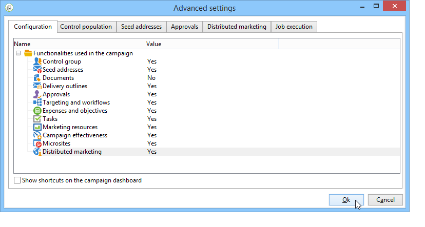
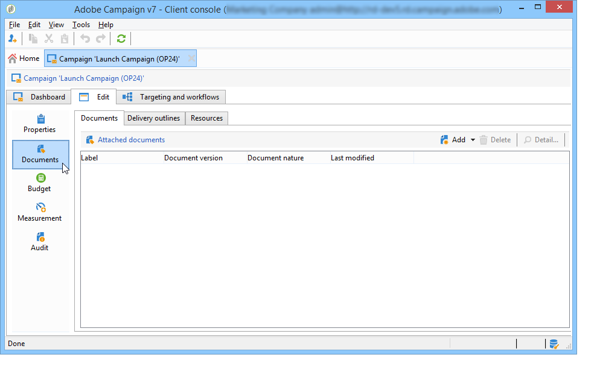

# Criar e configurar modelos de campanha {#campaign-templates}

Todas as campanhas de marketing são baseadas em um modelo, que armazena as principais características e recursos. Os templates do Campaign são centralizados no nó **[!UICONTROL Resources > Templates > Campaign templates]**. Um template de parâmetro é fornecido como padrão. Ele permite criar uma nova campanha usando todos os módulos disponíveis (Documentos, tarefas, seed addresses, etc.), mas os módulos oferecidos dependem dos seus direitos e da configuração da plataforma Adobe Campaign.

>[!NOTE]
>
>A árvore é exibida ao clicar no ícone **[!UICONTROL Explorer]** na home page.

Um modelo integrado é fornecido para criar uma campanha para a qual nenhuma configuração específica foi definida. Você pode criar e configurar seus modelos de campanha e, em seguida, criar campanhas com base nesses modelos.

 Para saber mais sobre a criação de campanha, assista a [este vídeo](../../campaign/using/marketing-campaign-deliveries.md#create-email-video).

## Criar um template de campanha {#creating-or-duplicating-a-campaign-template}

Para criar um template de campanha, siga as etapas abaixo:

1. Abra o **Gerenciador** de Campanha.
1. Em **Resources > Templates > Campaign templates**, clique em **New** na barra de ferramentas acima da lista de templates.

   

1. Insira o rótulo do seu novo template de campanha.
1. Clique em **Save** e abra seu template novamente.
1. Na guia **Edit**, insira o **Internal name** e outros valores, caso seja necessário.
1. Selecione **Advanced campaign settings** para adicionar um workflow ao seu template de campanha.

   

1. Altere o valor de **Targeting and workflows** para **Yes**.

   

1. Na guia **Targeting and workflows**, clique em **Add a workflow...**.

   

1. Complete o campo **Label** e clique em **Ok**.
1. Crie o workflow de acordo com suas necessidades.
1. Clique em **Save**. Agora, seu template está pronto para ser usado em uma campanha.

Você também pode **duplicar** o modelo padrão para reutilizar e adaptar sua configuração.

As várias guias e subguias do template de campanha permitem que você acesse as configurações, descritas em [Configuração geral](#general-configuration).

## Selecionar módulos {#select-modules}

O link **[!UICONTROL Advanced campaign settings...]** permite habilitar e desabilitar tarefas para as campanhas com base neste modelo. Selecione os recursos que deseja habilitar nas campanhas criadas com base neste modelo.

Se um recurso não estiver selecionado, os elementos relativos ao processo (menus, ícones, opções, guias, subguias etc.) não aparecerão na interface do modelo ou em campanhas baseadas nesse modelo. As guias à esquerda dos detalhes da campanha geralmente coincidem com os processos selecionados no modelo. Por exemplo, se a opção **Expenses and objectives** não estiver selecionada, a guia correspondente a **[!UICONTROL Budget]** não será exibida em campanhas que se baseiam no template.

Além disso, os atalhos para as janelas de configuração são adicionados ao painel de campanha. Quando uma funcionalidade é habilitada, um link direto dá acesso a ela a partir do painel de campanha.

Por exemplo, com a configuração abaixo:

Os links a seguir são exibidos no painel de campanha (o link **[!UICONTROL Add a task]** está ausente):

As seguintes guias serão exibidas:

No entanto, com esse tipo de configuração:

Os links e as guias a seguir serão exibidos:

## Tipologia de módulos {#typology-of-enabled-modules}

* **Grupo de controle**

   Quando este módulo está selecionado, uma guia adicional é adicionada às configurações avançadas do template e às campanhas baseadas nesse template. A configuração pode ser definida por meio do modelo ou individualmente para cada campanha. Saiba mais sobre grupos de controle [nesta seção](../../campaign/using/marketing-campaign-deliveries.md#defining-a-control-group).

   

* **Seed addresses**

   Quando este módulo está selecionado, uma guia adicional é adicionada às configurações avançadas do template e às campanhas baseadas nesse template. A configuração pode ser definida por meio do modelo ou individualmente para cada campanha. Saiba mais sobre seed addresses [nesta seção](../../delivery/using/about-seed-addresses.md).

   

* **Documentos**

   Quando este módulo é selecionado, uma guia adicional é adicionada à guia **[!UICONTROL Edition]** do template e às campanhas com base nesse template. Os documentos anexados podem ser adicionados do modelo ou individualmente para cada campanha. Saiba mais sobre documentos [nesta seção](../../campaign/using/marketing-campaign-deliveries.md#managing-associated-documents).

   

* **Outline**

   Quando esse módulo é selecionado, uma subguia **[!UICONTROL Delivery outlines]** é adicionada à guia **[!UICONTROL Documents]** para definir os delivery outlines da campanha. Saiba mais sobre delivery outlines [nesta seção](../../campaign/using/marketing-campaign-deliveries.md#associating-and-structuring-resources-linked-via-a-delivery-outline).

   

* **Direcionamento e workflows**

   Ao selecionar o módulo **[!UICONTROL Targeting and workflows]**, uma guia é adicionada para permitir que você crie um ou mais workflows para campanhas com base nesse template. Os workflows também podem ser configurados individualmente para cada campanha com base neste modelo. Saiba mais sobre workflows da campanha [nesta seção](../../campaign/using/marketing-campaign-deliveries.md#building-the-main-target-in-a-workflow).

   

   Quando este módulo é habilitado, uma guia é adicionada às configurações avançadas da campanha para definir a sequência de execução do processo.

   

* **Aprovação**

   Se você selecionar a opção **[!UICONTROL Approval]**, será possível selecionar os processos que serão aprovados, assim como os operadores de aprovação. Saiba mais sobre aprovações [nesta seção](../../campaign/using/marketing-campaign-approval.md#selecting-reviewers).

   

   Você pode optar por habilitar ou não a aprovação do processo por meio da guia **[!UICONTROL Approvals]** da seção de configurações avançadas dos templates. As tarefas para as quais a aprovação é selecionada devem ser aprovadas para que o delivery de mensagens seja autorizado.

   Você deve associar um operador de revisor ou grupo de operadores a cada aprovação habilitada.

* **Despesas e objetivos**

   Quando esse módulo for selecionado, uma guia **[!UICONTROL Budget]** é adicionada aos detalhes do modelo e às campanhas com base nesse modelo para que o orçamento associado possa ser selecionado.

   

## Propriedades e execução {#general-configuration}

### Propriedades do template {#template-properties}

Ao criar um template de campanha, você precisa inserir as seguintes informações:

* Insira o **rótulo** do template: este rótulo será atribuído por padrão para todas as campanhas criadas através deste template.
* Selecione a **natureza** da campanha na lista suspensa. Os valores disponíveis nesta lista são os que foram salvos na lista discriminada **[!UICONTROL natureOp]**.

   >[!NOTE]
   >
   >Para obter mais informações sobre enumerações, consulte a seção [Introdução](../../platform/using/managing-enumerations.md).

* Selecione o **tipo de campanha**: exclusiva, recorrente ou periódica. Por padrão, os templates de campanha se aplicam a campanhas exclusivas. As campanhas recorrentes e periódicas são detalhadas [nesta seção](../../campaign/using/setting-up-marketing-campaigns.md#recurring-and-periodic-campaigns).
* Especifique a duração da campanha, ou seja, o número de dias em que a campanha ocorrerá. Ao criar uma campanha com base nesse template, as datas de início e término da campanha serão preenchidas automaticamente.

   Se a campanha for recorrente, você deverá especificar as datas de início e término da campanha diretamente no template.

* Especifique o **programa relacionado** do template: campanhas baseadas neste template serão vinculadas ao programa selecionado.

### Parâmetros de execução do template {#template-execution-parameters}

O link **[!UICONTROL Advanced campaign settings...]** permite configurar as opções avançadas dos modelos para processar o direcionamento do delivery (grupo de controle, seed addresses etc.) e a configuração da medição da campanha e da execução do fluxo de trabalho.

## Rastrear a execução da campanha{#campaign-reverse-scheduling}

Você pode criar uma programação para uma campanha e rastrear as realizações, por exemplo, para preparar uma programação de evento para uma data específica. Os modelos de campanha agora permitem calcular a data de início de uma tarefa com base na data de término de uma campanha.

Na caixa de configuração da tarefa, vá para a área **[!UICONTROL Implementation schedule]** e marque a caixa **[!UICONTROL The start date is calculated based on the campaign end date]**. (Aqui, “start date” é a data de início da tarefa). Vá para o campo **[!UICONTROL Start]** e insira um intervalo: a tarefa iniciará antes da data de término da campanha. Se você inserir um período mais longo do que a campanha deve durar, a tarefa começará antes da campanha.

Quando você cria uma campanha usando este template, a data de início da tarefa será calculada automaticamente. No entanto, você sempre pode alterá-lo mais tarde.
