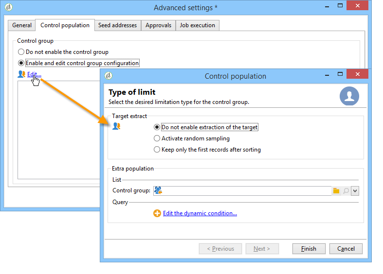
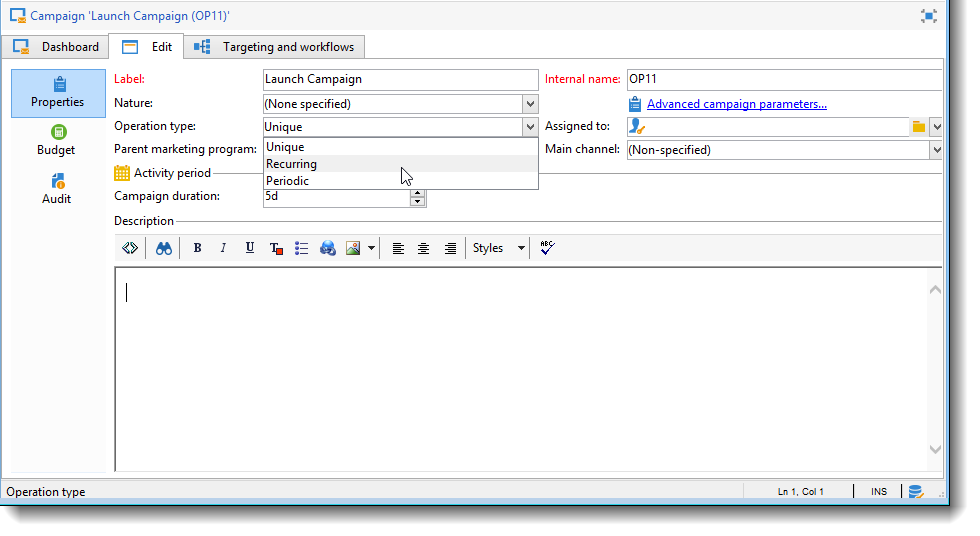

# Templates de campanha de marketing {#campaign-templates}

Campaign templates are centralized in the **[!UICONTROL Resources > Templates > Campaign templates]** node. Um template de parâmetro é fornecido como padrão. Ele permite criar uma nova campanha usando todos os módulos disponíveis (Documentos, tarefas, seed addresses, etc.), mas os módulos oferecidos dependem dos seus direitos e da configuração da plataforma Adobe Campaign.

## Criar ou duplicar um template de campanha {#creating-or-duplicating-a-campaign-template}

Para criar um novo template, execute as seguintes etapas:

1. Abra o **Gerenciador** de Campanha.
1. Em **Resources > Templates > Campaign templates**, clique em **New** na barra de ferramentas acima da lista de templates.

   

1. Insira o rótulo do seu novo template de campanha.
1. Clique em **Save** e abra seu template novamente.
1. Na guia **Edit**, insira o **Internal name** e outros valores, caso seja necessário.
1. Selecione **Advanced campaign settings** para adicionar um workflow ao seu template de campanha.

   

1. Altere o valor de **Targeting and workflows** para **Yes**.

   

1. Na guia **Targeting and workflows**, clique em **Add a workflow...**.

   

1. Complete o campo **Label** e clique em **Ok**.
1. Crie o workflow de acordo com suas necessidades.
1. Clique em **Save**. Agora, seu template está pronto para ser usado em uma campanha.

Você também pode duplicar o template padrão para reutilizar e adaptar a configuração.

As várias guias e subguias do template de campanha permitem que você acesse as configurações, descritas em [Configuração geral](#general-configuration).

## Configuração de um template de campanha {#configuring-a-campaign-template}

As campanhas são baseadas em templates que reúnem um conjunto de parâmetros predefinidos.

Em uma configuração padrão, os templates de campanha são centralizados no nó **[!UICONTROL Resources > Templates > Campaign templates]** da árvore do Adobe Campaign.

>[!NOTE]
>
>A árvore é exibida quando você clica no ícone **[!UICONTROL Explorer]** na página inicial.

Um template pronto para usar é fornecido para criar uma campanha para a qual nenhuma configuração específica foi definida. Você pode criar e configurar seus templates de campanha e, em seguida, criar campanhas a partir desses templates.

A criação e a configuração dos templates de campanha são apresentadas em [Templates de campanha](#campaign-templates).

Para obter mais informações sobre a criação da campanha, consulte o vídeo [Criação de uma campanha e de um e-mail](https://docs.adobe.com/content/help/en/campaign-classic-learn/tutorials/sending-messages/email-channel/creating-a-campaign-and-an-email.html).

## Configuração dos módulos disponíveis {#configuration-of-the-available-modules}

### Seleção do módulo {#module-selection}

The **[!UICONTROL Advanced campaign settings...]** link lets you enable and disable jobs for the campaigns based on this template. Selecione as funções que deseja habilitar nas campanhas criadas com base neste template.

Se uma funcionalidade não estiver selecionada, os elementos relativos ao processo (menus, ícones, opções, guias, subguias etc.) não aparecerão na interface do template ou em campanhas baseadas nesse template. As guias à esquerda dos detalhes da campanha geralmente coincidem com os processos selecionados no template. Por exemplo, se a opção **Expenses and objectives** não estiver selecionada, a guia correspondente a **[!UICONTROL Budget]** não será exibida em campanhas baseadas no template.

Além disso, os atalhos para as janelas de configuração são adicionados ao painel de campanha. Quando uma funcionalidade é habilitada, um link direto dá acesso a ela a partir do painel de campanha.

Por exemplo, com a configuração abaixo:

Os links a seguir são exibidos no painel de campanha (o link **[!UICONTROL Add a task]** está ausente):

As seguintes guias serão exibidas:

No entanto, com esse tipo de configuração:

Os links e as guias a seguir serão exibidos:

### Tipologia de módulos habilitados {#typology-of-enabled-modules}

* **Grupo de controle**

   Quando este módulo está selecionado, uma guia adicional é adicionada às configurações avançadas do template e às campanhas baseadas nesse template. A configuração pode ser definida por meio do template ou individualmente para cada campanha.

   

* **Seed addresses**

   Quando este módulo está selecionado, uma guia adicional é adicionada às configurações avançadas do template e às campanhas baseadas nesse template. A configuração pode ser definida por meio do template ou individualmente para cada campanha.

   

* **Documentos**

   Quando este módulo é selecionado, uma guia adicional é adicionada à guia **[!UICONTROL Edition]** do template e às campanhas baseadas nesse template. Os documentos anexados podem ser adicionados a partir do template ou individualmente para cada campanha.

   

* **Estrutura**

   Quando esse módulo é selecionado, uma subguia **[!UICONTROL Delivery outlines]** é adicionada à guia **[!UICONTROL Documents]** para definir delivery outlines para a campanha.

   

* **Construção do target e workflows**

   Quando você seleciona o módulo **[!UICONTROL Targeting and workflows]**, uma guia é adicionada para permitir que você crie um ou mais workflows para campanhas com base nesse template. Os workflows também podem ser configurados individualmente para cada campanha com base nesse template.

   

   Quando este módulo é habilitado, uma guia é adicionada às configurações avançadas da campanha para definir a sequência de execução do processo.

   

* **Aprovação**

   Se você selecionar a opção **[!UICONTROL Approval]**, será possível selecionar os processos a serem aprovados, assim como os operadores de aprovação.

   

* **Despesas e metas**

   Quando esse módulo é selecionado, uma guia **[!UICONTROL Budget]** é adicionada aos detalhes do template e às campanhas com base nesse template para que o orçamento associado possa ser selecionado.

   

### Aprovação de tarefas {#approval-of-jobs}

Você pode optar por habilitar ou não a aprovação do processo por meio da guia **[!UICONTROL Approvals]** da seção de configurações avançadas dos templates. As tarefas para as quais a aprovação é selecionada devem ser aprovadas para que o delivery de mensagens seja autorizado.

Você deve associar um operador de revisor ou grupo de operadores a cada aprovação habilitada.

## Configuração geral {#general-configuration}

### Propriedades do template {#template-properties}

Ao criar um template de campanha, você precisa inserir as seguintes informações:

* Insira o **rótulo** do template: este rótulo será atribuído por padrão para todas as campanhas criadas através deste template.
* Selecione a **natureza** da campanha na lista suspensa. Os valores disponíveis nesta lista são os que foram salvos na lista discriminada **[!UICONTROL natureOp]**.

   >[!NOTE]
   >
   >Para obter mais informações sobre enumerações, consulte a seção [Introdução](../../platform/using/managing-enumerations.md).

* Selecione o **tipo de campanha**: exclusiva, recorrente ou periódica. Por padrão, os templates de campanha se aplicam a campanhas exclusivas. As campanhas recorrentes e periódicas são detalhadas aqui: [Campanhas recorrentes e periódicas](../../campaign/using/setting-up-marketing-campaigns.md#recurring-and-periodic-campaigns).
* Especifique a duração da campanha, ou seja, o número de dias em que a campanha ocorrerá. Ao criar uma campanha com base nesse template, as datas de início e término da campanha serão preenchidas automaticamente.

   Se a campanha for recorrente, você deverá especificar as datas de início e término da campanha diretamente no template.

* Especifique o **programa relacionado** do template: campanhas baseadas neste template serão vinculadas ao programa selecionado.

### Parâmetros de execução do template {#template-execution-parameters}

The **[!UICONTROL Advanced campaign settings...]** link lets you configure the advanced options of the template for processing the delivery target (control group, seed addresses, etc.) e a configuração da medição da campanha e da execução do workflow.

## Programação reversa de campanha {#campaign-reverse-scheduling}

Você pode criar uma agenda reversa para uma campanha, por exemplo, para preparar um evento cuja data é conhecida antecipadamente. Os templates de campanha agora permitem calcular a data de início de uma tarefa com base na data de término de uma campanha.

Na caixa Configuração da tarefa, vá para a **[!UICONTROL Implementation schedule]** área e marque a **[!UICONTROL The start date is calculated based on the campaign end date]** caixa. (Aqui, &quot;start date&quot; é a data de início da tarefa). Vá para o campo **[!UICONTROL Start]** e insira um intervalo: a tarefa iniciará antes da data de término da campanha. Se você inserir um período mais longo do que a campanha deve durar, a tarefa começará antes da campanha.

Quando você cria uma campanha usando este template, a data de início da tarefa será calculada automaticamente. No entanto, você sempre pode alterá-lo mais tarde.
