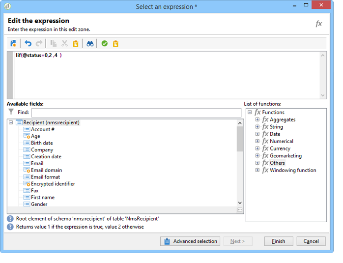

# Regras de pressão{#pressure-rules}

## Sobre fadiga da marca {#about-marketing-fatigue}

A implementação do gerenciamento de regras de pressão permite evitar o excesso de solicitações de população no banco de dados, também conhecido como fadiga da marca. Para fazer isso, você pode definir um número máximo de mensagens por recipient. Também permite implementar regras de arbitragem entre campanhas, para enviar a melhor mensagem para o público-alvo.

Regras de **pressão** para gerenciar a fadiga da marca, por exemplo: para restringir o número de cartas a serem enviadas a uma população, tanto para selecionar a comunicação que melhor corresponde aos interesses de um grupo de assinantes, quanto para evitar o envio de um SMS para um cliente insatisfeito etc.

As campanhas são selecionadas com base nos limites definidos e no peso da mensagem.

* Um limite é o número mais alto de deliveries autorizado para um determinado recipient dentro de um determinado período. Ele pode ser definido ou variável. Ele é definido ou calculado nas configurações da regra de tipologia. Consulte o número [máximo de mensagens](#maximum-number-of-messages).
* Os pesos do delivery permitem identificar deliveries de alta prioridade dentro da estrutura do gerenciamento de pressão. As mensagens com o peso mais alto têm prioridade. Consulte o peso da [mensagem](#message-weight).

A arbitragem consiste em garantir que campanhas agendadas com peso maior do que a campanha em andamento não gerem solicitações de perfil excessivas: se esse for o caso, o perfil será excluído do delivery.

Os critérios de arbitragem (peso e/ou limite da mensagem) podem variar com base em dois tipos de informações:

* preferência de recipient, que são informações declarativas: assinaturas de boletim informativo, status do recipient (cliente ou prospecto),
* comportamento do recipient: compras, links visitados etc.

A regra de arbitragem para definir mensagens qualificadas é aplicada durante o estágio de análise. Para cada destinatário e para o período em causa, a mensagem será enviada se a seguinte fórmula for verdadeira: **(número de mensagens enviadas) + (número de mensagens com maior peso) &lt; limite**.

Caso contrário, o destinatário será **[!UICONTROL Excluded by arbitration]**. Para mais informações, consulte [Exclusão após arbitragem](#exclusion-after-arbitration).

## Criação de uma regra de pressão {#creating-a-pressure-rule}

Para configurar arbitragem entre campanhas usando o Adobe Campaign, comece criando tipologias de campanha e definindo regras de tipologia vinculadas (regras de **Pressão** ).

To create and configure a **[!UICONTROL Pressure]** typology rule, apply the following steps:

1. In the list of campaign typology rules, click the **[!UICONTROL New]** icon above the list.

   

1. In the **[!UICONTROL General]** tab of the new rule, select a **Pressure** type rule and enter a name and description for it.

   

1. Altere a ordem de execução se necessário. When multiple typology rules are applied as a **[!UICONTROL Typology]** set, the lower ordered rules are applied first. For more on this, refer to [Execution order](../../campaign/using/applying-rules.md#execution-order).
1. In the **[!UICONTROL Calculation parameters]** section, define a frequency if you want to save targeting beyond the next daily re-arbitration execution. Para mais informações, consulte [Ajustar a frequência](../../campaign/using/applying-rules.md#adjusting-calculation-frequency)de cálculo.
1. Click the **[!UICONTROL Pressure]** tab and choose the calendar period during which the typology rule applies.

   

   A regra será aplicada aos deliveries cuja data de contato está incluída no período relacionado.

   >[!NOTE]
   >
   >Scheduled deliveries are only taken into account if the **[!UICONTROL Take the deliveries into account in the provisional calendar]** option is selected. For more on this, refer to [Setting the period](#setting-the-period).

1. Defina o método para calcular o número mais alto de mensagens.

   O limite representa o número mais alto de mensagens que podem ser enviadas para um recipient durante o período relacionado.

   Por padrão, o limite é constante e você precisa indicar um número máximo de mensagens autorizadas pela regra.

   

   To define a variable threshold, select the **[!UICONTROL Depends on the recipient]** value in the **[!UICONTROL Type of threshold]** field and use the icon on the right to open the expression editor.

   

   Para obter mais informações, consulte o número [máximo de mensagens](#maximum-number-of-messages).

1. Especifique o método para calcular o peso do delivery.

   Cada delivery tem um peso, ou seja, um valor que representa seu nível de prioridade: isso permite a arbitragem entre campanhas. Os pesos são calculados usando a fórmula definida na regra de tipologia e/ou em suas propriedades. For more on this, refer to [Message weight](#message-weight).

1. Por padrão, todas as mensagens são consideradas para o cálculo do limite. The **[!UICONTROL Restriction]** tab lets you filter the messages concerned by the typology rule:

   * A seção superior desta guia permite restringir os recipients relacionados.
   * A seção inferior desta guia permite que você filtre as mensagens a serem contadas.

      No exemplo a seguir, somente os recipients salvos na pasta **NewContacts** são considerados, sendo relacionados os deliveries que começam com **Newsletter**.
   

1. The **[!UICONTROL Typologies]** tab lets you view the campaign typologies which apply this rule or link the rule to one or more existing typologies. Para obter mais informações, consulte [Aplicação de tipologias](../../campaign/using/about-campaign-typologies.md#applying-typologies).

## Definindo limites e pesos {#defining-thresholds-and-weights}

### Número máximo de mensagens {#maximum-number-of-messages}

Cada regra de pressão define um limite, ou seja, o número máximo de mensagens que podem ser enviadas para um recipient em um determinado período de tempo. Depois que esse limite for atingido, não poderá ocorrer mais deliveries até que o final do período seja considerado. Esse processo permite que você exclua automaticamente um recipient de um delivery se uma mensagem exceder o limite definido, evitando assim um excesso de solicitações.

Os valores de limite podem ser constantes ou calculados por uma fórmula com variáveis. Isso significa que, para um determinado período, os limites podem variar de um recipient para outro ou até mesmo para o mesmo recipient.

>[!CAUTION]
>
>Inserir **0** como limite impede todos os deliveries ao público alvo durante o período considerado.

**Exemplo:**

Você pode indexar o número de mensagens autorizadas de acordo com o segmento ao qual pertence o recipient. Isso significa que um recipient pertencente ao segmento da Web pode receber mais mensagens do que outros recipients. An **[!UICONTROL Iif (@origin='Web', 5, 3)]** type formula authorizes the delivery of 5 messages to recipients and 3 for other segments. A configuração será a seguinte:

Para definir o limite, você pode usar uma dimensão vinculada à targeting dimension: por exemplo, para incluir mensagens enviadas aos perfis de recipients armazenados na tabela de visitantes (para saber mais sobre a tabela de visitantes, consulte [esta seção](../../web/using/use-case--creating-a-refer-a-friend-form.md)) ou para evitar o envio de mais de uma mensagem por semana para a mesma família de recipients, (o que pode significar vários endereços de email) identificada em uma dimensão vinculada aos recipients.

To do so, select the **[!UICONTROL Count messages on a linked dimension]** option, then select the visitor or the contact table.

### Peso da mensagem {#message-weight}

Cada delivery tem um peso que representa seu nível de prioridade. Por padrão, o peso de um delivery é definido como 5. As regras de pressão permitem definir o peso dos deliveries aos quais serão aplicados.

Os pesos podem ser definidos ou calculados por meio de uma fórmula para se adequar aos recipients. Por exemplo, você pode definir o peso de um delivery com base nos interesses do recipient.

>[!CAUTION]
>
>The weight defined in a typology rule can be overloaded individually for each delivery, in the **[!UICONTROL Properties]** tab. Click the **[!UICONTROL Typology]** tab to select the campaign typology and, if necessary, specify the weight to be applied.\
>No entanto, o peso declarado em uma regra de tipologia A não será usado para calcular uma regra de tipologia B: esse peso irá se referir apenas aos deliveries que usam a regra A.

**Exemplo:**

No exemplo a seguir, queremos vincular o peso das newsletters sobre música ao escore de propensão dos recipients. Para fazer isso:

1. Crie um novo campo para armazenar escores de propensão do recipient. O campo, **@Music** neste caso, será enriquecido com respostas de pesquisas e questionários on-line, dados de rastreamento coletados, etc.
1. Crie uma regra de tipologia para calcular o peso da mensagem com base nesse campo.

   

1. Aplique esta regra a mensagens com os seguintes tópicos: newsletters, ofertas especiais etc. O peso desses deliveries e, portanto, o nível de prioridade, dependerão do escore de propensão de cada recipient.

## Definindo o período {#setting-the-period}

As regras de pressão são definidas em períodos de **n** dias consecutivos.

The period is configured in the **[!UICONTROL Pressure]** tab of the rule. Você pode especificar o número de dias e, se necessário, selecionar o tipo de agrupamento a ser aplicado (dia, semana, mês, trimestre, etc.).

The grouping type lets you extend the **[!UICONTROL Period considered]** field to the whole day, calendar week, calendar month or calendar year for dates for the period.

Por exemplo, uma regra de pressão que define um limite de 2 mensagens por semana, com um agrupamento para cada mês, impedirá o delivery de mais de 2 mensagens na mesma semana E no mesmo mês. Aviso, se o período se sobrepõe dois meses, o limite de cálculo leva em consideração os deliveries desses dois meses e, portanto, poderá impedir todos os novos deliveries durante o segundo mês.

>[!NOTE]
>
>Por padrão, somente os deliveries já enviados são considerados ao calcular o limite. Check the **[!UICONTROL Take the deliveries into account in the provisional calendar]** option if you also want to consider the deliveries scheduled for the concerned period. Nesse caso, o período considerado é dobrado para permitir a integração de deliveries futuros, bem como os anteriores.\
>Para restringir os envios realizados em um período de duas semanas, é possível:
>
>* Enter **15d** in the **[!UICONTROL Concerned period]** field: deliveries sent up to two weeks before the date of the delivery which the rule is applied to will be taken into account in the calculation,
>
>  
ou
>
>* Digite **7d** no **[!UICONTROL Period considered]** campo E verifique a **[!UICONTROL Take the deliveries into account in the provisional calendar]**\
   >opção: as entregas enviadas até 7 dias antes da data de entrega e programadas até 7 dias após a data de entrega em que a regra é aplicada serão tidas em conta no cálculo.
>
>
A data de início do período depende de como o banco de dados está configurado.

Por exemplo, ao aplicar uma regra de pressão de 15 dias sem agrupar a um delivery com data 11/12, serão considerados os deliveries entre 27/11 e 12/12. Se a regra de pressão considerar os envios do calendário provisional, todas as programações entre 27/11 e 27/12 são consideradas. Por fim, ao configurar na regra um agrupamento por mês, todos os envios em novembro e dezembro são considerados para calcular o limite (de 01/11 a 31/12).

>[!CAUTION]
>
>**Casos frequentes**
>To make sure that deliveries for the current calendar week are not taken into account, as well as not to risk also taking into account those from the previous week for the calculation threshold, specify the **[!UICONTROL Period considered]** at &#39;0&#39; and select &#39;Grouping per calendar week&#39; as the **[!UICONTROL Period type]**.
> 
>Quando um período é maior que 0 (1 por exemplo), o limite de cálculo pode considerar os envios do dia anterior. Portanto, se o dia anterior corresponde à semana do calendário anterior e o tipo de período selecionado é o &#39;Agrupamento por semana do calendário&#39;, então toda a semana anterior é considerada para o limite de cálculo.

**Exemplo:**

Para criar uma regra de pressão que restringe a solicitação de 3 mensagens por período 2 semanas, com um agrupamento por mês do calendário.

São usados 6 boletins com o mesmo peso, programados para 30/05, 03/06, 08/06, 12/06, 22/06 e 30/06.

Os deliveries programados para os dias 12 e 30 de junho não podem ser realizados: o delivery de 12/06 excede o limite de 3 mensagens por período de 2 semanas e o delivery do dia 30 excede o limite de comunicações autorizadas por mês.

Todos os recipients desses envios são excluídos por arbitragem durante a fase de análise:

Para a mesma regra, ao agrupar os envios por trimestre, os recipients do **newsletter no.5** também devem ser excluídos e não podem ser enviados.

Finalmente, se nenhum agrupamento for selecionado, somente o **newsletter no.4** não pode ser enviado, já que foi programado para o mesmo período de 2 semanas que os três primeiros boletins.

>[!NOTE]
>
>Ao altera a definição de uma regra de tipologia, é possível criar uma **Simulation** para controlar o impacto sobre os envios aplicados e monitorar o impacto que os envios têm em cada um. For more on this, refer to [Campaign simulations](../../campaign/using/campaign-simulations.md).

## Exclusão após arbitragem {#exclusion-after-arbitration}

Arbitration is re-applied every night via the **[!UICONTROL Forecasting]** technical workflow and the **[!UICONTROL Campaign jobs]** workflow.

The **[!UICONTROL Forecasting]** workflow pre-calculates the data for the period in progress (from its start date to the current date), which lets typology rules be applied during the analysis. Também recalcula os contadores de exclusão para arbitragem a cada noite.

Assim, para cada recipient, o Adobe Campaign verifica se o número de mensagens que devem ser enviadas não excede o limite e assim considera todas as que já foram enviadas no período relacionado. Estas informações são um **indicador**, já que todos os cálculos são atualizados no momento do delivery.

Se esse número excede o limite, as regras de arbitragem definidas na tipologia de campanha são aplicadas e os recipients são excluídos das campanhas com um peso menor.

>[!NOTE]
>
>Se várias entregas alcançam pontuações iguais, a campanha programada para a data mais antiga é enviada.

## Casos de uso em regras de pressão {#use-cases-on-pressure-rules}

### Adaptar o limite com base no critério {#adapting-the-threshold-based-on-criterion}

Criaremos uma regra de tipologia para evitar o delivery de mais de 4 mensagens por semana para clientes e 2 mensagens por semana para prospectos.

To identify customers and prospects, use the **[!UICONTROL Status]** field, which contains 0 for prospects and 1 for customers.

Para criar a regra, aplique as seguintes etapas:

1. Crie uma nova regra de tipologia do tipo **Pressão**.
1. Edit the **[!UICONTROL Pressure]** tab: in the **[!UICONTROL Maximum number of messages]** section, we want to create a formula to calculate the threshold depending on each recipient. Selecione o **[!UICONTROL Depends on the recipient]** valor no **[!UICONTROL Threshold type]** campo e clique **[!UICONTROL Edit expression]** à direita do **[!UICONTROL Formula]** campo.

   Click the **[!UICONTROL Advanced parameters]** button to define the calculation formula.

   

1. Selecione a **[!UICONTROL Edit the formula using an expression]** opção e clique em **[!UICONTROL Next]**.

   

1. In the list of functions, double-click the **Iif** function in the **[!UICONTROL Others]** node.

   Then select the recipients&#39; **Status** in the **[!UICONTROL Available fields]** section.

   

   Informe a seguinte fórmula: **Iif(@status=0,2,4)**

   

   Essa fórmula permite atribuir o valor 2 se o status for igual a 0, e o valor 4 para todos os outros status.

   Clique em **[!UICONTROL Finish]** para aprovar a fórmula.

1. Indicar o período durante o qual a regra será aplicada: 7 dias nesse caso, para contar o número de mensagens por semana.

   

1. Salve a regra para aprovar a criação.

Agora vincule a regra que acabou de criar a um tipologia para aplicá-la aos deliveries. Para fazer isso:

1. Crie uma tipologia de campanha.
1. Go to the **[!UICONTROL Rules]** tab, click the **[!UICONTROL Add]** button and select the rule you have just created.

   

1. Salve a tipologia: ela será adicionada à lista de tipologias existentes.

To use this typology in your deliveries, select it in the delivery properties, in the **[!UICONTROL Typology]** tab as shown below:

>[!NOTE]
>
>A tipologia poderá ser definida no template de delivery para ser aplicada automaticamente a todos os deliveries criados usando esse template.

Durante a análise de delivery, os recipients do delivery são excluídos, se aplicável, dependendo do número de deliveries já enviados para eles. Para visualizar essas informações, você poderá:

* Visualizar o resultado da análise:

   

* Edite a entrega e clique na **[!UICONTROL Delivery]** guia e na **[!UICONTROL Exclusions]** subguia:

   

* Click the **[!UICONTROL Audit]** tab, then the **[!UICONTROL Causes of exclusions]** sub-tab to display the number of exclusions and the applied typology rules:

   

### Calculando o peso do delivery com base em comportamento {#calculating-the-delivery-weight-based-on-behavior}

Você pode definir regras de pressão com base no comportamento do recipient: assim, o peso de um delivery pode se adaptar a critérios que variam de um recipient a outro. Você pode decidir enviar uma mensagem dependendo se um recipient visitou o seu site de Internet, clicou em uma seção específica do último boletim informativo, se inscreveu em um serviço de informação ou até mesmo com base nas respostas de uma pesquisa, um jogo online etc.

No exemplo a seguir, um delivery com um peso de 5 é criado. Esse peso é melhorado com pontuações de propensão com base no comportamento do recipient: os clientes que já compraram neste site tem uma pontuação de 5, enquanto os clientes que nunca compraram online terão uma pontuação de 4.

Para executar esse tipo de configuração, é necessário usar uma fórmula para definir o peso da mensagem. As informações sobre pontuações de propensão e as respostas da pesquisa devem ser acessíveis no modelo de dados. No exemplo, o campo **Propensity** foi adicionado.

Aplique as seguintes etapas de configuração:

1. Crie uma nova regra de tipologia do tipo **Pressão**.
1. Edite a **[!UICONTROL Pressure]** guia. We want to create a threshold formula which will be based on each individual recipient: click the **[!UICONTROL Edit expression]** icon to the right of the **[!UICONTROL Weight formula]** field.

   

1. Por padrão, o valor **5** é mostrado na seção superior do editor de expressão. Queremos adicionar a pontuação de propensão de cada recipient a esse peso: coloque o cursor à direita do 5, insira o caractere **+** e selecione o campo **Propensity** .

   

1. Em seguida, adicione um valor maior para recipients que já fizeram uma compra. Para eles, o peso do delivery deverá ser aumentado em 5, enquanto para os outros o aumento será de somente 4.

   

1. Clique **[!UICONTROL Finish]** para salvar esta regra.
1. Vincule a regra a uma tipologia de campanha e faça referência a essa tipologia em um delivery para aprová-la.

### Enviando somente as mensagens com maior peso {#sending-only-the-highest-weighted-messages}

Você deseja enviar não mais do que 2 mensagens na mesma semana, com um limite de 2 mensagens por dia a cada um dos recipients, e você deseja que apenas as mensagens com pesos maiores sejam entregues.

Para fazer isso, é necessário agendar vários deliveries com pesos diferentes para o mesmo recipient e aplicar uma regra de pressão para excluir os deliveries com pesos menores.

Primeiro, configure a regra de pressão.

1. Criar uma regra de pressão. Para obter mais informações, consulte [Criação de uma regra](#creating-a-pressure-rule)de pressão.
1. Na **[!UICONTROL General]** guia, selecione a **[!UICONTROL Re-apply the rule at the start of personalization]** opção.

   

   This option overrules the value defined in the **[!UICONTROL Frequency]** field and automatically applies the rule during the personalization phase. Para mais informações, consulte [Ajustar a frequência](../../campaign/using/applying-rules.md#adjusting-calculation-frequency)de cálculo.

1. Na **[!UICONTROL Pressure]** guia, selecione **[!UICONTROL 7d]** como o **[!UICONTROL Period considered]** e **[!UICONTROL Grouping per day]** como o **[!UICONTROL Period type]**.
1. Selecione a **[!UICONTROL Take the deliveries into account in the provisional calendar]** opção para incluir as entregas programadas.

   

   São consideradas no cálculo os deliveries realizados até 7 dias antes da data de delivery e os programadas até 7 dias após a data de delivery. For more on this, refer to [Setting the period](#setting-the-period).

1. In the **[!UICONTROL Typologies]** tab, link the rule to a campaign typology.
1. Salve as alterações.

Agora, crie e configure um workflow para cada delivery em que a regra de pressão é aplicada.

1. Crie uma campanha. Para obter mais informações, consulte [esta seção](../../campaign/using/setting-up-marketing-campaigns.md#creating-a-campaign).
1. In the **[!UICONTROL Targeting and workflows]** tab of your campaign, add a **Query** activity to your workflow. Para obter mais informações sobre o uso dessa atividade, consulte [esta seção](../../workflow/using/query.md).
1. Add an **[!UICONTROL Email delivery]** activity to the workflow and open it. Para obter mais informações sobre o uso dessa atividade, consulte [esta seção](../../workflow/using/delivery.md).
1. Go to the **[!UICONTROL Approvals]** tab of the **[!UICONTROL Delivery properties]** and disable all approvals.

   

1. In the **[!UICONTROL Typology]** tab of the **[!UICONTROL Delivery properties]**, reference the campaign typology to apply the rule on. Defina um peso para o delivery.

   

1. Na entrega, clique **[!UICONTROL Scheduling]** e selecione **[!UICONTROL Schedule delivery (automatic execution when the scheduled date is reached)]**. Neste exemplo, selecione a **[!UICONTROL Use a calculation formula]** opção.
1. Defina a data de extração para 10 minutos (data atual + 10 minutos).
1. Defina a data de contato para o dia seguinte (data atual + 1 dia).

   

   Para implementar as exclusões da regra de pressão com êxito, certifique-se de definir a data e a hora da extração antes da data e hora do contato, assim como antes da arbitragem noturna ser reaplicada. Para mais informações, consulte [Exclusão após arbitragem](#exclusion-after-arbitration).

1. Desmarque a **[!UICONTROL Confirm the delivery before sending]** opção e salve as alterações.
1. Continue de forma semelhante para cada delivery que deve ser enviado. Certifique-se de definir o peso desejado para cada delivery.
1. Execute os workflows relevantes para preparar e realizar os envios.

Quando a arbitragem noturna for aplicada, os deliveries com os pesos menores para o mesmo recipient serão excluídos. Somente os deliveries com o peso mais alto serão considerados para envio. For more on this, refer to [Message weight](#message-weight).

Considerando que um email já tenha sido enviado aos recipients relacionados anteriormente durante a semana, a tabela abaixo mostra um exemplo das configurações que poderão ser aplicadas para duas entregas adicionais.

<table> 
 <thead> 
  <tr> 
   <th> Delivery  </th> 
   <th> Aprovações  </th> 
   <th> Peso  </th> 
   <th> Data/hora de Extração  </th> 
   <th> Data de contato  </th> 
   <th> Data/hora de início do Delivery  </th> 
   <th> Data/hora de execução do workflow de arbitragem  </th> 
   <th> Status do Delivery  </th> 
   <th> Delivery enviado (data/hora)  </th> 
  </tr> 
 </thead> 
 <tbody> 
  <tr> 
   <td> Delivery 1  </td> 
   <td> Desabilitado  </td> 
   <td> 5  </td> 
   <td> 15h00  </td> 
   <td> 8h (próximo dia)  </td> 
   <td> 14h  </td> 
   <td> Noturno  </td> 
   <td> Excluído  </td> 
   <td> Excluído  </td> 
  </tr> 
  <tr> 
   <td> Delivery 2  </td> 
   <td> Desabilitado  </td> 
   <td> 10  </td> 
   <td> 16h  </td> 
   <td> 9h (próximo dia)  </td> 
   <td> 14h  </td> 
   <td> Noturno  </td> 
   <td> Sent  </td> 
   <td> 9h (próximo dia)  </td> 
  </tr> 
 </tbody> 
</table>

Após a data de extração haver expirado para os dois deliveries, a arbitragem noturna será reaplicada antes das datas de contato de ambos os deliveries. Isso permite encontrar todos os deliveries já enviados (recipients para os quais um delivery é processado, registrado pelos logs amplos) ou agendados para ser enviados (recipients qualificados para receber um delivery, registrados pelos logs de previsão).

Depois que todos os deliveries enviados e potenciais tiverem sido listados para o período definido na regra de pressão, o Adobe Campaign os classificará por peso, com o maior valor em primeiro lugar. Quando o limite definido na regra de pressão for atingido (aqui, não mais do que 2 emails na mesma semana), os recipients serão excluídos do delivery.
