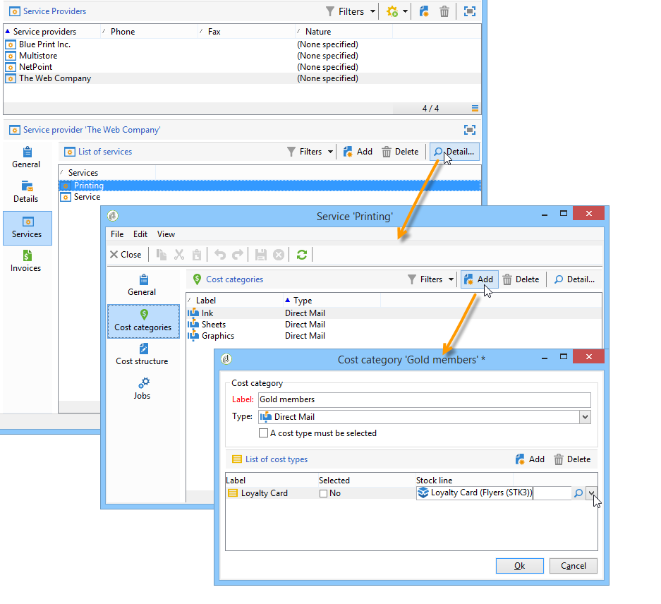

# Provedores, estoques e orçamentos{#providers-stocks-and-budgets}

O Adobe Campaign permite que você defina provedores de serviços que estarão envolvidos nas tarefas realizadas nas campanhas. As informações relacionadas aos provedores de serviços e as estruturas de custo relacionadas são definidas pelo administrador do Adobe Campaign a partir da visualização principal. O provedor de serviços é referenciado a partir do delivery e suas estruturas de custo permitem o cálculo de custos associados a esse delivery, bem como o gerenciamento do estoque.

## Criar provedores de serviços e estruturas de custo {#creating-service-providers-and-their-cost-structures}

Cada provedor de serviços é salvo em um arquivo com detalhes de contato, templates de serviço e tarefas relacionadas.

Service providers are configured in the **[!UICONTROL Administration > Campaign management]** node of the tree.

As tarefas realizadas durante as entregas são realizadas por provedores de serviços, especialmente para mala direta e canais móveis. Esses provedores de serviços podem, por exemplo, estar envolvidos na impressão ou distribuição de mensagens. Essas tarefas envolvem configurações e custos que são específicos para cada provedor de serviços. A configuração dos provedores de serviços envolve quatro estágios:

1. Criação de um provedor de serviços no Adobe Campaign

   See [Adding a service provider](#adding-a-service-provider).

1. Definindo categorias de custo e estruturas de templates de serviço associados

   Consulte [Definindo categorias](#defining-cost-categories) de custo e [Definindo a estrutura](#defining-the-cost-structure)de custo.

1. Configuração de processos

   See [Configuring processes associated with a service](#configuring-processes-associated-with-a-service).

1. Fazendo referência ao provedor de serviços no nível da campanha

   See [Associating a service with a campaign](#associating-a-service-with-a-campaign).

### Criar um provedor de serviços e categorias de custo {#creating-a-service-provider-and-its-cost-categories}

#### Adicionar um provedor de serviços {#adding-a-service-provider}

Você pode criar quantos provedores de serviços forem necessários para suas remessas. O procedimento para adicionar um provedor de serviços é o seguinte:

1. Right-click the list of service providers and select **[!UICONTROL New]**, or click the **[!UICONTROL New]** button above the list of service providers.
1. Na seção inferior da janela, especifique o nome e os detalhes de contato do provedor de serviços.

   

1. Click the **[!UICONTROL Save]** button to add the service provider to the list.

#### Definir categorias de custo {#defining-cost-categories}

Você deve associar templates de serviço a cada provedor de serviços. Nesses templates, você deve primeiro identificar as categorias de custo e se necessário o estoque em questão. Em seguida, você deve criar as regras de cálculo de custo para cada categoria, por meio das estruturas de custo.

>[!NOTE]
>
>Para obter mais informações, consulte [Definição da estrutura](#defining-the-cost-structure)de custo.

Uma categoria de custo é uma entidade que contém um conjunto de custos qualificados para um tipo de delivery (e-mail, mala direta, etc.) ou para uma tarefa. As categorias de custo são agrupadas nos templates de serviços associados aos provedores de serviço. Cada provedor de serviço pode referenciar um ou mais templates de serviço.

Para criar um template de serviço e definir seu conteúdo, aplique as seguintes etapas:

1. In the **[!UICONTROL Services]** tab of the service provider, click the **[!UICONTROL Add]** button and name the service template.

   

1. Crie as categorias de custo para cada tipo de processo (delivery por mala direta/e-mail/etc. ou tarefa). To do this, click the **[!UICONTROL Cost categories]** tab and then the **[!UICONTROL Add]** button, and enter the parameters of each cost category.

   

   * Enter a label for this cost category and select the type of process concerned: Delivery by **[!UICONTROL Direct mail]**, **[!UICONTROL E-mail]**, **[!UICONTROL Mobile]**, **[!UICONTROL Telephone]**, **[!UICONTROL Fax]** or **[!UICONTROL Task]**.
   * Click the **[!UICONTROL Add]** button to define the types of cost associated with this category.
   * Se necessário, associada a uma linha de estoque com cada tipo de custo para que as quantidades usadas sejam relacionadas automaticamente aos estoques existentes.

      >[!NOTE]
      >
      >The stock lines are defined in the **[!UICONTROL Stock management]** node.\
      >Para obter mais informações, consulte [Stock e gerenciamento](#stock-and-order-management)de pedidos.

1. Você pode pré-selecionar um valor para essa categoria de custo, que será oferecida por padrão nas categorias de custo do provedor de serviços (em vez de em branco). To do this, select the option in the **[!UICONTROL Selected]** column for the type of category concerned:

   

   No nível de delivery, o valor será selecionado por padrão:

   

### Definir a estrutura de custos {#defining-the-cost-structure}

Para cada tipo de custo, uma estrutura de custos especifica as regras de cálculo a serem aplicadas.

Click the **[!UICONTROL Cost structure]** tab to configure the cost calculation for each cost category and type. Click **[!UICONTROL Add]** and input the cost structure.

* Para criar a estrutura de custos, selecione o tipo de mensagem e a categoria de custo relacionada às listas suspensas, bem como o tipo de custo ao qual a regra de cálculo será aplicada. The content of these drop-down lists comes from the information entered via the **[!UICONTROL Cost categories]** tab.

   Você deve atribuir um rótulo à estrutura de custos. Por padrão, ele tem o seguinte contorno de entrega: Categoria **de custo - Tipo de custo**.

   You can, however, rename it: enter the desired value directly in the **[!UICONTROL Label]** field.

* A fórmula de cálculo de custo é definida na seção inferior da janela.

   Essa fórmula pode ser corrigida (para qualquer número de mensagens) ou calculadas de acordo com o número de mensagens.

   Quando depende do número de mensagens, a estrutura de cálculo de custo pode ser **[!UICONTROL Linear]**, **[!UICONTROL Linear by threshold]** ou **[!UICONTROL Constant by threshold]**.

#### Estrutura linear {#linear-structure}

If the amount is always the same for a message (or a batch of messages) irrespective of the total number of messages, select **[!UICONTROL Linear]** and enter the cost of each message.

If this amount applies to a batch of messages, specify the number of messages concerned in the **[!UICONTROL for]** field.

#### Estrutura linear por limite {#linear-structure-by-threshold}

If the amount applies by threshold for each message, you must define a **[!UICONTROL Linear by threshold]** calculation structure. Neste tipo de estrutura de custo, cada mensagem custará 0.13, por exemplo, se o número total de mensagens estiver entre 1 e 100, e custará 0.12 de 100 a 1000 mensagens enviadas ou 0.11 acima de 1000 mensagens.

A configuração será a seguinte:

To add a threshold, click the **[!UICONTROL Add]** button to the right of the list.

#### Estrutura constante por limite {#constant-structure-by-threshold}

Finalmente, você pode configurar um cálculo de custo de acordo com o número total de mensagens. Para fazer isso, selecione uma estrutura **[!UICONTROL Constant by threshold]** de cálculo. Por exemplo, o custo será definido em uma quantidade fixa de 12,00 para 1 a 100 mensagens, de 100,00 para um delivery de 101 a 1.000 mensagens e de 500,00 para qualquer delivery acima de 1.000 mensagens, independentemente do número total.

### Configurando processos associados com um serviço {#configuring-processes-associated-with-a-service}

You can associate information on the processes associated with the service via the **[!UICONTROL Processes]** tab.

To do this, click the **[!UICONTROL Processes]** tab to configure the sending of information to the router.

* The **[!UICONTROL File extraction]** section indicates the export template used for delivery when this service is selected. You can indicate the name of the output file in the **[!UICONTROL Extraction file]** field. O botão à direita do campo permite inserir variáveis.

   

* The **[!UICONTROL Notification e-mail]** section lets you specify the template to notify service providers after files have been sent. Selecione o template usado para criar a mensagem de alerta e o grupo de recipients.

   By default, delivery templates for notification messages are saved in the **[!UICONTROL Administration > Campaign management > Technical delivery templates]** node, which is accessible from the general view.

* The **[!UICONTROL Post-processing]** section lets you select the workflow to launch after the delivery has been approved. Se um template de workflow for inserido, uma instância de workflow será criada automaticamente e será iniciada assim que a aprovação entrar em vigor. Esse workflow pode enviar o arquivo de extração para um provedor de serviços externos para processamento, por exemplo.

### Associando um serviço a uma campanha {#associating-a-service-with-a-campaign}

Os serviços estão associados a campanhas via entregas ou tarefas. Os provedores de serviço estão vinculados a templates de delivery para oferecer seus serviços nos deliveries criados por meio desse template.

Quando um serviço é selecionado, as classes de custo correspondentes ao tipo de delivery (mala direta, e-mail etc.) são automaticamente indicadas na tabela central juntamente com as opções de processamento definidas.

>[!NOTE]
>
>Se nenhuma categoria de custo for exibida quando um serviço for selecionado, significa que nenhuma categoria de custo foi definida para esse tipo de processo. For example, for an email delivery, if no **[!UICONTROL E-mail]** type cost category has been defined, no category will be displayed, and selecting the service will have no effect.

* Para um delivery de mala direta, você pode selecionar o serviço na janela de configuração.

   

* Para um delivery em canais móveis, fax ou telefone, o mesmo modo de seleção é aplicável.
* For an email delivery, the service is selected from the **[!UICONTROL Advanced]** tab in the delivery properties, as in the following example:

   

The **[!UICONTROL Amount to surcharge]** column lets you add a cost for this category in the context of the delivery or task concerned.

Você pode impor a seleção obrigatória de um tipo de custo durante a definição de classes de custo para um delivery. Para fazer isso, selecione **[!UICONTROL A cost type must be selected]**.

## Gerenciamento de estoque e pedido {#stock-and-order-management}

Os tipos de custo podem ser associados a linhas de estoque para manipular alertas, controlar suprimentos e pedidos de lançamento.

O procedimento para configurar o estoque e o gerenciamento de pedidos no Adobe Campaign, e alertas os operadores no caso de fornecimentos insuficientes para um delivery a ser realizado, é o seguinte:

1. Criação de estoque e referência de provedores de serviços associados

   Consulte [Criação de um estoque](#creating-a-stock).

1. Adicionar linhas de estoque

   Consulte [Adicionar linhas](#adding-stock-lines)de estoque.

1. Notificar operadores no caso de um alerta

   Consulte Operadores [de](#alerting-operators)alertas.

1. Pedidos e fornecimento.

   Consulte [Pedidos](#orders).

### Gerenciamento de estoque {#stock-management}

O Adobe Campaign pode alertar um grupo de operadores se o estoque tiver executado ou atingir um limite mínimo. Stock levels are accessible via the **[!UICONTROL Stocks]** link of the **[!UICONTROL Campaigns]** universe via the **[!UICONTROL Other choices]** link of the navigation area.

#### Criar um estoque {#creating-a-stock}

Aplique as seguintes etapas para criar um novo estoque:

1. Click the **[!UICONTROL Create]** button above the list of stocks.
1. Insira o rótulo do estoque e selecione o provedor de serviços com o qual ele está associado na lista suspensa.

   

   >[!NOTE]
   >
   >Para obter mais informações, consulte [Criação de provedores de serviços e suas estruturas](#creating-service-providers-and-their-cost-structures)de custo.

#### Adicionar linhas de estoque {#adding-stock-lines}

Um estoque consiste em várias linhas de estoque. Uma linha de estoque contém uma quantidade inicial de recursos que serão consumidos pelas entregas. Cada linha de estoque indica a quantidade consumida, a quantidade em estoque e a quantidade solicitada.

When you create a stock, click the **[!UICONTROL Stock lines]** tab to add new lines.

Depois que o estoque for criado, clique nele para editar e usar seu painel para criar e exibir linhas de estoque.

Click the **[!UICONTROL Create]** button to define the stock parameters.

* Indicate the quantity initially in stock in the **[!UICONTROL Initial stock]** field. Os campos **[!UICONTROL Consumed]** e **[!UICONTROL In stock]** são calculados automaticamente e atualizados à medida que as campanhas avançam.

   

* Indicate the threshold from which operators should be alerted to order stock in the **[!UICONTROL Alert level]** field. Quando o nível de alerta for atingido, uma mensagem de aviso será exibida na janela de aprovação de remessas usando esse estoque.

#### Associar um estoque com categorias de custo {#associating-a-stock-with-cost-categories}

Para um determinado provedor de serviços, em um serviço, uma linha de estoque pode ser referenciada por uma das classes de custo, da seguinte maneira:

### Controle de estoque {#stock-tracking}

#### Operadores de alertas {#alerting-operators}

Um alerta é exibido quando um estoque referenciado em um delivery é insuficiente. Por exemplo, o alerta a seguir será exibido quando um arquivo de extração for aprovado:

#### Disposições {#orders}

The **[!UICONTROL Orders]** sub-tab lets you view current orders and save new orders.

To save an order, edit the targeted stock line, click the **[!UICONTROL Add]** button and specify the delivery date and the quantity ordered.

>[!NOTE]
>
>Once the delivery date is reached, the ordered stock line disappears automatically and the quantity entered in the **[!UICONTROL Volume on order]** field is added to the **[!UICONTROL Tracking]** tab. Essa quantidade é automaticamente adicionada ao volume de estoque.

The **[!UICONTROL Consumptions]** tab contains the volume consumed per campaign. As informações desta guia são inseridas automaticamente de acordo com as remessas realizadas. Click the **[!UICONTROL Edit]** button to open the campaign concerned.

## Calcular orçamentos {#calculating-budgets}

### Princípio {#principle}

Os custos são gerenciados para remessas e campanha. De acordo com o progresso, esses custos são alocados para os orçamentos.

Os custos de delivery de uma campanha são consolidados no nível da campanha, e os custos de todas as campanhas de um programa são passados para o programa com o qual estão associados. Relatórios dedicados permitem rastrear os orçamentos para toda a plataforma ou para cada plano e cada programa.

### Implementação {#implementation}

Em uma campanha, ao selecionar o orçamento, você deve inserir o valor inicial. Os custos calculados serão atualizados automaticamente de acordo com o nível de compromisso dos valores inseridos (despesas feitas, esperadas, reservadas e confirmadas). Consulte [Calculando valores](../../campaign/using/controlling-costs.md#calculating-amounts).

>[!NOTE]
>
>O procedimento para a criação de orçamentos é apresentado em [Criação de um orçamento](../../campaign/using/controlling-costs.md#creating-a-budget).

