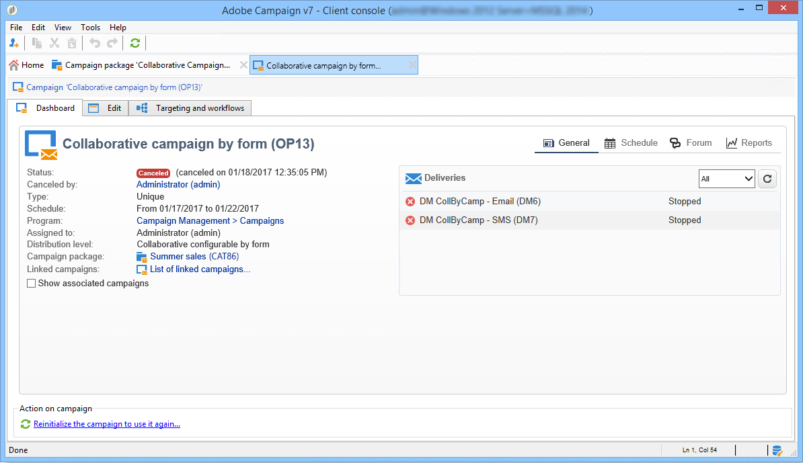

# Rastrear uma campanha{#tracking-a-campaign}

Os operadores de entidade central podem rastrear pedidos de campanha na lista de pacotes de campanha.

Isso permite:

* [Pacotes de filtro](#filter-packages),
* [Edição de pacotes](#edit-packages),
* [Cancelamento de um pacote](#cancel-a-package),
* [Reinicializar um pacote](#reinitializing-a-package).

## Pacotes de filtro {#filter-packages}

From the **[!UICONTROL Campaigns universe]**, you can display the list of **[!UICONTROL Campaign packages]** which regroups all existing Distributed Marketing campaigns. Você pode filtrar essa lista para que ela exiba somente as campanhas publicadas, atrasadas, pendentes de aprovação etc. Para fazer isso, clique nos links na seção superior desta exibição ou use o **[!UICONTROL Filter list]** link e selecione o status do pacote da campanha a ser exibido.

## Edição de pacotes {#edit-packages}

The **[!UICONTROL Campaign packages]** page lets you view the summary of each package.

Este resumo mostra as seguintes informações: rótulo, tipo de campanha, bem como o nome da campanha da qual foi criada e a pasta.

Clique no nome do pacote para editá-lo. Você também pode visualizar pedidos por suas entidades locais e pelo seus status.

This information is also offered in the **[!UICONTROL Campaign orders]** view which lists all orders.

O operador central pode editar o pedido. Há duas maneiras de fazer isso:

1. O operador pode clicar no nome do pedido para editá-lo: isso exibe os detalhes do pedido.

   

   The **[!UICONTROL Edit > General]** tab lets you view information entered by the local entity when it ordered the campaign.

   

1. O operador pode clicar no rótulo do pacote de campanha para editá-lo e alterar determinadas configurações.

   

## Cancelamento de um pacote {#cancel-a-package}

A entidade central pode cancelar um pacote de campanha a qualquer momento.

Clique **[!UICONTROL Cancel]** no pacote de campanha **[!UICONTROL Dashboard]**.

The **[!UICONTROL Comment]** field lets you justify the cancellation.

Para **campanhas locais**, cancelar um pacote o remove da lista de campanhas de marketing disponíveis.

Para **campanhas colaborativas**, cancelar um pacote inicia várias ações:

1. Quaisquer pedidos relacionados a este pacote serão cancelados,

   

1. A campanha de referência é cancelada e todos os processos ativos (workflows, deliveries) são interrompidos,

   

1. Uma notificação é enviada a todas as entidades locais relacionadas.

   

Os pacotes cancelados ainda podem ser acessados e reiniciados pela entidade central (veja abaixo) se necessário. Eles só serão oferecidas às entidades locais quando forem aprovados e iniciados. O processo de reinicialização de pacote é mostrado abaixo.

## Reinicializar um pacote {#reinitializing-a-package}

Os pacotes de campanha que já foram publicados podem ser reiniciados, modificados e disponibilizados às entidades locais.

1. Selecione o pacote desejado.
1. Clique no **[!UICONTROL Reinitialize the package to reuse it]** link e clique em **[!UICONTROL OK]**.

   

1. Click the **[!UICONTROL Save]** button to approve package re-initialization.

   

1. O status do pacote muda para **[!UICONTROL Being edited]**. Modifique, aprove e publique ele novamente para restaurá-lo na lista de pacotes de campanha.

>[!NOTE]
>
>Você também pode reinicializar pacotes de campanha cancelados.

