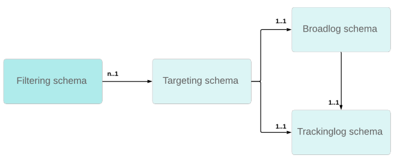

# Usar tabela de recipient personalizada{#about-custom-recipient-table}

Esta seção detalha os princípios para usar uma tabela de recipients não padrão.

Por padrão, o Adobe Campaign oferece uma tabela de recipients padrão à qual as funções e processos prontos para uso são vinculadas. A tabela de recipients padrão tem vários campos e tabelas predefinidos que podem ser facilmente estendidos usando uma tabela de extensão.

Se esse método de extensão oferecer boa flexibilidade para estender uma tabela, ele não permitirá a redução do número de campos ou links nela. Usar uma tabela não padrão ou &quot;tabela externa de destinatários&quot; permite maior flexibilidade, mas requer determinadas precauções ao implementá-la.

## Precisões {#precisions}

Essa funcionalidade permite que o Adobe Campaign processe dados de um banco de dados externo: esses dados serão usados como um conjunto de perfis para deliveries. A implementação desse processo envolve várias precisões que podem ser relevantes de acordo com as necessidades do cliente. Tal como:

* Nenhum fluxo de atualização de e para o banco de dados do Adobe Campaign: os dados desta tabela podem ser atualizados diretamente pelo mecanismo de banco de dados que os hospeda.
* Não há alterações nos processos que operam no banco de dados existente.
* Uso de um banco de dados de perfil com uma estrutura não padrão: possibilidade de delivery em perfis salvos em várias tabelas com várias estruturas, usando uma única instância.
* Nenhuma alteração ou manutenção necessária ao atualizar o banco de dados do Adobe Campaign.
* A tabela de recipients padrão é inútil se você não precisar da maioria dos campos da tabela ou se o template do banco de dados não estiver centralizado nos recipients.
* Para ser eficiente, uma tabela com alguns campos é necessária se você tiver um número significativo de perfis. A tabela de recipients padrão tem muitos campos para esse caso específico.

Esta seção descreve os pontos principais que permitem mapear tabelas existentes no Adobe Campaign e a configuração a ser aplicada para executar deliveries com base em qualquer tabela. Por fim, ele descreve como fornecer aos usuários interfaces de consulta tão práticas quanto aquelas disponíveis na tabela de recipients padrão. Para entender o material apresentado nesta seção, é necessário um bom conhecimento dos princípios de projeto de tela e de esquema.

## Recommendations e limitações {#recommendations-and-limitations}

O uso de uma tabela externa de recipient tem as seguintes limitações:

* O Adobe Campaign não oferece suporte a vários esquemas de recipient, conhecidos como esquemas de direcionamento, vinculados aos mesmos esquemas de broadlog e/ou de trackinglog. Caso contrário, isso pode levar a anomalias na reconciliação de dados posteriormente.

   O gráfico abaixo detalha a estrutura relacional necessária para cada schema de recipient personalizado:
   

   Recomendamos:

   * Dedicação da **[!UICONTROL nms:BroadLogRcp]** e **[!UICONTROL nms:TrackingLogRcp]** esquemas para pronto para uso **[!UICONTROL nms:Recipientschema]**. Essas duas tabelas de log não devem ser vinculadas a nenhuma tabela de recipient personalizada adicional.
   * Definir esquemas personalizados de broadlog e trackinglog dedicados para cada novo esquema de recipient personalizado. Isso pode ser feito automaticamente ao configurar o target mapping; consulte [Target mapping](../../configuration/using/target-mapping.md).

* Não é possível usar o padrão **[!UICONTROL Services and Subscriptions]** oferecido no produto.

   Isso significa que a operação geral é detalhada no [esta seção](../../delivery/using/managing-subscriptions.md) não é aplicável.

* O link com a variável **[!UICONTROL visitor]** tabela não funciona.

   Assim, para usar o **[!UICONTROL Social Marketing]** é necessário configurar a etapa de armazenamento para fazer referência à tabela correta.

   Da mesma forma, ao utilizar funções de referência, o modelo padrão de transferência inicial de mensagens deve ser adaptado.

* Não é possível adicionar perfis manualmente em uma lista.

   Por conseguinte, o procedimento descrito no [esta seção](../../platform/using/creating-and-managing-lists.md) não é aplicável sem uma configuração adicional.

   >[!NOTE]
   >
   >Ainda é possível criar listas de recipients usando workflows. Para obter mais informações, consulte [Criação de uma lista de perfis com base em um workflow](../../configuration/using/creating-a-profile-list-with-a-workflow.md).

Também recomendamos verificar os valores padrão usados nas diferentes configurações predefinidas: em função das funcionalidades utilizadas, devem ser efetuadas várias adaptações.

Por exemplo:

* Certos relatórios padrão, em especial os oferecidos por **Interação** e **Aplicativos móveis** tem de ser redesenvolvido. Consulte a [Gerenciamento de relatórios](../../configuration/using/managing-reports.md) seção.
* As configurações padrão para determinadas atividades de workflow fazem referência à tabela de recipients padrão (**[!UICONTROL nms:recipient]**): essas configurações devem ser alteradas quando usadas para uma tabela de recipients externos. Consulte a [Gerenciamento de fluxos de trabalho](../../configuration/using/managing-workflows.md) seção.
* O padrão **[!UICONTROL Unsubscription link]** o bloco de personalização deve ser adaptado.
* O target mapping dos templates de delivery padrão deve ser modificado.
* Os formulários V4 não são compatíveis para uso com uma tabela de recipients externos: você deve usar as aplicações web.
