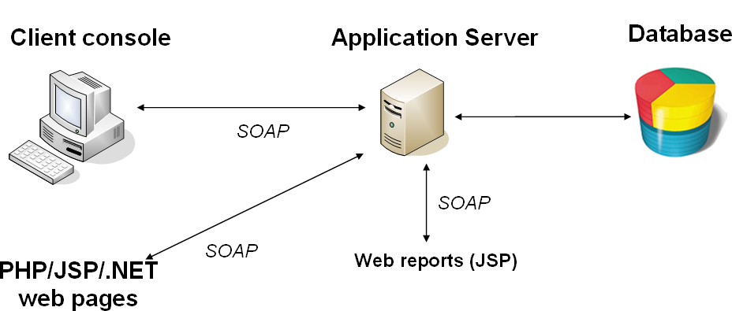

# Sobre serviços da Web{#about-web-services}


## Definição de APIs do Adobe Campaign {#definition-of-adobe-campaign-apis}

O servidor de aplicativos Adobe Campaign foi projetado para oferecer abertura e integração fácil com sistemas de informações de empresas cada vez mais diversos e complexos.

As APIs do Adobe Campaign são usadas em JavaScript no aplicativo e em SOAP fora dele. Eles compõem uma biblioteca de funções genéricas que podem ser enriquecidas. Para obter mais informações, consulte [Implementação de métodos SOAP](../../configuration/using/implementing-soap-methods.md).

>[!IMPORTANT]
>
>O número de chamadas de mecanismo autorizadas por dia varia de acordo com seu contrato de licença. Para obter mais informações, consulte [esta página](https://helpx.adobe.com/br/legal/product-descriptions/adobe-campaign-classic---product-description.html).\
>Uma lista de todas as APIs, incluindo sua descrição completa, está disponível em [esta documentação dedicada](https://experienceleague.adobe.com/developer/campaign-api/api/index.html).

## Pré-requisitos {#prerequisites}

Antes de usar as APIs do Adobe Campaign, você precisa conhecer os seguintes tópicos:

* Javascript
* Protocolo SOAP
* Modelo de dados do Adobe Campaign

## Uso de APIs do Adobe Campaign {#using-adobe-campaign-apis}

O Adobe Campaign usa dois tipos de APIs:

* APIs genéricas de acesso aos dados para consultar os dados do modelo de dados. Consulte [APIs orientadas a dados](../../configuration/using/data-oriented-apis.md).
* APIs específicas de negócios que permitem agir em cada objeto: deliveries, workflows, subscrições etc. Consulte [APIs direcionadas para empresas](../../configuration/using/business-oriented-apis.md).

Para desenvolver APIs e interagir com o Adobe Campaign, é necessário conhecer seu modelo de dados. O Adobe Campaign permite gerar uma descrição completa da base. Consulte [Descrição do modelo](../../configuration/using/data-oriented-apis.md#description-of-the-model).

## Chamadas SOAP {#soap-calls}

O protocolo SOAP permite invocar métodos de API, por meio do cliente avançado, aplicativos de terceiros usando serviços da Web ou JSP usando esses métodos nativamente.



A estrutura de uma mensagem SOAP é a seguinte:

* um envelope que define a estrutura da mensagem,
* um cabeçalho opcional,
* um corpo contendo as informações sobre a chamada e a resposta,
* gerenciamento de erros que define a condição de erro.

## Recursos e intercâmbios {#resources-and-exchanges}

O schema a seguir mostra os vários recursos envolvidos no uso de APIs do Adobe Campaign:


## Exemplo de mensagem SOAP no método &#39;ExecuteQuery&#39; {#example-of-a-soap-message-on-the--executequery--method--}

Neste exemplo, uma consulta SOAP chama o método &quot;ExecuteQuery&quot;, que utiliza uma cadeia de caracteres como parâmetro para autenticação (token de sessão) e um conteúdo XML para a descrição da consulta a ser executada.

Para obter mais informações, consulte [ExecuteQuery (xtk:queryDef)](../../configuration/using/data-oriented-apis.md#executequery--xtk-querydef-).

>[!NOTE]
>
>A descrição WSDL desse serviço é concluída no exemplo mostrado aqui: [Descrição do serviço Web: WSDL](../../configuration/using/web-service-calls.md#web-service-description--wsdl).

### Consulta SOAP {#soap-query}

```
<?xml version='1.0' encoding='ISO-8859-1'?>
  <SOAP-ENV:Envelope xmlns:xsd='http://www.w3.org/2001/XMLSchema' xmlns:xsi='http://www.w3.org/2001/XMLSchema-instance' xmlns:ns='http://xml.apache.org/xml-soap' xmlns:SOAP-ENV='http://schemas.xmlsoap.org/soap/envelope/'>
    <SOAP-ENV:Body>
      <ExecuteQuery xmlns='urn:xtk:queryDef' SOAP-ENV:encodingStyle='http://schemas.xmlsoap.org/soap/encoding/'>
        <__sessiontoken xsi:type='xsd:string'/>
        <entity xsi:type='ns:Element' SOAP-ENV:encodingStyle='http://xml.apache.org/xml-soap/literalxml'>
          <queryDef firstRows="true" lineCount="200" operation="select" schema="nms:rcpGrpRel" startLine="0" startPath="/" xtkschema="xtk:queryDef">
          ...
          </queryDef>
        </entity>
      </ExecuteQuery>
  </SOAP-ENV:Body>
</SOAP-ENV:Envelope>
```

O `<soap-env:envelope>` é o primeiro elemento da mensagem que representa o envelope SOAP.

O `<soap-env:body>` é o primeiro elemento filho do envelope. Ele contém a descrição da mensagem, ou seja, o conteúdo da query ou da resposta.

O método a ser chamado é inserido na variável `<executequery>` elemento do corpo da mensagem SOAP.

No SOAP, os parâmetros são reconhecidos por ordem de aparência. O primeiro parâmetro, `<__sessiontoken>`, pega a cadeia de autenticação, o segundo parâmetro é a descrição XML do query do `<querydef>` elemento.

### Resposta SOAP {#soap-response}

```
<?xml version='1.0' encoding='ISO-8859-1'?>
  <SOAP-ENV:Envelope xmlns:xsd='http://www.w3.org/2001/XMLSchema' xmlns:xsi='http://www.w3.org/2001/XMLSchema-instance' xmlns:ns='http://xml.apache.org/xml-soap' xmlns:SOAP-ENV='http://schemas.xmlsoap.org/soap/envelope/'>
    <SOAP-ENV:Body>
      <ExecuteQueryResponse xmlns='urn:xtk:queryDef' SOAP-ENV:encodingStyle='http://schemas.xmlsoap.org/soap/encoding/'>
        <pdomOutput xsi:type='ns:Element' SOAP-ENV:encodingStyle='http://xml.apache.org/xml-soap/literalxml'>
          <rcpGrpRel-collection><rcpGrpRel group-id="1872" recipient-id="1362"></rcpGrpRel></rcpGrpRel-collection>
        </pdomOutput>
      </ExecuteQueryResponse>
    </SOAP-ENV:Body>
</SOAP-ENV:Envelope>
```

O resultado do query é inserido do `<pdomoutput>` elemento.

## Gerenciamento de erros {#error-management}

Exemplo de resposta de erro SOAP:

```
<?xml version='1.0' encoding='ISO-8859-1'?>
<SOAP-ENV:Envelope xmlns:SOAP-ENV='http://schemas.xmlsoap.org/soap/envelope/'>
  <SOAP-ENV:Body>
    <SOAP-ENV:Fault>
      <faultcode>SOAP-ENV:Server</faultcode>
      <faultstring>Error while executing 'Write' of the 'xtk:persist'.</faultstring> service
      <detail>ODBC error: [Microsoft][ODBC SQL Server Driver][SQL Server]Cannot insert duplicate key row in object 'XtkOption' with unique index 'XtkOption_name'. SQLSTate: 23000
ODBC error: [Microsoft][ODBC SQL Server Driver][SQL Server]The statement has been terminated. SQLSTate: 01000 Cannot save the 'Options (xtk:option)' document </detail>
    </SOAP-ENV:Fault>
  </SOAP-ENV:Body>
</SOAP-ENV:Envelope>
```

O `<soap-env:fault>` O elemento no corpo da mensagem SOAP é usado para transmitir os sinais de erro que surgem durante o processamento do serviço da Web. É composto pelos seguintes subelementos:

* `<faultcode>` : indica o tipo de erro. Os tipos de erro são:

   * &quot;VersionMismatch&quot; em caso de incompatibilidade com a versão SOAP usada,
   * &quot;mustUnderstand&quot; no caso de um problema no cabeçalho da mensagem,
   * &quot;Cliente&quot; caso falte algumas informações ao cliente,
   * &quot;Servidor&quot; caso o servidor tenha um problema ao executar o processamento.

* `<faultstring>` : mensagem descrevendo o erro
* `<detail>` : mensagem de erro longa

O sucesso ou falha da invocação do serviço é identificado quando a variável `<faultcode>` é verificado.

>[!IMPORTANT]
>
>Todos os serviços da Web da Adobe Campaign lidam com erros. Portanto, é altamente recomendável testar cada chamada para lidar com erros retornados.

Exemplo de tratamento de erros em C#:

```
try 
{
  // Invocation of method
  ...
}
catch (SoapException e)
{
  System.Console.WriteLine("Soap exception: " + e.Message);        
  if (e.Detail != null)
    System.Console.WriteLine(e.Detail.InnerText);
}
```

## URL do servidor de serviço Web (ou EndPoint) {#url-of-web-service-server--or-endpoint-}

Para enviar o serviço da Web, o servidor Adobe Campaign que implementa o método de serviço correspondente deve ser contatado.

O URL do servidor é o seguinte:

https://serverName/nl/jsp/soaprouter.jsp

Com **`<server>`** o servidor de aplicativos Adobe Campaign (**nlserver web**).
