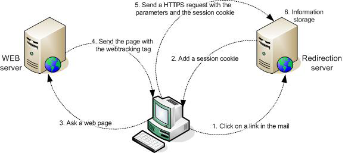

# Sobre o rastreamento Web{#about-web-tracking}

Além do rastreamento padrão, que mostra o comportamento de um usuário da Internet ao clicar em um link em uma mensagem de email, a plataforma do Adobe Campaign permite coletar informações sobre como os usuários da Internet navegam em seu site. Essa coleta de dados é executada pelo módulo de rastreamento web.

Quando um usuário da Internet clica em um link rastreado em um email de um determinado delivery, o servidor de redirecionamento contatado deposita um cookie de sessão contendo o identificador de broadlog (broadlogId) e o identificador de delivery (deliveryId).

O cliente Web envia esse cookie ao servidor sempre que o usuário visita uma página contendo uma tag de rastreamento Web. Isso continua durante toda a sessão, ou seja, até que o cliente da Web seja fechado.

O servidor de redirecionamento coleta os seguintes dados dessa maneira:

* URL da página visualizada, por meio de um identificador enviado como um parâmetro,
* o delivery do qual a página da Web foi visitada, por meio do cookie de sessão,
* identificador do usuário da Internet que clicou, por meio do cookie de sessão,
* informações adicionais, como o volume de negócios gerado.

O diagrama a seguir mostra os estágios da caixa de diálogo entre o cliente e os vários servidores.

