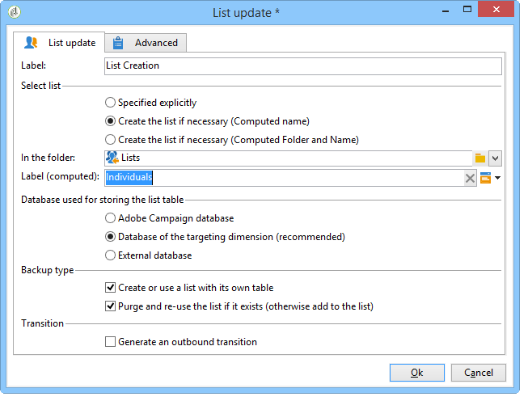

# Criação de uma lista de perfis com base em um fluxo de trabalho{#creating-a-profile-list-with-a-workflow}

Para criar uma lista do tipo **[!UICONTROL List]** com base na nova tabela de destinatários, é necessário criar um fluxo de trabalho de direcionamento que gerará a lista.

Para obter mais informações sobre listas no Campaign, consulte [esta seção](../../platform/using/creating-and-managing-lists.md#about-lists-in-adobe-campaign).

 [Conheça este recurso no vídeo](../../platform/using/creating-and-managing-lists.md#create-list-in-a-wf-video)

Para criar um workflow de direcionamento e atualizar recipients em uma tabela de recipients personalizada, siga as etapas abaixo:

1. Vá para o nó **[!UICONTROL Profiles and Targets > Jobs > Targeting workflows]** do explorador.
1. Criação de um novo fluxo de trabalho de segmentação
1. Coloque uma atividade **Query** seguida por uma atividade **List update**.

   

1. Clique duas vezes na atividade **Query** e clique em **[!UICONTROL Edit the query]** para escolher um targeting dimension com base no esquema da nova tabela de recipients (em nosso exemplo: **Individual**). Clique em **[!UICONTROL Finish]** para confirmar.

   

1. Clique duas vezes na atividade **List update** e selecione o botão de opção **[!UICONTROL Create the list if necessary (Computed name)]**.

   

1. Selecione a pasta de criação para a nova lista.
1. Execute o workflow para criar a lista.
1. Exiba o resultado no nó da árvore que você selecionou durante a atividade **[!UICONTROL List update]**.

   O painel especifica o esquema no qual a lista se baseia, conforme mostrado abaixo:

   
