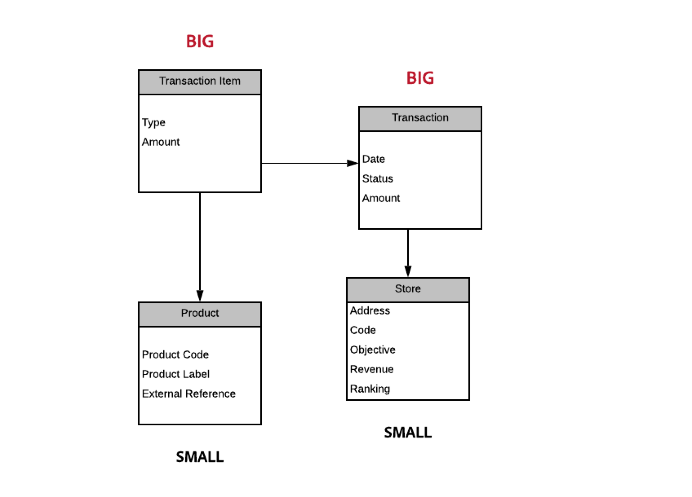

# Práticas recomendadas do modelo de dados{#data-model-best-practices}

Este documento descreve as principais recomendações ao projetar o modelo de dados do Adobe Campaign.

Para obter uma melhor compreensão das tabelas integradas do Campaign e sua interação, consulte [esta seção](../../configuration/using/about-data-model.md) seção.

Leia [esta documentação](../../configuration/using/about-schema-reference.md) para começar a usar os esquemas do Campaign. Saiba como configurar schemas de extensão para estender o modelo de dados conceituais do banco de dados do Adobe Campaign em [este documento](../../configuration/using/about-schema-edition.md).

## Visão geral {#overview}

O sistema Adobe Campaign é extremamente flexível e pode ser estendido além da implementação inicial. No entanto, embora as possibilidades sejam infinitas, é fundamental tomar decisões sábias e criar bases fortes para começar a projetar seu modelo de dados.

Este documento fornece casos de uso comuns e práticas recomendadas para aprender como arquitetar apropriadamente sua ferramenta Adobe Campaign.

## Arquitetura do modelo de dados {#data-model-architecture}

O Adobe Campaign é um poderoso sistema de gerenciamento de campanhas em vários canais que pode ajudar você a alinhar suas estratégias online e offline para criar experiências personalizadas de clientes.

### Abordagem centrada no cliente {#customer-centric-approach}

Embora a maioria dos provedores de serviços de email esteja se comunicando com os clientes por meio de uma abordagem centrada em listas, o Adobe Campaign depende de um banco de dados relacional para aproveitar uma visão mais ampla dos clientes e seus atributos.

Essa abordagem centrada no cliente é mostrada no gráfico abaixo. O **Recipient** tabela em cinza representa a tabela principal do cliente em torno da qual tudo está sendo criado:

Para acessar a descrição de cada tabela, acesse **[!UICONTROL Admin > Configuration > Data schemas]**, selecione um recurso na lista e clique no botão **[!UICONTROL Documentation]** guia .

O modelo de dados padrão do Adobe Campaign é apresentado em [este documento](../../configuration/using/data-model-description.md).

>[!NOTE]
>
>O Adobe Campaign Classic permite criar uma tabela de cliente personalizada. No entanto, na maioria dos casos, é recomendável aproveitar o padrão [Tabela de recipients](../../configuration/using/about-data-model.md#default-recipient-table) que já tem tabelas e recursos adicionais pré-criados.

### Dados do Adobe Campaign {#data-for-campaign}

Quais dados devem ser enviados para o Adobe Campaign? É importante determinar os dados necessários para suas atividades de marketing.

>[!NOTE]
>
>O Adobe Campaign não é um data warehouse nem uma ferramenta de relatórios. Portanto, não tente importar todos os clientes possíveis e suas informações associadas para o Adobe Campaign ou importe dados que serão usados apenas para criar relatórios.

Para decidir se um atributo seria necessário ou não no Adobe Campaign, pergunte a si mesmo se ele se enquadra em uma dessas categorias:

* Atributo usado para **segmentação**
* Atributo usado para **processos de gestão de dados** (cálculo agregado, por exemplo)
* Atributo usado para **personalização**

Se não estiver caindo em nenhum desses, você provavelmente não precisará desse atributo no Adobe Campaign.

### Escolha dos tipos de dados {#data-types}

Para garantir uma boa arquitetura e o desempenho do sistema, siga as práticas recomendadas abaixo para configurar os dados no Adobe Campaign.

* Uma tabela grande deve ter principalmente campos numéricos e conter links para tabelas de referência (ao trabalhar com a lista de valores).
* O **expr** permite definir um atributo de schema como um campo calculado em vez de um valor de conjunto físico em uma tabela. Isso pode permitir o acesso a informações em um formato diferente (como idade e data de nascimento, por exemplo) sem a necessidade de armazenar ambos os valores. Essa é uma boa maneira de evitar a duplicação de campos. Por exemplo, a tabela Recipient usa uma expressão para o domínio, que já está presente no campo de email.
* No entanto, quando o cálculo da expressão é complexo, não é recomendável usar a variável **expr** como cálculo dinâmico pode afetar o desempenho de suas consultas.
* O **XML** é uma boa maneira de evitar a criação de muitos campos. Mas também ocupa espaço em disco, pois usa uma coluna CLOB no banco de dados. Também pode levar a queries SQL complexos e afetar o desempenho.
* O comprimento de um **string** deve ser sempre definido com a coluna . Por padrão, o comprimento máximo no Adobe Campaign é 255, mas o Adobe recomenda manter o campo mais curto se você já souber que o tamanho não excederá um comprimento menor.
* É aceitável ter um campo menor no Adobe Campaign do que no sistema de origem se você tiver certeza de que o tamanho no sistema de origem foi superestimado e não seria atingido. Isso pode significar uma string menor ou um número inteiro menor no Adobe Campaign.

### Escolha dos campos {#choice-of-fields}

Um campo precisa ser armazenado em uma tabela se tiver uma finalidade de direcionamento ou personalização. Em outras palavras, se um campo não for usado para enviar um email personalizado ou como um critério em uma query, ele ocupará espaço em disco, enquanto será inútil.

Para instâncias híbridas e no local, o FDA (Federated Data Access, um recurso opcional que permite acessar dados externos) cobre a necessidade de adicionar um campo &quot;instantaneamente&quot; durante um processo de campanha. Você não precisa importar tudo se tiver FDA. Para obter mais informações, consulte [Sobre o Federated Data Access](../../installation/using/about-fda.md).

### Escolha de chaves {#choice-of-keys}

Além do **autopk** definido por padrão na maioria das tabelas, você deve considerar adicionar algumas chaves lógicas ou comerciais (número de conta, número de cliente e assim por diante). Ele pode ser usado posteriormente para importações/reconciliação ou pacotes de dados. Para obter mais informações, consulte [Identificadores](#identifiers).

Chaves eficientes são essenciais para o desempenho. Os tipos de dados numéricos devem sempre ser preferidos como chaves para tabelas.

Para o banco de dados do SQLServer, você pode considerar o uso de &quot;índice clusterizado&quot; se o desempenho for necessário. Como o Adobe não lida com isso, é necessário criá-lo no SQL.

### Espaços de tabela dedicados {#dedicated-tablespaces}

O atributo tablespace no schema permite especificar um tablespace dedicado para uma tabela.

O assistente de instalação permite armazenar objetos por tipo (dados, temporários e índice).

Os tablespaces dedicados são melhores para particionamento, regras de segurança e permitem administração fluida e flexível, melhor otimização e desempenho.

## Identificadores {#identifiers}

Os recursos do Adobe Campaign têm três identificadores e é possível adicionar um identificador adicional.

A tabela a seguir descreve esses identificadores e sua finalidade.

| Identifier | Descrição | Práticas recomendadas |
|--- |--- |--- |
| ID | <ul><li>A id é a chave primária física de uma tabela do Adobe Campaign. Para tabelas prontas para uso, é um número gerado de 32 bits de uma sequência</li><li>Normalmente, esse identificador é exclusivo de uma instância específica do Adobe Campaign. </li><li>Uma id gerada automaticamente pode ser visível em uma definição de esquema. Pesquise no *autopk=&quot;true&quot;* atributo.</li></ul> | <ul><li>Os identificadores gerados automaticamente não devem ser usados como referência em um workflow ou em uma definição de pacote.</li><li>Não se deve partir do princípio de que o auxílio será sempre um número crescente.</li><li>A id em uma tabela pronta para uso é um número de 32 bits e esse tipo não deve ser alterado. Esse número é retirado de uma &quot;sequência&quot; coberta na seção com o mesmo nome.</li></ul> |
| Nome (ou nome interno) | <ul><li>Essas informações são um identificador exclusivo de um registro em uma tabela. Esse valor pode ser atualizado manualmente, geralmente com um nome gerado.</li><li>Esse identificador mantém seu valor quando implantado em uma instância diferente do Adobe Campaign e não deve estar vazio.</li></ul> | <ul><li>Renomeie o nome do registro gerado pelo Adobe Campaign se o objeto for implantado de um ambiente para outro.</li><li>Quando um objeto tem um atributo de namespace (*schema* por exemplo), esse namespace comum será aproveitado em todos os objetos personalizados criados. Alguns namespaces reservados não devem ser usados: *nms*, *xtk*, *nl*, *ncl*, *crm*, *xxl*.</li><li>Quando um objeto não tem namespace (*workflow* ou *delivery* por exemplo), essa noção de namespace seria adicionada como um prefixo de um objeto de nome interno: *namespaceMyObjectName*.</li><li>Não use caracteres especiais, como espaço &quot;&quot;, semircoluna &quot;:&quot; ou hífen &quot;-&quot;. Todos esses caracteres seriam substituídos por um sublinhado &quot;_&quot; (caractere permitido). Por exemplo, &quot;abc-def&quot; e &quot;abc:def&quot; seriam armazenadas como &quot;abc_def&quot; e se substituiriam.</li></ul> |
| Rótulo | <ul><li>O rótulo é o identificador comercial de um objeto ou registro no Adobe Campaign.</li><li>Esse objeto permite espaços e caracteres especiais.</li><li>Não garante a singularidade de um registro.</li></ul> | <ul><li>É recomendável determinar uma estrutura para seus rótulos de objetos.</li><li>Essa é a solução mais fácil de usar para identificar um registro ou objeto para um usuário do Adobe Campaign.</li></ul> |

## Chaves internas personalizadas {#custom-internal-keys}

As chaves primárias são necessárias para cada tabela criada no Adobe Campaign.

A maioria das organizações está importando registros de sistemas externos. Embora a chave física da tabela Recipient seja o atributo &quot;id&quot;, é possível determinar uma chave personalizada além disso.

Essa chave personalizada é a chave primária de registro real no sistema externo que alimenta o Adobe Campaign.

Quando uma tabela pronta para uso tiver um autopk e uma chave interna, a chave interna será definida como um índice exclusivo na tabela do banco de dados físico.

Ao criar uma tabela personalizada, você tem duas opções:
* Uma combinação de chave gerada automaticamente (id) e chave interna (personalizada). Essa opção é interessante se a chave do sistema for uma chave composta ou não um inteiro. Os inteiros fornecerão desempenho mais alto em grandes tabelas e unirão a outras tabelas.
* Usar a chave primária como a chave primária do sistema externo. Essa solução geralmente é preferida, pois simplifica a abordagem para importar e exportar dados, com uma chave consistente entre diferentes sistemas. A opção Autopk deve ser desativada se a chave for chamada de &quot;id&quot; e se espera que seja preenchida com valores externos (não gerado automaticamente).

>[!IMPORTANT]
>
>Um autopk não deve ser usado como referência em workflows.

## Sequências {#sequences}

A chave primária do Adobe Campaign é uma id gerada automaticamente para todas as tabelas prontas para uso e pode ser a mesma para tabelas personalizadas. Para obter mais informações, consulte [esta seção](#identifiers).

Esse valor é obtido do que é chamado de **sequência**, que é um objeto de banco de dados usado para gerar uma sequência numérica.

Há dois tipos de sequências:
* **Compartilhado**: mais de uma tabela escolheria a id da mesma sequência. Isso significa que se um ID &#39;X&#39; for usado por uma tabela, nenhuma outra tabela que compartilhe a mesma sequência teria um registro com esse ID &#39;X&#39;. **XtkNewId** é a sequência compartilhada padrão disponível no Adobe Campaign.
* **Dedicado**: somente uma tabela está escolhendo suas ids da sequência. O nome da sequência normalmente contém o nome da tabela.

>[!IMPORTANT]
>
>A sequência é um valor inteiro de 32 bits, com um número máximo finito de valores disponíveis: 2,14 bilhões. Depois de atingir o valor máximo, a sequência volta para 0, para reciclar ids.
>
>Se os dados antigos não tiverem sido removidos, o resultado será uma violação de chave exclusiva, que se tornará um bloqueador para a integridade e o uso da plataforma. A Adobe Campaign não conseguiria enviar comunicações (quando afetasse a tabela de logs do delivery) e os desempenhos seriam altamente afetados.

Portanto, um cliente enviando 6 bilhões de emails anualmente com um período de retenção de 180 dias para seus logs acabaria com as ids em 4 meses. Para evitar esse desafio, certifique-se de ter configurações de limpeza de acordo com seus volumes. Para obter mais informações, consulte [esta seção](#data-retention).

Quando uma tabela personalizada está sendo criada no Adobe Campaign com uma chave primária como um autoPK, uma sequência dedicada personalizada deve ser sistematicamente associada a essa tabela.

Por padrão, uma sequência personalizada terá valores que variam de +1.000 a +2,1BB. Tecnicamente, é possível obter um intervalo completo de 4BB habilitando ids negativas. Isso deve ser usado com cuidado e uma id será perdida quando o número passar de negativo para positivo: o registro 0 normalmente é ignorado pela Adobe Campaign em consultas SQL geradas.

Para saber mais sobre a exaustão das sequências, assista [este vídeo](https://helpx.adobe.com/customer-care-office-hours/campaign/sequences-exhaustion-campaign-classic.html).

## Índices {#indexes}

Os índices são essenciais para o desempenho. Ao declarar uma chave no schema, o Adobe criará automaticamente um índice nos campos da chave. Você também pode declarar mais índices para consultas que não usam a chave.

O Adobe recomenda definir índices adicionais, pois pode melhorar o desempenho.

No entanto, lembre-se do seguinte:

* O uso do índice está vinculado ao seu padrão de acesso. A otimização da indexação é, muitas vezes, uma parte fundamental no design do banco de dados e precisa ser gerenciada por especialistas. A adição de índices geralmente é um workflow iterativo anexado à manutenção do banco de dados. É feito com o tempo, passo a passo, para solucionar problemas de desempenho ao acontecer.
* Os índices aumentam o tamanho geral da tabela (para armazenar o próprio índice).
* A adição de índice em colunas pode melhorar o desempenho do acesso de leitura de dados (SELECT), mas pode diminuir o desempenho do acesso de gravação de dados (UPDATE).
* Como isso afeta o desempenho durante a inserção de dados, os índices devem ser limitados em tamanho e número.
* Não adicione índices quando não for necessário. Certifique-se de que seja necessário e aumente o desempenho geral de suas consultas (teste e aprendizado).
* Geralmente, um índice é eficiente se você souber que as consultas não trarão mais de 10% dos registros.
* Selecione cuidadosamente os índices que precisam ser definidos.
* Não remova índices nativos de tabelas predefinidas.

<!--When you are performing an initial import with very high volumes of data insert in Adobe Campaign database, it is recommended to run that import without custom indexes at first. It will allow to accelerate the insertion process. Once you’ve completed this important import, it is possible to enable the index(es).-->

### Exemplo

O gerenciamento de índices pode se tornar muito complexo, portanto é importante entender como eles funcionam. Para ilustrar essa complexidade, vamos tomar um exemplo básico como pesquisar recipients filtrando no nome e sobrenome. Para fazer isso:
1. Vá para a pasta que lista todos os recipients no banco de dados. Para obter mais informações, consulte [Gerenciamento de perfis](../../platform/using/managing-profiles.md).
1. Clique com o botão direito do mouse no **[!UICONTROL First name]** campo.
1. Selecione **[!UICONTROL Filter on this field]**.

   

1. Repita essa operação para a **[!UICONTROL Last name]** campo.

Os dois filtros correspondentes são adicionados na parte superior da tela.

Agora é possível executar a filtragem de pesquisa no **[!UICONTROL First name]** e **[!UICONTROL Last name]** de acordo com as várias condições de filtro.

Agora, para acelerar a pesquisa nesses filtros, você pode adicionar índices. Mas que índices devem ser utilizados?

>[!NOTE]
>
>Esse exemplo se aplica a clientes hospedados que usam um banco de dados PostgreSQL.

A tabela a seguir mostra em quais casos os três índices descritos abaixo são usados ou não de acordo com o padrão de acesso exibido na primeira coluna.

| Critérios de pesquisa | Índice 1 (Nome + Sobrenome) | Índice 2 (somente nome) | Índice 3 (somente sobrenome) | Comentários |
|--- |--- |--- |--- |--- |
| Nome igual a &quot;Johnny&quot; | Usado | Usado | Não usado | Como o nome está na primeira posição no índice 1, ele será usado assim mesmo: não há necessidade de adicionar um critério no sobrenome. |
| Nome igual a &quot;Johnny&quot; E Sobrenome igual a &quot;Smith&quot; | Usado | Não usado | Não usado | Como ambos os atributos são pesquisados na mesma consulta, somente o índice que combina ambos os atributos será usado. |
| Sobrenome igual a &quot;Smith&quot; | Não usado | Não usado | Usado | A ordem dos atributos no índice é levada em conta. Se você não corresponder a essa ordem, o índice poderá não ser usado. |
| O primeiro nome começa com &quot;Joh&quot; | Usado | Usado | Não usado | &quot;Pesquisa à esquerda&quot; habilitará índices. |
| O nome termina com &quot;nny&quot; | Não usado | Não usado | Não usado | A &quot;pesquisa correta&quot; desativará os índices e uma verificação completa será realizada. Alguns tipos de índice específicos podem lidar com esse caso de uso, mas não estão disponíveis por padrão no Adobe Campaign. |
| O primeiro nome contém &quot;John&quot; | Não usado | Não usado | Não usado | Esta é uma combinação de pesquisas &quot;esquerda&quot; e &quot;direita&quot;. Por causa do último, ele desativará os índices e uma verificação completa será executada. |
| Nome igual a &quot;john&quot; | Não usado | Não usado | Não usado | Os índices fazem distinção entre maiúsculas e minúsculas. Para torná-lo não diferencia maiúsculas de minúsculas, você deve criar um índice específico que inclua uma função SQL como &quot;upper(firstname)&quot;. Você deve fazer o mesmo com outras transformações de dados, como &quot;unaccent(firstname)&quot;. |

## Links e cardinalidade {#links-and-cardinality}

### Links {#links}

Cuidado com a &quot;própria&quot; integridade em tabelas grandes. Excluir registros que tenham tabelas largas na integridade &quot;própria&quot; pode interromper a instância. A tabela está bloqueada e as exclusões são feitas uma por uma. Portanto, é melhor usar integridade &quot;neutra&quot; em tabelas secundárias que têm grandes volumes.

Declarar um link como uma associação externa não é bom para o desempenho. O registro de id zero emula a funcionalidade de associação externa. Não é necessário declarar associações externas se o link usar o autopk.

Embora seja possível unir qualquer tabela em um workflow, o Adobe recomenda definir links comuns entre recursos diretamente na definição da estrutura de dados.

O link deve ser definido de acordo com os dados reais nas tabelas. Uma definição incorreta pode afetar dados recuperados por meio de links, por exemplo, registros duplicados inesperadamente.

Nomeie seu link de forma consistente com o nome da tabela: o nome do link deve ajudar a entender o que é a tabela distante.

Não nomeie um link com &quot;id&quot; como sufixo. Por exemplo, nomeie-a como &quot;transaction&quot; em vez de &quot;transactionId&quot;.

Por padrão, o Adobe Campaign criará um link usando a chave primária da tabela externa. Para mais clareza, é preferível definir explicitamente a associação na definição do link.

Um índice será adicionado aos atributos usados em um link.

Os links criados por e último modificado por estão presentes em muitas tabelas. É possível desativar o índice usando o atributo noDbIndex no link, se essas informações não estiverem sendo usadas pela empresa.

### Cardinalidade {#cardinality}

Ao projetar um link, verifique se o registro de destino é exclusivo quando uma relação 1-1 foi declarada. Caso contrário, a associação poderá retornar vários registros quando apenas um for esperado. Isso resulta em erros durante a preparação do delivery quando &quot;a query retorna mais linhas do que o esperado&quot;. Defina o nome do link com o mesmo nome do schema de destino.

Defina um link com uma cardinalidade (1-N) no schema no lado (1). Por exemplo, a relação Recipient (1) - (N) Transaction deve ser definida no schema de transações.

Observe que uma cardinalidade reversa de um link é (N) por padrão. É possível definir um link (1-1) adicionando o atributo revCardinality=&#39;single&#39; à definição do link.

Se o link reverso não deve estar visível para o usuário, você pode ocultá-lo com a definição do link revLink=&#39;_NENHUM_&quot;. Um bom caso de uso para isso é definir um link do recipient para a última transação concluída, por exemplo. Você só precisa ver o link do recipient para a última transação e nenhum link reverso é necessário para ficar visível da tabela de transações.

Os links que executam uma associação externa (1-0.1) devem ser usados com cuidado, pois afetarão o desempenho do sistema.

## Retenção de dados - limpeza e limpeza {#data-retention}

O Adobe Campaign não é um data warehouse nem uma ferramenta de relatórios. Portanto, para garantir um bom desempenho da solução Adobe Campaign, o crescimento do banco de dados deve permanecer sob controle. Para isso, siga as práticas recomendadas abaixo.

Por padrão, o delivery e os logs de rastreamento do Adobe Campaign têm uma duração de retenção de 180 dias. Um processo de limpeza é executado para remover qualquer log anterior.

* Se quiser manter os logs por mais tempo, essa decisão deve ser tomada cuidadosamente dependendo do tamanho do banco de dados e do volume de mensagens enviadas. Como lembrete, a sequência do Adobe Campaign é um inteiro de 32 bits.
* Recomenda-se não ter mais de 1 bilhão de registros por vez nessas tabelas (cerca de 50% dos 2,14 bilhões de ids disponíveis) para limitar os riscos de consumo de todas as ids disponíveis. Isso exigirá que alguns clientes reduzam a duração da retenção para menos de 180 dias.

Saiba mais sobre a retenção de dados no [Privacidade e diretrizes de segurança da campanha](../../platform/using/privacy-and-recommendations.md).

Saiba mais sobre o fluxo de trabalho de limpeza da base de dados do Campaign [nesta seção](../../production/using/database-cleanup-workflow.md).

>[!IMPORTANT]
>
>As tabelas personalizadas não são removidas com o processo de limpeza padrão. Embora isso possa não ser necessário no primeiro dia, não se esqueça de criar um processo de limpeza para suas tabelas personalizadas, pois isso pode levar a desafios de desempenho.

Existem algumas soluções para minimizar a necessidade de registros no Adobe Campaign:
* Exporte os dados em um data warehouse fora do Adobe Campaign.
* Gere valores agregados que usarão menos espaço enquanto forem suficientes para suas práticas de marketing. Por exemplo, não é necessário ter o histórico completo de transações do cliente no Adobe Campaign para rastrear as últimas compras.

Você pode declarar o atributo &quot;deleteStatus&quot; em um schema. É mais eficiente marcar o registro como excluído e, em seguida, adiar a exclusão na tarefa de limpeza.

## Desempenho {#performance}

Para garantir melhor desempenho a qualquer momento, siga as práticas recomendadas abaixo.

### Recomendações gerais {#general-recommendations}

* Evite usar operações como &quot;CONTAINS&quot; em consultas. Se você sabe o que é esperado e deseja filtrar, aplique a mesma condição com um &quot;EQUAL TO&quot; ou outros operadores de filtro específicos.
* Evite unir com campos não indexados ao criar dados em workflows.
* Tente e verifique se os processos como importação e exportação acontecem fora do horário comercial.
* Certifique-se de que haja um agendamento para todas as atividades diárias e siga o agendamento.
* Se um ou alguns dos processos diários falharem e se for obrigatório executá-lo no mesmo dia, verifique se não há processos conflitantes em execução quando o processo manual é iniciado, pois isso pode afetar o desempenho do sistema.
* Certifique-se de que nenhuma campanha diária seja executada durante o processo de importação ou quando qualquer processo manual for executado.
* Use uma ou várias tabelas de referência em vez de duplicar um campo em cada linha. Ao usar pares de chave/valor, é preferível escolher uma chave numérica.
* Uma string curta permanece aceitável. Caso as tabelas de referências já estejam em vigor em um sistema externo, reutilizar a mesma facilitará a integração de dados com o Adobe Campaign.

### Relações um para muitos {#one-to-many-relationships}

* O design de dados afeta a usabilidade e a funcionalidade. Se você projetar seu modelo de dados com muitas relações um para muitos, torna mais difícil para os usuários construir uma lógica significativa no aplicativo. A lógica de filtro one-to-many pode ser difícil para profissionais de marketing não técnicos construírem e compreenderem corretamente.
* É bom ter todos os campos essenciais em uma tabela, pois facilita a criação de consultas por parte dos usuários. Às vezes, também é bom que o desempenho duplique alguns campos nas tabelas se puder evitar uma junção.
* Determinadas funcionalidades integradas não poderão fazer referência a relações um para muitos, por exemplo, fórmula de Ponderação de ofertas e Deliveries.

## Tabelas grandes {#large-tables}

O Adobe Campaign depende de mecanismos de banco de dados de terceiros. Dependendo do provedor, a otimização do desempenho para tabelas maiores pode exigir um design específico.

Abaixo estão algumas práticas recomendadas comuns que devem ser seguidas ao projetar seu modelo de dados usando tabelas grandes e associações complexas.

* Ao usar tabelas de recipients personalizadas adicionais, verifique se você tem uma tabela de log dedicada para cada mapeamento de delivery.
* Reduza o número de colunas, principalmente identificando aquelas que não estão utilizadas.
* Otimize as relações do modelo de dados evitando associações complexas, como associações em várias condições e/ou várias colunas.
* Para chaves de junção, sempre use dados numéricos em vez de cadeias de caracteres.
* Reduza o máximo possível de profundidade da retenção de log. Se precisar de um histórico mais profundo, você pode agregar computação e/ou manipular tabelas de log personalizadas para armazenar um histórico maior.

### Tamanho das tabelas {#size-of-tables}

O tamanho da tabela é uma combinação do número de registros e do número de colunas por registro. Ambos podem afetar o desempenho das consultas.

* A **tamanho pequeno** é semelhante à tabela Delivery .
* A **tamanho médio** tabela é igual ao tamanho da tabela Recipient . Ele tem um registro por cliente.
* A **tamanho grande** é semelhante à tabela Broad log . Ele tem muitos registros por cliente.
Por exemplo, se seu banco de dados contém 10 milhões de recipients, a tabela Broad log contém cerca de 100 a 200 milhões de mensagens e a tabela Delivery contém alguns milhares de registros.

No PostgreSQL, uma linha não deve exceder 8 KB para evitar [TOSSE](https://wiki.postgresql.org/wiki/TOAST) mecanismo. Portanto, tente reduzir ao máximo o número de colunas e o tamanho de cada linha para preservar o desempenho ideal do sistema (memória e CPU).

O número de linhas também afeta o desempenho. O banco de dados do Adobe Campaign não foi projetado para armazenar dados históricos que não são usados ativamente para fins de direcionamento ou personalização - esse é um banco de dados operacional.

Para evitar qualquer problema de desempenho relacionado ao alto número de linhas, mantenha os registros necessários no banco de dados. Qualquer outro registro deve ser exportado para um data warehouse de terceiros e removido do banco de dados operacional do Adobe Campaign.

Estas são algumas práticas recomendadas relacionadas ao tamanho das tabelas:

* Crie tabelas grandes com menos campos e mais dados numéricos.
* Não use um grande tipo de número de coluna (por exemplo: Int64) para armazenar pequenos números como valores booleanos.
* Remova colunas não usadas da definição da tabela.
* Não mantenha os dados históricos ou inativos no banco de dados do Adobe Campaign (exportação e limpeza).

Aqui está um exemplo:

Neste exemplo:
* O *Transação* e *Item da Transação* as tabelas são grandes: mais de 10 milhões.
* O *Produto* e *Loja* as tabelas são menores: menos de 10.000.
* O rótulo e a referência do produto foram inseridos no *Produto* tabela.
* O *Item da Transação* só tem um link para a *Produto* tabela, que é numérica.
