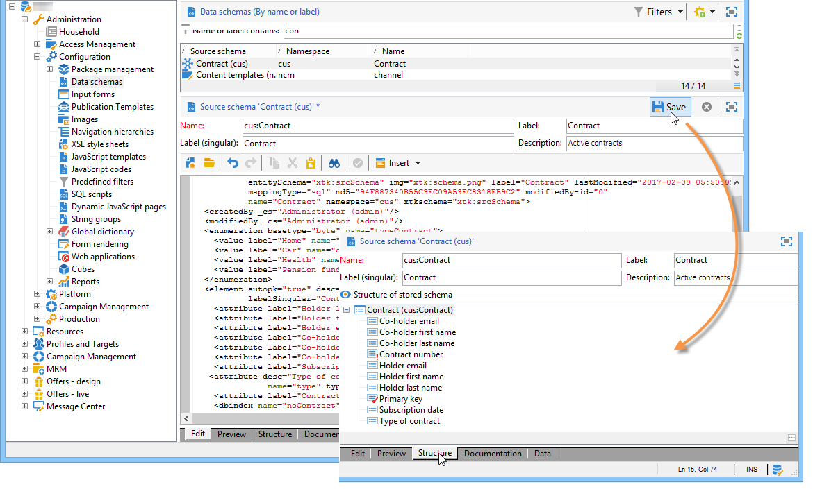

# Esquemas de dados{#data-schemas}


## Princípios {#principles}

Para editar, criar e configurar os esquemas, clique no botão **[!UICONTROL Administration > Configuration > Data schemas]** do console do cliente do Adobe Campaign.

>[!NOTE]
>
>Os esquemas de dados incorporados só podem ser excluídos por um administrador do console do Adobe Campaign Classic.


O campo de edição mostra o conteúdo XML do schema de origem:


>[!NOTE]
>
>O controle de edição &quot;Name&quot; permite a inserção da chave do schema formada pelo nome e pelo namespace. Os atributos &quot;name&quot; e &quot;namespace&quot; do elemento raiz do schema são atualizados automaticamente na zona de edição XML do schema.

A pré-visualização gera automaticamente o schema estendido:


>[!NOTE]
>
>Quando o schema de origem é salvo, a geração do schema estendido é iniciada automaticamente.

Se precisar verificar a estrutura completa de um schema, use a guia preview . Se o schema tiver sido estendido, você poderá visualizar todas as suas extensões. Como complemento, a guia Documentation exibe todos os atributos e elementos do schema e suas propriedades (Campo SQL, tipo/comprimento, rótulo, descrição). A guia Documentação se aplica somente aos esquemas gerados. Para obter mais informações, consulte [Regeneração de schemas](../../configuration/using/regenerating-schemas.md) seção.

## Exemplo: criar uma tabela de contrato {#example--creating-a-contract-table}

No exemplo a seguir, queremos criar uma nova tabela para **contratos** no modelo de banco de dados do banco de dados do Adobe Campaign. Essa tabela permite armazenar nomes e sobrenomes e endereços de email de titulares e cotitulares, para cada contrato.

Para fazer isso, é necessário criar o schema da tabela e atualizar a estrutura do banco de dados para gerar a tabela correspondente. Aplique as seguintes etapas:

1. Edite o **[!UICONTROL Administration > Configuration > Data schemas]** nó da árvore do Adobe Campaign e clique em **[!UICONTROL New]** .
1. Escolha a **[!UICONTROL Create a new table in the data model]** e clique em **[!UICONTROL Next]** .

   

1. Especifique um nome para a tabela e um namespace.

   

   >[!NOTE]
   >
   >Por padrão, os esquemas criados pelos usuários são armazenados no namespace &#39;cus&#39;. Para obter mais informações, consulte [Identificação de um schema](../../configuration/using/about-schema-reference.md#identification-of-a-schema).

1. Crie o conteúdo da tabela. Recomendamos o uso do assistente de entrada para garantir que nenhuma configuração esteja ausente. Para fazer isso, clique no botão **[!UICONTROL Insert]** e escolha o tipo de configuração a ser adicionada.

   

1. Defina as configurações da tabela de contrato:

   ```
   <srcSchema desc="Active contracts" img="ncm:channels.png" label="Contracts" labelSingular="Contract" mappingType="sql" name="Contracts" namespace="cus" xtkschema="xtk:srcSchema">
     <element desc="Active contracts" img="ncm:channels.png" label="Contracts" labelSingular="Contract"
              name="Contracts" autopk="true">
              <attribute name="holderName" label="Holder last name" type="string"/>
              <attribute name="holderFirstName" label="Holder first name" type="string"/>
              <attribute name="holderEmail" label="Holder email" type="string"/>
              <attribute name="co-holderName" label="Co-holder last name" type="string"/>           
              <attribute name="co-holderFirstName" label="Co-holder first name" type="string"/>           
              <attribute name="co-holderEmail" label="Co-holder email" type="string"/>    
              <attribute name="date" label="Subscription date" type="date"/>     
              <attribute name="noContract" label="Contract number" type="long"/>  
     </element>
   </srcSchema>
   ```

   Adicione o tipo de contrato e coloque um índice no número do contrato.

   ```
   <srcSchema _cs="Contracts (cus)" desc="Active contracts" entitySchema="xtk:srcSchema" img="ncm:channels.png"
              label="Contracts" labelSingular="Contract" name="Contracts" namespace="cus" xtkschema="xtk:srcSchema">
     <enumeration basetype="byte" name="typeContract">
       <value label="Home" name="home" value="0"/>
       <value label="Car" name="car" value="1"/>
       <value label="Health" name="health" value="2"/>
       <value label="Pension fund" name="pension fund" value="2"/>
     </enumeration>
     <element autopk="true" desc="Active contracts" img="ncm:channels.png" label="Contracts"
              labelSingular="Contract" name="Contracts">
       <attribute label="Holder last name" name="holderName" type="string"/>
       <attribute label="Holder first name" name="holderFirstName" type="string"/>
       <attribute label="Holder email" name="holderEmail" type="string"/>
       <attribute label="Co-holder last name" name="co-holderName" type="string"/>
       <attribute label="Co-holder first name" name="co-holderFirstName" type="string"/>
       <attribute label="Co-holder email" name="co-holderEmail" type="string"/>
       <attribute label="Subscription date" name="date" type="date"/>
      <attribute desc="Type of contract" enum="cus:Contracts:typeContract" label="Type of contract"
                  name="type" type="byte"/>
       <attribute label="Contract number" name="noContract" type="long"/>
       <dbindex name="noContract" unique="true">
         <keyfield xpath="@noContract"/>
       </dbindex>
     </element>
   </srcSchema>
   ```

1. Salve o schema para gerar a estrutura:

   

1. Atualize a estrutura do banco de dados para criar a tabela à qual o schema será vinculado. Para obter mais informações, consulte [Atualização da estrutura do banco de dados](../../configuration/using/updating-the-database-structure.md).
