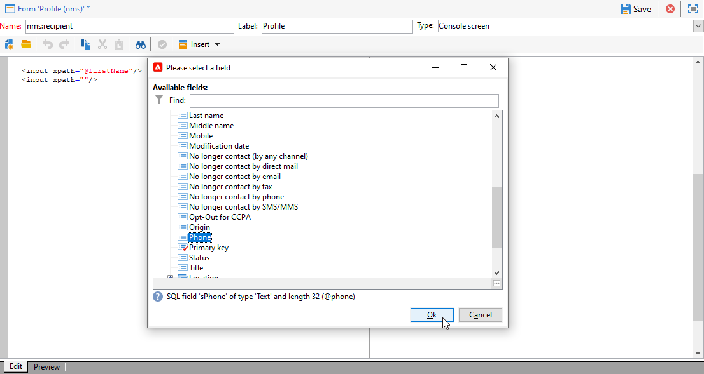

# Editar formulários{#editing-forms}


## Visão geral

Os profissionais de marketing e operadores usam formulários de entrada para criar, modificar e visualizar registros. O Forms mostra uma representação visual de informações.

É possível criar e modificar formulários de entrada:

* Você pode modificar os formulários de entrada de fábrica que são entregues por padrão. Os formulários de entrada de fábrica são baseados nos esquemas de dados de fábrica.
* É possível criar formulários de entrada personalizados, com base em esquemas de dados definidos por você.

Forms são entidades de `xtk:form` tipo . É possível exibir a estrutura do formulário de entrada na variável `xtk:form` esquema. Para exibir esse esquema, escolha **[!UICONTROL Administration]** > **[!UICONTROL Configuration]** > **[!UICONTROL Data schemas]** no menu . Leia mais sobre [estrutura do formulário](form-structure.md).

Para acessar formulários de entrada, escolha **[!UICONTROL Administration]> [!UICONTROL Configuration] >[!UICONTROL Input forms]** no menu:


Para criar formulários, edite o conteúdo XML no editor XML:


[Leia mais](form-structure.md#formatting).

Para visualizar um formulário, clique no botão **[!UICONTROL Preview]** guia :


## Tipos de formulário

É possível criar diferentes tipos de formulários de entrada. O tipo de formulário determina como os usuários navegam no formulário:

* Tela do console

   Esse é o tipo de formulário padrão. O formulário inclui uma única página.

   

* Gerenciamento de conteúdo

   Use esse tipo de formulário para gerenciamento de conteúdo. Veja isso [caso de uso](../../delivery/using/use-case--creating-content-management.md).

   

* Assistente

   Esse formulário inclui várias telas flutuantes ordenadas em sequências específicas. Os usuários navegam de uma tela para outra. [Leia mais](form-structure.md#wizards).

* Iconbox

   Esse formulário inclui várias páginas. Para navegar no formulário, os usuários selecionam ícones à esquerda do formulário.

   

* Notebook

   Esse formulário inclui várias páginas. Para navegar no formulário, os usuários selecionam guias na parte superior do formulário.

   

* Painel vertical

   Este formulário mostra uma árvore de navegação.

* Painel horizontal

   Este formulário mostra uma lista de itens.

## Containers

Nos formulários, é possível usar contêineres para vários fins:

* Organizar o conteúdo nos formulários
* Definir o acesso aos campos de entrada
* Aninhar formulários em outros formulários

[Leia mais](form-structure.md#containers).

### Organizar o conteúdo

Use contêineres para organizar o conteúdo em formulários:

* É possível agrupar campos em seções.
* É possível adicionar páginas a formulários de várias páginas.

Para inserir um contêiner, use o `<container>` elemento. [Leia mais](form-structure.md#containers).

#### Campos de grupo

Use contêineres para agrupar campos de entrada em seções organizadas.

Para inserir uma seção em um formulário, use este elemento: `<container type="frame">`. Como opção, para adicionar um título de seção, use a variável `label` atributo.

Sintaxe: `<container type="frame" label="`*section_title*`"> […] </container>`

Neste exemplo, um contêiner define a variável **Criação** , que compreende a **[!UICONTROL Created by]** e **[!UICONTROL Name]** campos de entrada:

```xml
<form _cs="Coupons (nms)" entitySchema="xtk:form" img="xtk:form.png" label="Coupons"
      name="coupon" namespace="nms" type="default" xtkschema="xtk:form">
  <input xpath="@code"/>
  <input xpath="@type"/>
  <container label="Creation" type="frame">
    <input xpath="createdBy"/>
    <input xpath="createdBy/@name"/>
  </container>
</form>
```


#### Adicionar páginas a formulários de várias páginas

Para formulários multipáginas, use um contêiner para criar uma página de formulário.

Este exemplo mostra contêineres para a variável **Geral** e **Detalhes** páginas de um formulário:

```xml
<container img="ncm:book.png" label="General">
[…]
</container>
<container img="ncm:detail.png" label="Details">
[…]
</container>
```

### Definir acesso aos campos

Use containers para definir o que é visível e definir o acesso aos campos. Você pode ativar ou desativar grupos de campos.

### Aninhar formulários

Use contêineres para aninhar formulários em outros formulários. [Leia mais](#add-pages-to-multipage-forms).

## Referências a imagens

Para localizar imagens, escolha **[!UICONTROL Administration]** > **[!UICONTROL Configuration]** > **[!UICONTROL Images]** no menu .

Para associar uma imagem a um elemento no formulário, por exemplo, um ícone, é possível adicionar uma referência a uma imagem. Use o `img` , por exemplo, no `<container>` elemento.

Sintaxe: `img="`*`namespace`*`:`*`filename`*`.`*`extension`*`"`

Este exemplo mostra referências ao `book.png` e `detail.png` imagens da `ncm` namespace:

```xml
<container img="ncm:book.png" label="General">
[…]
</container>
<container img="ncm:detail.png" label="Details">
[…]
</container>
```

Essas imagens são usadas para ícones em que os usuários clicam para navegar em um formulário de várias páginas:


## Criar um formulário simples {#create-simple-form}

Para criar um formulário, siga estas etapas:

1. No menu , escolha **[!UICONTROL Administration]** > **[!UICONTROL Configuration]** > **[!UICONTROL Input forms]**.
1. Clique no botão **[!UICONTROL New]** na parte superior direita da lista.

   

1. Especifique as propriedades do formulário:

   * Especifique o nome e o namespace do formulário.

      O nome do formulário e o namespace podem corresponder ao schema de dados relacionado.  Este exemplo mostra um formulário para a variável `cus:order` schema de dados:

      ```xml
      <form entitySchema="xtk:form" img="xtk:form.png" label="Order" name="order" namespace="cus" type="iconbox" xtkschema="xtk:form">
        […]
      </form>
      ```

      Como alternativa, você pode especificar explicitamente o schema de dados no `entity-schema` atributo.

      ```xml
      <form entity-schema="cus:stockLine" entitySchema="xtk:form" img="xtk:form.png" label="Stock order" name="stockOrder" namespace="cus" xtkschema="xtk:form">
        […]
      </form>
      ```

   * Especifique o rótulo a ser exibido no formulário.
   * Como opção, especifique o tipo de formulário. Se um tipo de formulário não for especificado, o tipo de tela do console será usado por padrão.

      

      Ao projetar um formulário multipáginas, é possível omitir o tipo de formulário no `<form>` e especifique o tipo em um contêiner.

1. Clique em **[!UICONTROL Save]**.

1. Insira os elementos do formulário.

   Por exemplo, para inserir um campo de entrada, use a variável `<input>` elemento. Defina as `xpath` à referência de campo como uma expressão XPath. [Leia mais](schema-structure.md#referencing-with-xpath).

   Este exemplo mostra campos de entrada com base na variável `nms:recipient` esquema.

   ```xml
   <input xpath="@firstName"/>
   <input xpath="@lastName"/>
   ```

1. Se o formulário for baseado em um tipo de schema específico, você poderá pesquisar os campos desse schema:

   1. Clique em **[!UICONTROL Insert]** > **[!UICONTROL Document fields]**.

      

   1. Selecione o campo e clique em **[!UICONTROL OK]**.

      

1. Como opção, especifique o editor de campos.

   Um editor de campo padrão está associado a cada tipo de dados:
   * Para um campo do tipo data, o formulário mostra um calendário de entrada.
   * Para um campo do tipo enumeração, o formulário mostra uma lista de seleção.

   Você pode usar esses tipos de editor de campo:

   | Editor de campos | Atributo do formulário |
   | --- | --- |
   | Botão de opção | `type="radiobutton"` |
   | Caixa de seleção | `type="checkbox"` |
   | Editar árvore | `type="tree"` |

   Leia mais sobre [controles da lista de memória](form-structure.md#memory-list-controls).

1. Opcionalmente, defina o acesso aos campos:

   | Elemento | Atributo | Descrição |
   | --- | --- | --- |
   | `<input>` | `read-only:"true"` | Fornece acesso somente leitura a um campo |
   | `<container>` | `type="visibleGroup" visibleIf="`*edit-expr*`"` | Exibe condicionalmente um grupo de campos |
   | `<container>` | `type="enabledGroup" enabledIf="`*edit-expr*`"` | Habilita condicionalmente um grupo de campos |

   Exemplo:

   ```xml
   <container type="enabledGroup" enabledIf="@gender=1">
     […]
   </container>
   <container type="enabledGroup" enabledIf="@gender=2">
     […]
   </container>
   ```

1. Como opção, use contêineres para agrupar campos em seções.

   ```xml
   <container type="frame" label="Name">
      <input xpath="@firstName"/>
      <input xpath="@lastName"/>
   </container>
   <container type="frame" label="Contact details">
      <input xpath="@email"/>
      <input xpath="@phone"/>
   </container>
   ```

   

## Criar um formulário multipáginas {#create-multipage-form}

Você pode criar formulários multipáginas. Também é possível aninhar formulários em outros formulários.

### Crie um `iconbox` formulário

Use o `iconbox` tipo de formulário para mostrar ícones à esquerda do formulário, que levam os usuários para páginas diferentes no formulário.


Para alterar o tipo de formulário existente para `iconbox`siga estas etapas:

1. Altere o `type` do `<form>` elemento para `iconbox`:

   ```xml
   <form […] type="iconbox">
   ```

1. Defina um contêiner para cada página de formulário:

   1. Adicione um `<container>` como filho do `<form>` elemento.
   1. Para definir um rótulo e uma imagem para o ícone, use o `label` e `img` atributos.

      ```xml
      <form entitySchema="xtk:form" name="Service provider" namespace="nms" type="iconbox" xtkschema="xtk:form">
          <container img="xtk:properties.png" label="General">
              <input xpath="@label"/>
              <input xpath="@name"/>
              […]
          </container>
          <container img="nms:msgfolder.png" label="Details">
              <input xpath="@address"/>
              […]
          </container>
          <container img="nms:supplier.png" label="Services">
              […]
          </container>
      </form>
      ```
   Como alternativa, remova o `type="frame"` do atributo existente `<container>` elementos.

### Criar um formulário de bloco de notas

Use o `notebook` tipo de formulário para mostrar guias na parte superior do formulário, que levam os usuários para páginas diferentes.


Para alterar o tipo de formulário existente para `notebook`siga estas etapas:

1. Altere o `type` do `<form>` elemento para `notebook`:

   ```xml
   <form […] type="notebook">
   ```

1. Adicione um contêiner para cada página de formulário:

   1. Adicione um `<container>` como filho do `<form>` elemento.
   1. Para definir o rótulo e a imagem para o ícone, use o `label` e `img` atributos.

   ```xml
     <form entitySchema="xtk:form" name="Service provider" namespace="nms" type="notebook" xtkschema="xtk:form">
         <container label="General">
             <input xpath="@label"/>
             <input xpath="@name"/>
             […]
         </container>
         <container label="Details">
             <input xpath="@address"/>
             […]
         </container>
         <container label="Services">
             […]
         </container>
     </form>
   ```

   Como alternativa, remova o `type="frame"` do atributo existente `<container>` elementos.

### Aninhar formulários {#nest-forms}

É possível aninhar formulários em outros formulários. Por exemplo, é possível aninhar formulários de notebook em formulários de caixa de ícones.

O nível de aninhamento controla a navegação. Os usuários podem detalhar os subformulários.

Para aninhar um formulário em outro formulário, insira um `<container>` e defina o `type` para o tipo de formulário. Para o formulário de nível superior, é possível definir o tipo de formulário em um contêiner externo ou no `<form>` elemento.

### Exemplo

Este exemplo mostra um formulário complexo:

* O formulário de nível superior é um formulário iconbox. Este formulário consiste em dois contêineres rotulados **Geral** e **Detalhes**.

   Como resultado, o formulário externo mostra a variável **Geral** e **Detalhes** páginas no nível superior. Para acessar essas páginas, os usuários clicam nos ícones à esquerda do formulário.

* O subformulário é um formulário de bloco de aninhado dentro do **Geral** contêiner. O subformulário consiste em dois contêineres rotulados **Nome** e **Contato**.

```xml
<form _cs="Profile (nms)" entitySchema="xtk:form" img="xtk:form.png" label="Profile" name="profile" namespace="nms" xtkschema="xtk:form">
  <container type="iconbox">
    <container img="ncm:general.png" label="General">
      <container type="notebook">
        <container label="Name">
          <input xpath="@firstName"/>
          <input xpath="@lastName"/>
        </container>
        <container label="Contact">
          <input xpath="@email"/>
        </container>
      </container>
    </container>
    <container img="ncm:detail.png" label="Details">
      <input xpath="@birthDate"/>
    </container>
  </container>
</form>
```

Como resultado, a variável **Geral** a página do formulário externo mostra a variável **Nome** e **Contato** guias.


## Modificar um formulário de entrada de fábrica {#modify-factory-form}

Para modificar um formulário de fábrica, siga estas etapas:

1. Como opção, estenda o schema de dados relacionado:

   1. No menu , escolha **[!UICONTROL Administration]** > **[!UICONTROL Configuration]** > **[!UICONTROL Data schemas]**.
   1. Selecione um schema de dados e estenda-o. Por exemplo, é possível adicionar campos. [Leia mais](extending-a-schema.md).

      >[!CAUTION]
      > Não modifique os dados originais em um namespace de fábrica, mas, em vez disso, estenda-os em um namespace personalizado. O motivo é que, durante as atualizações de software, todos os dados nos namespaces de fábrica são substituídos. Por exemplo, os dados na variável `xtk`, `ncm`e `nms` os namespaces de fábrica são substituídos. Os dados em seus namespaces personalizados não são modificados.


