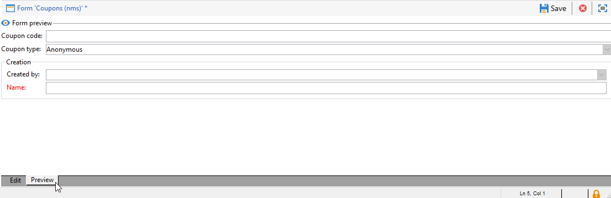

# Editar formulários{#editing-forms}

## Visão geral

Os profissionais de marketing e operadores usam formulários de entrada para criar, modificar e visualizar registros. O Forms mostra uma representação visual de informações.

É possível criar e modificar formulários de entrada:

* Você pode modificar os formulários de entrada de fábrica que são entregues por padrão. Os formulários de entrada de fábrica são baseados nos esquemas de dados de fábrica.
* É possível criar formulários de entrada personalizados, com base em esquemas de dados definidos por você.

Forms são entidades de `xtk:form` tipo . É possível exibir a estrutura do formulário de entrada na variável `xtk:form` esquema. Para exibir esse esquema, escolha **[!UICONTROL Administration]** > **[!UICONTROL Configuration]** > **[!UICONTROL Data schemas]** no menu . Leia mais sobre [estrutura do formulário](form-structure.md).

Para acessar formulários de entrada, escolha **[!UICONTROL Administration]> [!UICONTROL Configuration] >[!UICONTROL Input forms]** no menu:

Para criar formulários, edite o conteúdo XML no editor XML:

[Leia mais](form-structure.md#formatting).

Para visualizar um formulário, clique no botão **[!UICONTROL Preview]** guia :

## Tipos de formulário

É possível criar diferentes tipos de formulários de entrada. O tipo de formulário determina como os usuários navegam no formulário:

* Tela do console

   Esse é o tipo de formulário padrão. O formulário inclui uma única página.

   

* Gerenciamento de conteúdo

   Use esse tipo de formulário para gerenciamento de conteúdo. Veja isso [caso de uso](../../delivery/using/use-case--creating-content-management.md).

   

* Assistente

   Esse formulário inclui várias telas flutuantes ordenadas em sequências específicas. Os usuários navegam de uma tela para outra. [Leia mais](form-structure.md#wizards).

* Iconbox

   Esse formulário inclui várias páginas. Para navegar no formulário, os usuários selecionam ícones à esquerda do formulário.

   

* Notebook

   Esse formulário inclui várias páginas. Para navegar no formulário, os usuários selecionam guias na parte superior do formulário.

   

* Painel vertical

   Este formulário mostra uma árvore de navegação.

* Painel horizontal

   Este formulário mostra uma lista de itens.

