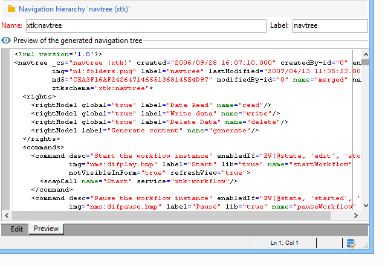

# Editar árvore de navegação do Campaign Explorer{#edition}

A tela para criar e configurar os documentos de configuração da hierarquia de navegação pode ser acessada por meio do nó **[!UICONTROL Administration > Configuration > Navigation hierarchies]**:

A configuração da hierarquia de navegação é dividida em vários documentos XML. Ela opera em um princípio semelhante à extensão do schema: todos os documentos são mesclados para gerar um único documento que contém toda a configuração. Este documento não pode ser editado e é exibido por meio da guia &quot;Preview&quot;.

O campo de edição fornece o conteúdo do documento XML:

>[!NOTE]
>
>O controle de edição &quot;Nome&quot; permite a inserção da chave do documento que consiste no nome e no namespace. Os atributos &quot;name&quot; e &quot;namespace&quot; do elemento **`<navtree>`** são atualizados automaticamente no campo de edição XML do esquema.

A visualização gera automaticamente o documento mesclado que contém a configuração completa:

