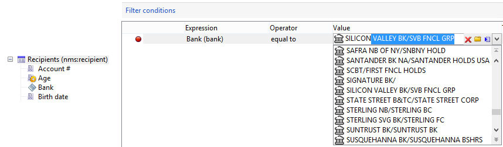

# Exemplos de edição de esquemas{#examples-of-schemas-edition}

## Estender uma tabela {#extending-a-table}

Para estender o **nms:recipient** tabela de recipients do schema, aplique o seguinte procedimento:

1. Criar o esquema de extensão (**cus:extensão**) utilizando os seguintes dados:

   ```
   <srcSchema mappingType="sql" name="extension" namespace="cus" xtkschema="xtk:srcSchema" extendedSchema="nms:recipient">  
     <enumeration basetype="string" default="area1" name="area">    
       <value label="Zone 1" name="area1"/>    
       <value label="Zone 2" name="area2"/>  
     </enumeration>  
   
     <element name="extension">    
       <dbindex name="area">      
         <keyfield xpath="location/@area"/>    
       </dbindex>      
   
       <attribute label="Loyalty code" name="fidelity" type="long"/>    
       <element name="location">      
         <attribute name="area" label="Purchasing zone" type="string" length="50" enum="area"/>    
       </element>  </element>  
   </srcSchema>
   ```

   Neste exemplo, um campo indexado (**fidelidade**) é adicionado e a variável **localização** elemento (que já existia na lista **nms:recipient** schema) é complementado com um campo enumerado (**área**).

   >[!IMPORTANT]
   >
   >Lembre-se de adicionar o **extendedSchema** atributo para fazer referência ao esquema de extensão.

1. Verifique se o esquema estendido é o **nms:recipient** e que os dados adicionais estão presentes:

   ```
   <schema dependingSchemas="cus:extension" mappingType="sql" name="recipient" namespace="nms" xtkschema="xtk:schema">
     ...
     <enumeration basetype="string" default="area1" name="area">    
       <value label="Zone 1" name="area1"/>    
       <value label="Zone 2" name="area2"/>  
     </enumeration>
     ...
     <element autopk="true" name="recipient" sqltable="NmsRecipient"> 
       <dbindex name="area">      
         <keyfield xpath="location/@area"/>    
       </dbindex>
   
       ...
       <attribute belongsTo="cus:extension" label="Loyalty code" name="fidelity" sqlname="iFidelity" type="long"/>
       <element name="location">
         ...
         <attribute enum="area" label="Purchasing zone" length="50" name="area" sqlname="sArea" type="string"/>
       </element>
       ...
     </element>
   </schema>
   ```

   O script SQL gerado pelo assistente de atualização de banco de dados é o seguinte:

   ```
   ALTER TABLE NmsRecipient ADD iFidelity INTEGER;
   UPDATE NmsRecipient SET iFidelity = 0;
   ALTER TABLE NmsRecipient ALTER COLUMN iFidelity SET NOT NULL;ALTER TABLE NmsRecipient ALTER COLUMN iFidelity SET Default 0;
   ALTER TABLE NmsRecipient ADD sArea VARCHAR(50); 
   CREATE INDEX NmsRecipient_area ON NmsRecipient(sArea);
   ```

## Tabela de coleção vinculada {#linked-collection-table}

Esta seção descreve como criar uma tabela de pedidos vinculada à tabela de destinatários com cardinalidade 1-N.

Esquema de origem da tabela de pedidos:

```
<srcSchema label="Order" name="order" namespace="cus" xtkschema="xtk:srcSchema">  
  <element autopk="true" name="order">    
    <compute-string expr="@number" + '(' + ToString(@date) + ')'/>    
    
    <attribute label="Number" length="128" name="number" type="string"/>    
    <attribute desc="Order date" label="Date" name="date" type="datetime" default="GetDate()"/>    
    <attribute desc="order total" label="Total" name="total" type="double"/>    
    <element label="Recipient" name="recipient" revDesc="Orders associated with this recipient" revIntegrity="own" revLabel="Orders" target="nms:recipient" type="link"/>  
  </element>
</srcSchema>
```

O tipo de tabela é **autopk** para criar uma chave primária gerada automaticamente a ser usada pela associação do link à tabela de recipients.

Esquema gerado:

```
<schema label="Order" mappingType="sql" name="order" namespace="cus" xtkschema="xtk:schema">  
  <element autopk="true" label="Order" name="order" sqltable="CusOrder">    
    <compute-string expr="ToString(@date) + ' - ' + @number"/>    

    <dbindex name="id" unique="true">      
      <keyfield xpath="@id"/>    
    </dbindex>    

    <key internal="true" name="id">      
      <keyfield xpath="@id"/>    
    </key>    

    <dbindex name="recipientId">      
      <keyfield xpath="@recipient-id"/>    
    </dbindex>    

    <attribute desc="Internal primary key" label="Primary key" name="id" sqlname="iOrderId" type="long"/>    
    <attribute label="Number" length="128" name="number" sqlname="sNumber" type="string"/>    
    <attribute desc="Order date" label="Date" name="date" sqlname="tsDate" type="datetime"/>    
    <attribute desc="order total" label="Total" name="total" sqlname="Total" type="double"/>    
    <element label="Recipient" name="recipient" revLink="order" target="nms:recipient" type="link">      
      <join xpath-dst="@id" xpath-src="@recipient-id"/>    
    </element>    
    <attribute advanced="true" label="Foreign key of 'Recipient' link ('id' field)" name="recipient-id" sqlname="iRecipientId" type="long"/>  
   </element>
</schema>
```

O script SQL de criação de tabela é o seguinte:

```
CREATE TABLE CusOrder(dTotal DOUBLE PRECISION NOT NULL Default 0, iOrderId INTEGER NOT NULL Default 0, iRecipientId INTEGER NOT NULL Default 0, sNumber VARCHAR(128), tsDate TIMESTAMP Default NULL);
CREATE UNIQUE INDEX CusOrder_id ON CusOrder(iOrderId);
CREATE INDEX CusOrder_recipientId ON CusOrder(iRecipientId);  
INSERT INTO CusOrder (iOrderId) VALUES (0); 
```

>[!NOTE]
>
>O comando SQL INSERT INTO no final do script permite inserir um registro de identificador definido como 0 para simular associações externas.

## Tabela de extensão {#extension-table}

Uma tabela de extensão permite estender o conteúdo de uma tabela existente em uma tabela vinculada de cardinalidade 1-1.

A finalidade de uma tabela de extensão é evitar limitações no número de campos compatíveis em uma tabela ou otimizar o espaço ocupado pelos dados, que são consumidos sob demanda.

Criação do schema de tabela de extensão (**cus:recurso**):

```
<srcSchema mappingType="sql" name="feature" namespace="cus" xtkschema="xtk:srcSchema">  
  <element autopk="true" name="feature">    
    <attribute label="Children" name="children" type="byte"/>    
    <attribute label="Single" name="single" type="boolean"/>    
    <attribute label="Spouse first name" length="100" name="spouseFirstName" type="string"/>  
  </element>
</srcSchema>
```

Criação de um schema de extensão na tabela de recipients para adicionar o link de cardinalidade 1-1:

```
<srcSchema extendedSchema="nms:recipient" label="Recipient" mappingType="sql" name="recipient" namespace="cus" xtkschema="xtk:srcSchema">  
  <element name="recipient">    
    <element desc="Features" integrity="own" label="Features" name="feature" revCardinality="single" revLink="recipient" target="cus:feature" type="link"/> 
  </element>
</srcSchema>
```

>[!NOTE]
>
>A definição do link entre a tabela do recipient e a tabela de extensão deve ser preenchida a partir do schema que contém a chave estrangeira.

O script SQL para criar a tabela de extensão é o seguinte:

```
CREATE TABLE CusFeature(  iChildren NUMERIC(3) NOT NULL Default 0, iFeatureId INTEGER NOT NULL Default 0, iSingle NUMERIC(3) NOT NULL Default 0, sSpouseFirstName VARCHAR(100));
CREATE UNIQUE INDEX CusFeature_id ON CusFeature(iFeatureId);  
INSERT INTO CusFeature (iFeatureId) VALUES (0); 
```

O script de atualização SQL da tabela do recipient é o seguinte:

```
ALTER TABLE NmsRecipient ADD iFeatureId INTEGER;
UPDATE NmsRecipient SET iFeatureId = 0;
ALTER TABLE NmsRecipient ALTER COLUMN iFeatureId SET NOT NULL;
ALTER TABLE NmsRecipient ALTER COLUMN iFeatureId SET Default 0;
CREATE INDEX NmsRecipient_featureId ON NmsRecipient(iFeatureId);
```

## Tabela de sobreposição {#overflow-table}

Uma tabela de sobreposição é uma tabela de extensão (cardinalidade 1-1), mas a declaração do link para a tabela a ser estendida é preenchida no schema da tabela de sobreposição.

A tabela de sobreposição contém a chave estrangeira para a tabela a ser estendida. A tabela a ser estendida, portanto, não é modificada. A relação entre as duas tabelas é o valor da chave primária da tabela a ser estendida.

Criação do schema da tabela de overflow (**cus:estouro**):

```
<srcSchema label="Overflow" name="overflow" namespace="cus" xtkschema="xtk:srcSchema">  
  <element name="overflow">    
    <key internal="true" name="id">      
      <keyfield xlink="recipient"/>    
    </key>    

    <attribute label="Children" name="children" type="byte"/>    
    <attribute label="Single" name="single" type="boolean"/>    
    <attribute label="Spouse first name" length="100" name="spouseFirstName" type="string"/>  
    <element label="Customer" name="recipient" revCardinality="single" revIntegrity="own" revExternalJoin="true" target="nms:recipient" type="link"/>  
  </element>  
</srcSchema>
```

>[!NOTE]
>
>A chave primária da tabela de overflow é o link para a tabela a ser estendida (schema &quot;nms:recipient&quot; em nosso exemplo).

O script SQL de criação de tabela é o seguinte:

```
CREATE TABLE CusOverflow(iChildren NUMERIC(3) NOT NULL Default 0, iRecipientId INTEGER NOT NULL Default 0, iSingle NUMERIC(3) NOT NULL Default 0, sSpouseFirstName VARCHAR(100));
CREATE UNIQUE INDEX CusOverflow2_id ON CusOverflow2(iRecipientId);  
```

## Tabela de relações {#relationship-table}

Uma tabela de relação permite vincular duas tabelas com cardinalidade N-N. Esta tabela contém apenas as chaves estrangeiras das tabelas a serem vinculadas.

Exemplo de uma tabela de relacionamento entre grupos (**nms:group**) e recipients (**nms:recipient**).

Esquema de origem da tabela de relacionamento:

```
<srcSchema name="rcpGrpRel" namespace="cus">
  <element name="rcpGrpRel">
    <key internal="true" name="id">      
      <keyfield xlink="rcpGroup"/>      
      <keyfield xlink="recipient"/>    
    </key>

    <element integrity="neutral" label="Recipient" name="recipient" revDesc="Groups to which this recipient belongs" revIntegrity="own" revLabel="Groups" target="nms:recipient" type="link"/>    
    <element integrity="neutral" label="Group" name="rcpGroup" revDesc="Recipients in the group" revIntegrity="own" revLabel="Recipients" revLink="rcpGrpRel" target="nms:group" type="link"/>
  </element>
</srcSchema>
```

O schema gerado é o seguinte:

```
<schema mappingType="sql" name="rcpGrpRel" namespace="cus" xtkschema="xtk:schema">  
  <element name="rcpGrpRel" sqltable="CusRcpGrpRel">    
    <compute-string expr="ToString([@rcpGroup-id]) + ',' + ToString([@recipient-id])"/>    
    <dbindex name="id" unique="true">      
      <keyfield xpath="@rcpGroup-id"/>      
      <keyfield xpath="@recipient-id"/>    
    </dbindex>    

    <key internal="true" name="id">      
      <keyfield xpath="@rcpGroup-id"/>      
      <keyfield xpath="@recipient-id"/>    
    </key>    

    <dbindex name="rcpGroupId">      
      <keyfield xpath="@rcpGroup-id"/>    
    </dbindex>    
    <dbindex name="recipientId">      
      <keyfield xpath="@recipient-id"/>    
    </dbindex>    

    <element integrity="neutral" label="Recipient" name="recipient" revLink="rcpGrpRel" target="nms:recipient" type="link">      
      <join xpath-dst="@id" xpath-src="@recipient-id"/>    
    </element>    
    <attribute advanced="true" label="Foreign key of 'Recipient' link ('id' field)" name="recipient-id" sqlname="iRecipientId" type="long"/>    

    <element integrity="neutral" label="Group" name="rcpGroup" revLink="rcpGrpRel" target="nms:group" type="link">      
      <join xpath-dst="@id" xpath-src="@rcpGroup-id"/>    
    </element>    
    <attribute advanced="true" label="Foreign key of 'Group' link ('id' field)" name="rcpGroup-id" sqlname="iRcpGroupId" type="long"/>  
  </element>
</schema>
```

O script SQL de criação de tabela é o seguinte:

```
CREATE TABLE CusRcpGrpRel( iRcpGroupId INTEGER NOT NULL Default 0, iRecipientId INTEGER NOT NULL Default 0);
CREATE UNIQUE INDEX CusRcpGrpRel_id ON CusRcpGrpRel(iRcpGroupId, iRecipientId);
CREATE INDEX CusRcpGrpRel_recipientId ON CusRcpGrpRel(iRecipientId);
```

## Caso de uso: vincular um campo a uma tabela de referência existente {#uc-link}

Esse caso de uso demonstra como é possível usar uma tabela de referência existente como uma alternativa aos mecanismos de enumeração do Adobe Campaign incorporados (enum, userEnum ou dbEnum).

Você também pode usar uma tabela de referência existente como uma lista discriminada em seus esquemas. Isso pode ser feito criando um vínculo entre uma tabela e a tabela de referência e adicionando o atributo **displayAsField=&quot;true&quot;**.

Neste exemplo, a tabela de referência contém uma lista de nomes e identificadores de bancos:

```
<srcSchema entitySchema="xtk:srcSchema" img="cus:bank16x16.png" label="Bank" mappingType="sql" name="bank" namespace="cus"
xtkschema="xtk:srcSchema">
    <element img="cus:bank16x16.png" label="Banks" name="bank">
        <compute-string expr="@name"/>
        <key name="id">
            <keyfield xpath="@id"/>
        </key>
        <attribute label="Bank Id" name="id" type="short"/>
        <attribute label="Name" length="64" name="name" type="string"/>
     </element> 
</srcSchema>
```

Em qualquer tabela que use essa tabela de referência, defina um link e adicione o **displayAsField=&quot;true&quot;** atributo.

```
<element displayAsField="true" label="Bank" name="bank" target="cus:bank" type="link" noDbIndex="true"/>
```

A interface não exibirá um link, mas um campo. Quando os usuários escolhem esse campo, eles podem selecionar um valor da tabela de referência ou usar o recurso de preenchimento automático.



* Para que ele seja preenchido automaticamente, você deve definir uma cadeia de caracteres de cálculo na tabela de referência.

* Adicione o **noDbIndex=&quot;true&quot;** atributo na definição do link para impedir que o Adobe Campaign crie um índice nos valores armazenados na tabela de origem do link.

## Tópicos relacionados

* [Trabalhar com enumerações](../../platform/using/managing-enumerations.md)

* [Introdução aos esquemas do Campaign](../../configuration/using/about-schema-edition.md)

* [Atualização da estrutura do banco de dados](../../configuration/using/updating-the-database-structure.md)
