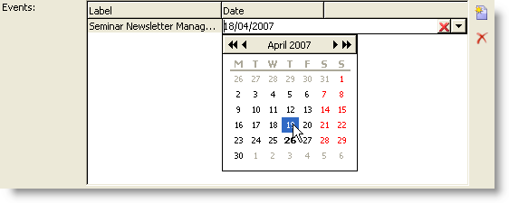

# Estrutura do formulário{#form-structure}

The description of a form is a structured XML document that observes the grammar of the form schema **xtk:form**.

The XML document of the input form must contain the `<form>` root element with the  **name** and  **namespace** attributes to populate the form name and namespace.

```
<form name="form_name" namespace="name_space">
...
</form>
```

Por padrão, um formulário é associado ao schema de dados com o mesmo nome e namespace. Para associar um formulário a um nome diferente, defina o atributo **entity-schema** do `<form>` elemento como o nome da chave do schema. Para ilustrar a estrutura de um formulário de entrada, descreva uma interface usando o schema de exemplo &quot;cus:recipient&quot;:

```
<srcSchema name="recipient" namespace="cus">
  <enumeration name="gender" basetype="byte">    
    <value name="unknown" label="Not specified" value="0"/>    
    <value name="male" label="Male" value="1"/>   
    <value name="female" label="Female" value="2"/>   
  </enumeration>

  <element name="recipient">
    <attribute name="email" type="string" length="80" label="Email" desc="E-mail address of recipient"/>
    <attribute name="birthDate" type="datetime" label="Date"/>
    <attribute name="gender" type="byte" label="Gender" enum="gender"/>
  </element>
</srcSchema>
```

O formulário de entrada com base no schema de exemplo:


```
<form name="recipient" namespace="cus">
  <input xpath="@gender"/>
  <input xpath="@birthDate"/>
  <input xpath="@email"/>
</form>
```

A descrição dos start de edição controla o elemento `<form>` raiz. Um controle de edição é inserido em um elemento **`<input>`** com o atributo **xpath** contendo o caminho do campo do schema.

O controle de edição se adapta automaticamente ao tipo de dados correspondente e usa o rótulo definido no schema.

>[!NOTE]
>
>Você pode sobrecarregar o rótulo definido em seu schema de dados adicionando o atributo **label** ao `<input>` elemento:\
>`<input label="E-mail address" xpath="@name" />`

Por padrão, cada campo é exibido em uma única linha e ocupa todo o espaço disponível dependendo do tipo de dados.

## Formatação {#formatting}

O layout dos controles se parece com o layout usado em tabelas HTML, com a possibilidade de dividir um controle em várias colunas, elementos de entrelaçamento ou especificar a ocupação do espaço disponível. Lembre-se, no entanto, de que a formatação permite apenas dividir a área para cima por proporções; não é possível especificar dimensões fixas para um objeto.

Para exibir os controles do exemplo acima em duas colunas:


```
<form name="recipient" namespace="cus">
  <container colcount="2">
    <input xpath="@gender"/>
    <input xpath="@birthDate"/>
    <input xpath="@email"/>
  </container>
</form>
```

O **`<container>`** elemento com o atributo **colcount** permite forçar a exibição de controles filho em duas colunas.

O atributo **colspan** em um controle estende o controle pelo número de colunas inseridas em seu valor:


```
<form name="recipient" namespace="cus">
  <container colcount="2">
    <input xpath="@gender"/>
    <input xpath="@birthDate"/>
    <input xpath="@email" colspan="2"/>
  </container>
</form> 
```

Ao preencher o atributo **type=&quot;frame&quot;** , o container adiciona um quadro ao redor dos controles filho com o rótulo contido no atributo **label** :


```
<form name="recipient" namespace="cus">
  <container colcount="2" type="frame" label="General">
    <input xpath="@gender"/>
    <input xpath="@birthDate"/>
    <input xpath="@email" colspan="2"/>
  </container>
</form>
```

Um **`<static>`** elemento pode ser usado para formatar o formulário de entrada:


```
<form name="recipient" namespace="cus">
  <static type="separator" colspan="2" label="General"/>
  <input xpath="@gender"/>
  <input xpath="@birthDate"/>
  <input xpath="@email" colspan="2"/>
  <static type="help" label="General information about recipient with date of birth, gender, and e-mail address." colspan="2"/>
</form>
```

A **`<static>`** tag com o tipo **separador** permite adicionar uma barra separadora com um rótulo contido no atributo **label** .

Um texto de ajuda foi adicionado usando a `<static>` tag com o tipo de ajuda. O conteúdo do texto é inserido no atributo **label** .

## Containeres {#containers}

Os containeres permitem agrupar um conjunto de controles. Eles são representados pelo **`<container>`** elemento. Eles foram usados acima para formatar controles em várias colunas.

O atributo **xpath** em um `<container>` permite simplificar a referência de controles filho. A referência dos controles é então relativa ao `<container>` pai pai.

Exemplo de um container sem &quot;xpath&quot;:

```
<container colcount="2">
  <input xpath="location/@zipCode"/>
  <input xpath="location/@city"/>
</container>
```

Exemplo com a adição de &quot;xpath&quot; ao elemento chamado &quot;location&quot;:

```
<container colcount="2" xpath="location">
  <input xpath="@zipCode"/>
  <input xpath="@city"/>
</container>
```

### Tipos de container {#types-of-container}

Container são usados para construir controles complexos usando um conjunto de campos formatados em páginas.

#### Container de guias {#tab-container}

Um container de guia formata dados em páginas que são acessíveis a partir de guias.


```
<container type="notebook">
  <container colcount="2" label="General">
    <input xpath="@gender"/>
    <input xpath="@birthDate"/>
    <input xpath="@email" colspan="2"/>
  </container>
  <container colcount="2" label="Location">
    ...
  </container>
</container>
```

O container principal é definido pelo atributo **type=&quot;notebook&quot;** . As guias são declaradas nos container filhos e o rótulo das guias é preenchido a partir do atributo **label** .

>[!NOTE]
>
>Um recurso **style=&quot;down|up**(por padrão)**&quot;** força o posicionamento vertical dos rótulos de tabulação abaixo ou acima do controle. Este recurso é opcional.
>
>`<container style="down" type="notebook">  ... </container>`

#### Lista de ícones {#icon-list}

Esse container exibe uma barra de ícones vertical que permite selecionar as páginas a serem exibidas.


```
<container type="iconbox">
  <container colcount="2" label="General" img="xtk:properties.png">
    <input xpath="@gender"/>
    <input xpath="@birthDate"/>
    <input xpath="@email" colspan="2"/>
  </container>
  <container colcount="2" label="Location" img="nms:msgfolder.png">
    ...
  </container>
</container>
```

O container principal é definido pelo atributo **type=&quot;iconbox&quot;** . As páginas associadas aos ícones são declaradas nos container secundários. O rótulo dos ícones é preenchido a partir do atributo **label** .

O ícone de uma página é preenchido a partir do `img="<image>"` atributo, onde `<image>` é o nome da imagem correspondente à sua chave composta do nome e da namespace (por exemplo, &quot;xtk:properties.png&quot;).

As imagens estão disponíveis no **[!UICONTROL Administration > Configuration > Images]** nó.

#### Container de visibilidade {#visibility-container}

É possível mascarar um conjunto de controles por uma condição dinâmica.

Este exemplo ilustra a visibilidade dos controles no valor do campo &quot;Gênero&quot;:

```
<container type="visibleGroup" visibleIf="@gender=1">
  ...
</container>
<container type="visibleGroup" visibleIf="@gender=2">
  ...
</container>
```

Um container de visibilidade é definido pelo atributo **type=&quot;visibleGroup&quot;**. O atributo **visibleIf** contém a condição de visibilidade.

Exemplos de sintaxe de condição:

* **visibleIf=&quot;@email=&#39;peter.martinezATneeolane.net&#39;&quot;**: testa a igualdade em dados do tipo string. O valor de comparação deve estar entre aspas.
* **visibleIf=&quot;@gender >= 1 e @gender != 2&quot;**: em um valor numérico.
* **visibleIf=&quot;@boolean1==true ou @boolean2==false&quot;**: teste em campos booleanos.

#### Ativação do container {#enabling-container}

Esse container permite ativar ou desativar um conjunto de dados de uma condição dinâmica. Desativar um controle impede que ele seja editado. O exemplo a seguir ilustra a ativação de controles a partir do valor do campo &quot;Gênero&quot;:

```
<container type="enabledGroup" enabledIf="@gender=1">
  ...
</container>
<container type="enabledGroup" enabledIf="@gender=2">
  ...
</container>
```

Um container ativador é definido pelo atributo **type=&quot;enabledGroup&quot;** . O atributo **enabledIf** contém a condição de ativação.

## Editar um link {#editing-a-link}

Lembre-se de que um link é declarado no schema de dados da seguinte maneira:

```
<element label="Company" name="company" target="cus:company" type="link"/>
```

O controle de edição do link em seu formulário de entrada é o seguinte:


```
<input xpath="company"/>
```

A seleção de públicos alvos pode ser acessada pelo campo de edição. A entrada é assistida por um tipo anterior para que um elemento de público alvo possa ser facilmente encontrado a partir dos primeiros caracteres inseridos. A pesquisa é então baseada na string **** Compute definida no schema direcionado. Se o schema não existir após a validação no controle, uma mensagem de confirmação da criação do público alvo em tempo real será exibida. A confirmação cria um novo registro na tabela público alvo e o associa ao link.

Uma lista suspensa é usada para selecionar um elemento de público alvo da lista de registros já criados.

O ícone **[!UICONTROL Modify the link]** (pasta) inicia um formulário de seleção com a lista de elementos de destino e uma zona de filtro:


O ícone **[!UICONTROL Edit link]** (lente de aumento) inicia o formulário de edição do elemento vinculado. Por padrão, o formulário usado é deduzido na chave do schema direcionado. O atributo de **formulário** permite forçar o nome do formulário de edição (por exemplo, &quot;cus:empresa2&quot;).

You can restrict the choice of target elements by adding the **`<sysfilter>`** element from the link definition in the input form:

```
<input xpath="company">
  <sysFilter>
    <condition expr="[location/@city] =  'Newton"/>
  </sysFilter>
</input>
```

Você também pode classificar a lista com o **`<orderby>`** elemento:

```
<input xpath="company">
  <orderBy>
    <node expr="[location/@zipCode]"/>
  </orderBy>
</input>
```

### Propriedades do controle {#control-properties}

* **noAutoComplete**: desativa o tipo ahead (com o valor &quot;true&quot;)
* **createMode**: cria o link dinamicamente se ele não existir. Os valores possíveis são:

   * **none**: desativa a criação. Uma mensagem de erro será exibida se o link não existir
   * **em linha**: cria o link com o conteúdo no campo de edição
   * **edição**: exibe o formulário de edição no link. Quando o formulário é validado, os dados são salvos (modo padrão)

* **noZoom**: nenhum formulário de edição no link (com o valor &quot;true&quot;)
* **formulário**: sobrecarrega o formulário de edição do elemento direcionado

## Lista de links {#list-of-links}

Um link inserido no schema de dados como um elemento de coleção (unbound=&quot;true&quot;) deve passar por uma lista para visualização de todos os elementos associados a ela.

O princípio consiste em exibir a lista de elementos vinculados com carregamento de dados otimizado (download por lote de dados, execução da lista somente se estiver visível).

Exemplo de um link de coleção em um schema:

```
<element label="Events" name="rcpEvent" target="cus:event" type="link" unbound="true">
...
</element>
```

A lista em seu formulário de entrada:


```
 <input xpath="rcpEvent" type="linklist">
  <input xpath="@label"/>
  <input xpath="@date"/>
</input>
```

O controle de lista é definido pelo atributo **type=&quot;linklist&quot;** . O caminho da lista deve se referir ao link da coleção.

The columns are declared via the **`<input>`** elements of the list. O atributo **xpath** refere-se ao caminho do campo no schema do público alvo.

Uma barra de ferramentas com um rótulo (definido no link no schema) é colocada automaticamente acima da lista.

A lista pode ser filtrada pelo **[!UICONTROL Filters]** botão e configurada para adicionar e classificar as colunas.

Os botões **[!UICONTROL Add]** e **[!UICONTROL Delete]** permitem que você adicione e exclua elementos da coleção no link. Por padrão, a adição de um elemento inicia o formulário de edição do schema do público alvo.

O botão **[!UICONTROL Detail]** é adicionado automaticamente quando o atributo **zoom=&quot;true&quot;** é preenchido na **`<input>`** tag da lista: permite que você inicie o formulário de edição da linha selecionada.

A filtragem e a classificação podem ser aplicadas quando a lista está sendo carregada:

```
 <input xpath="rcpEvent" type="linklist">
  <input xpath="@label"/>
  <input xpath="@date"/>
  <sysFilter>
    <condition expr="@type = 1"/>
  </sysFilter>
  <orderBy>
    <node expr="@date" sortDesc="true"/>
  </orderBy>
</input>
```

### Tabela Relacionamento {#relationship-table}

Uma tabela de relacionamento permite vincular duas tabelas com a cardinalidade N-N. A tabela de relacionamento contém apenas os links para as duas tabelas.

A adição de um elemento à lista deve, portanto, permitir que você conclua uma lista de um dos dois links na tabela de relacionamento.

Exemplo de uma tabela de relacionamento em um schema:

```
<srcSchema name="subscription" namespace="cus">
  <element name="recipient" type="link" target="cus:recipient" label="Recipient"/>
  <element name="service" type="link" target="cus:service" label="Subscription service"/>
</srcSchema>
```

Para o nosso exemplo, nós nos start com a forma de entrada do schema &quot;cus:recipient&quot;. A lista deve exibir as associações com subscrições nos serviços e permitir que você adicione uma subscrição selecionando um serviço existente.


```
<input type="linklist" xpath="subscription" xpathChoiceTarget="service" xpathEditTarget="service" zoom="true">
  <input xpath="recipient"/>
  <input xpath="service"/>
</input>
```

O atributo **xpathChoiceTarget** permite iniciar um formulário de seleção a partir do link inserido. A criação do registro da tabela de relacionamento atualizará automaticamente o link para o recipient atual e para o serviço selecionado.

>[!NOTE]
>
>O atributo **xpathEditTarget** permite forçar a edição da linha selecionada no link inserido.

### Propriedades da lista {#list-properties}

* **noToolbar**: oculta a barra de ferramentas (com o valor &quot;true&quot;)
* **toolbarCaption**: sobrecarrega o rótulo da barra de ferramentas
* **toolbarAlign**: modifica a geometria vertical ou horizontal da barra de ferramentas (possíveis valores: &quot;vertical&quot;|&quot;horizontal&quot;)
* **img**: exibe a imagem associada à lista
* **formulário**: sobrecarrega o formulário de edição do elemento direcionado
* **zoom**: adiciona o **[!UICONTROL Zoom]** botão para editar o elemento direcionado
* **xpathEditTarget**: define a edição no link inserido
* **xpathChoiceTarget**: para além disso, inicia o formulário de seleção no link inserido

## Controles de lista de memória {#memory-list-controls}

As listas de memória permitem que você edite os elementos da coleção usando o pré-carregamento de dados da lista. Esta lista não pode ser filtrada ou configurada.

Essas listas são usadas em elementos de coleção mapeados XML ou em links de baixo volume.

### Lista de colunas {#column-list}

Este controle exibe uma lista de colunas editável com uma barra de ferramentas contendo os botões Adicionar e Excluir.



```
<input xpath="rcpEvent" type="list">
  <input xpath="@label"/>
  <input xpath="@date"/>
</input>
```

O controle de lista deve ser preenchido com o atributo **type=&quot;list&quot;** e o caminho da lista deve se referir ao elemento de coleção.

The columns are declared in the child **`<input>`** tags of the list. O rótulo e o tamanho da coluna podem ser forçados com os atributos **label** e **colSize** .

>[!NOTE]
>
>As setas de ordem de classificação são adicionadas automaticamente quando o atributo **order=&quot;true&quot;** é adicionado ao elemento de coleta no schema de dados.

Os botões da barra de ferramentas podem ser alinhados horizontalmente:


```
<input nolabel="true" toolbarCaption="List of events" type="list" xpath="rcpEvent" zoom="true">
  <input xpath="@label"/>
  <input xpath="@date"/>
</input>
```

The **toolbarCaption** attribute forces the horizontal alignment of the toolbar and enters the title above the list.

#### Ampliação de uma lista {#zoom-in-a-list}

A inserção e edição dos dados em uma lista podem ser inseridas em um formulário de edição separado.


```
<input nolabel="true" toolbarCaption="List of events" type="list" xpath="rcpEvent" zoom="true" zoomOnAdd="true">
  <input xpath="@label"/>
  <input xpath="@date"/>

  <form colcount="2" label="Event">
    <input xpath="@label"/>
    <input xpath="@date"/>
  </form>
</input>
```

O formulário de edição é preenchido a partir do `<form>` elemento em definição de lista. Sua estrutura é idêntica à de um formulário de entrada. O **[!UICONTROL Detail]** botão é adicionado automaticamente quando o atributo **zoom=&quot;true&quot;** é preenchido na **`<input>`** tag da lista. Esse atributo permite iniciar o formulário de edição da linha selecionada.

>[!NOTE]
>
>Adicionar o atributo **zoomOnAdd=&quot;true&quot;** força o formulário de edição a ser chamado quando um elemento de lista é inserido.

### Propriedades da lista {#list-properties-1}

* **noToolbar**: oculta a barra de ferramentas (com o valor &quot;true&quot;)
* **toolbarCaption**: sobrecarrega o rótulo da barra de ferramentas
* **toolbarAlign**: modifica o posicionamento da barra de ferramentas (possíveis valores: &quot;vertical&quot;|&quot;horizontal&quot;)
* **img**: exibe a imagem associada à lista
* **formulário**: sobrecarrega o formulário de edição do elemento direcionado
* **zoom**: adiciona o **[!UICONTROL Zoom]** botão para editar o elemento direcionado
* **zoomOnAdd**: inicia o formulário de edição na adição
* **xpathChoiceTarget**: para além disso, inicia o formulário de seleção no link inserido

## Campos não editáveis {#non-editable-fields}

Para exibir um campo e impedir sua edição, use a **`<value>`** tag ou preencha o atributo **readOnly=&quot;true&quot;** na **`<input>`** tag .

Exemplo no campo &quot;Gênero&quot;:


```
<value value="@gender"/>
<input xpath="@gender" readOnly="true"/>
```

## Botão de opção {#radio-button}

Um botão de opção permite escolher entre várias opções. As **`<input>`** tags são usadas para lista das opções possíveis, e o atributo **checkValue** especifica o valor associado à escolha.

Exemplo no campo &quot;Gênero&quot;:

```
<input type="RadioButton" xpath="@gender" checkedValue="0" label="Choice 1"/>
<input type="RadioButton" xpath="@gender" checkedValue="1" label="Choice 2"/>
<input type="RadioButton" xpath="@gender" checkedValue="2" label="Choice 3"/>
```


## Caixa de seleção {#checkbox}

Uma caixa de seleção reflete um estado Booliano (selecionado ou não). Por padrão, esse controle é usado pelos campos &quot;Booliano&quot; (true/false). Uma variável com um valor padrão de 0 ou 1 pode ser associada a esse botão. Esse valor pode ser sobrecarregado pelos atributos **checkValue** .

```
<input xpath="@boolean1"/>
<input xpath="@field1" type="checkbox" checkedValue="Y"/>
```


## Edição da hierarquia de navegação {#navigation-hierarchy-edit}

Esse controle cria uma árvore em um conjunto de campos a serem editados.

Os controles a serem editados são agrupados em uma **`<container>`** entrada sob a **`<input>`** tag do controle de árvore:

```
<input nolabel="true" type="treeEdit">
  <container label="Text fields">
    <input xpath="@text1"/>
    <input xpath="@text2"/>
  </container>
  <container label="Boolean fields">
    <input xpath="@boolean1"/>
    <input xpath="@boolean2"/>
  </container>
</input>
```


## campo expressão {#expression-field}

Um campo de expressão atualiza um campo dinamicamente de uma expressão; a **`<input>`** tag é usada com um atributo **xpath** para inserir o caminho do campo a ser atualizado e um atributo **expr** contendo a expressão de atualização.

```
<!-- Example: updating the boolean1 field from the value contained in the field with path /tmp/@flag -->
<input expr="Iif([/tmp/@flag]=='On', true, false)" type="expr" xpath="@boolean1"/>
<input expr="[/ignored/@action] == 'FCP'" type="expr" xpath="@launchFCP"/>
```

## Contexto dos formulários {#context-of-forms}

A execução de um formulário de entrada inicializa um documento XML contendo os dados da entidade que está sendo editada. Esse documento representa o contexto do formulário e pode ser usado como um espaço de trabalho.

### Atualização do contexto {#updating-the-context}

Para modificar o contexto do formulário, use a **`<set expr="<value>" xpath="<field>"/>`** tag , onde **`<field>`** é o campo de destino, e **`<value>`** é a expressão ou valor da atualização.

Exemplos de uso da **`<set>`** tag :

* **`<set expr="'Test'" xpath="/tmp/@test" />`**: posiciona o valor &#39;Test&#39; no local temporário /tmp/@test1
* **`<set expr="'Test'" xpath="@lastName" />`**: atualiza a entidade no atributo &quot;lastName&quot; com o valor &quot;Test&quot;
* **`<set expr="true" xpath="@boolean1" />`**: define o valor do campo &quot;boolean1&quot; como &quot;true&quot;
* **`<set expr="@lastName" xpath="/tmp/@test" />`**: atualizações com o conteúdo do atributo &quot;lastName&quot;

O contexto do formulário pode ser atualizado ao inicializar e fechar o formulário pelas tags **`<enter>`** e **`<leave>`** .

```
<form name="recipient" namespace="cus">
  <enter>
    <set...
  </enter>
  ...
  <leave>
    <set...
  </leave>
</form>
```

>[!NOTE]
>
>As tags `<enter>` e `<leave>` podem ser usadas no número `<container>` de páginas (&quot;bloco de anotações&quot; e &quot;caixa de ícones&quot;).

### idioma expressão {#expression-language-}

Um idioma macro pode ser usado na definição do formulário para executar testes condicionais.

A **`<if expr="<expression>" />`** tag executa as instruções especificadas sob a tag se a expressão for verificada:

```
<if expr="([/tmp/@test] == 'Test' or @lastName != 'Doe') and @boolean2 == true">
  <set xpath="@boolean1" expr="true"/>
</if>
```

A **`<check expr="<condition>" />`** tag combinada com a **`<error>`** tag impede a validação do formulário e exibe uma mensagem de erro se a condição não for atendida:

```
<leave>
  <check expr="/tmp/@test != ''">
    <error>You must populate the 'Test' field!</error> 
  </check>
</leave>
```

## Assistentes {#wizards}

Um assistente guia você por um conjunto de etapas de entrada de dados na forma de páginas. Os dados inseridos são salvos quando o formulário é validado.

Um assistente tem a seguinte estrutura:

```
<form type="wizard" name="example" namespace="cus" img="nms:rcpgroup32.png" label="Wizard example" entity-schema="nms:recipient">
  <container title="Title of page 1" desc="Long description of page 1">
    <input xpath="@lastName"/>
    <input xpath="comment"/>
  </container>
  <container title="Title of page 2" desc="Long description of page 2">
    ...
  </container>
  ...
</form>
```


A presença do atributo **type=&quot;Wizard&quot;** no `<form>` elemento permite definir o modo assistente na construção do formulário. As páginas são preenchidas a partir de `<container>` elementos, que são filhos do `<form>` elemento. O `<container>` elemento de uma página é preenchido com os atributos de título do título e desc para exibir a descrição sob o título da página. Os botões **[!UICONTROL Previous]** e **[!UICONTROL Next]** são adicionados automaticamente para permitir a navegação entre páginas.

O **[!UICONTROL Finish]** botão salva os dados inseridos e fecha o formulário.

### Métodos SOAP {#soap-methods}

A execução do método SOAP pode ser iniciada a partir de uma **`<leave>`** tag preenchida no final de uma página.

A **`<soapcall>`** tag contém a chamada para o método com os seguintes parâmetros de entrada:

```
<soapCall name="<name>" service="<schema>">
  <param type="<type>" exprIn="<xpath>"/>  
  ...
</soapCall>
```

O nome do serviço e seu schema de implementação são inseridos pelos atributos de **nome** e **serviço** da **`<soapcall>`** tag .

Os parâmetros de entrada são descritos nos **`<param>`** elementos sob a **`<soapcall>`** tag .

O tipo de parâmetro deve ser especificado pelo atributo **type** . Os tipos possíveis são os seguintes:

* **string**: cadeia de caracteres
* **booleano**: Booleano
* **byte**: Número inteiro de 8 bits
* **curta**: Número inteiro de 16 bits
* **long**: Número inteiro de 32 bits
* **curta**: Número inteiro de 16 bits
* **duplo**: Número de ponto flutuante de precisão do duplo
* **DOMElement**: nó tipo elemento

O atributo **exprIn** contém o local dos dados a serem transmitidos como parâmetro.

**Exemplo**:

```
<leave>
  <soapCall name="RegisterGroup" service="nms:recipient">         
    <param type="DOMElement" exprIn="/tmp/entityList"/>         
    <param type="DOMElement" exprIn="/tmp/choiceList"/>         
    <param type="boolean"    exprIn="true"/>       
  </soapCall>
</leave>
```

