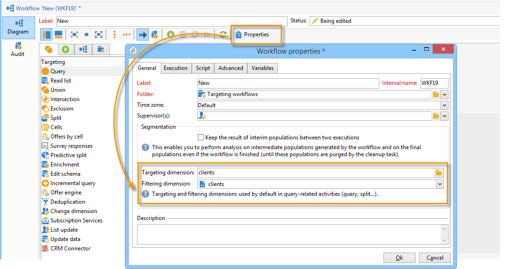

# Gerenciamento de workflows{#managing-workflows}

Por padrão, seus novos workflows são baseados em um template de workflow que foi pré-configurado e baseado em uma tabela de recipient (nms:recipient). Para que sejam baseados automaticamente na tabela personalizada de recipients referenciados no **Nms_DefaultRcpSchema** (consulte [Configuração da interface](../../configuration/using/configuring-the-interface.md) , você deve criar um novo template de workflow.

Crie um novo modelo através da **[!UICONTROL Resources > Templates > Workflow templates]** nó . Nas propriedades do modelo, as dimensões fornecidas correspondem à tabela de recipients externos.

Ao basear seus novos fluxos de trabalho em um modelo criado recentemente, a tabela personalizada será selecionada por padrão para as dimensões de filtragem e direcionamento global do fluxo de trabalho.

Todas as atividades usadas no workflow usarão a tabela personalizada sem a necessidade de qualquer configuração manual adicional.

Para obter mais informações sobre fluxos de trabalho, consulte [esta seção](../../workflow/using/about-workflows.md).

