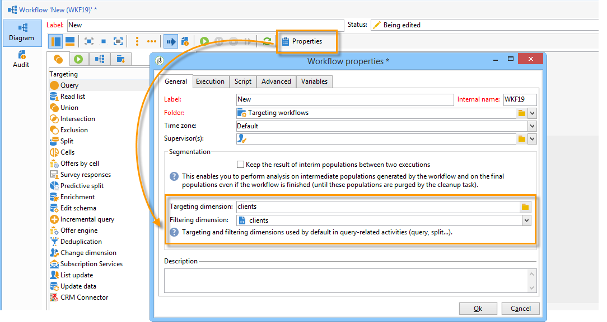

# Gerenciamento de fluxos de trabalho{#managing-workflows}

Por padrão, seus novos fluxos de trabalho são baseados em um modelo de fluxo de trabalho pré-configurado e baseado em uma tabela de destinatários (nms:recipient). Para que eles sejam baseados automaticamente na tabela personalizada de destinatários referenciados na opção **Nms_DefaultRcpSchema** (consulte a seção [Configuração da interface](../../configuration/using/configuring-the-interface.md)), você deve criar um novo modelo de fluxo de trabalho.

Crie um novo modelo através do nó **[!UICONTROL Resources > Templates > Workflow templates]**. Nas propriedades do template, as dimensões fornecidas correspondem à tabela de recipients externos.

Ao basear seus novos workflows em um template criado recentemente, sua tabela personalizada será selecionada por padrão para o targeting global e a dimensão de filtro do workflow.

Todas as atividades usadas em seu fluxo de trabalho usarão sua tabela personalizada sem precisar de configuração manual adicional.

Para obter mais informações sobre fluxos de trabalho, consulte [esta seção](../../workflow/using/about-workflows.md).

