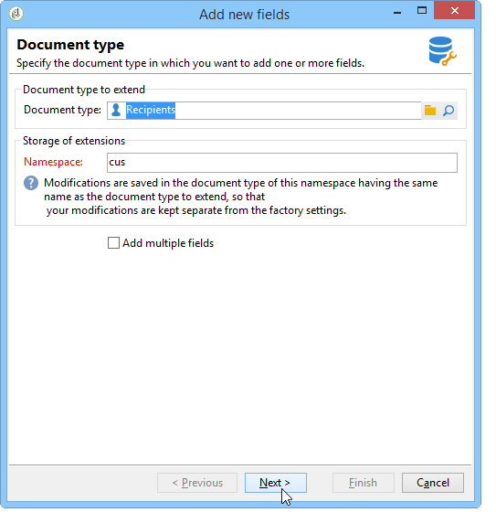

# Novo assistente de campo{#new-field-wizard}


Um assistente acessível via **[!UICONTROL Tools > Advanced > Add new fields]** permite adicionar um ou mais campos a uma tabela no banco de dados.

A validação do assistente atualiza o esquema de extensão da tabela a ser estendida e inicia o script SQL para modificar a estrutura física do banco de dados.

Esse assistente tem a vantagem de adicionar rapidamente um campo sem precisar saber a estrutura de um schema de dados.

A principal desvantagem é a limitação dos dados e as propriedades a serem estendidas.

As telas do assistente contêm as seguintes etapas:

1. A primeira página permite inserir o nome do schema a ser estendido e o namespace do schema de extensão onde as modificações serão salvas:

   

1. A próxima página permite inserir as propriedades do campo a ser adicionado.

   

1. Para confirmar as alterações, clique no link **[!UICONTROL Finish]** botão.

Um arquivo de extensão, chamado &quot;cus:recipient&quot; em nosso exemplo, é criado automaticamente e o script SQL correspondente é executado:

```
<srcSchema extendedSchema="nms:recipient" label="Recipients" name="recipient"  namespace="cus">  
  <element name="recipient">    
    <attribute belongsTo="cus:recipient" dataPolicy="email" label="Email" length="80" name="email1" sqlname="sEmail1" type="string" user="true"/>  
  </element>
</srcSchema>
```

>[!NOTE]
>
>Por padrão, os campos adicionados são declarados com a propriedade **usuário** (com o valor &quot;true&quot;). Isso permite exibir e editar o campo no formulário de entrada do schema estendido usando um controle do tipo &quot;treeEdit&quot; (consulte Formulário de entrada).
