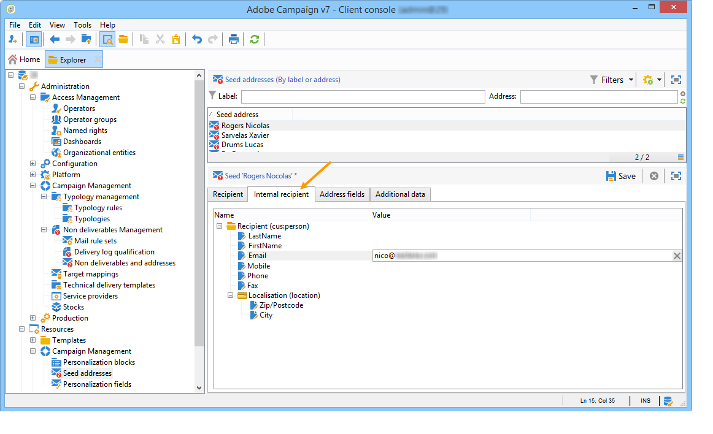

# Seed addresses{#seed-addresses}


Se a tabela do recipient for uma tabela personalizada, configurações adicionais serão necessárias. O esquema **[!UICONTROL nms:seedMember]** deve ser estendido. Uma guia adicional é adicionada aos seed addresses para definir os campos adequados, conforme mostrado abaixo:



Para obter mais informações sobre como usar seed addresses, consulte [esta seção](../../delivery/using/about-seed-addresses.md).

## Implementação {#implementation}

O esquema **nms:seedMember** e o formulário vinculado prontos para uso devem ser estendidos para configuração do cliente, para fazer referência a todos os campos necessários. A definição do schema contém comentários detalhando seu modo de configuração.

Definição do schema estendido da tabela de recipients:

```
<srcSchema label="Person" name="person" namespace="cus">
  <element autopk="true" label="Person" name="person">
      <attribute label="LastName" name="lastname" type="string"/>
      <attribute label="FirstName" name="firstname" type="string"/>
    <element label="Address" name="address">
      <attribute label="Email" name="addrEnv" type="string"/>
    </element>
    <attribute label="Code Offer" name="codeOffer" type="string"/>
  </element>
</srcSchema>
```

Siga as etapas abaixo:

1. Crie uma extensão do esquema **nms:seedMember**. Para obter mais informações, consulte [esta seção](../../configuration/using/extending-a-schema.md).
1. Nesta nova extensão, adicione um novo elemento na raiz de **[!UICONTROL seedMember]** com os seguintes parâmetros:

   ```
   name="custom_customNamespace_customSchema"
   ```

   Esse elemento deve conter os campos necessários para exportar as campanhas. Esses campos devem ter o mesmo nome que os campos correspondentes no esquema externo. Por exemplo, se o esquema for **[!UICONTROL cus:person]** , o esquema **[!UICONTROL nms:seedMember]** deverá ser estendido da seguinte maneira:

   ```
     <srcSchema extendedSchema="nms:seedMember" label="Seed addresses" labelSingular="Seed address" name="seedMember" namespace="cus">
     <element name="common">
       <element name="custom_cus_person">
         <attribute name="lastname" template="cus:person:person/@lastname"/>
         <attribute name="firstname" template="cus:person:person/@firstname"/>
         <attribute name="email" sqlname="myEmailField" template="cus:person:person/address/@addrEnv" xml="false"/>
       </element>
     </element>
     <element name="seedMember">
      <element aggregate="cus:seedMember:common"/>
     </element>
   </srcSchema>
   ```

   >[!NOTE]
   >
   >A extensão do esquema **nms:seedMember** deve estar em conformidade com as estruturas de uma campanha e uma entrega no Adobe Campaign.

   >[!IMPORTANT]
   >
   >
   >    
   >    
   >    * Durante a extensão, você deve especificar um **nome SQL (@sqlname)** para o campo &#39;email&#39;. O nome SQL deve ser diferente do &#39;sEmail&#39; reservado para o esquema do recipient.
   >    * Você deve atualizar a estrutura do banco de dados com o esquema criado ao estender **nms:seedMember**.
   >    * Na extensão **nms:seedMember**, o campo contendo o endereço de email deve ter **name=&quot;email&quot;** como um atributo. O nome SQL deve ser diferente de &#39;sEmail&#39;, que já é usado para o esquema do recipient. Este atributo deve ser declarado imediatamente sob o elemento **`<element name="custom_cus_person" />`**.
   >    
   >

1. Modifique o formulário **[!UICONTROL seedMember]** de acordo para definir uma nova guia &quot;Destinatário interno&quot; na janela **[!UICONTROL Seed addresses]**. Para obter mais informações, consulte [esta página](../../configuration/using/form-structure.md).

   ```
   <container colcount="2" label="Internal recipient" name="internal"
                xpath="custom_cus_person">
       <input colspan="2" editable="true" nolabel="true" type="treeEdit">
         <container label="Recipient (cus:person)">
           <input xpath="@last name"/>
           <input xpath="@first name"/>
           <input xpath="@email"/>
         </container>
       </input>
     </container>
   ```

Se todos os atributos do seed address não forem inseridos, o Adobe Campaign substituirá automaticamente os perfis: eles serão inseridos automaticamente durante a personalização usando dados de um perfil existente.
