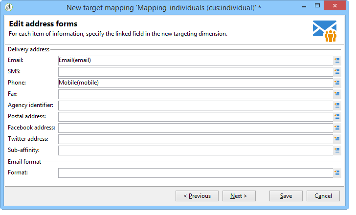
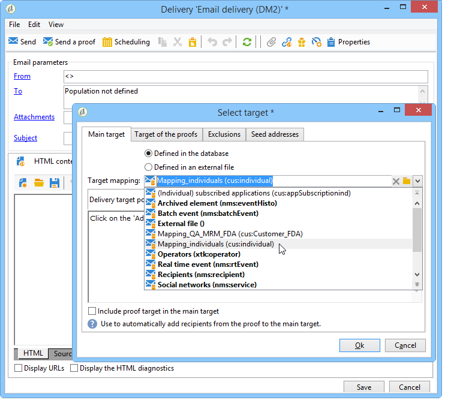

# Target mapping{#target-mapping}

A criação do target mapping é necessária em dois casos:

* se você usar uma tabela de recipients diferente da fornecida pelo Adobe Campaign,
* se você configurar uma dimensão de filtro diferente do targeting dimension padrão na tela target mapping.

O assistente de criação de target mapping ajudará você a criar todos os esquemas necessários para usar sua tabela personalizada.

## Criação e configuração de schemas vinculados à tabela personalizada {#creating-and-configuring-schemas-linked-to-the-custom-table}

Antes de criar um target mapping, várias configurações são necessárias para que o Adobe Campaign opere com um novo schema de dados de recipient.

Para fazer isso, siga as etapas abaixo:

1. Crie um novo esquema de dados que integre os campos da tabela personalizada que você deseja usar.

   Para obter mais informações, consulte [Referência de esquema (xtk:srcSchema)](../../configuration/using/about-schema-reference.md).

   Em nosso exemplo, criaremos um schema de cliente, uma tabela muito simples contendo os seguintes campos: ID, nome, sobrenome, endereço de email, número do telefone celular. O objetivo é poder enviar alertas de email ou SMS para as pessoas armazenadas nessa tabela.

   Exemplo de esquema (cus:individual)

   ```
   <srcSchema name="individual" namespace="cus" label="Individuals">
     <element name="individual">
       <key name="id" internal="true">
         <keyfield xpath="@id"/>
       </key>
       <attribute name="id" type="long" length="32"/>
       <attribute name="lastName" type="string" length="100"/>
       <attribute name="firstName" type="string" length="100"/>
       <attribute name="email" type="string" length="100"/>
       <attribute name="mobile" type="string" length="100"/>
     </element>
   </srcSchema>
   ```

1. Declare seu esquema como uma visualização externa usando o atributo =&quot;true&quot;. Consulte [O atributo de exibição](../../configuration/using/schema-characteristics.md#the-view-attribute).

   ```
    <srcSchema desc="External recipient table" namespace="cus" view="true"....>
      ...
    </srcSchema>
   ```

1. Se precisar adicionar um endereço de correspondência direta, use o seguinte tipo de estrutura:

   ```
   <element advanced="true" name="postalAddress" template="nms:common:postalAddress">
        <attribute expr="SubString(JuxtWords(Smart([../infos/@firstname]), Upper([../infos/@name])), 1, 80)"
                   name="line1"/>
        <attribute expr="Upper([../address/@line2])" name="line2"/>
        <attribute expr="Upper([../address/@line])" name="line3"/>
        <attribute expr="Upper([../address/@line])" name="line4"/>
        <attribute expr="Upper([../address/@line])" name="line5"/>
        <attribute expr="Upper([../address/@line])" name="line6"/>
        <attribute _operation="delete" name="line7"/>
        <attribute _operation="delete" name="addrErrorCount"/>
        <attribute _operation="delete" name="addrQuality"/>
        <attribute _operation="delete" name="addrLastCheck"/>
        <element expr="@line1+'n'+@line2+'n'+@line3+'n'+@line4+'n'+@line5+'n'+@line6"
                 name="serialized"/>
        <attribute expr="AllNonNull2([../address/@line], [../infos/@name])" name="addrDefined"/>
      </element>
   ```

1. Clique no nó **[!UICONTROL Administration > Campaign management > Target mappings]**.
1. Clique no botão **Novo** para abrir o assistente de criação de target mapping.
1. Insira o campo **Rótulo** e selecione o esquema que você acabou de criar no campo **Targeting dimension**.

   

1. Na janela **Editar formulários de endereço**, selecione os campos do esquema que correspondam aos vários endereços de entrega. Aqui, podemos mapear os campos **@email** e **@mobile**.

   

1. Na janela **Storage** a seguir, insira o campo **Suffix of the extension schemas** para diferenciar os novos esquemas dos esquemas prontos para uso fornecidos pela Adobe Campaign.

   Clique em **[!UICONTROL Define new additional fields]** para selecionar a dimensão que deseja direcionar na entrega.

   Por padrão, o gerenciamento de exclusão é armazenado na mesma tabela que as mensagens.

   Marque a caixa **Gerar um esquema de armazenamento para rastreamento** se desejar configurar o armazenamento para o rastreamento vinculado ao target mapping.

   

   >[!IMPORTANT]
   >
   >O Adobe Campaign não é compatível com vários esquemas de recipient, conhecidos como esquemas de direcionamento, vinculados aos mesmos esquemas de broadlog e/ou trackinglog. Caso contrário, isso pode levar a anomalias na reconciliação de dados posteriormente. Para obter mais informações, consulte a página [Recomendação e limitações](../../configuration/using/about-custom-recipient-table.md).

1. Na janela **Extensões**, selecione os esquemas opcionais que deseja gerar (a lista de esquemas disponíveis depende dos módulos instalados na plataforma Adobe Campaign).

   

1. Clique no botão **Salvar** para fechar o assistente.

   O assistente usa o schema de início para criar todos os outros schemas necessários para fazer o novo target mapping funcionar.

   

## Utilização do target mapping {#using-target-mapping}

Há duas maneiras de usar o novo schema como target de um delivery:

* Criar um ou mais modelos de entrega com base no mapeamento
* Selecione o mapeamento diretamente durante a seleção de target ao criar um delivery, conforme mostrado abaixo:


