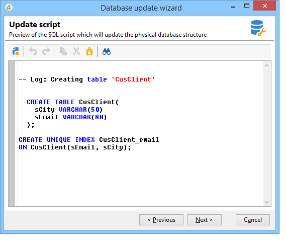

# Atualização da estrutura do banco de dados{#updating-the-database-structure}

Para aplicar as modificações feitas nos schemas, inicie o assistente de atualização do banco de dados. Este assistente pode ser acessado via **[!UICONTROL Tools > Advanced > Update database structure]** . Ele verifica se a estrutura física do banco de dados corresponde à sua descrição lógica e executa os scripts de atualização do SQL.

Os módulos no banco de dados são automaticamente preenchidos e ativados.

As **[!UICONTROL Add stored procedures]** opções e **[!UICONTROL Import initialization data]** são usadas para iniciar os scripts SQL iniciais e os pacotes de dados executados quando o banco de dados é criado.

É possível importar um conjunto de dados de um pacote de dados externo. Para fazer isso, selecione **[!UICONTROL Import a package]** e insira o arquivo XML do pacote.

Siga as etapas e visualização o script SQL de atualização do banco de dados:

>[!NOTE]
>
>Isso está em um campo de edição e pode ser modificado para excluir ou adicionar o código SQL.

Em seguida, inicie a atualização do banco de dados:

