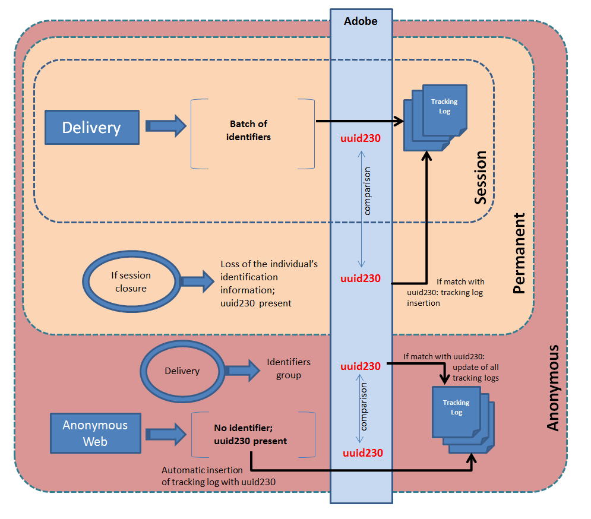

# Modo de rastreamento da Web{#web-tracking-mode}

O Adobe Campaign permite que você selecione um modo de rastreamento da Web que define a forma como os logs de rastreamento são processados no aplicativo.

Há três modos de rastreamento da Web disponíveis: **&quot;Rastreamento de sessão&quot;**,**&quot;Rastreamento permanente&quot;** e **&quot;Rastreamento anônimo&quot;**.


Cada modo tem características específicas. O modo de rastreamento da Web &quot;permanente&quot; inclui as características do modo de rastreamento da Web &quot;sessão&quot;, enquanto o modo &quot;anônimo&quot; inclui as características dos modos &quot;permanente&quot; e &quot;sessão&quot;.

>[!IMPORTANT]
>
>O modo &quot;anônimo&quot; de rastreamento da Web é ativado por padrão se o pacote &quot;Informações potenciais&quot; estiver ativado. Em todos os outros casos, o modo de rastreamento da Web &quot;sessão&quot; é ativado por padrão.
>
>A qualquer momento, o modo padrão pode ser alterado no assistente de implantação da instância.

Observe que se você estiver usando o modo de rastreamento **permanente da Web** ou **anônimo** , é necessário adicionar um índice à coluna &quot;sourceID&quot; (uuid230) nas tabelas de rastreamento (trackingLogXXX):

1. Identificar as tabelas de rastreamento afetadas pelo rastreamento permanente.
1. Estenda os esquemas que correspondem a essas tabelas adicionando as seguintes linhas:

```
<dbindex name="sourceId">
 <keyfield xpath="@sourceId"/>
</dbindex>
```

**Os modos de rastreamento permanente** e **anônimo** da Web incluem duas opções: Entrega **forçada** e **última entrega**.

A opção Entrega **** forçada permite especificar o identificador da entrega (@jobid) durante o rastreamento.

A opção **Última entrega** permite vincular o log de rastreamento atual à última entrega rastreada.

**Características do rastreamento da Web da sessão:**

Este modo cria um log de rastreamento para pessoas com um cookie de sessão. Essas são pessoas que clicaram em um URL em um email enviado pelo Adobe Campaign, permitindo que rastreássemos as seguintes informações:

* ID de entrega
* ID do contato
* registro de entrega
* cookie permanente (uid230)
* URL de rastreamento
* data do registro de rastreamento

Com esse modo de rastreamento da Web, se parte das informações estiver ausente, nenhum log de rastreamento será criado no aplicativo.

Esse modo é econômico em termos de volume (número limitado de registros na tabela trackingLog) e cálculo (sem reconciliação).

**Características do modo permanente de rastreamento da Web:**

Este modo de rastreamento da Web permite criar um log de rastreamento com base na presença do cookie uid230 permanente. Se um visitante fechar sua sessão, o Adobe Campaign usará o cookie permanente para recuperar informações de registros de rastreamento anteriores. O Adobe Campaign insere novamente um log de rastreamento se o uuid230 da sessão atual tiver o mesmo valor que um uuid230 já armazenado na tabela de rastreamento.

Isso significa que o visitante precisa ter sido previamente identificado no Adobe Campaign (por meio de uma entrega) para permitir a reconciliação nos valores do uid230.

Por padrão, as pesquisas em registros de rastreamento anteriores são executadas na tabela &quot;trackingLog&quot;. Se o pacote Leads estiver ativado, antes de pesquisar a tabela &quot;trackingLog&quot;, o Adobe Campaign pesquisará na tabela &quot;incomingLead&quot; os registros de log de rastreamento anteriores.

Esse modo é caro em termos de cálculo durante a reconciliação do log.

**Características do modo anônimo de rastreamento da Web:**

Esse modo de rastreamento da Web permite recuperar um log de rastreamento vinculado à navegação anônima no Adobe Campaign. Um log de rastreamento é criado automaticamente para cada clique em um URL rastreado. Este log tem apenas o valor do uuid230. Durante uma campanha de marketing, um log de rastreamento é criado automaticamente com todas as informações de identificação (consulte o rastreamento de sessão). O Adobe Campaign pesquisará automaticamente os logs anteriores em busca de um valor &quot;uid230&quot; igual ao valor do log de rastreamento desta campanha de marketing. Se valores idênticos forem encontrados, todos os logs de rastreamento anteriores serão inseridos com todas as informações do log de rastreamento da campanha de marketing.

Esse modo é o mais caro em termos de cálculo e volume.

>[!NOTE]
>
>Se o **[!UICONTROL Leads]** pacote estiver instalado, é necessário fazer o mesmo para a tabela de atividade (**crm:incomingLead**)

O esquema a seguir resume as funcionalidades dos três modos de rastreamento da Web:



**Exemplo de rastreamento da Web permanente com base na última entrega:**

Florence recebe uma entrega, abre o email, clica no link, navega no site de varejo, mas não faz compras. No dia seguinte, Florence volta ao site de varejo, navega e faz uma compra. Como o rastreamento permanente da Web (última entrega) está ativado, todos os logs de sua segunda visita serão vinculados à entrega que foi enviada a ela no dia anterior.
