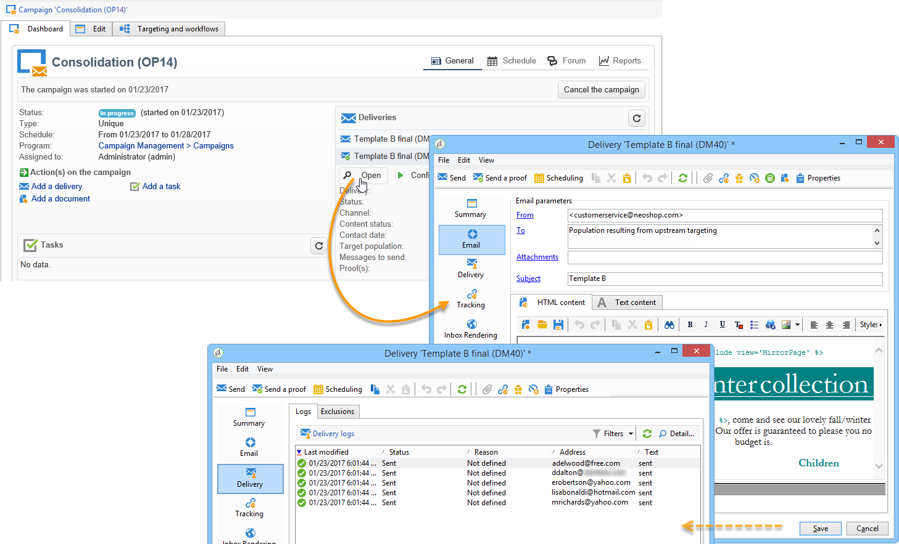

# Teste A/B: analisar o resultado {#step-8--analyzing-the-result}

Depois que as entregas de teste forem enviadas, será possível verificar a quais destinatários elas foram enviadas e se foram abertas ou não.

* Para descobrir quais destinatários foram selecionados, abra um pelo painel de campanha e clique na guia **[!UICONTROL Delivery]** Entrega.

  

* Para saber se a entrega foi aberta, vá para a guia **[!UICONTROL Tracking]**.

  

* Compare com a outra entrega.

  

No nosso exemplo, a entrega B pontuou a maior taxa de abertura. Isso significa que o conteúdo B será usado para a entrega final.

