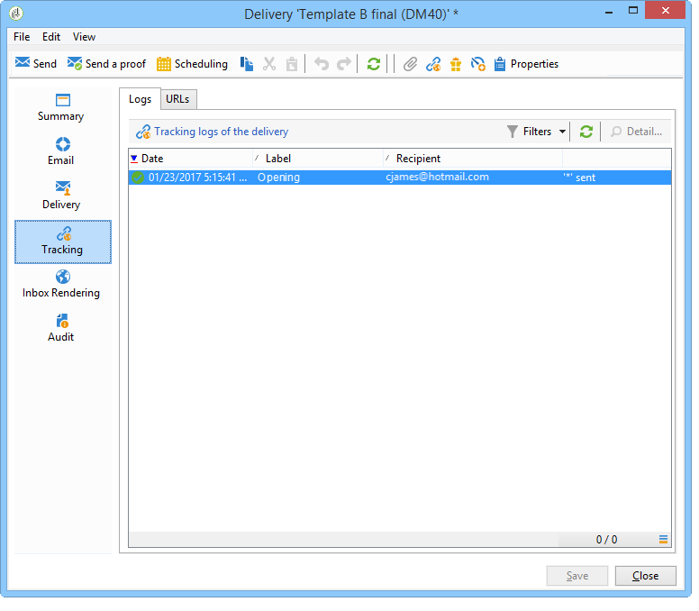

# Análise do resultado {#step-8--analyzing-the-result}

Depois que as deliveries forem enviadas, é possível verificar quais recipients receberam e se eles abriram ou não a entrega.

* Para descobrir quais recipients foram selecionados, abra um pelo painel de campanha e clique na guia **[!UICONTROL Delivery]** Delivery.

   

* Para saber se o delivery foi aberto, vá para a guia **[!UICONTROL Tracking]**.

   

* Compare com o outro fornecimento.

   

No nosso exemplo, a delivery B pontuou a maior taxa de abertura. Isso significa que o conteúdo B será usado para a delivery final.

