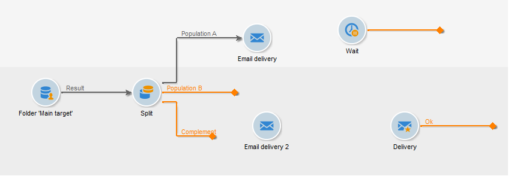
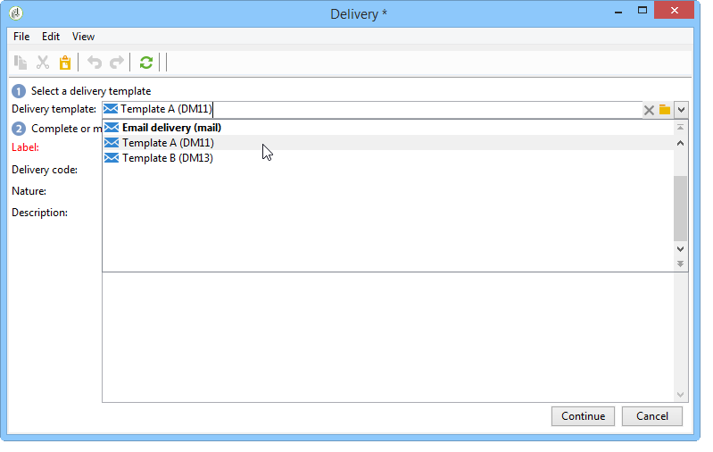
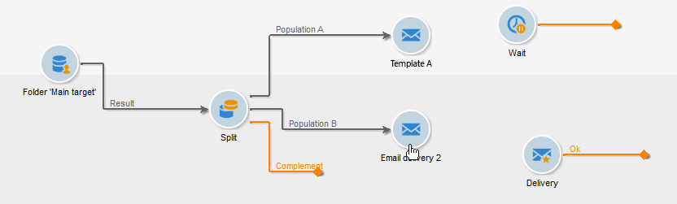
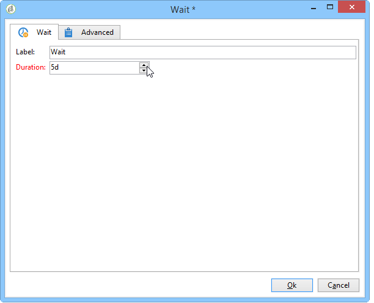

# Teste A/B: configurar as entregas no fluxo de trabalho {#step-4--configuring-the-deliveries-in-the-workflow}

Depois que [populações forem criadas](a-b-testing-uc-population-samples.md), você poderá configurar as entregas. Nesse caso de uso, as duas primeiras entregas permitem enviar conteúdo diferente às populações A e B. A terceira entrega é a de fallback: ela será enviada aos destinatários que não pertencerem a A nem B. O conteúdo será calculado por um script e será idêntico a A ou B, dependendo de qual deles obteve a maior taxa de abertura. Precisamos configurar um período de espera para a terceira entrega, para descobrir o resultado das entregas A e B. É por isso que a terceira entrega inclui uma atividade **[!UICONTROL Wait]**.

1. Vá para a atividade **[!UICONTROL Split]** e vincule a transição destinada à população A para uma das entregas do e-mail já no fluxo de trabalho.

   

1. Clique duas vezes na entrega para abri-la.
1. Usando a lista suspensa, selecione o modelo para a entrega A.

   

1. Clique em **[!UICONTROL Continue]** para visualizar a entrega e, em seguida, salve.

   

1. Vincule a transição da atividade **[!UICONTROL Split]** destinada à população B para a segunda entrega de e-mail.

   

1. Abra a entrega e selecione o modelo na entrega B e, em seguida, salve a entrega.

   

1. Vincule a transição destinada à população restante para a atividade **[!UICONTROL Wait]**.

   

1. Abra a atividade **[!UICONTROL Wait]** e configure um período de espera de 5 dias.

   

1. Vincule a atividade **[!UICONTROL Wait]** à atividade **[!UICONTROL JavaScript code]**.

   

Agora você pode criar o script. [Saiba mais](a-b-testing-uc-script.md).
