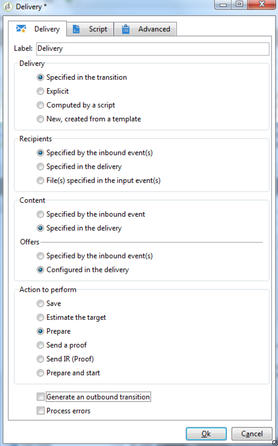

# Definição da delivery final {#step-6--defining-the-final-delivery}

Depois que o script for criado para selecionar o vencedor do teste A/B, é possível definir os parâmetros da delivery final.

1. Conecte a atividade **[!UICONTROL JavaScript code]** à atividade restante **[!UICONTROL Delivery]**.
1. Abra a atividade **[!UICONTROL Delivery]**.
1. Desmarque a opção **[!UICONTROL Generate an outbound transition]** para finalizar o workflow com esta atividade.
1. Deixe as outras opções em seus valores padrão.

   

Ao preparar o delivery especificado na transição (definido por meio da atividade **[!UICONTROL Javascript Code]**), é possível aprovar e iniciar o envio, conforme descrito na próxima etapa.

Agora você pode start o fluxo de trabalho (consulte [Etapa 7: Start do fluxo de trabalho](../../delivery/using/a-b-testing-uc-start-workflow.md)).
