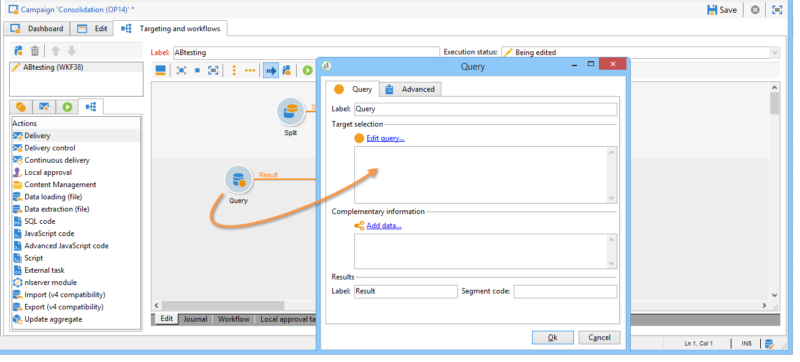
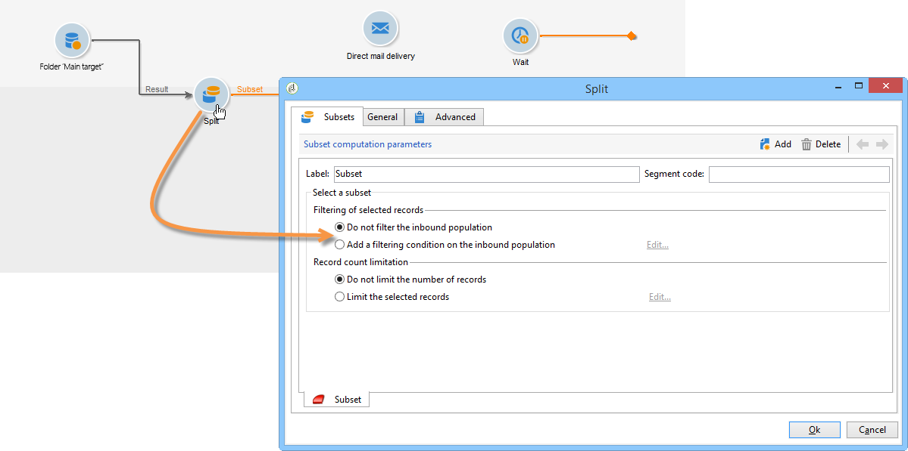

# Teste A/B: configurar amostras de população {#step-2--configuring-population-samples}

## Configurar a atividade de consulta {#configuring-the-query-activity}

* Clique duas vezes na atividade **[!UICONTROL Query]**.

  

* Clique no link **[!UICONTROL Edit query]** e selecione o tipo de destinatários que deseja direcionar.

  

* Vincule a atividade **[!UICONTROL Query]** à atividade **[!UICONTROL Split]**.

  

## Configurar a atividade de divisão {#configuring-the-split-activity}

Esta atividade permite criar várias populações: a que recebe a entrega A, aquela que recebe a entrega B e a população restante. A utilização de seleção aleatória permite atingir apenas parte da população de cada entrega.

1. Criação da população A:

   * Clique duas vezes na atividade **[!UICONTROL Split]**.

     

   * Na guia existente, altere o rótulo para a população A.

     

   * Selecione a opção **[!UICONTROL Limit the selected records]**.

     

   * Clique no link **[!UICONTROL Edit]**, selecione **[!UICONTROL Activate random sampling]** e clique em **[!UICONTROL Next]**.

     

   * Defina o limite como 10% e clique em **[!UICONTROL Finish]**.

     

1. Criação da população B:

   * Clique em **[!UICONTROL Add]** para criar uma nova guia para a população B.

     

   * Limite a população para 10% como anteriormente.

     

1. Criação da população restante:

   * Acesse a guia **[!UICONTROL General]**.

     

   * Selecione **[!UICONTROL Generate complement]**.

     

   * Altere o rótulo para especificar que esta população não inclui A nem B e clique em **[!UICONTROL OK]** para fechar a atividade.

     

Agora você pode criar os dois modelos de entrega. [Saiba mais](a-b-testing-uc-delivery-templates.md)).
