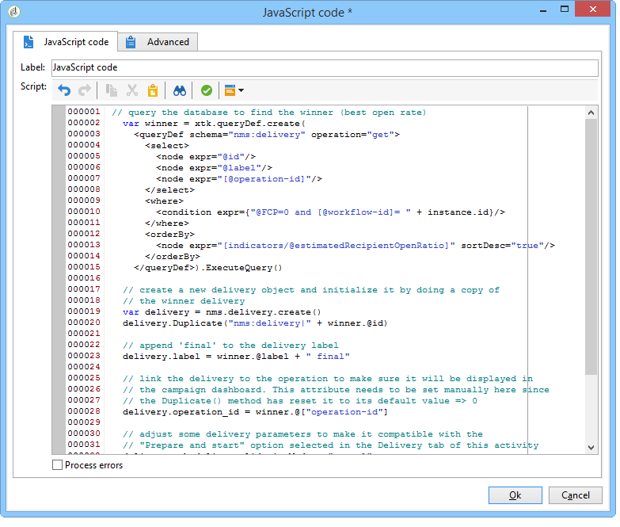

# Criar o script {#step-5--creating-the-script}


A escolha do conteúdo de delivery destinado à população restante é calculada por um script. Este script recupera as informações relacionadas à delivery com a mais alta taxa de abertura e copia o conteúdo para a delivery final.

## Exemplo de um script {#example-of-a-script}

O script a seguir pode ser usado no fluxo de trabalho de direcionamento. Para obter mais informações, consulte [esta seção](#implementation).

```
 // query the database to find the winner (best open rate)
   var winner = xtk.queryDef.create(
     <queryDef schema="nms:delivery" operation="get">
       <select>
         <node expr="@id"/>
         <node expr="@label"/>
         <node expr="[@operation-id]"/>
         <node expr="[@workflow-id]"/>
       </select>
       <where>
         <condition expr={"@FCP=0 and [@workflow-id]= " + instance.id}/>
       </where>
       <orderBy>
         <node expr="[indicators/@estimatedRecipientOpenRatio]" sortDesc="true"/>
       </orderBy>
     </queryDef>).ExecuteQuery()
   
   // create a new delivery object and initialize it by doing a copy of
   // the winner delivery
   var delivery = nms.delivery.create()
   delivery.Duplicate("nms:delivery|" + winner.@id)

   // append 'final' to the delivery label
   delivery.label = winner.@label + " final"

   // link the delivery to the operation to make sure it will be displayed in
   // the campaign dashboard. This attribute needs to be set manually here since 
   // the Duplicate() method has reset it to its default value => 0
   delivery.operation_id = winner.@["operation-id"]
   delivery.workflow_id = winner.@["workflow-id"]

   // adjust some delivery parameters to make it compatible with the 
   // "Prepare and start" option selected in the Delivery tab of this activity
   delivery.scheduling.validationMode = "manual"
   delivery.scheduling.delayed = 0
 
   // save the delivery in database
   delivery.save()
 
   // store the new delivery Id in event variables
   vars.deliveryId = delivery.id
```

Para verificar uma explicação detalhada do script, consulte [esta seção](#details-of-the-script).

## Implementação {#implementation}

1. Abra a atividade **[!UICONTROL JavaScript code]**.
1. Copie o script oferecido no [Exemplo de um script](#example-of-a-script) na janela **[!UICONTROL JavaScript code]**.

   

1. No campo **[!UICONTROL Label]**, digite o nome do script, ou seja,

   ```
   <%= vars.deliveryId %>
   ```

   

1. Feche a atividade **[!UICONTROL JavaScript code]**.
1. Salve o fluxo de trabalho.

## Detalhes do script {#details-of-the-script}

Esta seção detalha as várias partes do script e seu modo operacional.

* A primeira parte do script é uma query. O comando **queryDef** permite recuperar da tabela **NmsDelivery** os deliveries criados executando o workflow para construção do target e ordenando com base na taxa estimada de abertura, então as informações do delivery com a taxa mais alta de abertura são recuperadas.

   ```
   // query the database to find the winner (best open rate)
      var winner = xtk.queryDef.create(
        <queryDef schema="nms:delivery" operation="get">
          <select>
            <node expr="@id"/>
            <node expr="@label"/>
            <node expr="[@operation-id]"/>
          </select>
          <where>
            <condition expr={"@FCP=0 and [@workflow-id]= " + instance.id}/>
          </where>
          <orderBy>
            <node expr="[indicators/@estimatedRecipientOpenRatio]" sortDesc="true"/>
          </orderBy>
        </queryDef>).ExecuteQuery()
   ```

* A delivery com a taxa mais alta de abertura é duplicada.

   ```
    // create a new delivery object and initialize it by doing a copy of
    // the winner delivery
   var delivery = nms.delivery.create()
   delivery.Duplicate("nms:delivery|" + winner.@id)
   ```

* O rótulo da delivery duplicada é modificado e a palavra **final** é adicionada a ele.

   ```
   // append 'final' to the delivery label
   delivery.label = winner.@label + " final"
   ```

* A delivery é copiada no painel de campanha.

   ```
   // link the delivery to the operation to make sure it will be displayed in
   // the campaign dashboard. This attribute needs to be set manually here since 
   // the Duplicate() method has reset it to its default value => 0
   delivery.operation_id = winner.@["operation-id"]
   delivery.workflow_id = winner.@["workflow-id"]
   ```

   ```
   // adjust some delivery parameters to make it compatible with the 
   // "Prepare and start" option selected in the Delivery tab of this activity
   delivery.scheduling.validationMode = "manual"
   delivery.scheduling.delayed = 0
   ```

* A delivery é salva no banco de dados.

   ```
   // save the delivery in database
   delivery.save()
   ```

* O identificador único da delivery duplicada é armazenado na variável do workflow.

   ```
   // store the new delivery Id in event variables
   vars.deliveryId = delivery.id
   ```

## Outros critérios de seleção {#other-selection-criteria}

O exemplo acima permite selecionar o conteúdo de uma delivery com base na taxa de abertura de e-mails. É possível adaptá-la se baseando em outros indicadores específicos de delivery:

* Melhor rendimento de cliques: `[indicators/@recipientClickRatio]`,
* Taxa de reatividade mais alta (e-mail aberto e cliques na mensagem): `[indicators/@reactivity]`,
* Taxa de reclamação mais baixa: `[indicators/@refusedRatio]` (use o valor false para o atributo sortDesc),
* Maior taxa de conversão: `[indicators/@transactionRatio]`,
* Número de páginas visitadas após a recepção de uma mensagem: `[indicators/@totalWebPage]`,
* Taxa de cancelamento de subscrição mais baixa: `[indicators/@optOutRatio]`,
* Valor da transação: `[indicators/@amount]`.

Agora você pode definir a entrega final. [Saiba mais](a-b-testing-uc-final-delivery.md).
