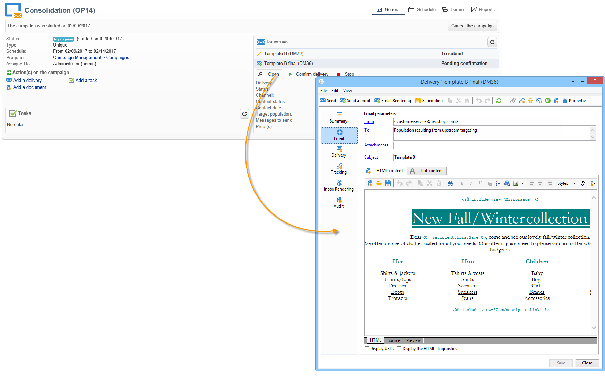

# Teste A/B: iniciar o fluxo de trabalho {#step-7--starting-the-workflow}

1. Clique em **[!UICONTROL Start]** para iniciar o fluxo de trabalho.

   

1. Aprove o target e o conteúdo para as entregas A e B via painel de campanha.
1. Confirme a entrega.
1. Aguarde até o final do período de 5 dias para descobrir qual conteúdo foi calculado após os resultados da abertura da entrega.

   

   Nesse caso, o modelo B foi escolhido.

1. Após o conteúdo da terceira entrega ser determinado, aprove o target e o conteúdo.

Agora é possível analisar o resultado. [Saiba mais](a-b-testing-uc-analyzing.md).
