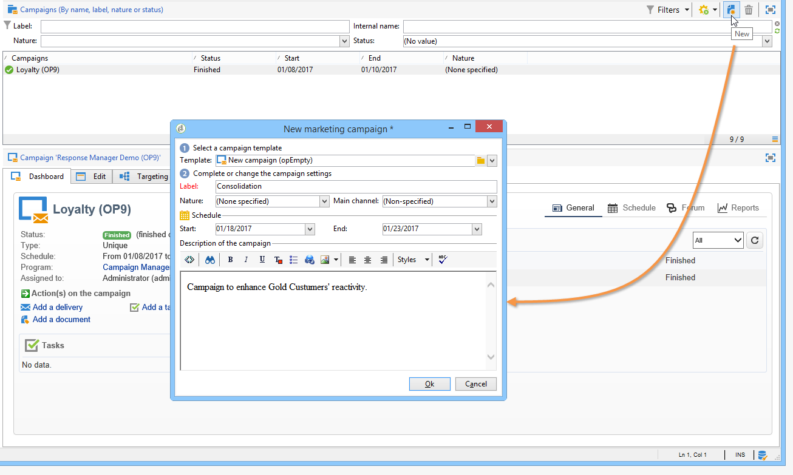

# Criar um fluxo de trabalho de direcionamento {#step-1--creating-a-targeting-workflow}

É necessário criar o workflow na guia **[!UICONTROL Targeting and Workflows]** de uma campanha. Ele é composto de uma atividade **[!UICONTROL Query]**, uma atividade **[!UICONTROL Split]** vinculada às duas atividades **[!UICONTROL Email delivery]**, uma atividade **[!UICONTROL Wait]**, uma atividade **[!UICONTROL JavaScript code]** e uma atividade **[!UICONTROL Delivery]**.

1. Caso ainda não o tenha feito, crie uma campanha (para saber mais, consulte [esta seção](../../campaign/using/setting-up-marketing-campaigns.md#creating-a-campaign)).

   

1. Acesse a guia **[!UICONTROL Targeting and Workflows]**.

   

1. Altere o rótulo do fluxo de trabalho existente ou clique em **[!UICONTROL Add]** para criar um novo (para obter mais informações, consulte [esta seção](../../campaign/using/marketing-campaign-deliveries.md#selecting-the-target-population)).

   

1. Use o mouse para arrastar e soltar atividades no diagrama do fluxo de trabalho, incluindo uma **[!UICONTROL Query]** (guia **[!UICONTROL Target]**), uma **[!UICONTROL Split]** (guia **[!UICONTROL Target]**), duas **[!UICONTROL Email deliveries]** (guias **[!UICONTROL Deliveries]**), uma atividade **[!UICONTROL Wait]** (guia **[!UICONTROL Flow Control]**), uma atividade **[!UICONTROL JavaScript code]** (guia **[!UICONTROL Actions]**), e uma atividade **[!UICONTROL Delivery]** (guia **[!UICONTROL Actions]**).

Agora você pode configurar as amostras de população. [Saiba mais](a-b-testing-uc-population-samples.md).
