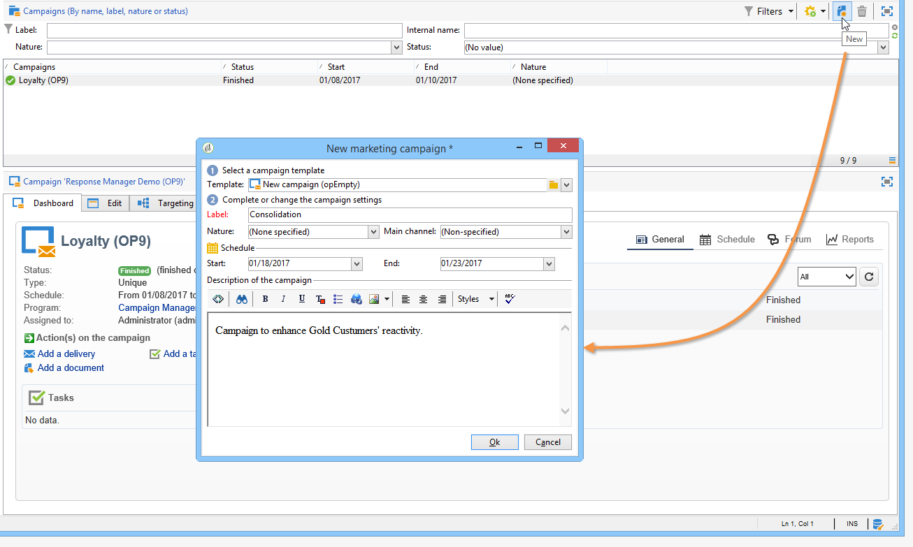
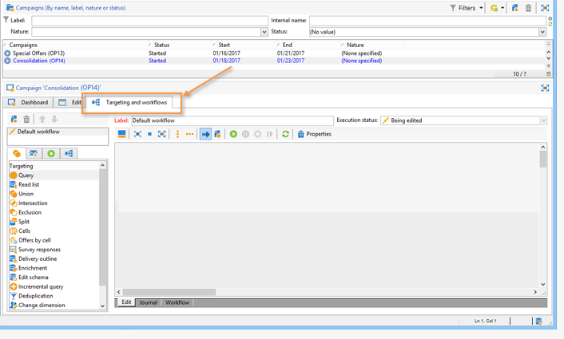

# Teste A/B: criar um fluxo de trabalho de direcionamento {#step-1--creating-a-targeting-workflow}

É necessário criar o fluxo de trabalho na guia **[!UICONTROL Targeting and Workflows]** de uma campanha. Ele é composto de uma atividade **[!UICONTROL Query]**, uma atividade **[!UICONTROL Split]** vinculada às duas atividades **[!UICONTROL Email delivery]**, uma atividade **[!UICONTROL Wait]**, uma atividade **[!UICONTROL JavaScript code]** e uma atividade **[!UICONTROL Delivery]**.

1. Caso ainda não o tenha feito, crie uma campanha. Para mais informações, consulte a [documentação do Campaign v8](https://experienceleague.adobe.com/docs/campaign/automation/campaign-orchestration/set-up-campaigns.html?lang=pt-BR){target=_blank}.

   

1. Acesse a guia **[!UICONTROL Targeting and Workflows]**.

   

1. Altere o rótulo do fluxo de trabalho existente ou clique em **[!UICONTROL Add]** para criar um novo (para obter mais informações, consulte a [documentação do Campaign v8](https://experienceleague.adobe.com/docs/campaign/automation/campaign-orchestration/marketing-campaign-target.html?lang=pt-BR){target="_blank"}.

   

1. Use o mouse para arrastar e soltar atividades no diagrama do fluxo de trabalho, incluindo uma **[!UICONTROL Query]** (guia **[!UICONTROL Target]**), uma **[!UICONTROL Split]** (guia **[!UICONTROL Target]**), duas **[!UICONTROL Email deliveries]** (guias **[!UICONTROL Deliveries]**), uma atividade **[!UICONTROL Wait]** (guia **[!UICONTROL Flow Control]**), uma atividade **[!UICONTROL JavaScript code]** (guia **[!UICONTROL Actions]**), e uma atividade **[!UICONTROL Delivery]** (guia **[!UICONTROL Actions]**).

Agora você pode configurar as amostras de população. [Saiba mais](a-b-testing-uc-population-samples.md).
