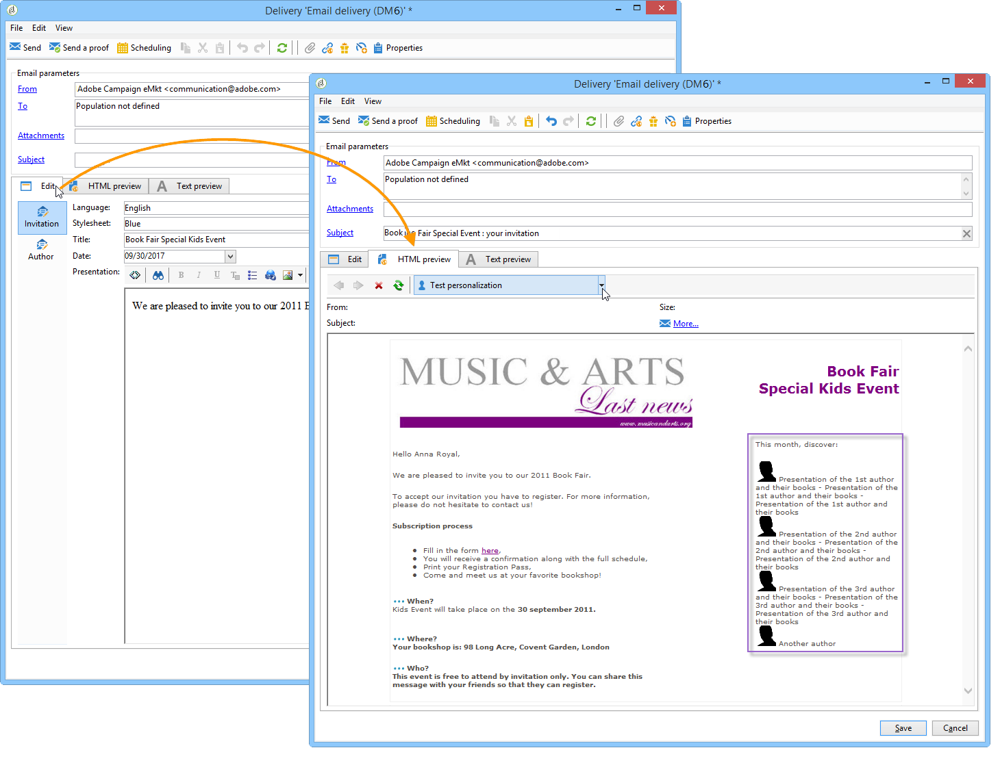

# Sobre gerenciamento de conteúdo{#about-content-management}

O módulo Adobe Campaign Content Manager é um [pacote integrado](../../installation/using/installing-campaign-standard-packages.md) exclusivo do Campaign Classic que você pode instalar para criar informativos periódicos ou site. Ele pode ajudá-lo a criar, validar e publicar suas mensagens.

>[!NOTE]
>
>Esta seção se refere ao módulo Gerenciamento de conteúdo. Para obter mais informações sobre como projetar o conteúdo de entregas de email, consulte a [documentação do Campaign v8](https://experienceleague.adobe.com/docs/campaign/campaign-v8/send/emails/defining-the-email-content.html?lang=pt-BR){target="_blank"}.

O módulo &quot;Gerenciamento de conteúdo&quot; incorpora o grupo de trabalho, o fluxo de trabalho e a funcionalidade de agregação de conteúdo. Isso permite que uma mensagem seja formatada automaticamente: email, correspondência, SMS, Web, etc.

O uso do gerenciador de conteúdo em uma entrega permite que você ofereça campos de entrada ou de seleção aos operadores de criação de conteúdo. O layout e a exibição desse conteúdo, bem como quaisquer alterações feitas, são gerenciados automaticamente usando a folha de estilos.

>[!CAUTION]
>
>Todas as alterações feitas na folha de estilos são implementadas no nível da entrega com base nos modelos de conteúdo usados.

O gerenciamento de conteúdo oferece as seguintes vantagens:

* Edição de mensagens estruturadas via interfaces de entrada,
* Separação do conteúdo de dados e como ele é apresentado (gerada no formato XML),
* Geração de documentos em vários formatos (html, txt, XML etc.) com base em folhas de estilos para garantir a conformidade com estatutos gráficos,
* Recuperação e agregação automática de fluxos de conteúdo externo,
* Colaboração com fluxo de trabalho para validação e verificação de dados.

No entanto, essa criação de conteúdo envolve algumas restrições, principalmente:

* Liberdade restrita sobre o design do documento final,
* A análise de requisitos deve ser rigorosa para que usuários finais não sejam afetados por uma função ausente.
