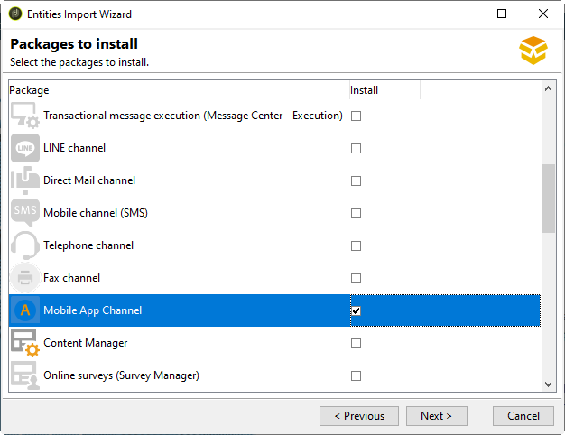

# Introdução ao canal de aplicativo móvel{#about-mobile-app-channel}

O Adobe Campaign permite criar entregas de notificação por push para enviar mensagens personalizadas aos usuários de aplicativo móvel.

As notificações por push permitem engajar os usuários de iOS e Android em tempo real. Ao enviar atualizações, anúncios ou promoções, é possível controlar o conteúdo, os tempos e o direcionamento. Saiba como configurar e usar o canal de push, gerenciar assinaturas, integrar-se a APNs e FCM, e personalizar mensagens na [documentação do Adobe Campaign v8](https://experienceleague.adobe.com/pt-br/docs/campaign/campaign-v8/send/emails/email){target=_blank}.

Como parte da transição do Campaign v7 para o v8, o conjunto de documentações do Campaign Classic foi simplificado e reorganizado. Os recursos comuns agora estão disponíveis apenas no conjunto de documentações do Campaign v8.

>[!BEGINTABS]

>[!TAB Documentação do canal de push]

Para saber mais sobre o canal de notificações por push, consulte a [documentação do Campaign v8](https://experienceleague.adobe.com/docs/campaign/campaign-v8/send/push/push.html?lang=pt-BR){target=_blank}.

{target=_blank}

>[!TAB Criação da entrega por push]

Conheça as principais etapas relacionadas à criação de entregas por push **na documentação do Campaign v8**:

* [Criar uma notificação por push](https://experienceleague.adobe.com/docs/campaign/campaign-v8/send/push/push.html?lang=pt-BR#push-create){target="_blank"}: saiba mais sobre as diferentes etapas necessárias para criar uma entrega por push.
* [Enviar e monitorar a notificação por push](https://experienceleague.adobe.com/docs/campaign/campaign-v8/send/push/push.html?lang=pt-BR#push-test){target="_blank"}: saiba como validar, enviar e controlar as suas entregas.
* [Criar uma entrega por push avançada no Android](https://experienceleague.adobe.com/docs/campaign/campaign-v8/send/push/rich-push/rich-push-android.html?lang=pt-BR){target="_blank"}: saiba como criar e configurar notificações por push avançadas para dispositivos Android.
* [Criar uma entrega de push avançada no iOS](https://experienceleague.adobe.com/docs/campaign/campaign-v8/send/push/rich-push/rich-push-ios.html?lang=pt-BR){target="_blank"}: saiba como projetar e configurar notificações por push avançadas para dispositivos iOS no Adobe Campaign v8.

>[!TAB Parâmetros de push]

Consulte estas páginas para saber mais sobre os parâmetros de push **na documentação do Campaign v8**:

* [Pré-requisitos de configuração](https://experienceleague.adobe.com/docs/campaign/campaign-v8/send/push/push-settings.html?lang=pt-BR#before-starting){target="_blank"}: saiba como definir permissões e configurar o seu aplicativo.
* [Configurar a propriedade de inicialização](https://experienceleague.adobe.com/docs/campaign/campaign-v8/send/push/push-settings.html?lang=pt-BR#launch-property){target="_blank"}: saiba como configurar uma propriedade de tag móvel na coleção de dados da Adobe Experience Platform para habilitar notificações por push.
* [Configurar serviços por push para serviços móveis](https://experienceleague.adobe.com/docs/campaign/campaign-v8/send/push/push-settings.html?lang=pt-BR#push-service){target="_blank"}: configure os serviços por push do iOS e do Android na Adobe para habilitar o envio de notificações por push direcionadas a usuários de aplicativo móvel.
* [Configurar a extensão na sua propriedade móvel](https://experienceleague.adobe.com/docs/campaign/campaign-v8/send/push/push-settings.html?lang=pt-BR#configure-extension){target="_blank"}: integre a extensão do Campaign à sua propriedade móvel para habilitar o envio de notificações por push e gerenciar interações dos usuários com eficiência.

>[!ENDTABS]

As informações a seguir são específicas do Campaign Classic.

+++ **Instalação do pacote**

 [Saiba como instalar o pacote de aplicativo para dispositivos móveis em vídeo](https://experienceleague.adobe.com/docs/campaign-classic-learn/tutorials/sending-messages/push-channel/installing-the-mobile-app-channel.html?lang=pt-BR#sending-messages)

Como um cliente híbrido/hospedado, entre em contato com a equipe de [Atendimento ao cliente da Adobe](https://helpx.adobe.com/br/enterprise/admin-guide.html/enterprise/using/support-for-experience-cloud.ug.html) para acessar o canal de notificação por push no Campaign.

Como cliente local, você precisa instalar um pacote integrado.

>[!CAUTION]
>
>Saiba mais sobre os pacotes integrados do Campaign, as práticas recomendadas e as recomendações [nesta página](../../installation/using/installing-campaign-standard-packages.md).

As etapas de instalação são:

1. Acesse o assistente de importação de pacotes do **[!UICONTROL Tools > Advanced > Import package]** no console do cliente do Adobe Campaign.

   

1. Selecione **[!UICONTROL Install a standard package]**.

1. Na lista que aparece, marque **[!UICONTROL Mobile App Channel]**.

   

1. Clique em **[!UICONTROL Next]** e, em seguida, em **[!UICONTROL Start]** para começar a instalação do pacote.

   Depois que os pacotes forem instalados, a barra de progresso mostrará **100%** e você poderá ver a seguinte mensagem nos registros de instalação: **[!UICONTROL Installation of packages successful]**.

   

1. **[!UICONTROL Close]** a janela de instalação.

Quando esta etapa for concluída, você poderá configurar os seus aplicativos para Android e iOS. Consulte a [documentação](https://experienceleague.adobe.com/docs/campaign/campaign-v8/send/push/push.html?lang=pt-BR){target="_blank"} do Campaign v8.

+++

+++ **Solução de problemas**

Se o dispositivo móvel estiver conectado ao wi-fi e você não estiver recebendo notificações, verifique se as portas FCM/APNS não estão bloqueadas pelo firewall.

**Android**: o dispositivo móvel conecta-se aos servidores FCM nas portas 5228 a 5230. Portanto, você deve configurar o firewall para que ele autorize a conexão com o FCM. As portas que devem ser abertas são: 5228 (a mais usada), 5229 e 5230.

**iOS**:

Conector HTTP/2: é necessário permitir a comunicação de e para os seguintes servidores:

* api.push.apple.com: porta 443
* api.development.push.apple.com: porta 443

>[!NOTE]
>
>Para mais informações sobre os dois conectores, consulte a [documentação](https://experienceleague.adobe.com/docs/campaign/campaign-v8/send/push/push-settings.html?lang=pt-BR){target="_blank"} do Campaign v8.

+++
